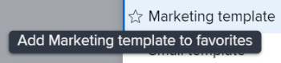

# Allegare un modello a un progetto

Puoi allegare un modello a un progetto durante la fase di creazione iniziale del progetto o dopo la sua creazione.

Per ulteriori informazioni sulla creazione di un progetto utilizzando un modello, consulta [Creare un progetto utilizzando un modello](../../../manage-work/projects/create-projects/create-project-from-template.md).

## Requisiti di accesso

Per eseguire i passaggi descritti in questo articolo, è necessario disporre dei seguenti elementi:

<table style="table-layout:auto"> 
 <col> 
 <col> 
 <tbody> 
  <tr> 
   <td role="rowheader">piano Adobe Workfront*</td> 
   <td> 
Qualsiasi 
 </td> 
  </tr> 
  <tr> 
   <td role="rowheader">Licenza Adobe Workfront*</td> 
   <td> 
Piano 
 </td> 
  </tr> 
  <tr> 
   <td role="rowheader">Configurazioni a livello di accesso*</td> 
   <td> 
Modifica accesso a progetti 
 
Per informazioni sull’accesso ai progetti, consulta <a href="../../../administration-and-setup/add-users/configure-and-grant-access/grant-access-projects.md" class="MCXref xref">Concedere l’accesso ai progetti</a>.
 
Visualizza l'accesso ai modelli
 
Per informazioni sulle autorizzazioni del modello, vedi <a href="../../../workfront-basics/grant-and-request-access-to-objects/share-a-template.md" class="MCXref xref">Condividere un modello</a>. 
 
Per informazioni sull'accesso ai modelli, vedi <a href="../../../administration-and-setup/add-users/configure-and-grant-access/grant-access-templates.md" class="MCXref xref">Concedere l’accesso ai modelli</a>.
 
Nota: Se non disponi ancora dell’accesso, chiedi all’amministratore Workfront se ha impostato ulteriori restrizioni nel livello di accesso. Per informazioni su come un amministratore Workfront può modificare il livello di accesso, consulta <a href="../../../administration-and-setup/add-users/configure-and-grant-access/create-modify-access-levels.md" class="MCXref xref">Creare o modificare livelli di accesso personalizzati</a>.
 </td> 
  </tr> 
  <tr> 
   <td role="rowheader">Autorizzazioni oggetto</td> 
   <td> 
Gestisci le autorizzazioni per il progetto
 
Per informazioni sulle autorizzazioni del progetto, consulta <a href="../../../workfront-basics/grant-and-request-access-to-objects/share-a-project.md" class="MCXref xref">Condivisione di un progetto in Adobe Workfront</a>. 
 
Visualizza autorizzazioni o superiore per il modello
 
Per informazioni sulla richiesta di accesso aggiuntivo, vedi <a href="../../../workfront-basics/grant-and-request-access-to-objects/request-access.md" class="MCXref xref">Richiedere l’accesso agli oggetti </a>.
 </td> 
  </tr> 
 </tbody> 
</table>

&#42;Per informazioni sul piano, il tipo di licenza o l&#39;accesso, contattare l&#39;amministratore Workfront.

<!--

<h2>Considerations when adding templates to projects</h2>

(NOTE: moved this to an Overview article of its own) 

Consider the following when adding templates to projects:

<ul>
<li> 
You can attach only active templates to projects. 
 </li>
<li> 
You can attach a template to a project when the project is in a status of Complete, Dead, or in Pending Approval, only when your Adobe Workfront administrator or a group administrator has enabled this functionality in the Project&nbsp;Preferences area. For information about setting project preferences, see <a href="../../../administration-and-setup/set-up-workfront/configure-system-defaults/set-project-preferences.md" class="MCXref xref">Configure system-wide project preferences</a>. 
 </li>
<li> 
Unless you exclude specific template tasks from being added in the attachment process, all template tasks are added to the existing project. 
 </li>
<li> 
Most template settings are added to the project. 
 </li>
<li> 
Some settings from the template automatically transfer to the project, unless you specifically mark them to be excluded. 

Example: </b>">
<b>Example: </b>

For example, these settings are added to the project:

<ul>
<li>Start&nbsp;From field</li>
<li>Custom forms and the information on them</li>
<li>Queue Details </li>
<li>Financial settings </li>
</ul>

 </li>
</ul>

-->

## Allega un modello a un progetto esistente {#attach-a-template-to-an-existing-project}

Puoi allegare un modello a un progetto in Workfront dalla pagina del progetto o da un elenco o da un rapporto di progetto.

1. Vai al progetto in cui desideri allegare un modello e fai clic sul pulsante **Altro** icona  a destra del nome del progetto

   

   Oppure

   Vai a un elenco o a un rapporto di progetto e seleziona un progetto, quindi fai clic su **Altro** icona  in cima all&#39;elenco.

   

1. Fai clic su **Allega modello**.

   Viene visualizzata la casella Allega modello.

1. Inizia a digitare il nome del modello da allegare al **Modelli di ricerca** campo , quindi fai clic su di esso quando viene visualizzato.nell’elenco

   Oppure

   Fai clic sul nome di un modello nel **Altri modelli** area.

   A destra viene visualizzata un’anteprima del modello che contiene le seguenti informazioni sul modello:

   * Durata
   * Proprietario
   * Numero di attività di primo livello (include un elenco delle prime tre attività di primo livello)
   * Numero totale di attività
   * Nomi dei moduli personalizzati allegati

   

1. (Facoltativo) Fai clic sul pulsante **Preferiti** icona  a sinistra del nome del modello per contrassegnarlo come preferito. Questo consente di spostare il modello nell&#39;elenco Preferiti.

   

1. (Facoltativo) Fai clic sul pulsante **Preferiti** icona  per rimuoverlo dall&#39;elenco Preferiti.
1. Fai clic su **Personalizza e allega**.

   

1. Aggiorna le informazioni nelle sezioni seguenti prima di allegare il modello (oppure fai clic su **Allega modello** in qualsiasi momento):

   <table style="table-layout:auto"> 
    <col> 
    <col> 
    <tbody> 
     <tr> 
      <td role="rowheader" colspan="2"> 
Sezione Attività
 
  
 </td> 
     </tr> 
     <tr> 
      <td role="rowheader">Le attività di modello selezionate vengono importate nel progetto. Deseleziona quelli da escludere. </td> 
      <td>Deselezionare le attività da escludere dal modello prima di collegarlo al progetto.</td> 
     </tr> 
     <tr> 
      <td role="rowheader">Selezionare l'attività di progetto che si desidera utilizzare come predecessore per le attività di questo modello.</td> 
      <td> 
Fare clic sul campo per visualizzare un elenco delle attività del progetto. Selezionare l'attività di progetto che si desidera completare prima dell'avvio delle attività del modello. In alternativa, puoi saltare questo passaggio e impostare relazioni all’interno del progetto dopo che il modello è stato allegato. 
 
 Seleziona la <strong>Tipo di dipendenza</strong>, <strong>Ritardo</strong> e se si desidera che il predecessore sia <strong>Impiegato</strong> o no. 
 </td> 
     </tr> 
     <tr> 
      <td role="rowheader">Selezionare l'attività di progetto che si desidera utilizzare come padre delle attività in questo modello.</td> 
      <td> Selezionare l'attività di progetto da designare come attività principale per tutte le attività del modello. Se non si effettua una selezione, tutte le attività del modello vengono visualizzate alla fine delle attività di progetto correnti. Puoi saltare questo passaggio e spostare le attività all’interno del progetto dopo che il modello è stato allegato.</td> 
     </tr> 
     <tr> 
      <td role="rowheader" colspan="2"> 
Sezione Opzioni
 
  
 </td> 
     </tr> 
     <tr> 
      <td role="rowheader">Gli elementi selezionati di seguito vengono trasferiti al progetto. Deseleziona quelli da escludere.</td> 
      <td> 
Deselezionare le caselle di controllo accanto alle informazioni che si desidera cancellare dal modello prima di allegarlo al progetto. Queste informazioni non vengono trasferite dal modello al progetto. Per ulteriori informazioni su ciascun campo, consulta <a href="../../../manage-work/projects/create-and-manage-templates/attach-template-to-project-overview.md" class="MCXref xref">Panoramica sull’associazione di un modello a un progetto</a>. 
 
Importante: Se controlli la <strong>Impostazione delle proprietà e dei problemi della coda</strong> Nella casella Dettagli coda del modello vengono sovrascritti quelli del progetto. In questo caso, le regole di instradamento, gli argomenti della coda e i gruppi di argomenti del modello vengono aggiunti a quelli del progetto.  Se il progetto è configurato come coda di richiesta e il modello allegato al progetto non è impostato come coda di richiesta, le informazioni sulla coda del progetto vengono rimosse se si lascia il <strong>Impostazione delle proprietà della coda e dei problemi</strong> casella selezionata.  Se deselezioni la <strong>Proprietà coda e impostazione dei problemi</strong> vengono mantenute tutte le impostazioni di configurazione della coda del progetto e non sono associate le impostazioni di configurazione della coda del modello. 
 </td> 
     </tr> 
     <tr> 
      <td role="rowheader" colspan="2"> 
Sezione Forms personalizzata
 
  
 </td> 
     </tr> 
     <tr> 
      <td role="rowheader">Forms personalizzato</td> 
      <td> 
Quando i moduli personalizzati sono allegati al modello, i relativi nomi vengono visualizzati nel pannello a sinistra. 
 </td> 
     </tr> 
    </tbody> 
   </table>

1. (Facoltativo) Aggiornare le informazioni nei moduli personalizzati. Queste informazioni vengono trasferite al progetto.

   >[!TIP]
   >
   >* Questo passaggio è obbligatorio quando i moduli personalizzati sul modello contengono campi obbligatori vuoti.
   >* Se i campi dei moduli personalizzati del modello esistono già nel progetto e contengono informazioni, queste conservano le informazioni già presenti nel progetto. Non è possibile modificarli durante l’associazione del modello.

1. Fai clic su **Allega modello.**
1. Fai clic su **Annulla allegato** per interrompere il collegamento del modello.

   Oppure

   Consenti il completamento dell&#39;allegato per aggiungere il modello al progetto.

   Dopo aver collegato il modello, puoi modificare il progetto e regolare le attività, le informazioni o le impostazioni in base alle esigenze.

1. (Facoltativo) Fai clic su **Dettagli progetto**, quindi **Panoramica** per visualizzare il nome del modello allegato nel **Relazioni del progetto** area.

   >[!TIP]
   >
   >Se alleghi più modelli al progetto, in questo campo viene visualizzato solo il modello allegato per primo. Per informazioni, consulta la sezione [Allega più modelli a un progetto esistente e visualizza informazioni sui modelli](#attach-multiple-templates-to-an-existing-project-and-view-template-information) in questo articolo.

1. (Facoltativo) Rimuovere le informazioni sul modello dal progetto a cui è stato allegato il modello. Per informazioni, consulta [Rimuovere informazioni sul modello da un progetto](../../../manage-work/projects/create-and-manage-templates/remove-template-from-project.md).

## Allega più modelli a un progetto esistente e visualizza informazioni sui modelli {#attach-multiple-templates-to-an-existing-project-and-view-template-information}

Potete allegare più modelli (uno alla volta) allo stesso progetto, seguendo i passaggi descritti nella sezione [Allega un modello a un progetto esistente](#attach-a-template-to-an-existing-project) in questo articolo. In questo modo le attività e altre informazioni di ogni modello vengono aggiunte al progetto.

>[!TIP]
>
>Quando alleghi più modelli a un progetto, nell’area Dettagli progetto viene visualizzato solo quello allegato per primo.

Per comprendere quale modello viene applicato a un progetto:

1. Passa a un progetto a cui è allegato un modello.
1. Fai clic su **Dettagli progetto** nel pannello a sinistra.
1. Trova il nome del modello allegato al progetto nel **Modello** campo nella parte inferiore del **Panoramica** sezione **Relazioni del progetto** .

   

 

 
