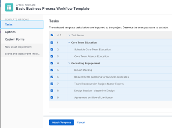

# Allegare un modello a un progetto

È possibile allegare un modello a un progetto durante la fase iniziale di creazione del progetto o dopo la sua creazione.

Per ulteriori informazioni sulla creazione di un progetto utilizzando un modello, consulta [Creare un progetto utilizzando un modello](../../../manage-work/projects/create-projects/create-project-from-template.md).

## Requisiti di accesso

Per eseguire i passaggi descritti in questo articolo, è necessario disporre dei seguenti elementi:

<table style="table-layout:auto"> 
 <col> 
 <col> 
 <tbody> 
  <tr> 
   <td role="rowheader">Piano Adobe Workfront*</td> 
   <td> 
Qualsiasi 
 </td> 
  </tr> 
  <tr> 
   <td role="rowheader">Licenza Adobe Workfront*</td> 
   <td> 
Piano 
 </td> 
  </tr> 
  <tr> 
   <td role="rowheader">Configurazioni del livello di accesso*</td> 
   <td> 
Modifica accesso ai progetti 
 
Per informazioni sull’accesso ai progetti, consulta <a href="../../../administration-and-setup/add-users/configure-and-grant-access/grant-access-projects.md" class="MCXref xref">Concedere l’accesso ai progetti</a>.
 
Accesso ai modelli
 
Per informazioni sulle autorizzazioni per i modelli, consulta <a href="../../../workfront-basics/grant-and-request-access-to-objects/share-a-template.md" class="MCXref xref">Condividere un modello</a>. 
 
Per informazioni sull’accesso ai modelli, consulta <a href="../../../administration-and-setup/add-users/configure-and-grant-access/grant-access-templates.md" class="MCXref xref">Concedere l’accesso ai modelli</a>.
 
Nota: se non disponi ancora dell’accesso, chiedi all’amministratore di Workfront se ha impostato restrizioni aggiuntive nel tuo livello di accesso. Per informazioni su come un amministratore di Workfront può modificare il tuo livello di accesso, consulta <a href="../../../administration-and-setup/add-users/configure-and-grant-access/create-modify-access-levels.md" class="MCXref xref">Creare o modificare livelli di accesso personalizzati</a>.
 </td> 
  </tr> 
  <tr> 
   <td role="rowheader">Autorizzazioni oggetto</td> 
   <td> 
Gestire le autorizzazioni per il progetto
 
Per informazioni sulle autorizzazioni per i progetti, consulta <a href="../../../workfront-basics/grant-and-request-access-to-objects/share-a-project.md" class="MCXref xref">Condividere un progetto in Adobe Workfront</a>. 
 
Visualizza autorizzazioni o versioni successive per il modello
 
Per informazioni sulla richiesta di accesso aggiuntivo, consulta <a href="../../../workfront-basics/grant-and-request-access-to-objects/request-access.md" class="MCXref xref">Richiedi accesso agli oggetti </a>.
 </td> 
  </tr> 
 </tbody> 
</table>

&#42;Per conoscere il piano, il tipo di licenza o l&#39;accesso di cui si dispone, contattare l&#39;amministratore Workfront.

<!--

<h2>Considerations when adding templates to projects</h2>

(NOTE: moved this to an Overview article of its own) 

Consider the following when adding templates to projects:

<ul>
<li> 
You can attach only active templates to projects. 
 </li>
<li> 
You can attach a template to a project when the project is in a status of Complete, Dead, or in Pending Approval, only when your Adobe Workfront administrator or a group administrator has enabled this functionality in the Project&nbsp;Preferences area. For information about setting project preferences, see <a href="../../../administration-and-setup/set-up-workfront/configure-system-defaults/set-project-preferences.md" class="MCXref xref">Configure system-wide project preferences</a>. 
 </li>
<li> 
Unless you exclude specific template tasks from being added in the attachment process, all template tasks are added to the existing project. 
 </li>
<li> 
Most template settings are added to the project. 
 </li>
<li> 
Some settings from the template automatically transfer to the project, unless you specifically mark them to be excluded. 

Example: </b>">
<b>Example: </b>

For example, these settings are added to the project:

<ul>
<li>Start&nbsp;From field</li>
<li>Custom forms and the information on them</li>
<li>Queue Details </li>
<li>Financial settings </li>
</ul>

 </li>
</ul>

-->

## Allega un modello a un progetto esistente {#attach-a-template-to-an-existing-project}

È possibile allegare un modello a un progetto in Workfront dalla pagina del progetto o da un elenco o report di progetti.

1. Vai al progetto in cui desideri allegare un modello e fai clic sul pulsante **Altro** icona  a destra del nome del progetto

   

   Oppure

   Vai a un elenco o a un report di progetti e seleziona un progetto, quindi fai clic su **Altro** icona  nella parte superiore dell’elenco.

   

1. Clic **Allega modello**.

   Viene visualizzata la casella Allega modello (Attach Template).

1. Inizia a digitare il nome del modello che desideri allegare al **Cerca Modelli** , quindi fare clic su di esso quando viene visualizzato.nella lista

   Oppure

   Fai clic sul nome di un modello in **Altri modelli** area.

   A destra viene visualizzata un&#39;anteprima del modello che contiene le seguenti informazioni sul modello:

   * Durata
   * Proprietario
   * Numero di attività di primo livello (include un elenco delle prime tre attività di primo livello)
   * Numero totale di attività
   * Nomi dei moduli personalizzati allegati

   

1. (Facoltativo) Fai clic su **Preferiti** icona  a sinistra del nome del modello per contrassegnarlo come preferito. In questo modo il modello viene spostato nell&#39;elenco Preferiti.

   

1. (Facoltativo) Fai clic su **Preferiti** icona  per rimuoverlo dall&#39;elenco Preferiti.
1. Clic **Personalizza e allega**.

   

1. Aggiorna le informazioni nelle sezioni seguenti prima di allegare il modello (oppure fai clic su **Allega modello** in qualsiasi momento):

   <table style="table-layout:auto"> 
    <col> 
    <col> 
    <tbody> 
     <tr> 
      <td role="rowheader" colspan="2"> 
Sezione Attività
 
  
 </td> 
     </tr> 
     <tr> 
      <td role="rowheader">Le attività modello selezionate di seguito vengono importate nel progetto. Deseleziona quelli da escludere. </td> 
      <td>Deseleziona le attività da escludere dal modello prima di allegarle al progetto.</td> 
     </tr> 
     <tr> 
      <td role="rowheader">Selezionare l'attività di progetto che si desidera come predecessore delle attività in questo modello.</td> 
      <td> 
Fare clic sul campo per visualizzare un elenco delle attività del progetto. Selezionare l'attività di progetto che si desidera completare prima di poter avviare le attività modello. In alternativa, puoi saltare questo passaggio e impostare relazioni all’interno del progetto dopo aver allegato il modello. 
 
 Seleziona la <strong>Tipo di dipendenza</strong>, <strong>Lag</strong> e se si desidera che il predecessore sia <strong>Enforced</strong> o no. 
 </td> 
     </tr> 
     <tr> 
      <td role="rowheader">Selezionare l'attività di progetto che si desidera utilizzare come padre delle attività in questo modello.</td> 
      <td> Selezionare l'attività di progetto che si desidera designare come attività padre per tutte le attività modello. Se non si effettua una selezione, tutte le attività modello vengono visualizzate alla fine delle attività progetto correnti. Puoi saltare questo passaggio e spostare le attività all’interno del progetto dopo aver allegato il modello.</td> 
     </tr> 
     <tr> 
      <td role="rowheader" colspan="2"> 
Sezione Opzioni
 
  
 </td> 
     </tr> 
     <tr> 
      <td role="rowheader">Gli elementi selezionati di seguito vengono trasferiti al progetto. Deseleziona quelli da escludere.</td> 
      <td> 
Deselezionate le caselle di controllo accanto alle informazioni che desiderate cancellare dal modello prima di allegarle al progetto. Queste informazioni non vengono trasferite dal modello al progetto. Per ulteriori informazioni su ciascun campo, vedi <a href="../../../manage-work/projects/create-and-manage-templates/attach-template-to-project-overview.md" class="MCXref xref">Panoramica dell’associazione di un modello a un progetto</a>. 
 
Importante: se selezioni la <strong>Impostazione delle proprietà e dei problemi della coda</strong> , nella casella Dettagli coda del modello vengono sovrascritti quelli del progetto. In questo caso, le Regole di instradamento, gli Argomenti coda e i Gruppi di argomenti del modello vengono aggiunti a quelli del progetto.  Se il progetto è impostato come coda di richieste e il modello allegato al progetto non è impostato come coda di richieste, le informazioni relative alla coda del progetto vengono rimosse se si lascia <strong>Impostazione delle proprietà e dei problemi della coda</strong> casella selezionata.  Se deselezioni il <strong>Proprietà coda e configurazione problema</strong> , vengono mantenute tutte le impostazioni di Configurazione coda del progetto e non vengono allegate impostazioni di Configurazione coda del modello. 
 </td> 
     </tr> 
     <tr> 
      <td role="rowheader" colspan="2"> 
Sezione Forms personalizzata
 
  
 </td> 
     </tr> 
     <tr> 
      <td role="rowheader">Forms personalizzato</td> 
      <td> 
Quando i moduli personalizzati vengono allegati al modello, i relativi nomi vengono visualizzati nel pannello a sinistra. 
 </td> 
     </tr> 
    </tbody> 
   </table>

1. (Facoltativo) Aggiorna le informazioni nei moduli personalizzati. Queste informazioni vengono trasferite al progetto.

   >[!TIP]
   >
   >* Questo passaggio è obbligatorio quando i moduli personalizzati nel modello contengono campi obbligatori vuoti.
   >* Se i campi dei moduli personalizzati del modello esistono già nel progetto e contengono informazioni, queste vengono mantenute nel progetto. Non è possibile modificarli durante l&#39;associazione del modello.

1. Clic **Allega modello.**
1. Clic **Annulla allegato** per interrompere il collegamento del modello.

   Oppure

   Consenti all&#39;allegato di completare l&#39;aggiunta del modello al progetto.

   Dopo aver allegato il modello, è possibile modificare il progetto e modificare le attività, le informazioni o le impostazioni in base alle esigenze.

1. (Facoltativo) Fai clic su **Dettagli progetto**, quindi **Panoramica** per visualizzare il nome del modello allegato nel **Relazioni progetto** area.

   >[!TIP]
   >
   >Se si allegano più modelli al progetto, in questo campo viene visualizzato solo il modello applicato per primo. Per informazioni, vedere [Allegare più modelli a un progetto esistente e visualizzare le informazioni sul modello](#attach-multiple-templates-to-an-existing-project-and-view-template-information) in questo articolo.

1. (Facoltativo) Rimuovi le informazioni sul modello dal progetto in cui è stato allegato il modello. Per informazioni, consulta [Rimuovere informazioni sul modello da un progetto](../../../manage-work/projects/create-and-manage-templates/remove-template-from-project.md).

## Allegare più modelli a un progetto esistente e visualizzare le informazioni sul modello {#attach-multiple-templates-to-an-existing-project-and-view-template-information}

Puoi allegare più modelli (uno alla volta) allo stesso progetto, seguendo i passaggi descritti nella sezione [Allega un modello a un progetto esistente](#attach-a-template-to-an-existing-project) in questo articolo. In questo modo le attività e altre informazioni di ogni modello vengono aggiunte al progetto.

>[!TIP]
>
>Quando si allegano diversi modelli a un progetto, nell&#39;area Dettagli progetto viene visualizzato solo il modello associato per primo.

Per capire quale modello viene applicato a un progetto:

1. Passa a un progetto a cui è associato un modello.
1. Clic **Dettagli progetto** nel pannello a sinistra.
1. Trova il nome del modello associato al progetto in **Modello** campo nella parte inferiore della sezione **Panoramica** sezione in **Relazioni progetto** .

   

