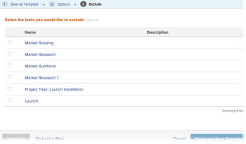

# Crea modello da progetto

<!--

(Note: Keep this article in the Creating and Managing Templates area with the detailed information that this contains. Since this is an article about creating TEMPLATES, this needs to be detailed under Templates; there is a similar article with almost the same title in Managing projects that points to this one - since this functionality is in the UI under Projects, this article must have a presence in that areas as well. Keep both, but make this one the only editable one (iterative))

-->

È possibile creare modelli quando si salva un progetto esistente come modello.

Dopo aver salvato un progetto esistente come modello, è possibile utilizzare il nuovo modello per creare nuovi progetti. Questo semplifica e velocizza il processo di creazione del progetto.

>[!NOTE]
>
>Quando si salva un progetto come modello, le date effettive delle attività e del progetto non vengono salvate come modello.
>
>Un modello e le relative attività non dispongono di date effettive, ma di un&#39;indicazione del giorno (a partire dal quale potrebbe iniziare il progetto futuro) in cui un&#39;attività potrebbe iniziare e del giorno in cui l&#39;attività potrebbe dover essere completata. Quando si utilizzano i modelli per creare i progetti futuri, i progetti riceveranno le date effettive. Per informazioni, vedere [Creare un progetto](../create-projects/create-project.md).

## Requisiti di accesso

+++ Espandi per visualizzare i requisiti di accesso per la funzionalità in questo articolo.

<table style="table-layout:auto"> 
 <col> 
 <col> 
 <tbody> 
  <tr> 
   <td role="rowheader">Pacchetto Adobe Workfront</td> 
   <td> 
Qualsiasi
 </td> 
  </tr> 
  <tr> 
   <td role="rowheader">Licenza Adobe Workfront</td> 
   <td>
Standard
 
   
Piano
 </td> 
  </tr> 
  <tr> 
   <td role="rowheader">Configurazioni del livello di accesso</td> 
   <td> 
Modificare l’accesso ai modelli
</td> 
  </tr> 
  <tr> 
   <td role="rowheader">Autorizzazioni oggetto</td> 
   <td> 
Visualizzare o accedere ad autorizzazioni superiori per un progetto 
 
Dopo la creazione, si ottengono le autorizzazioni di gestione per il modello
</td> 
  </tr> 
 </tbody> 
</table>

Per ulteriori dettagli sulle informazioni contenute in questa tabella, vedere [Requisiti di accesso nella documentazione di Workfront](/help/quicksilver/administration-and-setup/add-users/access-levels-and-object-permissions/access-level-requirements-in-documentation.md).

+++

<!--Old:
<table style="table-layout:auto"> 
 <col> 
 <col> 
 <tbody> 
  <tr> 
   <td role="rowheader">Adobe Workfront plan*</td> 
   <td> 
Any 
 </td> 
  </tr> 
  <tr> 
   <td role="rowheader">Adobe Workfront license*</td> 
   <td> 
Plan 
 </td> 
  </tr> 
  <tr> 
   <td role="rowheader">Access level configurations*</td> 
   <td> 
Edit access to Templates
 
Note: If you still don't have access, ask your Workfront administrator if they set additional restrictions in your access level. For information on how a Workfront administrator can modify your access level, see <a href="../../../administration-and-setup/add-users/configure-and-grant-access/create-modify-access-levels.md" class="MCXref xref">Create or modify custom access levels</a>.
 </td> 
  </tr> 
  <tr> 
   <td role="rowheader">Object permissions</td> 
   <td> 
View or higher permissions to a project 
 
You obtain Manage permissions to the template after you create it
 
For information on requesting additional access, see <a href="../../../workfront-basics/grant-and-request-access-to-objects/request-access.md" class="MCXref xref">Request access to objects </a>.
 </td> 
  </tr> 
 </tbody> 
</table>-->

## Crea modello da progetto

1. Vai al progetto che desideri salvare come modello.
1. Fai clic sul menu **Altro** , quindi **Salva come modello**.
1. Specificare le informazioni seguenti per il modello:

   <table style="table-layout:auto"> 
    <col> 
    <col> 
    <tbody> 
     <tr> 
      <td role="rowheader">Nome</td> 
      <td>Specificare un nome per il modello.</td> 
     </tr> 
     <tr> 
      <td role="rowheader">Descrizione</td> 
      <td>Fornisci una descrizione per il modello.</td> 
     </tr> 
     <tr> 
      <td role="rowheader">È attivo</td> 
      <td> 
Selezionare una delle opzioni seguenti:
 
       <ul> 
        <li> 
<strong>Sì</strong>: altri utenti possono trovare il modello e allegarlo ai progetti.
 </li> 
        <li><strong>No</strong>: altri utenti non possono trovare il modello e non possono allegarlo ai progetti.</li> 
       </ul> </td> 
     </tr> 
     <tr> 
      <td role="rowheader">Moduli personalizzati</td> 
      <td>Utilizza l’elenco a discesa per selezionare i moduli personalizzati da allegare al modello. Se al progetto sono già stati associati moduli personalizzati, vengono visualizzati tutti i campi di dati di tali moduli personalizzati. È possibile includere fino a 10 moduli personalizzati in un singolo modello.</td> 
     </tr> 
    </tbody> 
   </table>

1. Fare clic su **Gestisci Forms** per rimuovere o riordinare i moduli. Per informazioni su come rimuovere e riordinare i moduli personalizzati nel modello, vedere [Moduli personalizzati](../../../administration-and-setup/customize-workfront/create-manage-custom-forms/create-and-manage-custom-forms.md).

   

1. Fai clic su **Passaggio successivo.**
1. Nella sezione **Opzioni**, seleziona la casella di controllo accanto alle informazioni che desideri cancellare dal modello.

   

1. Fai clic su **Passaggio successivo.**
1. Nella sezione **Escludi** selezionare le attività che si desidera escludere dal progetto.

   

1. Fare clic su **Fine e salva modello.**

   Il modello viene ora visualizzato nell’elenco dei modelli disponibili e può essere allegato a un progetto esistente o utilizzato per crearne uno nuovo.

 
