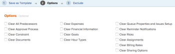

# Crea modello da progetto

<!--

(Note: Keep this article in the Creating and Managing Templates area with the detailed information that this contains. Since this is an article about creating TEMPLATES, this needs to be detailed under Templates; there is a similar article with almost the same title in Managing projects that points to this one - since this functionality is in the UI under Projects, this article must have a presence in that areas as well. Keep both, but make this one the only editable one (iterative))

-->

Puoi creare modelli quando salvi un progetto esistente come modello.

Dopo aver salvato un progetto esistente come modello, puoi utilizzare il nuovo modello per creare nuovi progetti. Questo semplifica e velocizza il processo di creazione del progetto.

## Requisiti di accesso

Per eseguire i passaggi descritti in questo articolo, è necessario disporre dei seguenti diritti di accesso:

<table style="table-layout:auto"> 
 <col> 
 <col> 
 <tbody> 
  <tr> 
   <td role="rowheader">piano Adobe Workfront*</td> 
   <td> 
Qualsiasi 
 </td> 
  </tr> 
  <tr> 
   <td role="rowheader">Licenza Adobe Workfront*</td> 
   <td> 
Piano 
 </td> 
  </tr> 
  <tr> 
   <td role="rowheader">Configurazioni a livello di accesso*</td> 
   <td> 
Modificare l’accesso ai modelli
 
Nota: Se non disponi ancora dell’accesso, chiedi all’amministratore Workfront se ha impostato ulteriori restrizioni nel livello di accesso. Per informazioni su come un amministratore Workfront può modificare il livello di accesso, consulta <a href="../../../administration-and-setup/add-users/configure-and-grant-access/create-modify-access-levels.md" class="MCXref xref">Creare o modificare livelli di accesso personalizzati</a>.
 </td> 
  </tr> 
  <tr> 
   <td role="rowheader">Autorizzazioni oggetto</td> 
   <td> 
Visualizzare o concedere autorizzazioni superiori a un progetto 
 
Ottieni le autorizzazioni di gestione per il modello dopo averlo creato
 
Per informazioni sulla richiesta di accesso aggiuntivo, vedi <a href="../../../workfront-basics/grant-and-request-access-to-objects/request-access.md" class="MCXref xref">Richiedere l’accesso agli oggetti </a>.
 </td> 
  </tr> 
 </tbody> 
</table>

&#42;Per informazioni sul piano, il tipo di licenza o l&#39;accesso, contattare l&#39;amministratore Workfront.

## Crea modello da progetto

1. Passa al progetto da salvare come modello.
1. Fai clic sul pulsante **Altro** menu , quindi **Salva come modello**.
1. Specifica le seguenti informazioni per il modello:

   <table style="table-layout:auto"> 
    <col> 
    <col> 
    <tbody> 
     <tr> 
      <td role="rowheader">Nome</td> 
      <td>Specifica un nome per il modello.</td> 
     </tr> 
     <tr> 
      <td role="rowheader">Descrizione</td> 
      <td>Fornisci una descrizione del modello.</td> 
     </tr> 
     <tr> 
      <td role="rowheader">È attivo</td> 
      <td> 
Seleziona tra le seguenti opzioni:
 
       <ul> 
        <li> 
<strong>Sì</strong>: Altri utenti possono trovare il modello e allegarlo ai progetti.
 </li> 
        <li><strong>No</strong>: Altri utenti non possono trovare il modello e non possono allegarlo ai progetti.</li> 
       </ul> </td> 
     </tr> 
     <tr> 
      <td role="rowheader">Moduli personalizzati</td> 
      <td>Utilizzare l’elenco a discesa per selezionare i moduli personalizzati da allegare al modello. Se al progetto sono già stati associati moduli personalizzati, vengono visualizzati tutti i campi dati di tali moduli personalizzati. È possibile includere fino a 10 moduli personalizzati in un singolo modello.</td> 
     </tr> 
    </tbody> 
   </table>

1. Fai clic su **Gestione Forms** per rimuovere o riordinare i moduli. Per informazioni su come rimuovere e riordinare i moduli personalizzati nel modello, vedere [Moduli personalizzati](../../../administration-and-setup/customize-workfront/create-manage-custom-forms/create-and-manage-custom-forms.md).

   

1. Fai clic su **Passaggio successivo.**
1. In **Opzioni** , seleziona la casella di controllo accanto alle informazioni che desideri cancellare dal modello.

   

1. Fai clic su **Passaggio successivo.**
1. In **Escludi** seleziona le attività da escludere dal progetto.

   

1. Fai clic su **Finisci e salva modello.**

   Il modello viene ora visualizzato nell’elenco dei modelli disponibili e può essere allegato a un progetto esistente o utilizzato per crearne uno nuovo.

 
