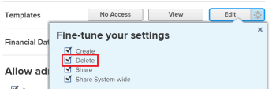

# Eliminare i modelli di progetto

È consigliabile disattivare i modelli non più in uso, anziché eliminarli, in modo da poter mantenere nel tempo le informazioni storiche sui progetti. Per informazioni sulla disattivazione di un modello, consulta [Modificare i modelli di progetto](../../../manage-work/projects/create-and-manage-templates/edit-templates.md).

>[!IMPORTANT]
>
>Quando elimini un modello, i progetti che utilizzano tale modello non vengono modificati in alcun modo. Tuttavia, non è più possibile visualizzare il nome del modello originale nel campo Modello del progetto. Inoltre, non è più possibile visualizzare i nomi delle attività modello per le attività del progetto in una visualizzazione attività. Il campo Modello del progetto e il campo Task modello delle attività rimangono vuoti dopo l’eliminazione del modello originariamente associato al progetto.

## Requisiti di accesso

Per eseguire i passaggi descritti in questo articolo, è necessario disporre dei seguenti diritti di accesso:

<table style="table-layout:auto"> 
 <col> 
 <col> 
 <tbody> 
  <tr> 
   <td role="rowheader">piano Adobe Workfront*</td> 
   <td> 
Qualsiasi
 </td> 
  </tr> 
  <tr> 
   <td role="rowheader">Licenza Adobe Workfront*</td> 
   <td> 
Piano 
 </td> 
  </tr> 
  <tr> 
   <td role="rowheader">Configurazioni a livello di accesso*</td> 
   <td> 
Modifica l’accesso ai modelli che include l’accesso a Elimina
 
  
 
Nota: Se non disponi ancora dell’accesso, chiedi all’amministratore Workfront se ha impostato ulteriori restrizioni nel livello di accesso. Per informazioni su come un amministratore Workfront può modificare il livello di accesso, consulta <a href="../../../administration-and-setup/add-users/configure-and-grant-access/create-modify-access-levels.md" class="MCXref xref">Creare o modificare livelli di accesso personalizzati</a>.
 </td> 
  </tr> 
  <tr> 
   <td role="rowheader">Autorizzazioni oggetto</td> 
   <td> 
Gestisci le autorizzazioni per il modello che include le autorizzazioni per eliminarlo
 
  
 
Per informazioni sulla richiesta di accesso aggiuntivo, vedi <a href="../../../workfront-basics/grant-and-request-access-to-objects/request-access.md" class="MCXref xref">Richiedere l’accesso agli oggetti </a>.
 </td> 
  </tr> 
 </tbody> 
</table>

&#42;Per informazioni sul piano, il tipo di licenza o l&#39;accesso, contattare l&#39;amministratore Workfront.

## Considerazioni sull’eliminazione dei modelli

* Le attività aggiunte ai progetti quando il modello è stato allegato rimangono sui progetti. Tuttavia, le informazioni sull&#39;attività del modello associate alle attività vengono eliminate.
* Il nome del modello non è più elencato nella variabile **Modello** sul campo **Panoramica** sottoscheda del progetto.

* È possibile recuperare un modello eliminato di recente dal Cestino. Per informazioni sul recupero degli elementi dal Cestino, vedere [Ripristina elementi eliminati](../../../administration-and-setup/manage-workfront/manage-deleted-items/restore-deleted-items.md).

## Eliminare un modello

1. Da **Menu principale** , fai clic su **Modelli**. Verrà visualizzato un elenco di modelli

1. Seleziona il modello da eliminare facendo clic sulla casella di controllo a sinistra del nome del modello, quindi fai clic su **Elimina > Sì, Elimina** per confermare l’eliminazione.

   Oppure

   Fai clic sul nome di un modello per accedervi, quindi fai clic sul pulsante **Altro** menu  , quindi **Elimina modello > Sì, eliminalo**.

   Il modello non è più disponibile per essere associato a un progetto.
