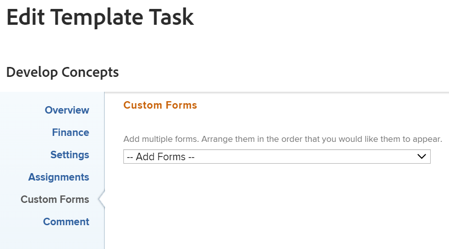

# Modificare un’attività modello

Dopo aver creato un modello, è possibile modificare le informazioni sulle attività del modello. Le informazioni aggiornate su un&#39;attività modello sono associate alle attività del progetto dopo aver utilizzato il modello per creare un progetto o aver allegato il modello a un progetto.

Per informazioni sulla creazione di un modello, consulta [Creare un modello di progetto](../../../manage-work/projects/create-and-manage-templates/create-template.md).

## Requisiti di accesso

Per eseguire i passaggi descritti in questo articolo, è necessario disporre dei seguenti diritti di accesso:

<table style="table-layout:auto"> 
 <col> 
 <col> 
 <tbody> 
  <tr> 
   <td role="rowheader">piano Adobe Workfront*</td> 
   <td> 
Qualsiasi
 </td> 
  </tr> 
  <tr> 
   <td role="rowheader">Adobe licenza di Workfrontlicense*</td> 
   <td> 
Piano 
 </td> 
  </tr> 
  <tr> 
   <td role="rowheader">Livello di accesso*</td> 
   <td> 
Modificare l’accesso ai modelli
 
Nota: Se disponi dell'accesso corretto ma non riesci ancora a modificare un'attività del modello, chiedi all'amministratore Workfront se hai impostato ulteriori restrizioni nel tuo livello di accesso. Per informazioni su come un amministratore Workfront può modificare il livello di accesso, consulta <a href="../../../administration-and-setup/add-users/configure-and-grant-access/create-modify-access-levels.md" class="MCXref xref">Creare o modificare livelli di accesso personalizzati</a>.
 </td> 
  </tr> 
  <tr> 
   <td role="rowheader"><strong>Autorizzazioni oggetto</strong> </td> 
   <td> 
Gestisci le autorizzazioni per un modello. 
 
Autorizzazioni di Contribute o superiori per l'attività del modello.
 
Per informazioni sulla richiesta dell’accesso agli oggetti, consulta <a href="../../../workfront-basics/grant-and-request-access-to-objects/request-access.md" class="MCXref xref">Richiedere l’accesso agli oggetti </a>.
 </td> 
  </tr> 
 </tbody> 
</table>

&#42;Per informazioni su piano, tipo di licenza o livello di accesso, contattare l&#39;amministratore Workfront.

## Prerequisiti

Prima di iniziare, devi

* Crea un modello.

   Per informazioni sulla creazione di un modello, consulta [Creare un modello di progetto](../../../manage-work/projects/create-and-manage-templates/create-template.md).

## Modifica attività modello

È possibile modificare un&#39;attività modello utilizzando le aree Modifica attività modello o Dettagli attività modello. I passaggi seguenti descrivono la modifica di un&#39;attività nella casella Modifica attività modello.

1. Fai clic sul pulsante **Menu principale** icona  nell’angolo in alto a destra di Adobe Workfront.

1. Fai clic su **Modelli**.
1. Fai clic sul nome di un modello per aprirlo.
1. Fai clic su **Attività dei modelli** nel pannello a sinistra.
1. Fare clic sul nome di un&#39;attività modello nell&#39;elenco per aprire l&#39;attività modello.
1. (Condizionale) Per modificare informazioni limitate sull&#39;attività del modello, fai clic su **Dettagli attività modello** nel pannello a sinistra, vai alle aree della sezione Dettagli per modificare le informazioni di ogni area.
1. (Facoltativo) Fai clic sul pulsante **Comprimi tutto** icona  per comprimere tutte le aree.
1. Per modificare le informazioni nella sezione Dettagli, fai clic sul pulsante **Modifica** icona , quindi seleziona una delle aree sottostanti, oppure fai clic su **Modifica tutto** per modificare le informazioni in tutte le aree:

   * Panoramica
   * Moduli personalizzati

      I nomi dei moduli doganali vengono visualizzati solo se all’oggetto sono associati moduli personalizzati.

   * Finanz
   >[!TIP]
   >
   >Per informazioni su tutti i campi visualizzati nell’area Dettagli, continuare con la modifica di tutti i campi utilizzando la casella Modifica attività modello riportata di seguito.

1. (Condizionale) Per modificare tutte le informazioni sull&#39;attività del modello, fai clic sul pulsante **Altro** menu  accanto al nome dell&#39;attività modello, quindi fai clic su **Modifica**.

   La **Modifica attività modello** viene visualizzata la casella .

   >[!TIP]
   >
   >È inoltre possibile selezionare un&#39;attività modello in un elenco, quindi fare clic su Modifica per aprire la casella Modifica attività modello.

   

1. È consigliabile specificare le informazioni in una delle sezioni seguenti:

   * [Panoramica](#overview)
   * [Finanz](#finance)
   * [Impostazioni](#settings)
   * [Assegnazioni](#assignments)
   * [Moduli personalizzati](#custom-forms)
   * [Commento](#comment)

### Panoramica {#overview}

1. Inizia a modificare un’attività modello come descritto sopra.
1. Fai clic su **Panoramica**.

   

1. Aggiorna uno dei seguenti elementi:

   <table style="table-layout:auto"> 
    <col> 
    <col> 
    <tbody> 
     <tr> 
      <td role="rowheader"><strong>Nome</strong> </td> 
      <td>Specificare un nome per l'attività del modello.</td> 
     </tr> 
     <tr> 
      <td role="rowheader"><strong>Descrizione</strong> </td> 
      <td>Aggiungi ulteriori informazioni sull'attività del modello.</td> 
     </tr> 
     <tr> 
      <td role="rowheader"><strong>URL</strong> </td> 
      <td>Specifica un collegamento web relativo alle informazioni sull’attività del modello.</td> 
     </tr> 
     <tr> 
      <td role="rowheader"><strong>Priorità</strong> </td> 
      <td> 
Questo è un flag visivo che ti consente di assegnare priorità alle attività del modello. 
 
Seleziona tra le seguenti opzioni:
 
       <ul> 
        <li> 
<strong>Nessuno</strong> 
 </li> 
        <li> 
<strong>Basso</strong> 
 </li> 
        <li> 
Normal 
 </li> 
        <li> 
Alta 
 </li> 
        <li> 
Urgente 
 </li> 
       </ul> 
A seconda delle preferenze del progetto selezionate dall’amministratore di Workfront, i nomi delle priorità potrebbero essere diversi. Per ulteriori informazioni sulle priorità di modifica, vedi <a href="../../../administration-and-setup/customize-workfront/creating-custom-status-and-priority-labels/create-customize-priorities.md" class="MCXref xref">Creare e personalizzare le priorità</a>.
 </td> 
     </tr> 
     <tr> 
      <td role="rowheader"><strong>Tipo di Durata</strong> </td> 
      <td> 
L'attività futura creata da questo modello avrà questo tipo di durata.  Il tipo di durata identifica la relazione tra i seguenti elementi:
 
- numero di risorse assegnate a un'attività
 
- lo sforzo totale necessario per completare l'attività
 
- la durata totale dell'attività. 
 
I tipi di durata consentono di impostare assegnazioni di risorse coerenti in base alle esigenze dell'attività. Per ulteriori informazioni sul tipo di durata di un'attività, vedere <a href="../../../manage-work/tasks/taskdurtn/task-duration-and-duration-type.md" class="MCXref xref">Panoramica del tipo di durata e durata dell’attività</a>.
 
Seleziona tra le seguenti opzioni:
 
       <ul> 
        <li> 
Incarico Calcolato 
 </li> 
        <li> 
Lavoro Calcolato 
 </li> 
        <li> 
Impegno Aggiuntivo 
 </li> 
        <li> 
Semplice   
 </li> 
       </ul> </td> 
     </tr> 
     <tr> 
      <td role="rowheader"><strong>Durata</strong> </td> 
      <td> 
Specifica la durata delle attività future, in minuti, ore, giorni, settimane o mesi. L'attività futura creata da questo modello avrà la durata specificata qui.
 
Per impostazione predefinita, Workfront misura la Durata in giorni. Questo è il tempo necessario per consentire all'attività di rimanere incompleta prima che venga completata. Non è possibile specificare la Durata di un'attività quando la <strong>Tipo di durata</strong> dell'attività <strong>Semplice</strong>o quando <strong>Vincolo attività</strong> è <strong>Date fisse</strong>.
 
Importante: La durata è in genere la quantità di tempo tra l'inizio pianificato e le date di completamento pianificato di un'attività modello e, per questo motivo, influisce sulla timeline del modello. Questo determina la timeline del progetto futuro creato dal modello. 
 </td> 
     </tr> 
     <tr> 
      <td role="rowheader"><strong>Lavoro Necessario</strong> </td> 
      <td> 
Specifica la quantità di ore pianificate per l'attività futura sul progetto creato con questo modello. Questo è il tempo effettivo necessario agli assegnatari dell'attività per completarla. È possibile specificare solo la quantità di ore pianificate per un'attività quando la<strong>Tipo di durata</strong> è impostato su <strong>Assegnazione calcolata</strong>. 
 </td> 
     </tr> 
     <tr data-mc-conditions=""> 
      <td role="rowheader">Impegno di lavoro </td> 
      <td> 
Quantità di sforzo necessaria per completare un'attività. Il project manager potrebbe decidere di utilizzare questo campo invece di Orari pianificati per stimare lo sforzo necessario per completare un'attività. Questo campo è visibile solo quando sono soddisfatte le seguenti condizioni: 
 
       <ul> 
        <li> 
L'attività modello ha un tipo di durata semplice. 
 
Suggerimento: Se si aggiorna il tipo di durata dell'attività, questo campo viene nascosto. 
 </li> 
        <li>Il project manager ha abilitato il campo Use Work Ffort per calcolare l’ora pianificata del modello. </li> 
       </ul> 
       
 
        
 Seleziona tra le seguenti opzioni:
 
        <ul> 
         <li>Piccolo</li> 
         <li>Media (valore predefinito per una nuova attività)</li> 
         <li>Grande</li> 
        </ul> 
       
 
Per informazioni sull'utilizzo dello sforzo di lavoro anziché dell'orario pianificato per stimare lo sforzo dell'attività, vedere <a href="../../../manage-work/tasks/task-information/work-effort.md" class="MCXref xref">Panoramica sullo sforzo di lavoro</a>.
 </td> 
     </tr> 
     <tr> 
      <td role="rowheader"><strong>Vincolo attività</strong> </td> 
      <td> 
L'attività del progetto creato da questo modello avrà questo vincolo. I vincoli di attività identificano quando un'attività deve essere completata. 
 
Seleziona tra le seguenti opzioni:
 
       <ul> 
        <li><strong>Dati Fissi</strong>. Specifica una <strong>Inizio pianificato</strong> e <strong>Data completamento pianificata.</strong></li> 
        <li><strong>Deve ininziare al</strong>. Specifica una <strong>Data di inizio pianificata.</strong></li> 
        <li><strong>Deve Finire al</strong>. Specifica una <strong>Data completamento pianificata</strong>.</li> 
        <li><strong>Il più presto possibile</strong> </li> 
        <li><strong>Il più tardi possibile</strong> </li> 
        <li style="font-weight: bold;"><strong>Primo Orario Disponibile</strong> </li> 
        <li style="font-weight: bold;"><strong>Ultimo Orario Disponibile</strong> </li> 
        <li>Iniziare non Dopo di. Specifica una <strong>Data di inizio prevista</strong>.</li> 
        <li><strong>Iniziare non Prima di</strong>. Specifica una <strong>Data di inizio prevista</strong>.</li> 
        <li><strong>Finire non Dopo di</strong>. Specifica una <strong>Data completamento pianificata</strong>.</li> 
        <li><strong>Finire non Prima di</strong>. Specifica una <strong>Data completamento pianificata</strong>.</li> 
       </ul> 
Per ulteriori informazioni sul vincolo di attività, vedere <a href="../../../manage-work/tasks/task-constraints/task-constraint-overview.md" class="MCXref xref">Panoramica sul vincolo di attività</a>.
 </td> 
     </tr> 
     <tr> 
      <td role="rowheader">Inizio giorno(Facoltativo e condizionale) </td> 
      <td> 
 È possibile specificare il giorno iniziale di un'attività modello solo quando il vincolo di attività è uno dei seguenti:
 
       <ul> 
        <li>Deve ininziare al</li> 
        <li>Inizia non prima di</li> 
        <li>Iniziare non Dopo di</li> 
        <li>Dati Fissi</li> 
       </ul> 
Questo corrisponde alla data entro la timeline del progetto futuro in cui verrà avviata l’attività. Per tutti gli altri vincoli, Workfront calcola il giorno iniziale in base alla dipendenza del predecessore tra le attività. 
 </td> 
     </tr> 
     <tr> 
      <td role="rowheader"><strong>Giorno di completamento</strong> (Facoltativo e condizionale) </td> 
      <td> 
 È possibile specificare il giorno di completamento di un'attività modello solo quando il vincolo di attività è uno dei seguenti:
 
       <ul style="list-style-type: circle;"> 
        <li>Deve Finire al</li> 
        <li>Fine Non Precedente A</li> 
        <li>Finire non Dopo di</li> 
        <li>Dati Fissi</li> 
       </ul> 
Questo valore corrisponde alla data entro la cronologia del progetto futuro in cui l’attività verrà completata. Per tutti gli altri vincoli, Workfront calcola il giorno di completamento in base a Durata e dipendenza predecessore. 
 </td> 
     </tr> 
    </tbody> 
   </table>

1. (Facoltativo) Continua a modificare le sezioni seguenti, a seconda delle informazioni che desideri modificare.

   Oppure

   Fai clic su **Salva modifiche**.

### Finanz {#finance}

1. Inizia a modificare un’attività come descritto sopra.
1. Fai clic su **Finanza**.

   

1. Aggiorna uno dei seguenti elementi:

   <table style="table-layout:auto"> 
    <col> 
    <col> 
    <tbody> 
     <tr> 
      <td role="rowheader"><strong>Tipo Cst</strong> </td> 
      <td> 
Specificare il tipo di costo per l'attività futura. In questo modo verrà determinato il calcolo del costo per l'attività, in base al numero di ore relative alle attività. 
 
Seleziona tra le seguenti opzioni:
 
       <ul> 
        <li> 
Nessun Costo 
 </li> 
        <li> 
Ore Fisse 
 </li> 
        <li> 
Ore Utente 
 </li> 
        <li> 
Ore Ruolo 
 </li> 
       </ul> 
Per ulteriori informazioni sui costi di tracciamento, vedi <a href="../../../manage-work/projects/project-finances/track-costs.md" class="MCXref xref">Costi di tracciamento</a>.
 </td> 
     </tr> 
     <tr> 
      <td role="rowheader"><strong>Tipo di Reddito</strong> </td> 
      <td> 
Specifica il tipo di ricavi per l'attività futura. Questo determinerà il modo in cui vengono calcolati i Ricavi sull'attività, in base al numero di ore sulle attività.
 
Seleziona tra le seguenti opzioni: 
 
       <ul> 
        <li> 
Non Fatturabile
 </li> 
        <li> 
Ore Utente
 </li> 
        <li> 
Ore Ruolo
 </li> 
        <li> 
Ore Fisse
 </li> 
        <li> 
Ore Utente w/Cap
 </li> 
        <li> 
Ore Ruolo w/Cap
 </li> 
        <li> 
Ore Utente più Fisso
 </li> 
        <li> 
Ore Ruolo più Fisso
 </li> 
        <li> 
Reddito Fisso
 </li> 
       </ul> 
Per ulteriori informazioni sul tracciamento dei ricavi, vedi <a href="../../../manage-work/projects/project-finances/billing-and-revenue-overview.md" class="MCXref xref">Panoramica di fatturazione e ricavi</a>.
 </td> 
     </tr> 
    </tbody> 
   </table>

1. (Facoltativo) Continua a modificare le sezioni seguenti, a seconda delle informazioni che desideri modificare.

   Oppure

   Fai clic su **Salva modifiche**.

### Impostazioni {#settings}

1. Inizia a modificare un’attività come descritto sopra.
1. Fai clic su **Impostazioni**.

   

1. Aggiorna uno dei seguenti elementi:

   <table style="table-layout:auto"> 
    <col> 
    <col> 
    <tbody> 
     <tr> 
      <td role="rowheader"><strong>Modalità Tracciamento</strong> </td> 
      <td> 
Specificare come verrà tracciato lo stato di avanzamento dell'attività futura. 
 
Seleziona tra le seguenti opzioni:
 
       <ul> 
        <li> 
<strong>Utente deve Aggiornare</strong> 
 </li> 
        <li> 
<strong>Presupponi in tempo</strong> 
 </li> 
        <li> 
<strong>Ignora Avvertimenti di Ritardo</strong> 
 </li> 
        <li> 
<strong>Autocompletamento</strong> 
 </li> 
        <li> 
<strong>Predecessore</strong> 
 </li> 
       </ul> 
Per ulteriori informazioni sulla modalità di tracciamento delle attività, consulta <a href="../../../manage-work/tasks/task-information/task-tracking-mode.md" class="MCXref xref">Panoramica sulla modalità di tracciamento delle attività</a>.
 </td> 
     </tr> 
     <tr> 
      <td role="rowheader"><strong>Processo di approvazione</strong> </td> 
      <td> 
Selezionare il processo di approvazione da associare all'attività del modello. Prima di poter essere associati alle attività del modello, è necessario che l'amministratore di Workfront definisca i processi di approvazione delle attività a livello di sistema. Un utente con accesso amministrativo ai processi di approvazione può anche creare processi di approvazione specifici per gruppo. Per ulteriori informazioni sulla creazione dei processi di approvazione, consulta <a href="../../../administration-and-setup/customize-workfront/configure-approval-milestone-processes/create-approval-processes.md" class="MCXref xref">Creazione di un processo di approvazione per gli elementi di lavoro</a>.
 
Quando si aggiungono processi di approvazione, considera quanto segue: 
 
       <ul> 
       <li>Nell’elenco vengono visualizzati solo i processi di approvazione attivi. </li> 
       <li> 
Nell'elenco vengono visualizzati i processi di approvazione a livello di sistema e di gruppo. I processi di approvazione associati a un gruppo diverso da quello del modello non vengono visualizzati nell’elenco.
 
Importante: Se il gruppo associato al modello cambia, il processo di approvazione specifico per il gruppo diventa un processo di approvazione a uso singolo. Per ulteriori informazioni su come le modifiche apportate al gruppo del progetto o al processo di approvazione influiscono sulle impostazioni di approvazione, vedere <a href="../../../administration-and-setup/customize-workfront/configure-approval-milestone-processes/how-changes-affect-group-approvals.md" class="MCXref xref">Effetti delle modifiche al processo di approvazione e di gruppo sui processi di approvazione assegnati</a>. 
 </li> 
       <li> 
Se hai aggiunto un processo di approvazione per un solo utilizzo, viene visualizzato come "&lt;custom&gt;" in questo campo. Per informazioni, consulta <a href="../../../review-and-approve-work/manage-approvals/associate-approval-with-work.md" class="MCXref xref">Associa un processo di approvazione nuovo o esistente al lavoro</a>. 
 <!--
(NOTE: this will be valid only for Classic when they edit the Edit Template box in NWE)
--> </li> 
       <li> 
Quando si eseguono attività di modifica in serie di modelli, esistono i seguenti scenari:
 
       <ul> 
       <li> 
Quando si selezionano attività modello dallo stesso gruppo di modelli, in questo campo vengono visualizzati sia i processi di approvazione a livello di sistema che quelli a livello di gruppo.
 </li> 
       <li> 
Quando si selezionano attività modello da diversi gruppi di modelli, in questo campo vengono visualizzati solo i processi di approvazione a livello di sistema.
 </li> 
       <li> 
Quando uno dei task del modello presenta un processo di approvazione a uso singolo allegato, viene sostituito da o processo di approvazione a livello di gruppo selezionate. 
 </li> 
       </ul> </li> 
       </ul> </td> 
     </tr> 
     <tr> 
      <td role="rowheader"><strong>Notifiche promemoria</strong> </td> 
      <td> 
Selezionare le notifiche di promemoria da allegare all'attività del modello. Saranno allegati alle attività future sul progetto creato da questo modello. L'amministratore di sistema deve configurare le notifiche dei promemoria prima di selezionarle in un'attività. Per ulteriori informazioni sulla configurazione delle notifiche dei promemoria, vedi <a href="../../../administration-and-setup/manage-workfront/emails/set-up-reminder-notifications.md" class="MCXref xref">Impostare le notifiche dei promemoria</a>.
 </td> 
     </tr> 
    </tbody> 
   </table>

1. (Facoltativo) Continua a modificare le sezioni seguenti, a seconda delle informazioni che desideri modificare.

   Oppure

   Fai clic su **Salva modifiche**.

### Assegnazioni {#assignments}

1. Inizia a modificare un’attività come descritto sopra.
1. Fai clic su **Assegnazioni**.

   

1. Fai clic su **Aggiungi assegnatario** per aggiungere un nuovo assegnatario all&#39;attività del modello. È possibile assegnare utenti, ruoli o team a un’attività. È possibile disporre di più assegnatari in un&#39;attività. Le attività future avranno le stesse risorse assegnate quando create da questo task modello.
1. (Facoltativo) Se disponi di più assegnatari, seleziona la **Proprietario** pulsante di scelta per indicare quale utente o ruolo è considerato il proprietario dell&#39;attività o l&#39;assegnatario principale. Workfront contrassegna il primo ruolo utente o processo assegnato a un&#39;attività modello come proprietario o assegnatario principale.
1. (Condizionale e facoltativo) Se il Vincolo attività è Calcolato Lavoro o Sforzo guidato, specificare il **% allocazione** (percentuale di assegnazione) per ciascun assegnatario. Indica la quantità di tempo dalla pianificazione dell&#39;assegnatario che possono trascorrere per questa attività. La modifica della percentuale di allocazione per un assegnatario modificherà le ore pianificate di un&#39;attività.
1. (Condizionale e facoltativo) Se il Vincolo di attività è Semplice, specifica il **Ore** di ciascun assegnatario

   Oppure

   Specifica il numero totale di **Orari pianificati** per l&#39;attività modello. In questo modo le ore totali vengono distribuite in modo uniforme tra tutti gli assegnatari.

1. (Condizionale e facoltativo) Se il Vincolo di attività è Semplice, specifica il **Durata** dell&#39;attività modello in giorni. Questa diventerà la durata dell&#39;attività creata da questo modello.
1. (Facoltativo) Seleziona un ruolo dal **Ruolo dell&#39;assegnatario** menu a discesa. Questo è il ruolo che l&#39;assegnatario può svolgere su questo compito futuro. Nel menu a discesa vengono visualizzati solo i ruoli di lavoro associati a ciascun assegnatario nel proprio profilo.
1. (Facoltativo) Continua a modificare le sezioni seguenti, a seconda delle informazioni che desideri modificare.

   Oppure

   Fai clic su **Salva modifiche**.

### Moduli personalizzati {#custom-forms}

È possibile definire moduli personalizzati predefiniti da associare automaticamente alle attività quando le attività vengono aggiunte a un progetto. Per informazioni sulla configurazione del progetto per includere moduli personalizzati per attività predefiniti , consulta la sezione &quot;Attività&quot; nell’articolo [Modifica progetti](../../../manage-work/projects/manage-projects/edit-projects.md).

1. Inizia a modificare un’attività come descritto sopra. test
1. Fai clic su **Forms personalizzato**.

   

1. Selezionare il modulo o i moduli personalizzati che si desidera associare all&#39;attività del modello. È necessario creare i moduli personalizzati prima che siano disponibili per la selezione in questo campo. Nell’elenco vengono visualizzati solo i moduli personalizzati attivi. Per ulteriori informazioni sulla creazione di moduli personalizzati, vedere [Creare o modificare un modulo personalizzato](../../../administration-and-setup/customize-workfront/create-manage-custom-forms/create-or-edit-a-custom-form.md)È possibile aggiungere fino a dieci moduli personalizzati a un’attività modello. I moduli vengono aggiunti automaticamente alle attività create dal modello.
1. (Condizionale e facoltativo) Se è stato allegato un modulo personalizzato all’attività del modello, modificare tutti i campi del modulo. È necessario specificare tutti i campi obbligatori prima di salvare l&#39;attività modello.

   >[!NOTE]
   >
   >A seconda di come l’amministratore di Workfront ha impostato le autorizzazioni per le sezioni del modulo personalizzato, non tutti possono visualizzare o modificare gli stessi campi in un determinato modulo personalizzato. Le autorizzazioni per modificare i campi all’interno di una sezione di un modulo personalizzato dipendono dalle autorizzazioni disponibili per l’attività modello o per l’attività futura.\
   >Per informazioni sull’impostazione delle autorizzazioni per le sezioni di un modulo personalizzato, vedere [Condivisione di un modulo personalizzato](../../../administration-and-setup/customize-workfront/create-manage-custom-forms/share-access-to-a-custom-form.md).\
   >Per informazioni sull&#39;impostazione delle autorizzazioni per le attività, consulta [Condividere un’attività](../../../workfront-basics/grant-and-request-access-to-objects/share-a-task.md).\
   >Per informazioni sull&#39;impostazione delle autorizzazioni del modello, vedi [Condividere un modello](../../../workfront-basics/grant-and-request-access-to-objects/share-a-template.md).

1. (Facoltativo) Continua a modificare la sezione seguente, a seconda delle informazioni da modificare.

   Oppure

   Fai clic su **Salva modifiche**.

### Commento {#comment}

1. Inizia a modificare un’attività come descritto sopra.
1. Fai clic su **Commento**.

   

1. Specificare un commento da visualizzare nel flusso degli aggiornamenti dell&#39;attività del modello nel campo disponibile. Questo commento è visibile a tutti coloro che dispongono dell&#39;accesso Visualizza al modello e all&#39;attività del modello e con accesso a Visualizza note.
1. Fai clic su **Salva modifiche**.

   Le modifiche verranno inviate per questa attività modello.

   Quando si crea un progetto da questo modello o un altro utente, tutte le impostazioni applicate alle attività del modello diventano le impostazioni per le attività del progetto.
