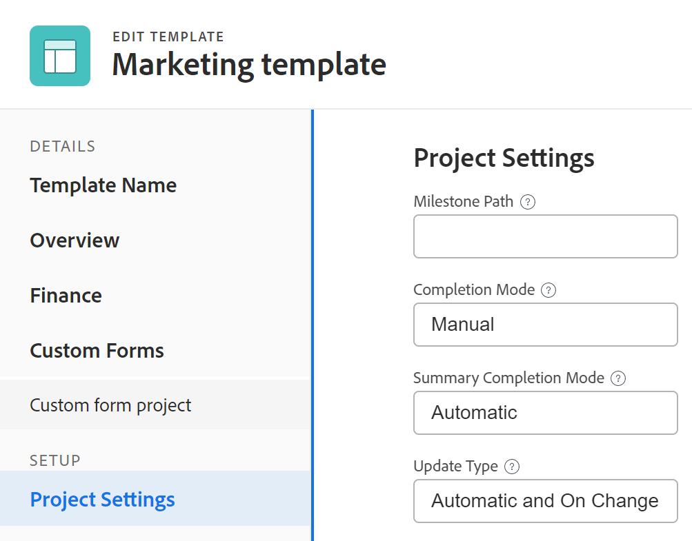
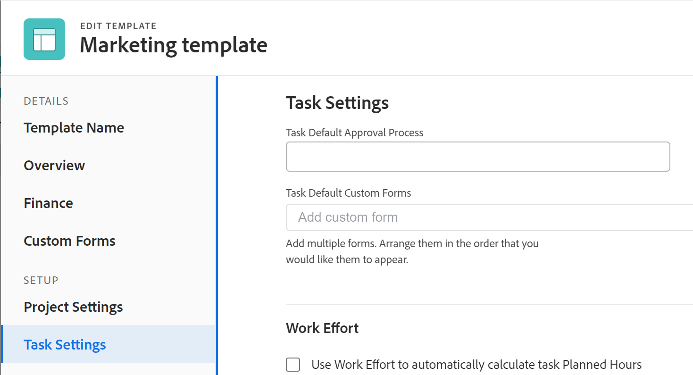
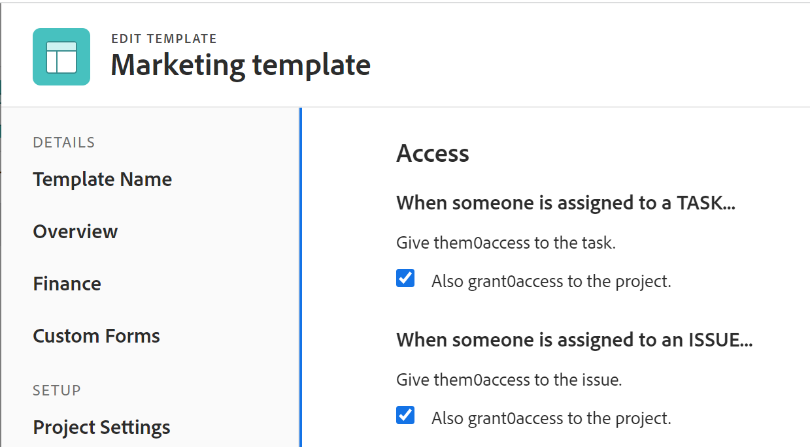

# Modificare i modelli di progetto

<!-- Audited: 2/2024 -->

<!--The Resource Pools part also duplicates in the "Working with Resource Pools" article-->

È possibile modificare i modelli di progetto per riflettere le modifiche apportate ai processi e alle impostazioni del progetto. Dopo aver aggiornato e salvato le modifiche su un modello, le nuove modifiche sono visibili nei nuovi progetti quando questi vengono creati utilizzando il modello. Le modifiche apportate al modello non si riflettono sul progetto che attualmente utilizza tale modello.

## Requisiti di accesso

Per eseguire i passaggi descritti in questo articolo, è necessario disporre dei seguenti diritti di accesso:

<table style="table-layout:auto"> 
 <col> 
 <col> 
 <tbody> 
  <tr> 
   <td role="rowheader">piano Adobe Workfront</td> 
   <td> 
Qualsiasi 
 </td> 
  </tr> 
  <tr> 
   <td role="rowheader">Licenze Adobe Workfront</td> 
   <td>
      
Nuovo: Standard

      
Oppure

      
Corrente: Piano

   </td> 
  </tr> 
  <tr> 
   <td role="rowheader">Livello di accesso</td> 
   <td> 
Modificare l’accesso ai modelli
 </td> 
  </tr> 
  <tr> 
   <td role="rowheader">Autorizzazioni oggetto</td> 
   <td> 
    <ul> 
     <li> 
Concedere le autorizzazioni per un modello per modificarlo nella scheda Dettagli modello
 </li> 
     <li> 
Gestire le autorizzazioni per un modello per modificarlo nella casella Modifica modello
 </li> 
   </td> 
  </tr> 
 </tbody> 
</table>

Per ulteriori dettagli sulle informazioni contenute in questa tabella, vedere [Requisiti di accesso nella documentazione di Workfront](/help/quicksilver/administration-and-setup/add-users/access-levels-and-object-permissions/access-level-requirements-in-documentation.md).

## Modificare un modello {#edit-a-template}

<!--
Editing a template differs depending on what environment you choose. 

### Edit a template in the Production environment {#edit-a-template-in-the-production-environment} 

1. Go to the template you want to edit.
1. (Conditional) To edit limited information about the template,  click **Template Details** in the left panel, then go to the areas listed in the left panel to edit information for each area. 
1. To edit information in the Details section, click the **Edit** icon , then select from any of the areas below, or click **Edit all** to edit information in all areas:

   * Overview
   * Custom Forms

     Names of customs forms display only if there are custom forms attached to the object.
   
   * Finance

   >[!TIP]
   >
   >For information about all fields that display in the Details area, continue with editing all fields using the Edit Template box below.

1. (Conditional) To edit all information about the template, click the **More** menu  next to the name of the template, then click **Edit**.

   The **Edit Template** box opens. The sections in this box contain the same fields available in  the Template Details section .

1. Consider editing information in any of the following sections:

   * [Overview](#overview) 
   * [Finance](#finance) 
   * [Portfolio](#portfolio) 
   * [Settings](#settings) 
   * [Access](#access) 
   * [Custom Forms](#custom-forms) 
   * [Tasks](#tasks) 
   * [Issues](#issues) 
   * [Comment](#comment)

### Overview {#overview}

1. Begin editing your template as described above.
1. In the **Edit Template** box, click **Overview**.

   

1. Update the following fields:

   <table style="table-layout:auto"> 
    <col> 
    <col> 
    <tbody> 
     <tr> 
      <td role="rowheader"><strong>Name</strong></td> 
      <td>Specify a name for the template.</td> 
     </tr> 
     <tr> 
      <td role="rowheader"><strong>Description</strong></td> 
      <td>Add additional information about the template.</td> 
     </tr> 
     <tr> 
      <td role="rowheader"><strong>Is Active</strong></td> 
      <td>
Select this checkbox if you want the template to be active. Other users can find this template and attach it to projects when creating projects. Deselect this checkbox if you want to deactivate templates that are no longer used. Deactivated templates cannot be attached to projects. This is enabled by default. 

<b>TIP</b>
      
      You can deactivate a template from the template header as described in the [Activate or deactivate a template](#activate-or-deactivate-a-template) section in this article.
</td> 
     </tr> 
     <tr> 
      <td role="rowheader"><strong>URL</strong></td> 
      <td>Specify a web link that relates to information about this template.</td> 
     </tr> 
     <tr> 
      <td role="rowheader"><strong>Schedule From</strong></td> 
      <td>
Specify whether the project using this template is scheduled from the <strong>Start Date</strong>, or from the <strong>Completion Date</strong>. This selection determines the planned dates of the future tasks on the project using this template. 

Select from the following: 
 
       <ul> 
        <li>
<strong>Schedule From Start Date</strong>: The Start Date of the template is actually the Start Day. When you schedule a template from Start Date, Adobe Workfront calculates the Completion Day of the template based on the Duration of all the template tasks. The Start Day of the template becomes the Planned Start Date of the future project.
</li> 
        <li>
<strong>Schedule from Completion Date</strong>: The Completion Date of the template is actually the Completion Day. When you schedule a template from Completion Date, Workfront calculates the Start Day of the template based on the Duration of all the template tasks. The Completion Day of the template becomes the Planned Completion Date of the future project. 
</li> 
       </ul>
For more information about the Start and Completion Days of template tasks, see <a href="../../../manage-work/projects/create-and-manage-templates/overview-of-start-completion-day-on-template.md" class="MCXref xref">Overview of Start and Completion Days in a template</a>. 

The Schedule From setting for templates is similar to that of projects. Your Workfront administrator selects the default Schedule From setting for the projects in your system. For information about setting project defaults, see <a href="../../../administration-and-setup/set-up-workfront/configure-system-defaults/set-project-preferences.md" class="MCXref xref">Configure system-wide project preferences</a>.
</td> 
     </tr> 
     <tr> 
      <td role="rowheader"><strong>Condition Type</strong></td> 
      <td>
Select between the following Condition Types:
 
       <ul> 
        <li><strong>Manual:</strong> The project owner sets the Condition of the project on the project manually. <strong></strong></li> 
        <li><strong>Progress Status:</strong> Workfront automatically sets the Condition of the future project based on the Progress Status of tasks on the Critical Path. For more information about understanding Progress Status, see <a href="../../../manage-work/tasks/task-information/task-progress-status.md" class="MCXref xref">Task Progress Status overview</a>.</li> 
       </ul></td> 
     </tr> 
     <tr> 
      <td role="rowheader"><strong>Priority</strong></td> 
      <td>
This is just a visual flag for you which allows you to prioritize your future projects. Select from the following options:
 
       <ul> 
        <li>
<strong>None</strong>
</li> 
        <li>
<strong>Low</strong>
</li> 
        <li>
<strong>Normal</strong>
</li> 
        <li>
<strong>High</strong>
</li> 
        <li>
<strong>Urgent</strong>
</li> 
       </ul>

Depending on the Project Preferences selected by your Workfront administrator, the names of priorities might be different for you. For more information about editing priorities, see <a href="../../../administration-and-setup/customize-workfront/creating-custom-status-and-priority-labels/create-customize-priorities.md" class="MCXref xref">Create and customize priorities</a>.

</td> 
     </tr> 
     <tr> 
      <td role="rowheader"><strong>Template Owner</strong></td> 
      <td>
The user who is designated as the Template Owner must be a Workfront active user. 

Consider the following about the user designated as the Template Owner: 
 
       <ul> 
        <li>They are automatically given Manage permissions to the template. </li> 
        <li>They are added to the project team and are automatically given Manage permissions to the project created from the template. </li> 
        <li>They become the Project Owner, when the project is created from this template. </li> 
       </ul></td> 
     </tr> 
     <tr> 
      <td role="rowheader"><strong>Template Sponsor</strong></td> 
      <td>
The user specified in this field becomes the Project Sponsor, when the template is added to the project. This user is added to the project team and is automatically given view permissions to the project. The user who is designated as the Template Sponsor must be a Workfront active user. 
</td> 
     </tr> 
     <tr> 
      <td role="rowheader"><strong>Resource Manager</strong></td> 
      <td>
The specified users are automatically given manage permissions to the future projects and can assign resources to the tasks and issues of the projects. You can specify more than one Resource Manager. 
</td> 
     </tr> 
     <tr data-mc-conditions="QuicksilverOrClassic.Quicksilver"> 
      <td role="rowheader"><strong>Group</strong></td> 
      <td>
In the drop-down list, select the group that you want to be associated with projects created from the template. It can be a group of any level. 

You can make sure you are selecting the right group by hovering over it and clicking the information icon  that displays next to it. This displays a tooltip listing information about the group, such as the hierarchy of groups above it and its administrators.
 
<b>NOTES</b>
      
    <ul> 
    <li>
In the Projects area on a group's page, when someone creates a project using a template that doesn't have a group selected, the system associates the currently open group with the project.

This is different from other areas where the system associates a user's Home Group with the project when the user creates the project using a template that doesn't have a group selected.

    </li> 
      <li>
If a user selects a template that has a group selected while creating a project—or while converting a task or issue to a project—the user can choose a different group for the project.
</li> 
      <li>Though this field is available in templates only in the new Adobe Workfront experience, you can see it in lists and reports both there and in Adobe Workfront Classic. </li> 
      </ul> 
</td> 
     </tr> 
     <tr> 
      <td role="rowheader"><strong>Company</strong></td> 
      <td>
Specify the Company that you want to associate with the template. Only active companies display in the list.
</td> 
     </tr> 
    </tbody> 
   </table>

1. (Optional) Continue editing the following sections, depending on the information you want to modify.

   Or

   Click **Save Changes**.

### Finance {#finance}

1. Begin editing your template as described above.
1. In the **Edit Template** box, click **Finance**.

   

1. Update the following fields:

   <table style="table-layout:auto"> 
    <col> 
    <col> 
    <tbody> 
     <tr> 
      <td role="rowheader"><strong>Performance Index Method</strong></td> 
      <td>
Specify whether the Earned Value metrics of the future project are calculated using hours or costs. For more information about the Performance Index Method, see <a href="../../../manage-work/projects/project-finances/set-pim.md" class="MCXref xref">Set the Performance Index Method (PIM)</a>. 
</td> 
     </tr> 
     <tr> 
      <td role="rowheader"><strong>Budget</strong></td> 
      <td>
Specify a Budget for the projects that are created from this template.
</td> 
     </tr> 
     <tr> 
      <td role="rowheader"><strong>Fixed Cost</strong></td> 
      <td>
Specify the Fixed Cost for the projects that are created from this template. This is different than the Labor Cost which comes from the hours on the project and the Expense Cost which comes from the amount of expenses on the project. The Fixed Cost of a project is taken into account when calculating the Net Value of a project and it is part of the Budgeted Cost.
</td> 
     </tr> 
     <tr> 
      <td role="rowheader"><strong>Fixed Revenue</strong></td> 
      <td>
Specify the Fixed Revenue for the projects that are created from this template.
</td> 
     </tr> 
     <tr> 
      <td role="rowheader"><strong>Template Currency</strong></td> 
      <td>
Specify the currency for the future project, if it is different than the default currency of your system. This field is not visible if you have only the default currency in the system. For more information about currency, see <a href="../../../administration-and-setup/manage-workfront/exchange-rates/set-up-exchange-rates.md" class="MCXref xref">Set up exchange rates</a>.
</td> 
     </tr> 
     <tr> 
      <td role="rowheader"><strong>Require time to be approved for this project</strong></td> 
      <td>
Select this option to require the Project Owner of the future project created from this template to approve time logged on the project. If you are using Billing Records and you select this option, only the approved hours on the project appear as available billable hours for the Billing Records. Approving time on the project is independent of approving timesheets. For more information about requiring time to be approved on a project, see <a href="../../../manage-work/projects/manage-projects/require-time-approval-for-projects.md" class="MCXref xref">Require time to be approved for a project</a>.
</td> 
     </tr> 
    </tbody> 
   </table>

1. (Optional) Continue editing the following sections, depending on the information you want to modify.

   Or

   Click **Save Changes**.

### Portfolio {#portfolio}

1. Begin editing your template as described above.
1. In the **Edit Template** box, click **Portfolio**.

   

1. Update the following fields:

   <table style="table-layout:auto">
    <col> 
    <tbody> 
     <tr> 
      <td role="rowheader"><strong>Portfolio</strong></td> 
      <td>
Specify a Portfolio for the projects that are created from this template. You must create a Portfolio first, before it appears in the drop-down list. 

Only active portfolios display in the list. For more information about creating portfolios, see <a href="../../../manage-work/portfolios/create-and-manage-portfolios/create-portfolios.md" class="MCXref xref">Create a portfolio </a>.
</td> 
     </tr> 
     <tr> 
      <td role="rowheader"><strong>Program</strong></td> 
      <td>
If you selected a Portfolio for the template, specify a <strong>Program</strong> for the future project. Some Portfolios might not have Programs. You must create a Program first, before it appears in this drop-down list. Only active programs display in the list.

For more information about creating programs, see <a href="../../../manage-work/portfolios/create-and-manage-programs/create-program.md" class="MCXref xref">Create a program</a>.
</td> 
     </tr> 
     <tr> 
      <td role="rowheader"><strong>Planned Benefit</strong></td> 
      <td>
Specify the Planned Benefit of the projects that are created from this template. The Planned Benefit is used in the Business Case of the project and the Portfolio Optimizer. 

For more information about the Planned Benefit of a project, see <a href="../../../manage-work/projects/project-finances/project-planned-benefit.md" class="MCXref xref">Overview of project Planned Benefit</a>. The Planned Benefit of a project is taken into account when the Net Value of a project is calculated. 

For more information about using the Portfolio Optimizer, see <a href="../../../manage-work/portfolios/portfolio-optimizer/manage-projects-in-portfolio-optimizer.md" class="MCXref xref">Manage projects in the Portfolio Optimizer</a> 
</td> 
     </tr> 
    </tbody> 
   </table>

1. (Optional) Continue editing the following sections, depending on the information you want to modify.

   Or

   Click **Save Changes**.

### Settings {#settings}

1. Begin editing your template as described above.
1. In the **Edit Template** box, click **Settings**.

   

1. Update the following fields: 

   <table style="table-layout:auto"> 
    <col> 
    <col> 
    <tbody> 
     <tr> 
      <td role="rowheader"><strong>Milestone Path</strong> </td> 
      <td> 
Select a Milestone Path for the template. Only active milestone paths display in the list. For more information about Milestone Paths, see <a href="../../../administration-and-setup/customize-workfront/configure-approval-milestone-processes/create-milestone-path.md" class="MCXref xref">Create a milestone path</a>.
 </td> 
     </tr> 
     <tr> 
      <td role="rowheader"><strong>Completion Mode</strong> </td> 
      <td> 
Controls how the future project will be marked as Complete.  Select from the following options:
 
       <ul> 
        <li> 
<strong>Automatic</strong>: The project is marked Complete when all the tasks and issues are completed.
 </li> 
        <li> 
<strong>Manual</strong>: You have to manually select the Complete status for the project, when all the tasks and issues are completed. 
 </li> 
       </ul> </td> 
     </tr> 
     <tr> 
      <td role="rowheader"><strong>Summary Completion Mode</strong> </td> 
      <td> 
Controls how the parent tasks on the future project are marked as Complete.  Select from the following options:
 
       <ul> 
        <li> 
<strong>Automatic</strong>: The parent tasks are marked Complete and they update their percent complete automatically, as the children tasks are completed and the percent complete of the children is updated. 
 </li> 
        <li> 
<strong>Manual</strong>: You have to manually update the percent complete and the status of the parent tasks, independently of what changes are made to the children tasks. 
 </li> 
       </ul> </td> 
     </tr> 
     <tr> 
      <td role="rowheader"><strong>Update Type</strong> </td> 
      <td> 
Controls when the changes you make to the timeline of the future project are saved on the project. 
 
       <b>EXAMPLE </b> 
        
The following changes to the project trigger an update to the timeline of the project:
 
        <ul> 
         <li> 
update the dates of tasks
 </li> 
         <li> 
change predecessor relationships 
 </li> 
         <li> 
change parent-child relationships
 </li> 
         <li> 
add or remove assignments in addition to changing the task constraint or duration type.
 </li> 
        </ul> 
       
 
Select from the following options: 
 
       <ul> 
        <li> 
<strong>Automatic and On Change</strong> (Default setting): The future project timeline is updated each time a change occurs in the project or in another project that the timeline is dependent on (On Change). The project timeline is also updated each night (Automatic). This is the recommended setting for this field because it ensures that the project timeline is always up to date. When you perform an action on a task or project that triggers a timeline recalculation, all available dates are immediately displayed, allowing you to continue working. On projects with more than 100 tasks, dates that require longer recalculations display briefly as a question mark (between 1 and 5 seconds, or up to a minute for large projects). This indicates that the recalculation is not yet finished, and the dates are subject to change. 
 </li> 
       </ul> 
       <ul> 
        <li> 
<strong>Change Only</strong>: The project timeline is updated each time a change occurs in the project or in another project that the timeline is dependent on. You might want to select this option if changes rarely occur in the project or in other projects that the timeline is dependent on. 
 </li> 
       </ul> 
       <ul> 
        <li> 
<strong>Automatic Only</strong>: The project timeline is updated each night; it is not updated immediately after changes are made. You might want to select this option if many changes occur each day in the project or in other projects that the timeline is dependent on. However, be aware that you chose this setting, as the project will not update at the same time that the changes are made. 
 </li> 
       </ul> 
       <ul> 
        <li> 
<strong>Manual Only</strong>: The project timeline is updated only when you select the option to Recalculate Timelines, as described in <a href="../../../manage-work/projects/manage-projects/recalculate-project-timeline.md" class="MCXref xref">Recalculate project timelines</a>. 
 </li> 
       </ul> 
You might want to select this option if you are making many changes to the project at one time, and you want the timeline recalculation to occur after all of the changes have been made (rather than after each individual change).
 </td> 
     </tr> 
     <tr> 
      <td role="rowheader"><strong>Schedule</strong> </td> 
      <td> 
Select a schedule for your template. This will become the schedule of the project that is created from this template. This should be the same schedule assigned to most people that are working on the project. You must create a schedule before you can assign it to a template. For more information about creating schedules, see <a href="../../../administration-and-setup/set-up-workfront/configure-timesheets-schedules/create-schedules.md" class="MCXref xref">Create a schedule</a>.  If you have not created custom schedules in your system, the Default Schedule is selected. 
 </td> 
     </tr> 
     <tr> 
      <td role="rowheader"><strong>User Time Off</strong> </td> 
      <td> 
Determines whether the time off of the Primary Assignee of a task adjusts the task planned dates. When you attach the template to an existing project, and the template has a different setting for this field than the project, the setting on the project remains unchanged. The default option for this setting for a new template is the same as the system-level project preference. 
 
For information about the project preferences at the System level, see <a href="../../../administration-and-setup/set-up-workfront/configure-system-defaults/set-project-preferences.md" class="MCXref xref">Configure system-wide project preferences</a>. 
 
For information about how this setting affects the task dates on a project, see <a href="../../../manage-work/projects/manage-projects/edit-projects.md" class="MCXref xref">Edit projects</a>. Select from the following options: 
 
       <ul> 
        <li> 
<strong>Consider user time off in task durations</strong>: When selecting this option, the planned dates of the tasks on the project created from this template adjust according to the time off of the Primary Assignee of the task, if the time off occurs during the duration of the task. 
 </li> 
        <li> 
<strong>Ignore user time off in task durations</strong>: When selecting this option, the planned dates of the tasks on the project created from this template remain as originally planned, even if the Primary Assignee of the task has time off during the duration of the task. 
 </li> 
       </ul> </td> 
     </tr> 
     <tr> 
      <td role="rowheader"><strong>Resource Leveling Mode</strong> </td> 
      <td> 
Select from the following options: 
 
       <ul> 
        <li> 
<strong>Manual</strong>: you must manually level your resources on the project created from this template (this is the default setting)
 </li> 
        <li> 
<strong>Automatic:</strong> Workfront levels the resources on the future project.  For more information about Resource Leveling, see <a href="../../../manage-work/gantt-chart/use-the-gantt-chart/level-resources-in-gantt.md" class="MCXref xref">Level Resources in the Gantt Chart </a>. 
 </li> 
       </ul> </td> 
     </tr> 
     <tr> 
      <td role="rowheader"><strong>Risk</strong> </td> 
      <td> 
Define the level of risk of the projects created from this template. The risk is just an indicator of how risky a project can be. You can prioritize the execution of your projects based on the level of risk. Consider selecting from the following levels of risk: 
 
       <ul> 
        <li> 
<strong>Very Low</strong> 
 </li> 
        <li> 
<strong>Low</strong> 
 </li> 
        <li> 
<strong>Medium</strong> 
 </li> 
        <li> 
<strong>High</strong> 
 </li> 
        <li> 
<strong>Very High</strong> 
 </li> 
       </ul> </td> 
     </tr> 
     <tr> 
      <td role="rowheader"><strong>Resource Pools</strong> </td> 
      <td> 
Specify the resource pools associated with the template. Resource pools are collections of users that are needed at the same time for the completion of a project. For more information about resource pools, see <a href="../../../resource-mgmt/resource-planning/resource-pools/work-with-resource-pools.md" class="MCXref xref"> Resource pools overview </a>.
 
 
<b>NOTE</b> 
      
      When you edit templates in bulk, only the resource pools that are common to all the templates selected appear in this field. If the templates selected have no shared resource pools, this field will be empty. The resource pools you specify here will overwrite the templates' individual resource pools.
 
 </td> 
     </tr> 
     <tr> 
      <td role="rowheader"><strong>Approval Process</strong> </td> 
      <td> 
Select the approval process you want to associate with the template. Your Workfront administrator or a user with administrative access to Approval Processes must define system-level or group-level project approval processes before you can associate them with a template. For more information about creating approval processes, see <a href="../../../administration-and-setup/customize-workfront/configure-approval-milestone-processes/create-approval-processes.md" class="MCXref xref">Create an approval process for work items</a>.
 
Consider the following when adding approval processes: 
 
      <ul> 
      <li>Only active approval processes display in the list. </li> 
      <li> 
System-wide and group-specific approval processes display in the list. An approval process associated with a group other than that of the template does not display in the list.
 
<b>IMPORTANT</b> 
      
      If the group associated with the template changes, the group-specific approval process becomes a single-use approval process. For more information about how changes to the group of the project or changes in the approval process affect approval settings, see <a href="../../../administration-and-setup/customize-workfront/configure-approval-milestone-processes/how-changes-affect-group-approvals.md">How group and approval process changes affect assigned approval processes</a>. 
 </li> 
      <li> 
If you added a single-use approval process, it displays as "Custom" in this field. For information, see <a href="../../../review-and-approve-work/manage-approvals/associate-approval-with-work.md" class="MCXref xref">Associate a new or existing approval process with work</a>. 
 
      </li> 
      <li> 
When bulk-editing templates, the following scenarios exist:
 
      <ul> 
         <li> 
When you select templates from the same group, both system-level and group-level approval processes display in this field.
 </li> 
         <li> 
When you select templates from different groups, only system-level approval processes display in this field.
 </li> 
         <li> 
When any of the templates has a single-use approval process attached, it is replaced by the system-level you select. 
 </li> 
      </ul> </li> 
      </ul> </td> 
     </tr> 
     <tr> 
      <td role="rowheader"><strong>Filter Hour Types</strong> </td> 
      <td> 
Consider the following:
 
Select <strong>No</strong> to make all project-specific hour types available on the future project. (This is the default selection)
 
Or
 
Select <strong>Yes</strong> to make only a subset of the project-specific hour types available on the future project, then select the hour types you want to make available. (Hold the Shift key to select multiple hour types.)
 
If you select this option, only the hour types you select are made available to select when logging hours on the project (or on tasks and issues within the project). You must select at least one hour type; if you select this option and you do not select any hour types, all hour types are made available on the project.
 
The same hour type selections must be made at the individual user level in order for the user to see these hour type options on the project. 
 
For more information about defining hour types at the user level, see the section <a href="../../../timesheets/create-and-manage-timesheets/log-time.md#understa" class="MCXref xref">Log time</a> in <a href="../../../timesheets/create-and-manage-timesheets/log-time.md" class="MCXref xref">Log time</a>.
 </td> 
     </tr> 
     <tr> 
      <td role="rowheader"><strong>Reminder Notification</strong> </td> 
      <td>Select the Reminder Notification that should be associated with the future project. You must configure Reminder Notifications for projects for this field to appear during editing a template.  For more information about configuring Reminder Notifications, see <a href="../../../administration-and-setup/manage-workfront/emails/set-up-reminder-notifications.md" class="MCXref xref">Set up reminder notifications</a>.</td> 
     </tr> 
    </tbody> 
   </table>

1. (Optional) Continue editing the following sections, depending on the information you want to modify.  
   Or
1. Click **Save Changes**.

### Access {#access}

1. Begin editing your template as described above.
1. In the **Edit Template** box, click **Access**.

   

   The Access you specify for your template will become the Access of users associated with the project when the template is used to create a project.

   Specify the following **Access** information for the template:

   <table style="table-layout:auto"> 
    <col> 
    <col> 
    <tbody> 
     <tr> 
      <td role="rowheader"><strong>When someone is assigned to a task</strong> </td> 
      <td> 
Select from <strong>View</strong>, <strong>Contribute,</strong> or <strong>Manage</strong> access to a task. The user assigned to a task is automatically granted this access to the task. 
 </td> 
     </tr> 
     <tr> 
      <td role="rowheader"><strong>Also grant access to the project</strong> </td> 
      <td> 
 Select from <strong>View</strong>, <strong>Contribute</strong>, or <strong>Manage</strong> access to the project. The user assigned to a task is automatically granted this access to the project, as well. 
 </td> 
     </tr> 
     <tr> 
      <td role="rowheader"><strong>When someone is assigned to an issue</strong> </td> 
      <td> 
Select from <strong>View</strong>, <strong>Contribute,</strong> or <strong>Manage</strong> access to an issue. The user assigned to an issue is automatically granted this access to the issue. 
 </td> 
     </tr> 
     <tr> 
      <td role="rowheader"><strong>Also grant access to the project</strong> </td> 
      <td> 
 Select from <strong>View</strong>, <strong>Contribute</strong>, or <strong>Manage</strong> access to the project. The user assigned to an issue is automatically granted this access to the project, as well. 
 </td> 
     </tr> 
     <tr> 
      <td role="rowheader"><strong>When someone submits a request: Give them access</strong> </td> 
      <td> 
 Select from <strong>View</strong>, <strong>Contribute</strong>, or <strong>Manage</strong> access to the request. When they submit a request to the project, they are granted this access to the request they submitted. For more information, see <a href="../../../workfront-basics/grant-and-request-access-to-objects/share-an-issue.md" class="MCXref xref">Share an issue </a>.
 </td> 
     </tr> 
     <tr> 
      <td role="rowheader"><strong>People from the same company will inherit the same permissions for all requests</strong> </td> 
      <td> 
Select this field if you want people from the same company to have the same access to all the requests on the project, whether they submitted them or not.
 </td> 
     </tr> 
     <tr> 
      <td role="rowheader"><strong>When someone is given access to this project: Give them access to ...</strong> </td> 
      <td> 
Select the access options that you want users to have on the project, if the project is shared with them. Select the specific options for their access, if they are designated as <strong>Viewers</strong>, <strong>Contributors</strong>, or <strong>Managers</strong> when sharing the project with them. 
 </td> 
     </tr> 
    </tbody> 
   </table>

1. (Optional) Continue editing the following sections, depending on the information you want to modify.

   Or

   Click **Save Changes**.

### Custom Forms {#custom-forms}

1. Begin editing your template as described above.
1. In the **Edit Template** box, click **Custom Forms**.

   

1. Select the custom form or forms that you want to associate with the template. You must build the custom forms before they are available to select in this field.

   Only active custom forms display in the list. For more information about building custom forms, see [Create or edit a custom form](../../../administration-and-setup/customize-workfront/create-manage-custom-forms/create-or-edit-a-custom-form.md).

   You can add up to ten custom forms to a template.

   The forms will be added to the project that is created from this template. 

1. (Optional) Continue editing the following section, depending on the information you want to modify.

   Or

   Click **Save Changes**.

### Tasks {#tasks}

You can define the defaults that will be associated with all the new tasks when you add them to a project that is created from the template.

For information about how these settings affect creating new tasks, see [Create tasks overview](../../../manage-work/tasks/create-tasks/create-tasks-overview.md).

1. Begin editing your template as described above.
1. In the **Edit Template** box, click **Tasks**.

   

1. In the **Task Default Approval Process** box, select the Approval Process you want to associate with all new tasks when you add them to a project created from this template. You must create an Approval Process for tasks before you can associate it with tasks. Only active approval processes display in the list. For more information about creating Approval Processes, see [Creating Approval Processes](../../../administration-and-setup/customize-workfront/configure-approval-milestone-processes/create-approval-processes.md).
1. In the **Task Default Custom Forms** box, select the custom form or forms that you want to associate with all new tasks when you add them to a project created from this template. You must build the custom forms before they are available to select in this field. Only active custom forms display in the list. For more information about building custom forms, see [Creating Custom Forms](../../../administration-and-setup/customize-workfront/create-manage-custom-forms/create-or-edit-a-custom-form.md). You can associate up to ten custom forms with a task.
1. (Optional) **Select Use Work Effort to automatically calculate task Planned Hours** if you want to enable managing task effort by using&nbsp;Work Effort instead of Planned Hours in the project created from the template.
1. (Conditional and optional) If you selected Use Work Effort to automatically calculate task Planned Hours, click the drop-down menu to update the percentage for each level of Work Effort. The following percentage values are the defaults:
 
   | Work Effort level |Percentage value|
   |---|---|
   | Small |25% |
   | Medium |50% |
   | Large |75% |

  For information about using Work Effort to manage the effort on tasks on projects, see [Work Effort overview](../../../manage-work/tasks/task-information/work-effort.md).

1. (Optional) Continue editing the following section, depending on the information you want to modify.

   Or

   Click **Save Changes**.

### Issues {#issues}

By editing issue settings, you can prevent users from adding issues inline in the future project created from the template.

1. Begin editing your template as described above.
1. In the **Edit Template** box, click **Issues**.

   

1. (Optional) Deselect the **Allow users to add issues inline** option. It is enabled by default.

   When disabling this option users cannot add issues inline to the project or the tasks in the Issues section, when the project is created from the template.

   >[!TIP]
   >
   >Disable this option if you want to enforce users to complete the New Issue Fields or the custom forms associated with new issues.

   When disabling this option, users with permissions to add issues to the project created from the template can do so by using the New Issue button or a request queue associated with the project.

   For more information about configuring issue settings on projects, see the [Issue Settings](../../../manage-work/projects/manage-projects/edit-projects.md#issue) section in the article [Edit projects](../../../manage-work/projects/manage-projects/edit-projects.md).

   For information about creating issues on projects, see [Create issues](../../../manage-work/issues/manage-issues/create-issues.md). 

1. (Optional) Continue editing the following section, depending on the information you want to modify.

   Or

   Click **Save Changes**.

### Comment {#comment}

1. Begin editing your template as described above.
1. In the **Edit Template** box, click **Comment**.

   

1. Specify a comment that you want to display in the updates stream of the template in the available field.

   This comment is visible for everyone with View access to the template and with access to view Notes.

1. Click **Save Changes**.

   Your changes will be submitted for this template.

   Now, when you use this template to create a project all these settings will transfer to the new project.

   <!--drafted section below for the edit template story: 
   remove this tag and add the Preview blurb at the top of this article in yellow, if it's not already there. Keep the "div class" tags below until 23.1 production: 

### Edit a template in the Preview environment {#edit-a-template-in-the-preview-environment}
-->

1. Passa al modello da modificare.
1. (Condizionale) Per modificare informazioni limitate sul modello, fai clic su **Dettagli Modello** nel pannello a sinistra, passa alle aree elencate nel pannello a sinistra per modificare le informazioni per ogni area.
1. Per modificare le informazioni nella sezione Dettagli, fare clic sul pulsante **Modifica** icona , quindi seleziona una delle aree di seguito oppure fai clic su **Modifica tutto** per modificare le informazioni in tutte le aree:

   * Panoramica
   * Moduli personalizzati

   I nomi dei moduli doganali vengono visualizzati solo se all’oggetto sono allegati moduli personalizzati.

   * Finanz

   >[!TIP]
   >
   >Per informazioni su tutti i campi visualizzati nell&#39;area Dettagli, continuare a modificare tutti i campi utilizzando la casella Modifica modello di seguito.

1. (Condizionale) Per modificare tutte le informazioni sul modello, fai clic sul pulsante **Altro** menu  accanto al nome del modello, quindi fai clic su **Modifica**.

   Il **Modifica modello** viene visualizzata la casella. Le sezioni di questa casella contengono gli stessi campi disponibili nella sezione Dettagli modello .

1. Valuta la possibilità di modificare le informazioni in una delle sezioni seguenti:

   * [Nome modello](#template-name)
   * [Panoramica](#overview-preview)
   * [Finanza](#finance-preview)
   * [Moduli personalizzati](#custom-forms-preview)
   * [Impostazioni progetto](#project-settings)
   * [Impostazioni attività](#task-settings)
   * [Impostazioni problema](#issue-settings)
   * [Accesso](#access-preview)

### Nome Modello{#template-name}

1. Inizia a modificare il modello come descritto in precedenza.
1. In **Modifica modello** , fare clic su **Nome modello**.
1. (Facoltativo) Continua a modificare le sezioni seguenti, a seconda delle informazioni che desideri modificare

   Oppure

   Fai clic su **Salva**.

### Panoramica {#overview-preview}

1. Inizia a modificare il modello come descritto in precedenza.
1. In **Modifica modello** , fare clic su **Panoramica**.

   

1. Aggiorna i campi seguenti:

   <table style="table-layout:auto"> 
       <col> 
       <col> 
       <tbody> 
         <tr> 
         <td role="rowheader"><strong>Descrizione</strong></td> 
         <td>Aggiungi ulteriori informazioni sul modello.</td> 
       </tr> 
         <tr> 
         <td role="rowheader"><strong>Priorità</strong></td> 
         <td>
Questo è solo un flag visivo per te che ti consente di assegnare la priorità ai tuoi progetti futuri. Selezionare una delle opzioni seguenti:
 
         <ul> 
         <li>
<strong>Nessuno</strong>
</li> 
         <li>
<strong>Basso</strong>
</li> 
         <li>
<strong>Normal</strong>
</li> 
         <li>
<strong>Alta</strong>
</li> 
         <li>
<strong>Urgente</strong>
</li> 
         </ul>

A seconda delle Preferenze di progetto selezionate dall'amministratore di Workfront, i nomi delle priorità potrebbero essere diversi. Per ulteriori informazioni sulla modifica delle priorità, consulta <a href="../../../administration-and-setup/customize-workfront/creating-custom-status-and-priority-labels/create-customize-priorities.md" class="MCXref xref">Creare e personalizzare le priorità</a>.

</td> 
       </tr> 
       <tr> 
       <td role="rowheader"><strong>URL</strong></td> 
         <td>Specificare un collegamento Web relativo alle informazioni su questo modello.</td> 
       </tr>
       <tr> 
       <td role="rowheader"><strong>Tipo di condizione</strong></td> 
       <td>
Seleziona uno dei seguenti tipi di condizioni:
 
         <ul> 
         <li><strong>Manuale:</strong> Il proprietario del progetto imposta manualmente la condizione del progetto. <strong></strong></li> 
         <li><strong>Stato avanzamento:</strong> Workfront imposta automaticamente la condizione del progetto futuro in base allo stato di avanzamento delle attività nel percorso critico. Per ulteriori informazioni sullo stato di avanzamento, consulta <a href="../../../manage-work/tasks/task-information/task-progress-status.md" class="MCXref xref">Panoramica sullo stato di avanzamento dell’attività</a>.</li> 
       </ul>
         </td> 
         </tr> 
       <tr> 
         <td role="rowheader"><strong>Modalità pianificazione</strong></td> 
         <td>
Specifica se il progetto che utilizza questo modello è pianificato dal <strong>Data di inizio</strong>, o dall' <strong>Data di completamento</strong>. Questa selezione determina le date pianificate delle attività future del progetto che utilizzano questo modello. 

Selezionare una delle opzioni seguenti: 
 
       <ul> 
       <li>
<strong>Pianifica dalla data di inizio</strong>: la data di inizio del modello è in realtà il giorno di inizio. Quando si pianifica un modello a partire dalla data di inizio, Adobe Workfront calcola il giorno di completamento del modello in base alla durata di tutte le attività del modello. Il giorno di inizio del modello diventa la data di inizio pianificata del progetto futuro.
</li> 
       <li>
<strong>Pianifica dalla data di completamento</strong>: la data di completamento del modello è in realtà il giorno di completamento. Quando si pianifica un modello a partire dalla data di completamento, Workfront calcola il giorno di inizio del modello in base alla durata di tutte le attività del modello. Il giorno di completamento del modello diventa la data di completamento pianificata del progetto futuro. 
</li> 
       </ul>
Per ulteriori informazioni sui giorni di inizio e completamento delle attività modello, vedere <a href="../../../manage-work/projects/create-and-manage-templates/overview-of-start-completion-day-on-template.md" class="MCXref xref">Panoramica dei giorni di inizio e completamento in un modello</a>. 

L’impostazione Pianifica da per i modelli è simile a quella dei progetti. L’amministratore di Workfront seleziona l’impostazione predefinita Pianifica da per i progetti nel sistema. Per informazioni sull'impostazione delle impostazioni predefinite del progetto, vedere <a href="../../../administration-and-setup/set-up-workfront/configure-system-defaults/set-project-preferences.md" class="MCXref xref">Configurare le preferenze di progetto a livello di sistema</a>.
</td> 
       </tr>

   <tr> 
         <td role="rowheader"><strong>Portfolio</strong></td> 
         <td>
Specifica un Portfolio per i progetti creati da questo modello. È necessario creare un Portfolio prima che venga visualizzato nell'elenco a discesa. 

Nell’elenco vengono visualizzati solo i portfolio attivi. Per ulteriori informazioni sulla creazione dei portfolio, consulta <a href="../../../manage-work/portfolios/create-and-manage-portfolios/create-portfolios.md" class="MCXref xref">Creare un portfolio </a>.
</td> 
       </tr> 
       <tr> 
         <td role="rowheader"><strong>Programma</strong></td> 
         <td>
Se è stato selezionato un Portfolio per il modello, specificare un <strong>Programma</strong> per il progetto futuro. Alcuni Portfoli potrebbero non disporre di programmi. È innanzitutto necessario creare un programma prima che venga visualizzato in questo elenco a discesa. Nell'elenco vengono visualizzati solo i programmi attivi.

Per ulteriori informazioni sulla creazione di programmi, vedere <a href="../../../manage-work/portfolios/create-and-manage-programs/create-program.md" class="MCXref xref">Creare un programma</a>.
</td> 
       </tr>  
       <tr data-mc-conditions="QuicksilverOrClassic.Quicksilver"> 
         <td role="rowheader"><strong>Gruppo</strong></td> 
         <td>
Nell’elenco a discesa, seleziona il gruppo che desideri associare ai progetti creati dal modello. Può essere un gruppo di qualsiasi livello. 

Per assicurarsi di selezionare il gruppo corretto, posizionare il puntatore del mouse su di esso e fare clic sull'icona delle informazioni  che viene visualizzato accanto ad esso. In questo modo viene visualizzata una descrizione del gruppo contenente informazioni sul gruppo stesso, ad esempio la gerarchia dei gruppi al di sopra del gruppo e i relativi amministratori.
 
<b>NOTE</b>

   <ul> 
       <li>
Nell'area Progetti (Projects) della pagina di un gruppo, quando un utente crea un progetto utilizzando un modello per il quale non è stato selezionato un gruppo, il sistema associa il gruppo aperto al progetto.

Si tratta di una procedura diversa dalle altre aree in cui il sistema associa il Gruppo Predefinito di un utente al progetto quando l'utente crea il progetto utilizzando un modello in cui non è selezionato alcun gruppo.
</li> 
       <li>
Se un utente seleziona un modello in cui è selezionato un gruppo durante la creazione di un progetto o durante la conversione di un’attività o di un problema in un progetto, può scegliere un gruppo diverso per il progetto.
</li> 
       <li>Anche se questo campo è disponibile nei modelli solo nella nuova esperienza Adobe Workfront, è possibile visualizzarlo in elenchi e rapporti sia lì che in Adobe Workfront Classic. </li> 
         </ul> 
</td> 
       </tr> 
       <tr> 
         <td role="rowheader"><strong>Azienda</strong></td> 
         <td>
Specifica la società da associare al modello. Nell'elenco vengono visualizzate solo le società attive.
</td> 
       </tr> 
       <tr> 
         <td role="rowheader"><strong>Proprietario del modello</strong></td> 
         <td>
L'utente designato come proprietario del modello deve essere un utente attivo di Workfront. 

Considera quanto segue sull’utente designato come proprietario del modello: 
 
         <ul> 
         <li>Vengono automaticamente assegnate loro le autorizzazioni di gestione per il modello. </li> 
         <li>Vengono aggiunti alla squadra del progetto e ricevono automaticamente le autorizzazioni di gestione per il progetto creato dal modello. </li> 
         <li>Diventano il Proprietario del progetto quando il progetto viene creato da questo modello. </li> 
         <li> Se l’utente designato come proprietario del modello ha accesso limitato a modelli o progetti dal proprio livello di accesso, le autorizzazioni di gestione sul modello e sui progetti saranno limitate. Ad esempio, se dispongono solo dell’accesso di visualizzazione per i modelli o i progetti nel loro livello di accesso, riceveranno automaticamente le autorizzazioni di visualizzazione sul modello e sul progetto quando saranno designati come proprietario del modello.</li>
         </ul></td> 
       </tr> 
       <tr> 
         <td role="rowheader"><strong>Sponsor modello</strong></td> 
         <td>
L’utente specificato in questo campo diventa sponsor del progetto quando il modello viene aggiunto al progetto. Questo utente viene aggiunto al team del progetto e riceve automaticamente le autorizzazioni di visualizzazione per il progetto. L'utente designato come sponsor del modello deve essere un utente attivo di Workfront. 
</td> 
       </tr> 
       <tr> 
         <td role="rowheader"><strong>Responsabile risorse</strong></td> 
         <td>
Gli utenti specificati ricevono automaticamente le autorizzazioni di gestione per i progetti futuri e possono assegnare risorse alle attività e ai problemi dei progetti. È possibile specificare più di un Responsabile risorse. 
</td> 
       </tr> 
      </table>

1. (Facoltativo) Continua a modificare le sezioni seguenti, a seconda delle informazioni che desideri modificare.

   Oppure

   Fai clic su **Salva**.

### Finanz {#finance-preview}

1. Inizia a modificare il modello come descritto in precedenza.
1. In **Modifica modello** , fare clic su **Finanza**.

   

1. Aggiorna i campi seguenti:

   <table style="table-layout:auto"> 
       <col> 
       <col> 
       <tbody>
       <tr> 
         <td role="rowheader"><strong> Valuta</strong></td> 
         <td>
Specifica la valuta per il progetto futuro, se è diversa da quella predefinita del sistema. Questo campo non è visibile se nel sistema è presente solo la valuta predefinita. Per ulteriori informazioni sulla valuta, consulta <a href="../../../administration-and-setup/manage-workfront/exchange-rates/set-up-exchange-rates.md" class="MCXref xref">Imposta tassi di cambio</a>.
</td> 
       </tr>
       <tr> 
       <td role="rowheader"><strong>Bdg</strong></td> 
       <td>
Specifica un budget per i progetti creati da questo modello.
</td> 
       </tr>  
       <tr> 
         <td role="rowheader"><strong>Metodo indice prestazioni</strong></td> 
         <td>
Scegli come Workfront calcolerà le metriche del Valore Guadagnato del progetto futuro. Scegli una delle seguenti opzioni:
         <ul>
         <li>Basato su Ore</li>
         <li>Basato su Costo</li>
         </ul>

   Per ulteriori informazioni sul metodo dell&#39;indice delle prestazioni, vedere <a href="../../../manage-work/projects/project-finances/set-pim.md" class="MCXref xref">Impostare il metodo PIM (Performance Index Method)</a>. 
</td>
   </tr> 
         <tr> 
         <td role="rowheader"><strong>Benef Pian</strong></td> 
         <td>
Specifica il beneficio pianificato dei progetti creati da questo modello. Il beneficio pianificato viene utilizzato nel caso aziendale del progetto e nell'Ottimizzatore Portfolio. 

Per ulteriori informazioni sui benefici pianificati di un progetto, consulta <a href="../../../manage-work/projects/project-finances/project-planned-benefit.md" class="MCXref xref">Panoramica del beneficio pianificato del progetto</a>. Il beneficio pianificato di un progetto viene preso in considerazione quando viene calcolato il valore netto di un progetto. 

Per ulteriori informazioni sull'utilizzo di Ottimizzatore Portfolio, vedere <a href="../../../manage-work/portfolios/portfolio-optimizer/manage-projects-in-portfolio-optimizer.md" class="MCXref xref">Gestire i progetti in Portfoli Optimizer</a> 
</td> 
       </tr> 
       <tr> 
         <td role="rowheader"><strong>Costi fissi</strong></td> 
         <td>
Specificare il Costo fisso per i progetti creati da questo modello. Questo valore è diverso dal costo manodopera che deriva dalle ore del progetto e dal costo spesa che deriva dall'importo delle spese del progetto. Il Costo Fisso di un progetto viene preso in considerazione nel calcolo del Valore Netto di un progetto e fa parte del Costo Preventivato.
</td> 
       </tr> 
       <tr> 
       <td role="rowheader"><strong>Reddito Fisso</strong></td> 
       <td>
Specifica il Reddito Fisso per i progetti creati da questo modello.
</td> 
       </tr> 
       <tr> 
       <td role="rowheader"><strong>Richiede l'approvazione del tempo per questo progetto</strong></td> 
       <td>
Selezionare questa opzione per richiedere al proprietario del progetto futuro creato da questo modello di approvare l'ora registrata sul progetto. Se si utilizzano le Fatturazioni e si seleziona questa opzione, solo le ore approvate nel progetto vengono visualizzate come ore fatturabili disponibili per le Fatturazioni. L'approvazione del tempo sul progetto è indipendente dall'approvazione delle schede orario. Per ulteriori informazioni sulla richiesta di approvazione del tempo per un progetto, consulta <a href="../../../manage-work/projects/manage-projects/require-time-approval-for-projects.md" class="MCXref xref">Richiede l'approvazione del tempo per un progetto</a>.
</td> 
       </tr> 
       </tbody> 
      </table>

1. (Facoltativo) Continua a modificare le sezioni seguenti, a seconda delle informazioni che desideri modificare.

   Oppure

   Fai clic su **Salva**.

### Moduli personalizzati {#custom-forms-preview}

1. Inizia a modificare il modello come descritto in precedenza.
1. In **Modifica modello** , fare clic su **Forms personalizzato**.

   

   I nomi dei moduli personalizzati già allegati al modello vengono visualizzati nel pannello a sinistra.

1. Fai clic all’interno del **Aggiungi modulo personalizzato** e selezionare il modulo o i moduli personalizzati da associare al modello. Devi creare i moduli personalizzati prima che siano disponibili per la selezione in questo campo.

   Nell’elenco vengono visualizzati solo i moduli personalizzati attivi. Per ulteriori informazioni sulla creazione di moduli personalizzati, consulta [Creare o modificare un modulo personalizzato](../../../administration-and-setup/customize-workfront/create-manage-custom-forms/create-or-edit-a-custom-form.md).

   È possibile aggiungere fino a dieci moduli personalizzati a un modello.

   I moduli verranno aggiunti al progetto creato da questo modello.

1. (Facoltativo) Aggiorna le informazioni in uno qualsiasi dei campi dei moduli personalizzati. Le informazioni verranno trasferite ai progetti che verranno creati dal modello.

1. (Facoltativo) Fai clic su **x** a destra del nome di un modulo personalizzato, quindi fai clic su **Rimuovi** per rimuoverlo dal modello.

1. (Facoltativo) Continua a modificare la sezione seguente, a seconda delle informazioni che desideri modificare.

   Oppure

   Fai clic su **Salva**.

### Impostazione progetto {#project-settings}

1. Inizia a modificare il modello come descritto in precedenza.
1. In **Modifica modello** , fare clic su **Impostazioni progetto**.

   

1. Aggiorna i campi seguenti:

   <table style="table-layout:auto"> 
       <col> 
       <col> 
       <tbody> 
       <tr> 
       <td role="rowheader"><strong>Percorso milestone</strong> </td> 
       <td> 
Seleziona un Percorso milestone per il modello. Nell'elenco vengono visualizzati solo i percorsi milestone attivi. Per ulteriori informazioni sui percorsi delle milestone, vedi <a href="../../../administration-and-setup/customize-workfront/configure-approval-milestone-processes/create-milestone-path.md" class="MCXref xref">Creare un percorso milestone</a>.
 </td> 
       </tr> 
       <tr> 
         <td role="rowheader"><strong>Modalità di completamento</strong> </td> 
         <td> 
Controlla come il progetto futuro verrà contrassegnato come Completato.  Selezionare una delle opzioni seguenti:
 
         <ul> 
         <li> 
<strong>Automatico</strong>: il progetto è contrassegnato come Completo quando tutte le attività e i problemi sono completati.
 </li> 
         <li> 
<strong>Manuale</strong>: quando tutte le attività e i problemi sono stati completati, devi selezionare manualmente lo stato Completo per il progetto. 
 </li> 
         </ul> </td> 
       </tr> 
       <tr> 
       <td role="rowheader"><strong>Modalità di completamento riepilogo</strong> </td> 
       <td> 
Controlla il modo in cui le attività padre nel progetto futuro vengono contrassegnate come completate.  Selezionare una delle opzioni seguenti:
 
       <ul> 
       <li> 
<strong>Automatico</strong>: le attività padre sono contrassegnate come completate e aggiornano automaticamente la loro percentuale di completamento, man mano che le attività figlio vengono completate e la percentuale di completamento degli elementi figlio viene aggiornata. 
 </li> 
       <li> 
<strong>Manuale</strong>: devi aggiornare manualmente la percentuale di completamento e lo stato delle attività principali, indipendentemente dalle modifiche apportate alle attività secondarie. 
 </li> 
       </ul> </td> 
       </tr> 
       <tr> 
         <td role="rowheader"><strong>Tipo di aggiornamento</strong> </td> 
         <td> 
Controlla quando le modifiche apportate alla sequenza temporale del progetto futuro vengono salvate nel progetto. 
 
         <b>ESEMPIO </b> 
         
Le seguenti modifiche al progetto attivano un aggiornamento della timeline del progetto:
 
         <ul> 
         <li> 
aggiornare le date delle attività
 </li> 
         <li> 
modificare le relazioni dei predecessori 
 </li> 
         <li> 
modificare le relazioni padre-figlio
 </li> 
         <li> 
aggiungere o rimuovere assegnazioni oltre a modificare il vincolo attività o il tipo di durata.
 </li> 
         </ul> 
         
 
Selezionare una delle opzioni seguenti: 
 
         <ul> 
         <li> 
<strong>Automatico e in caso di modifica</strong> (impostazione predefinita): la sequenza temporale del progetto futuro viene aggiornata ogni volta che si verifica una modifica nel progetto o in un altro progetto da cui dipende la sequenza temporale (Alla modifica). Anche la timeline del progetto viene aggiornata ogni notte (Automatico). Si tratta dell’impostazione consigliata per questo campo, in quanto garantisce che la timeline del progetto sia sempre aggiornata. Quando si esegue un'azione su un'attività o un progetto che attiva un ricalcolo della sequenza temporale, tutte le date disponibili vengono visualizzate immediatamente, consentendo di continuare a lavorare. Nei progetti con più di 100 attività, le date che richiedono calcoli più lunghi vengono visualizzate brevemente come punto interrogativo (tra 1 e 5 secondi o fino a un minuto per i progetti di grandi dimensioni). Questo indica che il ricalcolo non è ancora terminato e che le date sono soggette a modifiche. 
 </li> 
         </ul> 
         <ul> 
         <li> 
<strong>Solo modifica</strong>: la timeline del progetto viene aggiornata ogni volta che si verifica una modifica nel progetto o in un altro progetto da cui dipende. È possibile selezionare questa opzione se le modifiche si verificano raramente nel progetto o in altri progetti da cui dipende la sequenza temporale. 
 </li> 
         </ul> 
         <ul> 
         <li> 
<strong>Solo Automatico</strong>: la timeline del progetto viene aggiornata ogni notte; non viene aggiornata immediatamente dopo le modifiche. È possibile selezionare questa opzione se si verificano molte modifiche ogni giorno nel progetto o in altri progetti da cui dipende la sequenza temporale. Tuttavia, tieni presente che hai scelto questa impostazione, in quanto il progetto non verrà aggiornato contemporaneamente alle modifiche apportate. 
 </li> 
         </ul> 
         <ul> 
         <li> 
<strong>Solo manuale</strong>: la timeline del progetto viene aggiornata solo quando si seleziona l’opzione Ricalcola timeline, come descritto in <a href="../../../manage-work/projects/manage-projects/recalculate-project-timeline.md" class="MCXref xref">Ricalcolare i timeline dei progetti</a>. 
 </li> 
         </ul> 
È possibile selezionare questa opzione se si apportano contemporaneamente molte modifiche al progetto e si desidera che il ricalcolo della sequenza temporale venga eseguito dopo che tutte le modifiche sono state apportate (anziché dopo ogni singola modifica).
 </td> 
       </tr> 
       <tr> 
         <td role="rowheader"><strong>Pianificazione</strong> </td> 
         <td> 
Seleziona una pianificazione per il modello. Questa diventerà la pianificazione del progetto creato da questo modello. Questa deve essere la stessa pianificazione assegnata alla maggior parte delle persone che lavorano sul progetto. È necessario creare una pianificazione prima di assegnarla a un modello. Per ulteriori informazioni sulla creazione di pianificazioni, vedere <a href="../../../administration-and-setup/set-up-workfront/configure-timesheets-schedules/create-schedules.md" class="MCXref xref">Creare una pianificazione</a>.  Se nel sistema non sono state create programmazioni personalizzate, viene selezionata la Programmazione predefinita. 
 </td> 
       </tr> 
       <tr> 
         <td role="rowheader"><strong>Indisponibilità utente</strong> </td> 
         <td> 
Determina se l'indisponibilità dell'assegnatario principale di un'attività determina l'adeguamento delle date pianificate dell'attività. Quando alleghi il modello a un progetto esistente e il modello ha un’impostazione diversa per questo campo rispetto al progetto, l’impostazione sul progetto rimane invariata. L'opzione predefinita per questa impostazione per un nuovo modello è la stessa della preferenza di progetto a livello di sistema. 
 
Per informazioni sulle preferenze del progetto a livello di sistema, consulta <a href="../../../administration-and-setup/set-up-workfront/configure-system-defaults/set-project-preferences.md" class="MCXref xref">Configurare le preferenze di progetto a livello di sistema</a>. 
 
Per informazioni sull'effetto di questa impostazione sulle date delle attività di un progetto, vedere <a href="../../../manage-work/projects/manage-projects/edit-projects.md" class="MCXref xref">Modifica progetti</a>. Selezionare una delle opzioni seguenti: 
 
         <ul> 
         <li> 
<strong>Considerare l'indisponibilità dell'utente durante l'attività</strong>: quando si seleziona questa opzione, le date pianificate delle attività nel progetto creato da questo modello vengono modificate in base al tempo libero dell’assegnatario principale dell’attività, se tale tempo libero si verifica durante la durata dell’attività. 
 </li> 
         <li> 
<strong>Ignora indisponibilità utente durante l'attività</strong>: quando si seleziona questa opzione, le date pianificate delle attività nel progetto creato da questo modello rimangono invariate rispetto a quelle pianificate in origine, anche se l’assegnatario principale dell’attività presenta un’indisponibilità per tutta la durata dell’attività. 
 </li> 
         </ul> </td> 
       </tr> 
       <tr> 
         <td role="rowheader"><strong>Modalità livellamento risorse</strong> </td> 
         <td> 
Selezionare una delle opzioni seguenti: 
 
         <ul> 
         <li> 
<strong>Manuale</strong>: devi livellare manualmente le risorse sul progetto creato da questo modello (questa è l’impostazione predefinita)
 </li> 
         <li> 
<strong>Automatico:</strong> Workfront livella le risorse sul progetto futuro.  Per ulteriori informazioni sul livellamento delle risorse, vedi <a href="../../../manage-work/gantt-chart/use-the-gantt-chart/level-resources-in-gantt.md" class="MCXref xref">Livellare le risorse nel diagramma di Gantt </a>. 
 </li> 
         </ul> </td> 
       </tr> 
       <tr> 
         <td role="rowheader"><strong>Rischio</strong> </td> 
         <td> 
Definisci il livello di rischio dei progetti creati da questo modello. Il rischio è solo un indicatore di quanto un progetto possa essere rischioso. Puoi assegnare la priorità all’esecuzione dei progetti in base al livello di rischio. Valuta di scegliere tra i seguenti livelli di rischio: 
 
         <ul> 
         <li> 
<strong>Molto bassa</strong> 
 </li> 
         <li> 
<strong>Basso</strong> 
 </li> 
         <li> 
<strong>Medio</strong> 
 </li> 
         <li> 
<strong>Alta</strong> 
 </li> 
         <li> 
<strong>Molto alta</strong> 
 </li> 
         </ul> </td> 
       </tr> 
       <tr> 
         <td role="rowheader"><strong>Gruppi di risorse</strong> </td> 
         <td> 
Specifica i pool di risorse associati al modello. I pool di risorse sono insiemi di utenti necessari contemporaneamente per il completamento di un progetto. Per ulteriori informazioni sui pool di risorse, consulta <a href="../../../resource-mgmt/resource-planning/resource-pools/work-with-resource-pools.md" class="MCXref xref"> Panoramica sui pool di risorse </a>.
 
 
<b>NOTA</b>

   Quando si modificano i modelli in blocco, in questo campo vengono visualizzati solo i pool di risorse comuni a tutti i modelli selezionati. Se i modelli selezionati non hanno pool di risorse condivisi, questo campo sarà vuoto. I pool di risorse specificati in questo campo sovrascriveranno i singoli pool di risorse dei modelli.
 
 </td>
   </tr>
       <tr> 
         <td role="rowheader"><strong>Filtra tipo di ore</strong> </td> 
         <td> 
Considera quanto segue:
 
Seleziona <strong>No</strong> per rendere disponibili sul progetto futuro tutti i tipi di lavoro specifici del progetto. Questa è la selezione predefinita.
 
Oppure
 
Seleziona <strong>Sì</strong> per rendere disponibile nel progetto futuro solo un sottoinsieme dei tipi di ore specifici del progetto, selezionare i tipi di ore che si desidera rendere disponibili. (Tenere premuto il tasto Maiusc per selezionare più tipi di ore).
 
Se selezioni questa opzione, solo i tipi di ore selezionati saranno disponibili per la selezione durante la registrazione delle ore sul progetto (o sulle attività e sui problemi all’interno del progetto). È necessario selezionare almeno un tipo di ora; se si seleziona questa opzione e non si seleziona alcun tipo di ora, tutti i tipi di ora verranno resi disponibili sul progetto.
 
Per consentire all'utente di visualizzare le opzioni relative al tipo di ora nel progetto, è necessario selezionare lo stesso tipo di ora a livello di singolo utente. 
 
Per ulteriori informazioni sulla definizione dei tipi di ora a livello di utente, consulta la sezione <a href="../../../timesheets/create-and-manage-timesheets/log-time.md#understa" class="MCXref xref">Tempo di connessione</a> in <a href="../../../timesheets/create-and-manage-timesheets/log-time.md" class="MCXref xref">Tempo di connessione</a>.
 </td> 
       </tr> 
       <tr> 
         <td role="rowheader"><strong>Processo di approvazione</strong> </td> 
         <td> 
Selezionare il processo di approvazione da associare al modello. Prima di poter essere associati a un modello, l'amministratore di Workfront o un utente con accesso amministrativo ai processi di approvazione deve definire i processi di approvazione dei progetti a livello di sistema o di gruppo. Per ulteriori informazioni sulla creazione di processi di approvazione, consulta <a href="../../../administration-and-setup/customize-workfront/configure-approval-milestone-processes/create-approval-processes.md" class="MCXref xref">Creare un processo di approvazione per gli elementi di lavoro</a>.
 
Quando aggiungi processi di approvazione, tieni presente quanto segue: 
 
         <ul> 
         <li>Nell'elenco vengono visualizzati solo i processi di approvazione attivi. </li> 
         <li> 
I processi di approvazione a livello di sistema e di gruppo vengono visualizzati nell’elenco. Un processo di approvazione associato a un gruppo diverso da quello del modello non viene visualizzato nell’elenco.
 
<b>IMPORTANTE</b>

   Se il gruppo associato al modello cambia, il processo di approvazione specifico del gruppo diventa un processo di approvazione a utente singolo. Per ulteriori informazioni su come le modifiche al gruppo del progetto o le modifiche nel processo di approvazione influiscono sulle impostazioni di approvazione, vedi <a href="../../../administration-and-setup/customize-workfront/configure-approval-milestone-processes/how-changes-affect-group-approvals.md">Effetti delle modifiche al gruppo e al processo di approvazione sui processi di approvazione assegnati</a>. 
 </li>
   <li> 
Se hai aggiunto un processo di approvazione a utente singolo, in questo campo viene visualizzato come "Personalizzato". Per informazioni, consulta <a href="../../../review-and-approve-work/manage-approvals/associate-approval-with-work.md" class="MCXref xref">Associa un processo di approvazione nuovo o esistente al lavoro</a>. 
 
         </li> 
         <li> 
Quando si modificano i modelli in blocco, si verificano i seguenti scenari:
 
         <ul> 
            <li> 
Quando si selezionano i modelli dello stesso gruppo, in questo campo vengono visualizzati sia i processi di approvazione a livello di sistema che quelli a livello di gruppo.
 </li> 
            <li> 
Quando si selezionano modelli da gruppi diversi, in questo campo vengono visualizzati solo i processi di approvazione a livello di sistema.
 </li> 
            <li> 
Quando a uno dei modelli è allegato un processo di approvazione a utente singolo, questo viene sostituito dal livello di sistema selezionato. 
 </li> 
         </ul> </li> 
         </ul> </td> 
       </tr> 
       <tr> 
         <td role="rowheader"><strong>Avviso di Promemoria</strong> </td> 
         <td>Seleziona l’Avviso di Promemoria da associare al progetto futuro. Devi configurare gli Avvisi di Promemoria per i progetti per questo campo da visualizzare durante la modifica di un modello.  Per ulteriori informazioni sulla configurazione delle notifiche di promemoria, vedere <a href="../../../administration-and-setup/manage-workfront/emails/set-up-reminder-notifications.md" class="MCXref xref">Configurare le notifiche di promemoria</a>.</td> 
       </tr> 
       </tbody> 
      </table>

1. (Facoltativo) Continua a modificare le sezioni seguenti, a seconda delle informazioni che desideri modificare.\
   Oppure
1. Fai clic su **Salva**.

### Impostazioni attività {#task-settings}

È possibile definire le impostazioni predefinite che verranno associate a tutte le nuove attività quando vengono aggiunte a un progetto creato dal modello.

Per informazioni sull&#39;effetto di queste impostazioni sulla creazione di nuove attività, vedere [Panoramica sulla creazione di attività](../../../manage-work/tasks/create-tasks/create-tasks-overview.md).

1. Inizia a modificare il modello come descritto in precedenza.
1. In **Modifica modello** , fare clic su **Impostazioni attività**.

   

1. In **Processo di approvazione predefinito attività** selezionare il processo di approvazione che si desidera associare a tutte le nuove attività quando si aggiungono a un progetto creato da questo modello. È necessario creare un processo di approvazione per le attività prima di associarlo alle attività. Nell&#39;elenco vengono visualizzati solo i processi di approvazione attivi. Per ulteriori informazioni sulla creazione di processi di approvazione, vedere [Creazione di processi di approvazione](../../../administration-and-setup/customize-workfront/configure-approval-milestone-processes/create-approval-processes.md).
1. In **Forms personalizzato predefinito attività** selezionare il modulo o i moduli personalizzati che si desidera associare a tutte le nuove attività quando si aggiungono questi moduli a un progetto creato da questo modello. Devi creare i moduli personalizzati prima che siano disponibili per la selezione in questo campo. Nell’elenco vengono visualizzati solo i moduli personalizzati attivi. Per ulteriori informazioni sulla creazione di moduli personalizzati, consulta [Creazione di un Forms personalizzato](../../../administration-and-setup/customize-workfront/create-manage-custom-forms/create-or-edit-a-custom-form.md). È possibile associare fino a dieci moduli personalizzati a un&#39;attività.
1. (Facoltativo) Seleziona **Usa Impegno di lavoro per calcolare automaticamente le ore pianificate per l&#39;attività** se si desidera abilitare la gestione dell&#39;impegno attività utilizzando Impegno di lavoro invece delle Ore pianificate nel progetto creato dal modello.
1. (Condizionale e facoltativo) Se è stata selezionata l&#39;opzione Usa impegno di lavoro per calcolare automaticamente le ore pianificate per l&#39;attività, fare clic sul menu a discesa per aggiornare la percentuale per ogni livello di impegno di lavoro. I valori percentuali predefiniti sono i seguenti:

   | Livello di impegno di lavoro | Valore percentuale |
   |---|---|
   | Piccola | 25% |
   | Medio | 50% |
   | Grande | 75% |

   Per informazioni sull’utilizzo di Impegno di lavoro per gestire le attività sui progetti, consulta [Panoramica sull’impegno di lavoro](../../../manage-work/tasks/task-information/work-effort.md).

1. (Facoltativo) Continua a modificare la sezione seguente, a seconda delle informazioni che desideri modificare.

   Oppure

   Fai clic su **Salva**.

### Impostazioni problema {#issue-settings}

Modificando le impostazioni dei problemi, puoi impedire agli utenti di aggiungere problemi in linea nel progetto futuro creato dal modello.

1. Inizia a modificare il modello come descritto in precedenza.
1. In **Modifica modello** , fare clic su **Impostazioni problema**.

   

1. (Facoltativo) Deseleziona il **Consenti agli utenti di aggiungere problemi in linea** opzione. È attivata per impostazione predefinita.

   Quando si disabilita questa opzione, gli utenti non possono aggiungere problemi in linea al progetto o alle attività nella sezione Problemi quando il progetto viene creato dal modello.

   >[!TIP]
   >
   >Disattivare questa opzione se si desidera imporre agli utenti di completare i campi dei nuovi problemi o i moduli personalizzati associati ai nuovi problemi.

   Quando si disattiva questa opzione, gli utenti con le autorizzazioni per aggiungere problemi al progetto creato dal modello possono farlo utilizzando il pulsante Nuovo problema o una coda di richieste associata al progetto.

   Per ulteriori informazioni sulla configurazione delle impostazioni dei problemi nei progetti, vedere [Impostazioni problema](../../../manage-work/projects/manage-projects/edit-projects.md#issue) sezione nell’articolo [Modifica progetti](../../../manage-work/projects/manage-projects/edit-projects.md).

   Per informazioni sulla creazione di problemi sui progetti, consulta [Crea problemi](../../../manage-work/issues/manage-issues/create-issues.md).

1. (Facoltativo) Continua a modificare la sezione seguente, a seconda delle informazioni che desideri modificare.

   Oppure

   Fai clic su **Salva**.

### Accesso {#access-preview}

1. Inizia a modificare il modello come descritto in precedenza.
1. In **Modifica modello** , fare clic su **Accesso**.

   

   L’accesso specificato per il modello diventerà l’accesso degli utenti associati al progetto quando il modello viene utilizzato per creare un progetto.

   Specifica quanto segue **Accesso** informazioni per il modello:

   <table style="table-layout:auto"> 
       <col> 
       <col> 
       <tbody> 
       <tr> 
         <td role="rowheader"><strong>Quando a un utente viene assegnata un'attività</strong> </td> 
         <td> 
Seleziona da <strong>Visualizza</strong>, <strong>Contribuisci,</strong> o <strong>Gestisci</strong> accedere a un’attività. L’utente assegnato a un’attività ottiene automaticamente questo accesso all’attività. 
 </td> 
       </tr> 
       <tr> 
         <td role="rowheader"><strong>Concedi anche l’accesso al progetto</strong> </td> 
         <td> 
 Seleziona da <strong>Visualizza</strong>, <strong>Contribuisci</strong>, o <strong>Gestisci</strong> accesso al progetto. Anche all’utente assegnato a un’attività viene automaticamente concesso questo accesso al progetto. 
 </td> 
       </tr> 
       <tr> 
         <td role="rowheader"><strong>Quando a un utente viene assegnato un problema</strong> </td> 
         <td> 
Seleziona da <strong>Visualizza</strong>, <strong>Contribuisci,</strong> o <strong>Gestisci</strong> accesso a un problema. L’utente assegnato a un problema ottiene automaticamente questo accesso al problema. 
 </td> 
       </tr> 
       <tr> 
         <td role="rowheader"><strong>Concedi anche l’accesso al progetto</strong> </td> 
         <td> 
 Seleziona da <strong>Visualizza</strong>, <strong>Contribuisci</strong>, o <strong>Gestisci</strong> accesso al progetto. Anche l’utente assegnato a un problema dispone automaticamente di questo accesso al progetto. 
 </td> 
       </tr> 
       <tr> 
         <td role="rowheader"><strong>Quando un utente invia una richiesta: concedi l’accesso</strong> </td> 
         <td> 
 Seleziona da <strong>Visualizza</strong>, <strong>Contribuisci</strong>, o <strong>Gestisci</strong> accesso alla richiesta. Quando presentano una richiesta al progetto, viene loro concesso l’accesso alla richiesta che hanno presentato. Per ulteriori informazioni, consulta <a href="../../../workfront-basics/grant-and-request-access-to-objects/share-an-issue.md" class="MCXref xref">Condividere un problema </a>.
 </td> 
       </tr> 
       <tr> 
         <td role="rowheader"><strong>Le persone della stessa società erediteranno le stesse autorizzazioni per tutte le richieste</strong> </td> 
         <td> 
Seleziona questo campo se desideri che le persone della stessa società abbiano lo stesso accesso a tutte le richieste sul progetto, che le abbiano inviate o meno.
 </td> 
       </tr> 
       <tr> 
         <td role="rowheader"><strong>Quando a un utente viene dato l’accesso a questo progetto: concedi l’accesso a ...</strong> </td> 
         <td> 
Seleziona le opzioni di accesso che desideri che gli utenti abbiano sul progetto, se il progetto è condiviso con loro. Seleziona le opzioni specifiche per il loro accesso, se sono designate come <strong>Visualizzatori</strong>, <strong>Collaboratori</strong>, o <strong>Manager</strong> quando condividi il progetto con loro. 
 </td> 
       </tr> 
       </tbody> 
      </table>

1. (Facoltativo) Continua a modificare le sezioni seguenti, a seconda delle informazioni che desideri modificare.

   Oppure

   Fai clic su **Salva**.

   Le modifiche verranno inviate per questo modello.

   Ora, quando utilizzi questo modello per creare un progetto, tutte queste impostazioni verranno trasferite al nuovo progetto.

## Modificare i modelli in blocco

È possibile modificare i modelli in blocco e aggiornare tutte le relative informazioni contemporaneamente.

Per modificare i modelli in blocco:

1. Fai clic su **Menu principale** icona  nell’angolo superiore destro di Adobe Workfront.

1. Clic **Modelli**.
1. Seleziona diversi modelli nell’elenco.
1. Clic **Modifica**.

   Il **Modifica Modelli** viene visualizzata.

   

1. Fai clic sulle sezioni a sinistra per modificare tutti i modelli selezionati.

   Per ulteriori informazioni sulla modifica delle informazioni sui modelli, vedere [Modificare un modello](#edit-a-template) in questo articolo.

1. Fai clic su **Salva modifiche**.

   Tutte le modifiche apportate sono ora visibili in tutti i modelli selezionati.

## Aggiungere attività a un modello

Dopo aver creato il modello e aver modificato le informazioni sul modello, è possibile aggiungervi attività.

L’aggiunta di attività a un modello è simile all’aggiunta di attività a un progetto.

Per ulteriori informazioni sull’aggiunta di attività a un progetto, consulta [Creare attività in un progetto](../../../manage-work/tasks/create-tasks/create-tasks-in-project.md).

Quando si aggiungono attività a un modello, la Durata del modello e i Giorni di inizio e completamento del modello cambiano di conseguenza. Per informazioni sui giorni di inizio e completamento del modello e delle attività del modello, vedere [Panoramica dei giorni di inizio e completamento in un modello](../../../manage-work/projects/create-and-manage-templates/overview-of-start-completion-day-on-template.md).

## Aggiungere elementi aggiuntivi a un modello

Dopo aver creato il modello e aver modificato le informazioni sul modello, è possibile aggiungervi altri elementi. Gli elementi aggiunti saranno disponibili per il progetto quando lo si crea dal modello.

L’aggiunta dei seguenti elementi a un modello è identica all’aggiunta a un progetto:

* Documenti
* Rischi

  Per ulteriori informazioni sulla creazione di rischi, vedere [Creare e modificare i rischi nei progetti](../../../manage-work/projects/define-a-business-case/create-edit-risks-on-projects.md#create)  sezione nell’articolo [Creare e modificare i rischi nei progetti](../../../manage-work/projects/define-a-business-case/create-edit-risks-on-projects.md).

* Processi di approvazione

  Per informazioni sull&#39;associazione dei processi di approvazione al lavoro, vedere [Associa un processo di approvazione nuovo o esistente al lavoro](../../../review-and-approve-work/manage-approvals/associate-approval-with-work.md).

* Tariffe di fatturazione

  Per ulteriori informazioni sulla sostituzione delle tariffe di fatturazione per un progetto, consulta [Panoramica sulla sostituzione delle tariffe di fatturazione dei ruoli e sul calcolo dei ricavi per un progetto](../../../manage-work/projects/project-finances/override-role-billing-rates-and-calculate-project-revenue.md).

* Spese

  Per ulteriori informazioni sull&#39;aggiunta delle spese, vedere [Gestisci spese progetto](../../../manage-work/projects/project-finances/manage-project-expenses.md).

* Gruppi di argomenti e argomenti coda

  Per ulteriori informazioni sull&#39;aggiunta di Gruppi di argomenti e Argomenti coda a un progetto o a un modello, vedere [Creare una coda di richieste](../../../manage-work/requests/create-and-manage-request-queues/create-request-queue.md).

Puoi aggiungere i seguenti elementi alle attività nel modello:

* Documenti
* Spese

  Per ulteriori informazioni sull&#39;aggiunta delle spese, vedere [Gestisci spese progetto](../../../manage-work/projects/project-finances/manage-project-expenses.md).

* Approvazioni

  Per ulteriori informazioni sull&#39;associazione delle approvazioni al lavoro, vedere [Associa un processo di approvazione nuovo o esistente al lavoro](../../../review-and-approve-work/manage-approvals/associate-approval-with-work.md).

## Attivare o disattivare un modello

Puoi disattivare un modello se desideri che gli utenti non possano trovarlo e creare progetti da esso. Non è possibile allegare ai progetti un modello disattivato né utilizzarlo per creare un progetto.

I modelli disattivati non influiscono sui progetti esistenti creati utilizzando tali modelli.

Per disattivare un modello:

1. Passa a un modello attivo, quindi fai clic su **Altro**  accanto al nome del modello, quindi fai clic su **Disattiva**.

   

   Il modello non è più attivo e gli utenti non possono più trovarlo per creare progetti da esso.
1. (Facoltativo) Per attivare il modello, fai clic su **Altro**  accanto al nome del modello, quindi fai clic su **Attiva**.

   Il modello è ora attivo e può essere allegato ai progetti o utilizzato per crearli.