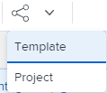

# Condividere modelli di progetto

Puoi condividere un modello con gli utenti oppure definire come i progetti creati da un modello verranno condivisi con gli utenti utilizzando le seguenti opzioni di condivisione a livello di modello.

Quando condividi un oggetto in Adobe Workfront, consenti ad altri utenti di visualizzarlo, contribuirvi o modificarlo.

Per informazioni sulle autorizzazioni di Workfront, vedere [Panoramica sulle autorizzazioni di condivisione per gli oggetti](../../../workfront-basics/grant-and-request-access-to-objects/sharing-permissions-on-objects-overview.md).

Per informazioni sulle autorizzazioni che è possibile concedere agli utenti quando si condivide un modello, vedere [Condividere un modello](../../../workfront-basics/grant-and-request-access-to-objects/share-a-template.md).

## Requisiti di accesso

+++ Espandi per visualizzare i requisiti di accesso per la funzionalità in questo articolo. 

<table style="table-layout:auto"> 
 <col> 
 <col> 
 <tbody> 
  <tr> 
   <td role="rowheader">Pacchetto Adobe Workfront</td> 
   <td> 
Qualsiasi
 </td> 
  </tr> 
  <tr> 
   <td role="rowheader">Licenza Adobe Workfront</td> 
   <td> 
Standard

   
Piano
 </td> 
  </tr> 
  <tr> 
   <td role="rowheader">Configurazioni del livello di accesso</td> 
   <td> 
Modificare l’accesso ai modelli
  </td> 
  </tr> 
  <tr> 
   <td role="rowheader">Autorizzazioni oggetto</td> 
   <td> 
Gestire le autorizzazioni per un modello
 </td> 
  </tr> 
 </tbody> 
</table>

Per ulteriori informazioni, consulta [Requisiti di accesso nella documentazione di Workfront](/help/quicksilver/administration-and-setup/add-users/access-levels-and-object-permissions/access-level-requirements-in-documentation.md).

+++

<!--Old:
<table style="table-layout:auto"> 
 <col> 
 <col> 
 <tbody> 
  <tr> 
   <td role="rowheader">Adobe Workfront plan*</td> 
   <td> 
Any 
 </td> 
  </tr> 
  <tr> 
   <td role="rowheader">Adobe Workfront license*</td> 
   <td> 
Plan 
 </td> 
  </tr> 
  <tr> 
   <td role="rowheader">Access level configurations*</td> 
   <td> 
Edit access to Templates
 
Note: If you still don't have access, ask your Workfront administrator if they set additional restrictions in your access level. For information on how a Workfront administrator can modify your access level, see <a href="../../../administration-and-setup/add-users/configure-and-grant-access/create-modify-access-levels.md" class="MCXref xref">Create or modify custom access levels</a>.
 </td> 
  </tr> 
  <tr> 
   <td role="rowheader">Object permissions</td> 
   <td> 
Manage permissions to a template
 
For information on requesting additional access, see <a href="../../../workfront-basics/grant-and-request-access-to-objects/request-access.md" class="MCXref xref">Request access to objects </a>.
 </td> 
  </tr> 
 </tbody> 
</table>-->

## Condividere un modello {#share-a-template}

Puoi condividere i modelli con altri utenti utilizzando Condivisione modelli. Questa azione definisce chi dispone delle autorizzazioni per il modello.

>[!NOTE]
>
>Quando si designa un utente attivo come Proprietario del modello, tale utente riceve automaticamente le autorizzazioni di gestione sul modello. Per informazioni sulla designazione di un utente come proprietario del modello, vedere [Modifica modelli di progetto](../../../manage-work/projects/create-and-manage-templates/edit-templates.md).

Per condividere un modello:

{{step1-to-templates}}

1. Esegui una delle operazioni seguenti:\
   Fai clic sul nome di un modello per aprirlo, quindi fai clic sul menu **Altro** , quindi su **Condivisione modelli**.

   Oppure

   Seleziona un modello dall&#39;elenco, fai clic sull&#39;icona Condividi , quindi fai clic su **Modello.**

   >[!TIP]
   >
   >Puoi condividere un oggetto solo con utenti attivi, team, ruoli o aziende.

1. Nella casella **Accesso al modello** selezionare le persone, i team, i ruoli, i gruppi o le società con cui si desidera condividere il modello.

   Puoi anche fare clic sull&#39;icona **Opzioni** per rendere il modello disponibile a livello di sistema:

1. Dal menu a discesa di ogni entità con cui stai condividendo, seleziona una delle seguenti opzioni:

   * **Visualizza**: gli utenti con queste autorizzazioni possono visualizzare il modello e creare un progetto che lo utilizza oppure allegarlo a un progetto esistente.

     >[!TIP]
     >
     >Per poter creare i progetti, l’amministratore di Workfront deve consentire l’accesso in Modifica ai progetti.

   * **Gestione**: gli utenti con queste autorizzazioni possono modificare o eliminare il modello.

     Per informazioni sulle impostazioni avanzate  disponibili qui, vedere la sezione [Impostazioni avanzate per la condivisione dei modelli](../../../workfront-basics/grant-and-request-access-to-objects/share-a-template.md#template-permissions) nell&#39;articolo [Condividi modello](../../../workfront-basics/grant-and-request-access-to-objects/share-a-template.md).

1. Fai clic su **Salva**.

## Condividere un progetto da un modello {#share-a-project-from-a-template}

Con il modello Condivisione progetti, è possibile definire gli utenti con autorizzazioni per i progetti creati dal modello a livello di modello.

Per condividere con gli utenti i progetti futuri creati da un modello:

1. Esegui una delle operazioni seguenti:\
   Fai clic sul nome di un modello per aprirlo, quindi fai clic sul menu **Altro** , quindi su **Condivisione modelli**.

   

   Oppure

   Seleziona un modello dall&#39;elenco, fai clic su **Condividi**, quindi su **Progetto.**

1. Nella casella **Accesso al progetto** selezionare le persone, i team, i ruoli, i gruppi o le società con cui è condiviso il modello.

   >[!TIP]
   >
   >Puoi condividere un oggetto solo con utenti attivi, team, ruoli o aziende.

1. Dal menu a discesa di ciascuna entità, selezionare una delle seguenti opzioni:

   * **Nessun accesso**: è possibile specificare quali utenti non avranno accesso al modello.\
     Questa opzione è disponibile solo quando si condividono progetti in blocco da modelli. 
   * **Visualizza**: gli utenti con queste autorizzazioni possono visualizzare i progetti creati dal modello.
   * **Contribuisci**: gli utenti con queste autorizzazioni possono contribuire ai progetti creati dal modello 
   * **Gestisci**: gli utenti con queste autorizzazioni possono gestire o eliminare i progetti creati da questo modello.

1. (Facoltativo) Fai clic sull&#39;icona **Opzioni** per rendere i progetti disponibili a livello di sistema.
1. Fai clic su **Salva**.

<!--

<h3>Overview of project sharing from other sources</h3>

You may already have been assigned access to projects from other areas of Workfront.  You may have been assigned access to projects from the following areas: 

<ul>
<li>When a project is created For more information about sharing projects when the project is created, see the "Access" section in <a href="../../../manage-work/projects/manage-projects/edit-projects.md" class="MCXref xref">Edit projects</a>.</li>
<li>When your Workfront administrator sets user access levels For more information about setting access levels, see <a href="../../../administration-and-setup/add-users/configure-and-grant-access/create-modify-access-levels.md" class="MCXref xref">Create or modify custom access levels</a>.</li>
<li>When using the project access template</li>
</ul>

When using the Template Project Sharing feature, if a user's access to a project is View, but you set the access permissions for Template Project Sharing to Manage, the user will have Manage permission for every project created using this specific template. The user will only have View permission for the other projects they are on.

-->

## Condivisione di modelli e progetti da modelli in blocco

Puoi condividere più modelli e progetti da più modelli contemporaneamente.

>[!NOTE]
>
>Quando si selezionano più modelli, non è possibile visualizzare chi dispone già delle autorizzazioni per i singoli modelli.

1. Consente di passare a un elenco di modelli.
1. Seleziona più modelli, quindi fai clic su .

   

   >[!TIP]
   >
   >Puoi condividere un oggetto solo con utenti attivi, team, ruoli o aziende.

1. Fai clic su **Modello** per condividere i modelli selezionati.

   Oppure

   Fai clic su **Progetto** per condividere i progetti che verranno creati dai modelli selezionati.

1. Continua a condividere i modelli per i progetti, come descritto nelle sezioni seguenti di questo articolo:

   * [Condividere un modello](#share-a-template)
   * [Condividere un progetto da un modello](#share-a-project-from-a-template)
