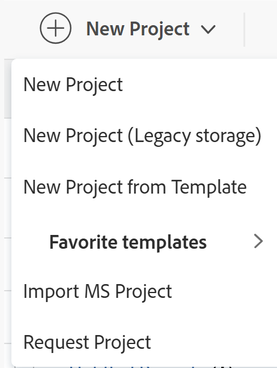
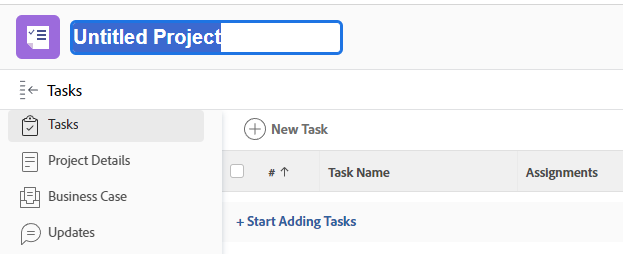

# Crea un progetto

<!--remove Preview and Production references-->

<!-- Audited: 110/2025 -->

<!--
The highlighted information on this page refers to functionality not yet generally available. It is available only in the Preview environment for all customers. After the release to Preview, the same features are also available monthly in the Production environment for customers who enabled fast releases.    

For information about fast releases, see [Enable or disable fast releases for your organization](/help/quicksilver/administration-and-setup/set-up-workfront/configure-system-defaults/enable-fast-release-process.md). 
-->

I progetti rappresentano una grande quantità di lavoro che deve essere fatto in Adobe Workfront.

## Requisiti di accesso

+++ Espandi per visualizzare i requisiti di accesso per la funzionalità descritta in questo articolo.

<table style="table-layout:auto"> 
 <col> 
 <col> 
 <tbody> 
  <tr> 
   <td role="rowheader">Pacchetto Adobe Workfront</td> 
   <td> 
Qualsiasi
 </td> 
  </tr> 
  <tr> 
   <td role="rowheader">Licenza di Adobe Workfront</td> 
   <td> 
Standard

        
Piano
 </td> 
  </tr> 
  <tr> 
   <td role="rowheader">Configurazioni del livello di accesso</td> 
   <td> 
Modifica accesso ai progetti
 </td> 
  </tr> 
  <tr> 
   <td role="rowheader">Autorizzazioni sugli oggetti</td> 
   <td> 
Quando crei un progetto, ricevi automaticamente le autorizzazioni di gestione per il progetto.
 </td> 
  </tr> 
 </tbody> 
</table>

Per ulteriori informazioni, consulta [Requisiti di accesso nella documentazione di Workfront](/help/quicksilver/administration-and-setup/add-users/access-levels-and-object-permissions/access-level-requirements-in-documentation.md).

+++

<!--
Old:
<table style="table-layout:auto"> 
 <col> 
 <col> 
 <tbody> 
  <tr> 
   <td role="rowheader">Adobe Workfront plan</td> 
   <td> 
Any
 </td> 
  </tr> 
  <tr> 
   <td role="rowheader">Adobe Workfront license*</td> 
   <td> 
New: Standard

        
or

        
Current: Plan 
 </td> 
  </tr> 
  <tr> 
   <td role="rowheader">Access level configurations</td> 
   <td> 
Edit access to Projects
 </td> 
  </tr> 
  <tr> 
   <td role="rowheader">Object permissions</td> 
   <td> 
When you create a project, you automatically receive Manage permissions to the project.
 </td> 
  </tr> 
 </tbody> 
</table>
-->

## Modi per creare progetti

Puoi creare un progetto in Workfront utilizzando uno dei seguenti metodi:

* Crea un progetto da zero senza utilizzare un modello. Questo articolo descrive come creare un progetto da zero.

* Copia un progetto esistente.\
  Per ulteriori informazioni sulla copia di un progetto, vedere [Copiare un progetto](../../../manage-work/projects/manage-projects/copy-project.md).

* Utilizza un modello.\
  Per ulteriori informazioni sull&#39;utilizzo di un modello per creare un nuovo progetto, vedere [Creare un progetto utilizzando un modello](../../../manage-work/projects/create-projects/create-project-from-template.md).

* Importa un progetto da Microsoft Project.\
  Per ulteriori informazioni sull&#39;importazione di un progetto da MS Project, vedere [Importare un progetto da Microsoft Project](../../../manage-work/projects/create-projects/import-project-from-ms-project.md).

* Importa un progetto utilizzando i kick-start.

  In qualità di amministratore di Workfront, puoi importare progetti utilizzando una funzione di avvio.

  Per informazioni sull&#39;importazione di dati tramite Kick-Start in Workfront, vedere [Importare dati in Adobe Workfront utilizzando un modello Kick-Start](../../../administration-and-setup/manage-workfront/using-kick-starts/import-data-via-kickstarts.md).

  Per informazioni sull&#39;importazione di progetti tramite Kick-Start, vedere [Scenario Kick-Start: preparazione dell&#39;importazione di un progetto semplice e di un&#39;attività](../../../administration-and-setup/manage-workfront/using-kick-starts/kick-starts-scenario-simple-project-task-import-prep.md).

* Pubblicare un’iniziativa da uno scenario in Adobe Workfront Scenario Planner.

  Per informazioni su Pianificazione scenari di Workfront, consulta [Panoramica su Pianificazione scenari](../../../scenario-planner/scenario-planner-overview.md).

  Per informazioni sulla creazione di progetti dalle iniziative di pubblicazione, vedere [Aggiornare o creare progetti pubblicando iniziative in Scenario Planner](../../../scenario-planner/publish-scenarios-update-projects.md).

* Aggiungere progetti quando si collegano da un tipo di record in Workfront Planning.

  Per informazioni sull&#39;accesso a Workfront Planning, vedere [Panoramica dell&#39;accesso](/help/quicksilver/planning/access/access-overview.md).

  Per informazioni sulla creazione di progetti tramite l&#39;aggiunta di tali elementi ai record, vedere la sezione &quot;Creazione di progetti durante la connessione con i record di Workfront Planning&quot; nell&#39;articolo [Creazione di oggetti Workfront da Workfront Planning durante la connessione ai record](/help/quicksilver/planning/records/create-workfront-objects-from-workfront-planning.md).

* Aggiungere progetti utilizzando le automazioni di Workfront Planning.

  Per informazioni, vedere [Creare oggetti utilizzando le automazioni dei record di Adobe Workfront Planning](/help/quicksilver/planning/records/create-wf-objects-using-planning-automations.md).

  È necessario disporre di una nuova licenza Workfront e di un pacchetto Workfront Planning aggiuntivo per Workfront Planning.

  Per informazioni sull&#39;accesso a Workfront Planning, vedere [Panoramica dell&#39;accesso](/help/quicksilver/planning/access/access-overview.md).

## Prerequisiti

Prima di iniziare, è necessario assicurarsi che:

* L’amministratore di sistema o di gruppo ha abilitato la preferenza &quot;Consenti agli utenti di creare progetti senza utilizzare un modello&quot; nell’area Configura.

  Per ulteriori informazioni, vedere [Configurare le preferenze di progetto a livello di sistema](../../../administration-and-setup/set-up-workfront/configure-system-defaults/set-project-preferences.md).

## Impostazioni predefinite nuovo progetto

Quando crei un progetto, Workfront applica a esso una serie di impostazioni predefinite. Ad esempio, le modalità Stato, Gruppo e Pianificazione sono predefinite al momento della creazione di un progetto.

Considera i seguenti aspetti:

* In qualità di amministratore di Workfront o di un gruppo, puoi configurare le impostazioni predefinite per un nuovo progetto durante la configurazione delle Preferenze di progetto per l’intera istanza di Workfront o per un gruppo.
* Workfront applica le impostazioni del gruppo, se presenti, prima di applicare quelle impostate dall&#39;amministratore Workfront.
* Lo stato predefinito di un nuovo progetto corrisponde a quello definito dall&#39;amministratore di Workfront nell&#39;area Preferenze progetto principale o da un amministratore di gruppo (o da un amministratore di Workfront) nell&#39;area Preferenze progetto per un gruppo.

  >[!NOTE]
  >
  >Lo stato predefinito di un nuovo progetto è Pianificazione. Quando si apportano modifiche al nuovo progetto, questo assicura che le notifiche non vengano inviate agli utenti assegnati al progetto.
  >
  >Per ulteriori informazioni sulla configurazione dello stato predefinito e di altre impostazioni predefinite per un nuovo progetto, vedi [Configurare le preferenze di progetto a livello di sistema](../../../administration-and-setup/set-up-workfront/configure-system-defaults/set-project-preferences.md) o [Configurare le preferenze di progetto per un gruppo](../../../administration-and-setup/manage-groups/create-and-manage-groups/configure-project-preferences-group.md).

* Esistono i seguenti scenari per la definizione del gruppo e dello stato di un nuovo progetto da parte di Workfront:

   * Se crei un progetto da zero, il Gruppo del progetto sarà il Gruppo Predefinito.

     Lo stato del progetto è lo stato predefinito nelle Preferenze progetto del Gruppo predefinito, se presente, o dell’istanza Workfront. È possibile modificare lo stato predefinito durante la creazione del progetto impostando qualsiasi stato disponibile per il gruppo del progetto.

   * Se crei un progetto utilizzando un modello, le impostazioni del modello hanno la precedenza su quelle stabilite dall’amministratore di Workfront o di gruppo.

     Il Gruppo del nuovo progetto è il Gruppo del modello. Se il modello non è associato a un gruppo, il gruppo del progetto è il gruppo predefinito dell’utente che crea il progetto.

     Lo stato predefinito di un nuovo progetto creato da un modello corrisponde a quello definito dall&#39;amministratore di Workfront nell&#39;area Preferenze progetto principale o da un amministratore di gruppo (o amministratore Workfront) nell&#39;area Preferenze progetto per il gruppo. È possibile modificare lo stato predefinito durante la creazione di un progetto da un modello a uno qualsiasi degli stati del gruppo del progetto, che è il gruppo del modello o il gruppo predefinito dell&#39;utente che crea il progetto.

   * Se si crea un progetto convertendo un problema, il gruppo di un nuovo progetto è il gruppo del progetto esistente del problema. Se l’utente che converte il problema non ha accesso al progetto del problema o se il progetto del problema non ha un gruppo, il gruppo del nuovo progetto è il gruppo predefinito dell’utente che converte il problema.

     Gli stati del nuovo progetto corrispondono agli stati del gruppo associato al progetto, che è il Gruppo del progetto originale o il Gruppo Predefinito dell’utente che converte il problema.

     Se utilizzi un modello durante la creazione del progetto convertendo il problema, consulta il secondo scenario qui sopra per capire quale gruppo e quale Stato di Workfront si applica al nuovo progetto.

* La posizione in cui vengono memorizzati i documenti per un progetto e per i relativi oggetti secondari (attività e problemi) dipende da ciò che l&#39;amministratore di Workfront sceglie come impostazione predefinita per Preferenze di archiviazione nell&#39;area Preferenze di sistema di Configura. A seconda della posizione in cui vengono archiviati i documenti nell’istanza di Workfront, è possibile creare i seguenti tipi di progetti:

   * Progetti di storage Workfront legacy
   * Progetti di archiviazione cloud Adobe.

  Per ulteriori informazioni, consulta [Abilitare l&#39;archiviazione cloud Adobe per la tua organizzazione](/help/quicksilver/administration-and-setup/set-up-workfront/configure-system-defaults/enable-esm.md).

  >[!TIP]
  >
  > L&#39;istanza di Workfront potrebbe non disporre di entrambi i tipi di archiviazione dei documenti.

* Quando si crea un progetto di Adobe Cloud Storage, nella sezione **Documents** del progetto viene creata una cartella documenti con lo stesso nome. Dopo aver aggiunto le attività al progetto, le cartelle con il nome dell&#39;attività vengono aggiunte alla sezione **Documenti** di ogni attività.

Per ulteriori informazioni, vedere [Panoramica sulla gestione dei documenti per progetti e oggetti correlati](/help/quicksilver/manage-work/projects/manage-projects/manage-documents-on-projects.md).

## Creare un progetto da zero

>[!NOTE]
>
>Se stai creando un progetto utilizzando un modello, ti consigliamo di visualizzare anche l&#39;articolo [Creare un progetto utilizzando un modello](/help/quicksilver/manage-work/projects/create-projects/create-project-from-template.md).

1. Esegui una delle operazioni seguenti:

   * Fai clic sull&#39;icona **[!UICONTROL Main Menu]**  nell&#39;angolo superiore sinistro, quindi fai clic su **Projects** ed espandi **New Project**.
   * Vai a un portfolio, quindi espandi **Nuovo progetto**.
   * Vai a un programma, quindi espandi **Nuovo progetto**.
   * Se sei un amministratore gruppo, puoi anche creare un progetto nella sezione Progetti di un gruppo che gestisci. Per ulteriori informazioni, vedere [Creare e modificare i progetti di un gruppo](../../../administration-and-setup/manage-groups/work-with-group-objects/create-and-modify-a-groups-projects.md).

   

1. (Condizionale) A seconda dell&#39;archiviazione documenti utilizzata dall&#39;organizzazione, fare clic su una delle opzioni seguenti:

   * **Nuovo progetto**, quando l&#39;amministratore di Workfront sceglie **Adobe Cloud Storage** o **Legacy Workfront** e ha selezionato o meno l&#39;impostazione **Consenti all&#39;utente di selezionare il provider di archiviazione**.
   * **Nuovo progetto (archiviazione legacy)**, quando l&#39;amministratore di Workfront sceglie **Archiviazione cloud Adobe** o **Workfront legacy** e seleziona anche l&#39;impostazione **Consenti all&#39;utente di selezionare il provider di archiviazione**.

     Questa opzione viene visualizzata solo quando nell&#39;area Consenti impostazione **Consenti all&#39;utente di selezionare il provider di archiviazione** è selezionato.

     Per ulteriori informazioni, consulta [Abilitare l&#39;archiviazione cloud Adobe per la tua organizzazione](/help/quicksilver/administration-and-setup/set-up-workfront/configure-system-defaults/enable-esm.md).

     >[!NOTE]
     >
     >* Quando crei un progetto di archiviazione cloud Adobe da un portfolio o programma di archiviazione Workfront legacy, il portfolio o il programma viene convertito anche in oggetti di archiviazione cloud Adobe. Tutti gli altri progetti di storage Workfront legacy nell&#39;ambito dello stesso portfolio o programma rimangono invariati.
     >* L&#39;istanza di Workfront potrebbe non disporre di entrambi i tipi di archiviazione dei documenti.

     Viene creato un progetto il cui nome predefinito segue i seguenti pattern, a seconda del Workfront di archiviazione utilizzato per i documenti:

      * `Untitled Project` per un progetto di archiviazione legacy di Workfront.

        Un progetto di archiviazione legacy di Workfront visualizza un&#39;icona **Archiviazione legacy di Workfront**  accanto al nome.

      * `Untitled Project - < Month day, year hour.minute.second >` per un progetto di archiviazione cloud Adobe

        >[!IMPORTANT]
        >
        >I progetti che utilizzano Adobe Cloud Storage devono avere nomi univoci.

1. Nell’intestazione del progetto, aggiorna il nome del progetto. Premi Invio per salvare il nome.

   

   L’intestazione della pagina del progetto presenta una breve panoramica dello stato e dell’avanzamento correnti di un progetto. Le informazioni nell&#39;intestazione del progetto cambiano con l&#39;aggiornamento delle informazioni sul progetto.

1. Fai clic su **Inizia ad aggiungere attività**.

   Oppure

   Fai clic su **Nuova attività** per aggiungere attività al progetto e assegnare loro risorse.

   Per ulteriori informazioni sull&#39;aggiunta di attività a un progetto, vedere [Creare attività in un progetto](../../../manage-work/tasks/create-tasks/create-tasks-in-project.md).

1. Modifica i dettagli del progetto facendo clic sul menu **Altro** a destra del nome del progetto, nell&#39;intestazione, quindi **Modifica**  accanto al nome del progetto.

   Viene visualizzata la casella **Modifica progetto**.

1. Aggiungi informazioni sul progetto.

   Per ulteriori informazioni sulla modifica di un progetto, vedere [Modifica progetti](../../../manage-work/projects/manage-projects/edit-projects.md).

   >[!TIP]
   >
   >Lo stato del progetto deve essere Pianificazione o un altro stato non Corrente. Questo consente di apportare modifiche al progetto senza generare notifiche ai partecipanti al progetto.

1. Fai clic su **Salva** per salvare le modifiche.

1. (Facoltativo) Dopo aver configurato le impostazioni del progetto e aver aggiunto le attività, puoi modificare lo stato del progetto in **Corrente** nell&#39;intestazione del progetto.

   Questo indica che il progetto è pronto per essere avviato e che gli utenti assegnati alle attività ora possono iniziare a lavorarci.

   Per ulteriori informazioni sugli stati dei progetti, vedere [Accedere all&#39;elenco degli stati dei progetti di sistema](../../../administration-and-setup/customize-workfront/creating-custom-status-and-priority-labels/project-statuses.md).
