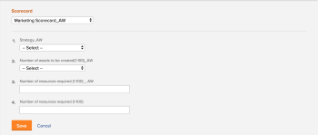

# Applicare una scorecard a un progetto e generare un punteggio di allineamento

Puoi utilizzare una scorecard per misurare l’allineamento di un progetto con i criteri precedentemente stabiliti di un portfolio. Una scheda di valutazione spesso riflette la missione, i valori e gli obiettivi strategici di un&#39;organizzazione.

Per ulteriori informazioni sulle scorecard e su come crearne una, consulta [Creare una scorecard](../../../administration-and-setup/set-up-workfront/configure-system-defaults/create-scorecard.md).

## Requisiti di accesso

Per eseguire i passaggi descritti in questo articolo, è necessario disporre dei seguenti diritti di accesso:

<table style="table-layout:auto"> 
 <col> 
 <col> 
 <tbody> 
  <tr> 
   <td role="rowheader">piano Adobe Workfront*</td> 
   <td> <p>Aziende o superiore</p> </td> 
  </tr> 
  <tr> 
   <td role="rowheader">Licenza Adobe Workfront*</td> 
   <td> <p>Piano </p> </td> 
  </tr> 
  <tr> 
   <td role="rowheader">Configurazioni a livello di accesso*</td> 
   <td> <p>Modifica accesso a progetti</p> <p>Visualizzazione o accesso superiore ai Portfoli</p> <p>Nota: Se non disponi ancora dell’accesso, chiedi all’amministratore Workfront se ha impostato ulteriori restrizioni nel livello di accesso. Per informazioni su come un amministratore Workfront può modificare il livello di accesso, consulta <a href="../../../administration-and-setup/add-users/configure-and-grant-access/create-modify-access-levels.md" class="MCXref xref">Creare o modificare livelli di accesso personalizzati</a>.</p> </td> 
  </tr> 
  <tr> 
   <td role="rowheader">Autorizzazioni oggetto</td> 
   <td> <p>Gestire le autorizzazioni per un progetto</p> <p>Visualizza o autorizzazioni superiori per un portfolio </p> <p>Per informazioni sulla richiesta di accesso aggiuntivo, vedi <a href="../../../workfront-basics/grant-and-request-access-to-objects/request-access.md" class="MCXref xref">Richiedere l’accesso agli oggetti </a>.</p> </td> 
  </tr> 
 </tbody> 
</table>

&#42;Per informazioni sul piano, il tipo di licenza o l&#39;accesso, contattare l&#39;amministratore Workfront.

## Schede di valutazione del progetto {#project-scorecards}

* [Panoramica delle scorecard](#scorecards-overview)
* [Schede di valutazione del progetto](#project-scorecards)

### Panoramica delle scorecard {#scorecards-overview}

In genere, un project manager completa le informazioni della scorecard per produrre un valore di allineamento compreso tra 0 e 100 per il progetto. Il valore prodotto viene successivamente utilizzato quando il gestore del portafoglio esamina i progetti nell’ottimizzatore del portafoglio per confrontarli.

Per ulteriori informazioni sull’ottimizzazione del portafoglio, consulta l’articolo [Panoramica di Portfoli Optimizer](../../../manage-work/portfolios/portfolio-optimizer/portfolio-optimizer-overview.md).

### Applicare una scorecard a un progetto

In qualità di utente con una licenza Pianifica e autorizzazioni Gestisci per un progetto, puoi allegare una scorecard al progetto.

Per ulteriori informazioni sulle autorizzazioni del progetto, consulta [Condivisione di un progetto in Adobe Workfront](../../../workfront-basics/grant-and-request-access-to-objects/share-a-project.md).

È possibile aggiungere scorecard a un progetto come parte della creazione del business case per il progetto.

Per ulteriori informazioni sulla creazione di un business case, vedi [Creare un business case per un progetto](../../../manage-work/projects/define-a-business-case/create-business-case.md).

L’amministratore di Adobe Workfront o l’amministratore di gruppo deve abilitare la sezione Scorecard nell’area Business Case dei progetti prima di poter accedere alle scorecard dal Business Case. Per informazioni sulla configurazione delle preferenze del progetto e sull&#39;abilitazione delle aree del Business Case, vedi [Configurare le preferenze del progetto a livello di sistema](../../../administration-and-setup/set-up-workfront/configure-system-defaults/set-project-preferences.md).

Per applicare una scorecard a un progetto:

1. Passa a un progetto a cui desideri applicare una scorecard.
1. Fai clic su **Business case** nel pannello a sinistra.
1. Trova il **Scorecard** sezione del Business Case.\
   È necessario creare una scorecard prima della **Scorecard** viene visualizzata la sezione relativa al Business Case.

   Per informazioni sulla creazione di una scorecard, vedi [Creare una scorecard](../../../administration-and-setup/set-up-workfront/configure-system-defaults/create-scorecard.md).

1. Seleziona una scorecard dal menu a discesa.

   

1. Specifica una risposta per tutte le domande nella scorecard.

   Workfront applica un punteggio a ogni domanda cui è stata data risposta e calcola un punteggio complessivo del progetto in base al punteggio individuale di ogni domanda.

   Per ulteriori informazioni sulla generazione del punteggio complessivo di allineamento del progetto, consulta [Genera un punteggio di allineamento per un progetto](#generate-an-alignment-score-for-a-project).

1. Fai clic su **Salva** per salvare la scorecard e valutare il progetto.

   La scheda di valutazione è ora associata al progetto e il relativo punteggio.

<!--This functionality was removed when we redesigned bulk editing projects with 23.2: 

1. (Conditional) When changes occur in the values of scorecard questions, you must recalculate the scorecard to reflect the new values for the project score. To recaulate the scorecard, do the following: 

   1. Go to a list of projects and select all projects in the list. 
   1. Click the **Edit** icon at the top of the list. 
   1. Click **Settings** in the left panel, then check the **Recalculate Scorecards** option at the end of the Settings area. 
   1. Click Save. This recalculates the score value based on the scorecards attached for all the selected projects.  

      >[!NOTE]
      >
      >   The option to recalculate scorecards has been removed from the Preview environment, when editing projects in bulk. 

-->

## Genera un punteggio di allineamento

* [Genera un punteggio di allineamento per un progetto](#generate-an-alignment-score-for-a-project)
* [Genera un punteggio di allineamento per un portfolio](#generate-an-alignment-score-for-a-portfolio)

### Genera un punteggio di allineamento per un progetto {#generate-an-alignment-score-for-a-project}

Il punteggio di allineamento è il valore prodotto dopo il completamento della scorecard.

Le scorecard contengono domande con scelte di risposta a cui sono stati assegnati valori numerici, denominati punti di allineamento. Questi punti vengono utilizzati per determinare l’allineamento del progetto con l’organizzazione. I punti di allineamento per ogni domanda contengono un numero compreso tra 0 e 100.

Al termine della scorecard, Workfront calcola il punteggio di allineamento del progetto in percentuale, utilizzando la seguente formula:

```
Project Alignment Score = The sum of the question points from the scorecard met at a given time/ The sum of the possible points on the scorecard
```

Per ulteriori informazioni, consulta [Creare una scorecard](../../../administration-and-setup/set-up-workfront/configure-system-defaults/create-scorecard.md).

### Genera un punteggio di allineamento per un portfolio {#generate-an-alignment-score-for-a-portfolio}

Il punteggio di allineamento del portafoglio è una media dei punteggi di allineamento di tutti i progetti nel portafoglio.

Al termine delle scorecard dei progetti, Workfront utilizza tali valori per calcolare il punteggio di allineamento del portfolio come percentuale, utilizzando la seguente formula:

Punteggio di allineamento Portfolio = Somma delle percentuali dei punteggi di allineamento del progetto/ Numero di progetti nel portfolio

>[!NOTE]
>
>Se a un progetto non è associata una scorecard e quindi non è associato un punteggio di allineamento, si considera che il portfolio sia con un allineamento dello 0%. Il progetto viene preso in considerazione nel numero di progetti del portafoglio.

## Visualizza punteggio allineamento

Puoi visualizzare il punteggio di allineamento di un progetto a livello di progetto o in Portfoli Optimizer.

* [Visualizza il punteggio di allineamento su un progetto](#View%20the)
* [Visualizza i punteggi di allineamento del progetto e del portfolio nel Portfolio Optimizer](#View%20the2)

### Visualizza il punteggio di allineamento su un progetto

Potete visualizzare il punteggio di allineamento di un progetto a livello di progetto se disponete dei diritti di Contribute per il progetto.

1. Passare al progetto di cui si desidera visualizzare il punteggio di allineamento.
1. Fai clic su **Business case** nel pannello a sinistra.
1. Vai a **Riepilogo del caso aziendale** sul lato destro dello schermo.

   Il punteggio di allineamento si trova nel sintetico del Business Case, nel **Allineato** valore.

   

### Visualizza i punteggi di allineamento del progetto e del portfolio nel Portfolio Optimizer

Puoi visualizzare il punteggio di allineamento di un progetto o di un portfolio in Portfoli Optimizer, se disponi dell&#39;accesso Gestione al portfolio.

Per ulteriori informazioni sulle informazioni visualizzate in Portfoli Optimizer, vedi [Panoramica di Portfoli Optimizer](../../../manage-work/portfolios/portfolio-optimizer/portfolio-optimizer-overview.md).

* [Individua il punteggio di allineamento del progetto in Portfoli Optimizer](#locate-the-alignment-score-of-the-project-in-the-portfolio-optimizer)
* [Individua il punteggio di allineamento del portfolio nel Portfoli Optimizer](#locate-the-alignment-score-of-the-portfolio-in-the-portfolio-optimizer)

   

#### Individua il punteggio di allineamento del progetto in Portfoli Optimizer {#locate-the-alignment-score-of-the-project-in-the-portfolio-optimizer}

1. Fai clic sul pulsante **Menu principale** icona , quindi **Portfoli**.

1. Fare clic sul nome di un Portfolio.
1. Fai clic su **Ottimizzazione del Portfolio** nel pannello a sinistra.

   Viene visualizzato Portfoli Optimizer.

1. Il punteggio di allineamento di un progetto viene visualizzato come percentuale nel **Allineamento** della colonna di Portfoli Optimizer.

   Si tratta del punteggio di allineamento del progetto in base alla scheda di valutazione associata al progetto.

#### Individua il punteggio di allineamento del portfolio nel Portfoli Optimizer  {#locate-the-alignment-score-of-the-portfolio-in-the-portfolio-optimizer}

1. Vai a **Progetti** nella barra di navigazione globale.
1. Seleziona la **Portfoli** scheda .
1. Fare clic sul nome di un Portfolio.
1. Seleziona la **Ottimizzazione del Portfolio** scheda .
1. Nella parte superiore del Portfolio Optimizer trova il **Allineato** e **Allineamento** indicatore che indica il punteggio di allineamento del portafoglio.

   Punteggio di allineamento del portfolio.

   Per ulteriori informazioni sulla generazione del punteggio di allineamento di un portfolio, vedi [Genera un punteggio di allineamento per un portfolio](#generate-an-alignment-score-for-a-portfolio).

## Panoramica del punteggio di Portfoli Optimizer

C&#39;è una differenza tra il punteggio di allineamento e il punteggio di ottimizzazione del portfolio di un progetto.

Il punteggio di allineamento di un progetto viene calcolato in base ai punti ottenuti dopo il completamento della scorecard. Questo punteggio viene quindi utilizzato per determinare il punteggio di allineamento del portfolio. Il punteggio di allineamento viene visualizzato come percentuale.

Il punteggio di allineamento di un progetto viene visualizzato nel **Allineamento** della colonna di Portfoli Optimizer.

Il punteggio dell&#39;ottimizzatore di portfolio è una classificazione calcolata automaticamente in Ottimizzatore di Portfolio in base alla quale è possibile assegnare la priorità ai progetti. Il punteggio dell&#39;ottimizzatore portfolio viene visualizzato come un&#39;icona indicatore accompagnata da un numero e viene visualizzato nella **Punteggio** della colonna di Portfoli Optimizer. Un punteggio di Portfoli Optimizer viene generato solo quando vengono completate tutte le sezioni del Business Case, ad eccezione di Obiettivi.

Per ulteriori informazioni sulla creazione di un Business Case per un progetto, consulta [Creare un business case per un progetto](../../../manage-work/projects/define-a-business-case/create-business-case.md).

Per ulteriori informazioni sul calcolo del punteggio dell&#39;ottimizzatore del portfolio di un progetto, vedi [Panoramica del punteggio di Portfoli Optimizer](../../../manage-work/portfolios/portfolio-optimizer/portfolio-optimizer-score.md).
