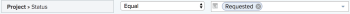

# Approvare un caso aziendale

Dopo aver completato e inviato il Business Case per una richiesta di progetto, il Business Case deve essere approvato. Questo dipende dal flusso di lavoro dell’organizzazione. Un progetto può essere avviato senza l’approvazione del caso aziendale, ma l’amministratore di Adobe Workfront e i proprietari del progetto potrebbero non essere d’accordo. 

Per ulteriori informazioni sul completamento e l&#39;invio di un Business Case, consulta l&#39;articolo [Creare un business case per un progetto](../../../manage-work/projects/define-a-business-case/create-business-case.md).

## Requisiti di accesso

Per eseguire i passaggi descritti in questo articolo, è necessario disporre dei seguenti diritti di accesso:

<table style="table-layout:auto"> 
 <col> 
 <col> 
 <tbody> 
  <tr> 
   <td role="rowheader">piano Adobe Workfront*</td> 
   <td> <p>Pro o superiore</p> </td> 
  </tr> 
  <tr> 
   <td role="rowheader">Licenza Adobe Workfront*</td> 
   <td> <p>Piano </p> </td> 
  </tr> 
  <tr> 
   <td role="rowheader">Configurazioni a livello di accesso*</td> 
   <td> <p>Modifica accesso a progetti</p> <p>Nota: Se non disponi ancora dell’accesso, chiedi all’amministratore Workfront se ha impostato ulteriori restrizioni nel livello di accesso. Per informazioni su come un amministratore Workfront può modificare il livello di accesso, consulta <a href="../../../administration-and-setup/add-users/configure-and-grant-access/create-modify-access-levels.md" class="MCXref xref">Creare o modificare livelli di accesso personalizzati</a>.</p> </td> 
  </tr> 
  <tr> 
   <td role="rowheader">Autorizzazioni oggetto</td> 
   <td> <p>Gestire le autorizzazioni per un progetto</p> <p>Per informazioni sulla richiesta di accesso aggiuntivo, vedi <a href="../../../workfront-basics/grant-and-request-access-to-objects/request-access.md" class="MCXref xref">Richiedere l’accesso agli oggetti </a>.</p> </td> 
  </tr> 
 </tbody> 
</table>

&#42;Per informazioni sul piano, il tipo di licenza o l&#39;accesso, contattare l&#39;amministratore Workfront.

## Panoramica sull&#39;approvazione del caso aziendale

Quando si approva un Business Case di un progetto, tenere presente quanto segue:

* Per approvare il Business Case, è necessario disporre delle autorizzazioni di gestione per un progetto. 
* Non potrai vedere i progetti che attendono l&#39;approvazione del Business Case in base alle tue Approvazioni in Home.
* Per verificare che siano in attesa di approvazione, devi passare manualmente ai singoli progetti per i quali è necessaria l’approvazione del Business Case. Non esiste un meccanismo di notifica Workfront che avvisa un utente che deve approvare il Business Case di un progetto.
* Puoi trovare i progetti in attesa dell’approvazione del Business Case creando un rapporto sul progetto o accedendo al portfolio a cui sono associati. 

   Per ulteriori informazioni sui Portfoli, consulta l’articolo [Panoramica del Portfolio in Adobe Workfront](../../../manage-work/portfolios/portfolios-overview/portfolio-overview.md).

## Approvare il Business Case creando un rapporto sul progetto

È possibile creare un rapporto per i progetti per vedere quali progetti richiedono l’approvazione del Business Case. 

Per creare un report per i progetti in attesa dell&#39;approvazione dei rispettivi casi aziendali:

1. Crea un rapporto per i progetti.

   Per ulteriori informazioni sulla creazione di rapporti, consulta l’articolo [Creare un rapporto personalizzato](../../../reports-and-dashboards/reports/creating-and-managing-reports/create-custom-report.md).

1. Seleziona la **Visualizza** scheda del rapporto, quindi fai clic su **Aggiungi colonna**.

1. Inizia a digitare &quot;Status&quot; nella **Mostra in questa colonna** e selezionare questo campo quando viene visualizzato nell&#39;elenco.

    In questa colonna viene visualizzato lo stato dei progetti.

1. Seleziona la **Filtri** scheda del rapporto, quindi fai clic su **Aggiungere una regola filtro**.

1. Inizia a digitare &quot;Status&quot; nella **Mostra solo progetti in cui ...** e selezionarlo quando viene visualizzato nell&#39;elenco.
1. Seleziona **Uguale** per il modificatore del filtro.
1. Inizia a digitare &quot;Requested&quot; nel campo disponibile. 

   In questo modo il rapporto include solo i progetti che si trovano nello stato Richiesto.

     

1. (Facoltativo) Fai clic su **Aggiungi un’altra regola filtro**.

   Puoi aggiungere altri filtri per mostrare solo i progetti in cui sei il proprietario del progetto, lo sponsor del progetto o il proprietario del Portfolio.

   Ad esempio, puoi utilizzare le seguenti istruzioni filtro: 

   ```
   Project Sponsor ID Equals $$USER.ID
   ```

   per visualizzare i progetti in cui sei designato come sponsor del progetto

   ```
   Project Owner ID Equals $$USER.ID
   ```

   per visualizzare i progetti in cui sei designato come proprietario del progetto

   ```
   Project Portfolio Owner ID Equals $$USER. ID
   ```

   per visualizzare la posizione in cui sei designato come responsabile del Portfolio. 

1. Fai clic su **Salva e chiudi**.

   Tutti i progetti nel rapporto sono nello stato **Richiesto**.

1. Fai clic sul nome di un progetto nel rapporto per aprirlo.
1. Fai clic su **Business case** nel pannello a sinistra.
1. Fai clic su **Approva** o **Rifiuta** nell&#39;area Sintetico casi aziendali per approvare o rifiutare il Business Case. 

   

   Lo stato del progetto viene modificato in **Approvato** se il Business Case è approvato.

   Lo stato del progetto viene modificato in **Rifiutato** se il caso aziendale viene rifiutato.

   >[!NOTE]
   >
   >Nessuna notifica avvisa l&#39;utente che ha inviato l&#39;approvazione del business case se la sua richiesta di progetto è stata approvata o rifiutata.

## Approvare il Business Case accedendo ai progetti richiesti in un portfolio

Per ulteriori informazioni sulla revisione dei progetti richiesti, consulta l’articolo [Revisione dei progetti richiesti](../../../manage-work/portfolios/create-and-manage-portfolios/review-requested-projects.md).
