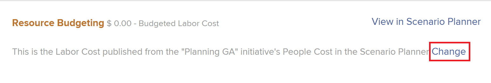

# Preventivare le risorse nel Business Case utilizzando la Programmazione delle risorse

Come parte della pianificazione delle risorse, è possibile utilizzare la Pianificazione risorse a livello di progetto per preventivare i ruoli necessari per il completamento del lavoro in un progetto quando si crea il caso di business.

Per ulteriori informazioni sulla creazione di un caso di business, consulta [Creare un Business Case per un progetto](../../../manage-work/projects/define-a-business-case/create-business-case.md).

>[!TIP]
>
>Le informazioni immesse nella Programmazione risorse a livello di progetto sono visibili anche nella Programmazione risorse a livello di sistema. Anche il contrario è vero. Per informazioni sulla Programmazione delle risorse, consulta [Panoramica di Programmazione delle risorse](../../../resource-mgmt/resource-planning/get-started-resource-planner.md).

Puoi anche preventivare le risorse nel caso di business utilizzando Adobe Workfront Scenario Planner. Per ulteriori informazioni, consulta [Preventivare le risorse nel Business Case utilizzando la Pianificazione scenario](../../../manage-work/projects/define-a-business-case/budget-resources-in-business-case-use-scenario-planner.md).

## Requisiti di accesso

Devi avere i seguenti:

<table style="table-layout:auto"> 
 <col> 
 <col> 
 <tbody> 
  <tr> 
   <td role="rowheader"><a href="https://www.workfront.com/plans" target="_blank">piano Adobe Workfront</a>*</td> 
   <td> 
Pro o superiore
 </td> 
  </tr> 
  <tr> 
   <td role="rowheader"><a href="../../../administration-and-setup/add-users/access-levels-and-object-permissions/wf-licenses.md" class="MCXref xref">Panoramica sulle licenze di Adobe Workfront</a>*</td> 
   <td> 
Revisione o successiva
 
Importante: è necessario disporre di una licenza Pianificazione per modificare le informazioni di budget delle risorse. 
 </td> 
  </tr> 
  <tr> 
   <td role="rowheader">Configurazioni del livello di accesso*</td> 
   <td> 
Modifica accesso a: 
 
    <ul> 
     <li> 
Progetti
 </li> 
     <li> 
Gestione risorse
 </li> 
     <li> 
Dati finanziari
 </li> 
    </ul> 
Per informazioni sull'accesso necessario alle risorse del budget, vedere anche <a href="../../../resource-mgmt/resource-planning/access-needed-to-budget-resources.md" class="MCXref xref">Accesso necessario per preventivare le risorse in Adobe Workfront</a>.
 
Nota: se ancora non disponi dell’accesso, chiedi all’amministratore di Adobe Workfront se ha impostato restrizioni aggiuntive nel tuo livello di accesso. Per informazioni su come un amministratore di Workfront può modificare il tuo livello di accesso, consulta <a href="../../../administration-and-setup/add-users/configure-and-grant-access/create-modify-access-levels.md" class="MCXref xref">Creare o modificare livelli di accesso personalizzati</a>.
 </td> 
  </tr> 
  <tr> 
   <td role="rowheader">Autorizzazioni oggetto</td> 
   <td> 
Gestire le autorizzazioni sul progetto
 
Per informazioni sulla richiesta di accesso aggiuntivo, consulta <a href="../../../workfront-basics/grant-and-request-access-to-objects/request-access.md" class="MCXref xref">Richiedi accesso agli oggetti </a>.
 </td> 
  </tr> 
 </tbody> 
</table>

&#42;Per conoscere il piano, il tipo di licenza o l&#39;accesso di cui si dispone, contattare l&#39;amministratore Workfront.

## Prerequisiti

Prima di iniziare, è necessario effettuare le seguenti operazioni:

* Soddisfa tutti i prerequisiti per la pianificazione delle risorse in Adobe Workfront. Per informazioni, consulta [Panoramica di Programmazione delle risorse](../../../resource-mgmt/resource-planning/get-started-resource-planner.md).

* Associa i gruppi di risorse al progetto.

   <!--
  
(NOTE:(you must have tasks assigned to job roles and users on the project - this is optional because the users and their roles come from the pools))

  -->

   >[!NOTE]
   Non è possibile preventivare le risorse assegnate ai problemi nel Business Case. È possibile preventivarli nella programmazione delle risorse a livello di sistema. Per ulteriori informazioni sulla Programmazione delle risorse, consulta [Panoramica di Programmazione delle risorse](../../../resource-mgmt/resource-planning/get-started-resource-planner.md).

* Anche se questo non è un prerequisito, ti consigliamo anche di indicare le Ore pianificate per le attività sul progetto. In questo modo è possibile comprendere la quantità di lavoro che un&#39;attività potrebbe dover completare, il che consente di decidere in merito alla quantità di tempo a cui le risorse devono essere preventivate per completare l&#39;attività. Per informazioni sull&#39;associazione delle attività alle ore pianificate, vedere [Modifica attività](../../../manage-work/tasks/manage-tasks/edit-tasks.md).

## Applicare gruppi di risorse a un progetto e risorse preventivo nel Business Case

>[!IMPORTANT]
È possibile preventivare le risorse per un periodo di 15 anni. Se si preventivano le risorse per un progetto con una durata superiore a 15 anni, le informazioni di definizione del budget potrebbero non essere accurate.

Per applicare i gruppi di risorse e le risorse del progetto di budget nel Business Case per un progetto senza gruppo di risorse:

1. Vai al progetto per il quale vuoi preventivare le risorse.
1. Clic **Business Case** nel pannello a sinistra.
1. (Condizionale) Se la tua azienda non dispone di una licenza per Workfront Scenario Planner, fai clic su **Modifica budget risorse** nel **Budget risorse** , quindi continuare con il passaggio 5.

   <!--
   
(NOTE: ensure it stays right - this is 5 instead of 6 because step 2 won't print for nwe)

   -->

1. (Facoltativo e condizionale) Se le informazioni sul progetto sono state pubblicate da un&#39;iniziativa nella Pianificazione scenario, effettuate una delle seguenti operazioni:

   * Seleziona Programmazione delle risorse in **Scegliere le ore da utilizzare per calcolare il costo manodopera preventivato del progetto** , quindi fai clic su **Scegli > Modifica budget risorse**.

      

   * Se è stato selezionato Pianificazione scenario per la definizione del budget delle risorse per il progetto, fare clic su **Cambia** > **Modifica budget risorse**.

      
   In questo modo vengono utilizzate le ore preventivate del progetto per calcolare il costo manodopera preventivato per il progetto.

   La Pianificazione scenario è disponibile solo nella nuova esperienza Adobe Workfront e richiede una licenza aggiuntiva. Per informazioni su Workfront Scenario Planner, consulta [Panoramica sulla pianificazione degli scenari](../../../scenario-planner/scenario-planner-overview.md).

   >[!NOTE]
   È consigliabile decidere se utilizzare la Programmazione risorse o la Pianificazione scenario quando si inizia a lavorare su un progetto. Il passaggio frequente tra le due opzioni durante il ciclo di vita del progetto può creare incongruenze nel modo in cui vengono preventivate le risorse per il progetto.

1. In **Seleziona gruppo di risorse** , specificare uno o più **Gruppi di risorse**.

   È necessario specificare solo i gruppi di risorse popolati con utenti attivi.

   >[!TIP]
   Se il progetto è già associato ai gruppi di risorse, per impostazione predefinita viene visualizzato Pianificazione risorse. Per aggiungere altri gruppi di risorse al progetto, modifica il progetto. Per informazioni sulla modifica di un progetto, consulta [Modifica progetti](../../../manage-work/projects/manage-projects/edit-projects.md).

1. Clic **Applica**.

   Viene visualizzata la Programmazione delle risorse per il progetto selezionato.

   Per impostazione predefinita, i primi 20 ruoli associati a questo progetto sono elencati in ordine alfabetico nella sezione Budget risorse. 

   Per ulteriori informazioni sulla Programmazione delle risorse, consulta [Panoramica di Programmazione delle risorse](../../../resource-mgmt/resource-planning/get-started-resource-planner.md).

   

1. (Facoltativo e condizionale) Espandere i ruoli per visualizzare gli utenti associati.

   >[!NOTE]
   Gli utenti attivi vengono visualizzati nelle mansioni loro associate solo se soddisfano i seguenti criteri:
   * Appartengono a uno dei Pool di Risorse del progetto.
   * Sono state assegnate ore preventivate.
   * Sono associati a una delle mansioni del progetto.

    

1. Clic **Oggi** per tornare all&#39;intervallo di tempo odierno.
1. (Facoltativo) Fai clic su **Settimana**, **Mese** o **Trimestre** per visualizzare le informazioni del progetto in diversi intervalli di tempo.
1. (Facoltativo) Fai clic su **Ore** menu a discesa e selezionare **Ore**,**FTE**, o **Costo** per modificare la modalità di visualizzazione delle informazioni nella Programmazione delle risorse. Le ore vengono visualizzate per impostazione predefinita.

1. (Facoltativo) Fai clic su **Esporta** per esportare la Programmazione delle risorse in un file Excel.

   >[!NOTE]
   Puoi esportare dati per un massimo di 12 periodi di tempo alla volta.

1. (Facoltativo) Fai clic su **Schermo intero** icona  per visualizzare la Programmazione delle risorse in modalità a schermo intero.

1. Aggiornare il **BDG** (Ore preventivate) con i valori di Ora, FTE o Costo per gli utenti, i ruoli o il progetto eseguendo una delle operazioni seguenti:

   * Stimare manualmente la quantità di ore, FTE o valori di costo per ruoli, utenti o progetto.

      Oppure

   * Fai clic su **Opzioni** per il progetto o le mansioni e selezionare un&#39;opzione per preventivare automaticamente le ore per le mansioni, gli utenti o il progetto.
   Per ulteriori informazioni sulla definizione del budget nella visualizzazione Progetto della Programmazione delle risorse, vedere [Risorse preventivate nella Programmazione delle risorse utilizzando le viste Progetto e Ruolo](../../../resource-mgmt/resource-planning/budget-resources-project-role-views-resource-planner.md).

   >[!NOTE]
   È possibile preventivare ore, FTE o costi per le risorse per qualsiasi intervallo di tempo visualizzato nell&#39;area Budget risorse, indipendentemente dalla sequenza temporale del progetto. Ad esempio, se vuoi indicare che le risorse potrebbero non essere disponibili durante la timeline del progetto (dove sono associate alle ore pianificate), ma potrebbero essere disponibili in un altro momento, puoi preventivarle per intervalli di tempo in cui le ore pianificate sono zero, se questo è il momento in cui diventano disponibili per lavorare.

1. (Facoltativo) Per capire se è possibile spostare le ore, i FTE o i costi preventivati in un altro intervallo di tempo, fare clic sul pulsante **Opzioni** , quindi **Adegua date budget**.

   Per ulteriori informazioni sull&#39;adeguamento delle date preventivate, vedere [Adeguare le date di budget nella Programmazione risorse](../../../resource-mgmt/resource-planning/adjust-budgeting-dates.md).

1. Fai clic su **Salva**.

   Se alle mansioni sono associate tariffe Costo orario, la definizione del budget delle risorse nell&#39;area Budget risorse calcola il valore **Costo manodopera preventivato** del progetto. Il Costo manodopera preventivato viene visualizzato nell&#39;area Budget risorse del Business Case e nel Sintetico Business Case.

   >[!TIP]
   Nel Business Case, il costo viene visualizzato nella valuta del progetto.

   Le informazioni di budget specificate nel Business Case vengono visualizzate anche nella Programmazione delle risorse.

   Quando copi un progetto, puoi anche copiare le ore preventivate nel nuovo progetto. Vengono copiate solo le ore preventivate nella Programmazione delle risorse. Per ulteriori informazioni, consulta [Copiare un progetto](../manage-projects/copy-project.md).
