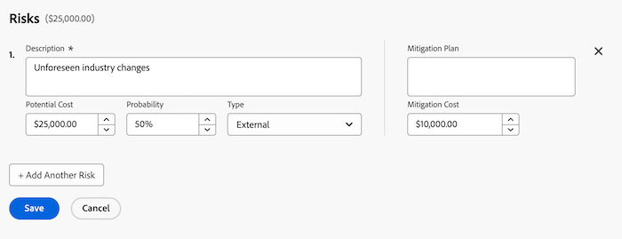
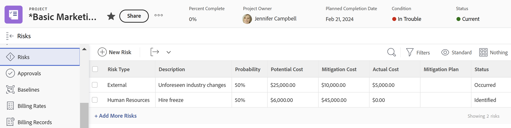
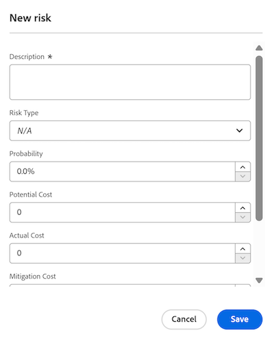

# Creare e modificare i rischi nei progetti

<!--Audited: 06/2025-->

<!--The highlighted information on this page refers to functionality not yet generally available. It is available only in the Preview environment for all customers. The same features will also be available in the Production environment for all customers after a week from the Preview release.    

For more information, see [Interface modernization](/help/quicksilver/product-announcements/product-releases/interface-modernization/interface-modernization.md). -->

I rischi sono eventi o fattori possibili che impediscono a un progetto di terminare in tempo o nel rispetto del budget. È possibile registrare i rischi durante la creazione del Business Case di un progetto o utilizzando la scheda Rischi.

Puoi creare rischi solo su progetti o modelli. Non è possibile associare rischi ad attività o problemi.

I rischi possono essere associati ai costi, ma il costo rischio effettivo non influisce sul costo effettivo del progetto.

>[!NOTE]
>
>Questo articolo definisce i rischi associati al progetto nel modo in cui vengono definiti nel Business Case del progetto o aggiunti nella scheda Rischi del progetto.
>
>Per informazioni sul campo Rischio disponibile quando si modifica un progetto, vedere [Modifica progetti](../../../manage-work/projects/manage-projects/edit-projects.md).

## Requisiti di accesso

Per eseguire i passaggi descritti in questo articolo, è necessario disporre dei seguenti diritti di accesso:

+++ Espandi per visualizzare i requisiti di accesso per la funzionalità in questo articolo. 

<table style="table-layout:auto"> 
 <col> 
 <col> 
 <tbody> 
  <tr> 
   <td role="rowheader">
Piano Adobe Workfront*
</td> 
   <td> 
Piani correnti:

   <ul><li>Qualsiasi piano, per aggiungere rischi nell’area Rischi del progetto
</li>
   <li>
Prime o versione successiva, per aggiungere rischi nel Business Case del progetto
</li></ul>
   
Piani legacy: qualsiasi piano

   </td> 
  </tr> 
  <tr> 
   <td role="rowheader">
Licenza Adobe Workfront*
</td> 
   <td> 
Corrente: Standard 

   
Legacy: Plan 
 </td> 
  </tr> 
  <tr> 
   <td role="rowheader">
Configurazioni del livello di accesso
</td> 
   <td> 
Modifica accesso a progetti e dati finanziari
 </td> 
  </tr> 
  <tr> 
   <td role="rowheader">
Autorizzazioni oggetto
</td> 
   <td> 
 Gestire le autorizzazioni che includono Gestisci dati finanziari per il progetto per il quale si desidera creare o modificare i rischi 
 </td> 
  </tr> 
 </tbody> 
</table>

*Per informazioni, consulta [Requisiti di accesso nella documentazione di Workfront](/help/quicksilver/administration-and-setup/add-users/access-levels-and-object-permissions/access-level-requirements-in-documentation.md).

+++

## Creare e modificare i rischi nel Business Case

È possibile creare rischi durante la pianificazione del Business Case di un progetto. In seguito è possibile modificarli nel Business Case, ad esempio quando si verificano modifiche alla probabilità, al piano di mitigazione o al costo. Per informazioni sulla creazione di un caso aziendale, vedere [Creare un caso aziendale per un progetto](../../../manage-work/projects/define-a-business-case/create-business-case.md).

L&#39;amministratore di Workfront o l&#39;amministratore di gruppo deve abilitare la sezione **Rischi** nel caso di business nell&#39;area Preferenze progetto prima di visualizzarla a livello di progetto nella sezione Caso di business. Per informazioni sull&#39;impostazione delle preferenze di progetto, vedere [Configurare le preferenze di progetto a livello di sistema](../../../administration-and-setup/set-up-workfront/configure-system-defaults/set-project-preferences.md).

La creazione e la modifica dei rischi nel Business Case sono identiche.

Per creare o modificare un rischio nel Business Case:

1. Passare al progetto per il quale si desidera creare rischi.
1. Fai clic su **Business Case** nel pannello a sinistra.
1. Nella sezione **Rischi** fare clic su **Modifica rischi**.
1. Immettere o modificare le informazioni seguenti:

   * **Descrizione:** Descrivere il rischio.

   * **Costo potenziale**: immettere il costo stimato se il rischio dovrebbe verificarsi.

   * **Probabilità**: immettere la probabilità che il rischio si verifichi come valore percentuale.

   * **Tipo:** Selezionare la categoria di appartenenza del rischio.
   * **Piano di mitigazione**: aggiornare la descrizione del piano per mitigare il rischio.

   * **Costo di mitigazione**: immettere il costo del piano di mitigazione che è necessario implementare per evitare che si verifichi il rischio.

   

1. (Facoltativo) Fai clic su **Aggiungi un altro rischio** per aggiungere altri rischi.
1. Fai clic su **Salva**.

## Creare e modificare i rischi nell&#39;area Rischi

Oltre a creare e modificare i rischi nel caso di business, puoi farlo utilizzando la sezione **Rischi** di un progetto.

È possibile creare e modificare i rischi nella sezione Rischi di un progetto o di un modello. Creare rischi per i modelli è identico a creare rischi per i progetti.

### Creare rischi nell&#39;area Rischi {#create-risks-in-the-risks-area}

1. Passare al progetto per il quale si desidera creare rischi.
1. Fai clic su **Rischi** nel pannello a sinistra.

   

1. Fai clic su **Aggiungi altri rischi** e crea rischi modificando le informazioni in linea.

   Oppure

   Fare clic su **Nuovo rischio** per aprire la casella **Nuovo rischio**.

   

1. (Condizionale) Se si aggiunge un rischio nella casella **Nuovo rischio**, immettere le informazioni seguenti:

   * **Descrizione**: descrivere il rischio. Questo è un campo obbligatorio.
   * **Tipo di rischio**: indicare la categoria di appartenenza del rischio.\
     L’amministratore di Workfront definisce i tipi di rischio disponibili nel tuo ambiente. Per informazioni sulla definizione dei tipi di rischio, vedere l&#39;articolo [Modifica e crea tipi di rischio](../../../administration-and-setup/set-up-workfront/configure-system-defaults/edit-create-risk-types.md).

   * **Probabilità**: indicare la probabilità che il rischio si verifichi come valore percentuale.
   * **Costo potenziale**: indicare il costo stimato nel caso in cui si verifichi il rischio.
   * **Costo effettivo**: indicare il costo effettivo del rischio se si è verificato il rischio.
   * **Costo di mitigazione**: indicare il costo del piano di mitigazione che è necessario implementare per evitare che si verifichi il rischio.
   * **Piano di mitigazione**: aggiornare la descrizione del piano per mitigare il rischio.

1. Fai clic su **Salva**.

1. (Facoltativo) Selezionare un altro **Stato** per il rischio, nel menu a discesa **Stato**, quando si applica la visualizzazione **Standard** per l&#39;elenco dei rischi.

   Per impostazione predefinita, lo **Stato** di un rischio è **Identificato**.

### Modifica rischi nell&#39;area Rischi {#edit-risks-in-the-risks-area}

È possibile modificare i rischi durante il ciclo di vita di un progetto o quando si verificano modifiche (ad esempio, una modifica della probabilità, del costo potenziale o dello stato).

È possibile modificare un rischio alla volta o più rischi in blocco.

Per modificare i rischi:

1. Passare a un progetto per il quale si desidera modificare i rischi esistenti.
1. Fai clic su **Rischi** nel pannello a sinistra.
1. Inizia a modificare in linea i campi per i rischi visualizzati nell’elenco per modificare un rischio alla volta.

   Oppure

   Selezionare uno o più rischi, quindi fare clic su **Modifica** per modificare più rischi contemporaneamente.

   >[!NOTE]
   >
   >Quando si modificano più rischi contemporaneamente, si applicano le stesse informazioni a tutti i rischi selezionati. Le informazioni associate a ciascun rischio prima delle modifiche vengono sovrascritte in una modifica collettiva.

1. Se hai fatto clic su **Modifica**, verrà visualizzata la casella **Modifica rischio** o **Modifica rischi**.

   Aggiorna i campi seguenti:

   * **Descrizione**: modificare la descrizione del rischio.
   * **Tipo di rischio**: aggiorna la categoria in cui rientra il rischio.
   * **Probabilità**: indicare la probabilità che il rischio si verifichi come valore percentuale.
   * **Costo potenziale**: indicare il costo stimato nel caso in cui si verifichi il rischio.
   * **Costo effettivo**: indicare il costo effettivo del rischio se si è verificato il rischio.
   * **Costo di mitigazione**: indicare il costo del piano di mitigazione che è necessario implementare per evitare che si verifichi il rischio.
   * **Piano di mitigazione**: aggiornare la descrizione del piano per mitigare il rischio.

1. Fai clic su **Salva**.
1. (Facoltativo) Modifica lo **Stato** per un rischio, nel menu a discesa **Stato**, quando applichi la visualizzazione **Standard** per l&#39;elenco dei rischi.

   >[!NOTE]
   >
   >Impossibile modificare lo **Stato** dei rischi nella finestra di dialogo **Modifica rischio**. Puoi eseguire questa operazione solo in una modifica in linea.
