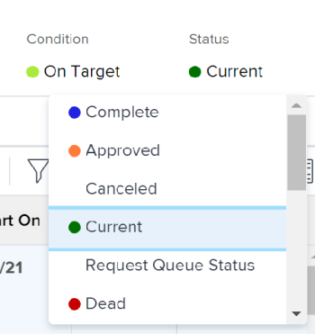

# Modificare lo stato di un progetto

Puoi modificare manualmente lo stato di un progetto.

## Requisiti di accesso

<!--drafted for P&P:

<table style="table-layout:auto"> 
 <col> 
 <col> 
 <tbody> 
  <tr> 
   <td role="rowheader">Adobe Workfront plan*</td> 
   <td> 
Any
 </td> 
  </tr> 
  <tr> 
   <td role="rowheader">Adobe Workfront license*</td> 
   <td> 
Current license: Standard 
 
   Or
   
Legacy license: Plan 

   </td> 
  </tr> 
  <tr> 
   <td role="rowheader">Access level configurations*</td> 
   <td> 
Edit access to Projects
 
<b>NOTE</b> If you still don't have access, ask your Workfront administrator if they set additional restrictions in your access level. For information on how a Workfront administrator can modify your access level, see <a href="../../../administration-and-setup/add-users/configure-and-grant-access/create-modify-access-levels.md" class="MCXref xref">Create or modify custom access levels</a>.
 </td> 
  </tr> 
  <tr> 
   <td role="rowheader">Object permissions</td> 
   <td> 
Manage permissions on the project
 
For information on requesting additional access, see <a href="../../../workfront-basics/grant-and-request-access-to-objects/request-access.md" class="MCXref xref">Request access to objects </a>.
 </td> 
  </tr> 
 </tbody> 
</table>
-->

Per eseguire i passaggi descritti in questo articolo, è necessario disporre dei seguenti diritti di accesso:

<table style="table-layout:auto"> 
 <col> 
 <col> 
 <tbody> 
  <tr> 
   <td role="rowheader">piano Adobe Workfront*</td> 
   <td> 
Qualsiasi
 </td> 
  </tr> 
  <tr> 
   <td role="rowheader">Licenza Adobe Workfront*</td> 
   <td> 
Piano 
 </td> 
  </tr> 
  <tr> 
   <td role="rowheader">Configurazioni a livello di accesso*</td> 
   <td> 
Modifica accesso a progetti
 
<b>NOTA</b> Se non disponi ancora dell’accesso, chiedi all’amministratore Workfront se ha impostato ulteriori restrizioni nel livello di accesso. Per informazioni su come un amministratore Workfront può modificare il livello di accesso, consulta <a href="../../../administration-and-setup/add-users/configure-and-grant-access/create-modify-access-levels.md" class="MCXref xref">Creare o modificare livelli di accesso personalizzati</a>.
 </td> 
  </tr> 
  <tr> 
   <td role="rowheader">Autorizzazioni oggetto</td> 
   <td> 
Gestisci le autorizzazioni per il progetto
 
Per informazioni sulla richiesta di accesso aggiuntivo, vedi <a href="../../../workfront-basics/grant-and-request-access-to-objects/request-access.md" class="MCXref xref">Richiedere l’accesso agli oggetti </a>.
 </td> 
  </tr> 
 </tbody> 
</table>

&#42;Per informazioni sul piano, il tipo di licenza o l&#39;accesso, contattare l&#39;amministratore Workfront.

## Considerazioni sull’aggiornamento a stati specifici

* **Quando si aggiorna un progetto in Completa:** Assicurati che tutte le attività e i problemi siano completati sul progetto. Non è possibile selezionare lo stato Completa per un progetto o qualsiasi altro stato che equivalga a Completo in presenza di attività o problemi che non sono stati completati nel progetto. Ciò include l&#39;approvazione di qualsiasi attività o problema che si trova in uno stato di approvazione in attesa di completamento.
* **Quando si aggiorna un progetto da Completa a Corrente:** Se tutte le attività e i problemi relativi al progetto sono stati completati, assicurati che la modalità di completamento del progetto sia impostata su Manuale. Se la modalità di completamento del progetto è Automatica, lo stato del progetto rimane Completo.

## Modificare lo stato del progetto

1. Passa al progetto di cui desideri aggiornare lo stato.
1. Nell’intestazione del progetto, fai clic sul nome dello stato nel **Stato** , quindi selezionare un nuovo stato.

   

   Oppure

   Fai clic sul pulsante **Altro** menu  accanto al nome del progetto e fai clic su **Modifica** e seleziona un nuovo stato nel **Stato** campo , quindi fai clic su **Salva**.

   Lo stato del progetto viene aggiornato a quello selezionato.
