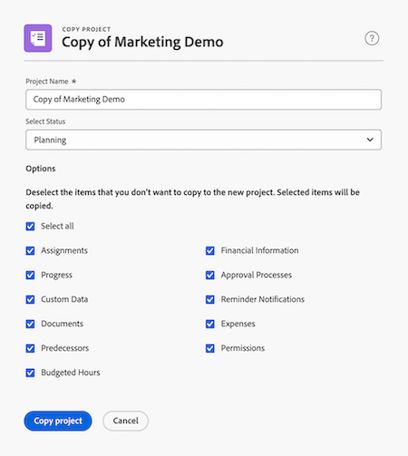

# Copiare un progetto

<!--
<(LINKED TO THE PRODUCT IN THE COPY PROJECT BOX)

-->

<!-- Audited: 5/2025 -->

È possibile copiare un progetto da un progetto esistente anziché crearne uno nuovo, risparmiando tempo.

Non è possibile copiare i progetti in blocco.

>[!IMPORTANT]
>
>I seguenti elementi non vengono mai copiati da un progetto esistente a uno nuovo:
>
>* Problemi
>* Tariffe di fatturazione
>* Record fatturazione
>* Note
>* Ore
>* Predecessori tra progetti
>* Ore preventivate
>
>I seguenti elementi vengono sempre copiati da un progetto esistente a uno nuovo:
>
>* Attività
>* Modello
>* Rischi
>* Informazioni impostazione coda
>* Portfolio e programma
>* Scheda di valutazione
>* Informazioni predefinite attività (processo di approvazione predefinito attività, Forms personalizzato predefinito attività)
>
> Le date delle attività del progetto originale verranno copiate nel nuovo progetto. È necessario modificare la data di inizio o di completamento del progetto (a seconda della modalità di programmazione) per aggiornare le date delle attività. I vincoli relativi alle attività potrebbero impedire la modifica delle date nel progetto.

## Requisiti di accesso

+++ Espandi per visualizzare i requisiti di accesso per la funzionalità in questo articolo.
Per eseguire i passaggi descritti in questo articolo, è necessario disporre dei seguenti diritti di accesso:

<table style="table-layout:auto"> 
 <col> 
 <col> 
 <tbody> 
  <tr> 
   <td> 
Pacchetto Adobe Workfront
 </td>  
   <td>Qualsiasi</td> 
  </tr> 
  <tr> 
   <td> 
Licenza Adobe Workfront
 </td> 
   <td> 
Standard
 
   
Piano

      </td> 
  </tr> 
     <td>Configurazioni del livello di accesso </td> 
   <td> 
Modificare l’accesso ai progetti con la possibilità di creare e copiare progetti
 </td> 
  </tr>

<td> 
Autorizzazioni oggetto 
 </td> 
   <td> 
Visualizza autorizzazioni o versioni successive per il progetto
  </td> 
  </tr> 
 </tbody> 
</table>

Per ulteriori dettagli sulle informazioni contenute in questa tabella, vedere [Requisiti di accesso nella documentazione di Workfront](/help/quicksilver/administration-and-setup/add-users/access-levels-and-object-permissions/access-level-requirements-in-documentation.md).

+++

<!--Old:
 
 <table style="table-layout:auto"> 
 <col> 
 <col> 
 <tbody> 
  <tr> 
   <td> 
Adobe Workfront plan
 </td> 
   <td>Any</td> 
  </tr> 
  <tr> 
   <td> 
Adobe Workfront license
 </td> 
   <td> 
New: Standard 
 
   
Or

   
Current: Plan 

   
   </td> 
  </tr> 
  <tr data-mc-conditions=""> 
   <td>Access level configurations </td> 
   <td> 
Edit access to Projects with ability to Create and Copy projects
 </td> 
  </tr> 
  <tr data-mc-conditions=""> 
   <td> 
Object permissions 
 </td> 
   <td> 
View permissions or higher to the project
  </td> 
  </tr> 
 </tbody> 
</table>-->

## Copiare un singolo progetto

Quando si copia un progetto, alcune informazioni vengono copiate anche dal progetto originale al nuovo progetto. È inoltre possibile specificare quali elementi non devono essere copiati nel nuovo progetto durante il processo di copia.

Per copiare un progetto:

{{step1-to-projects}}

1. Seleziona il progetto da copiare dall&#39;elenco dei progetti, quindi fai clic sull&#39;icona **Altro**  a destra del nome del progetto.

   Oppure

   Vai a un elenco o a un report di progetti e seleziona un progetto, quindi fai clic sull&#39;icona **Altro**  nella parte superiore dell&#39;elenco.

1. Nel menu a discesa **Altro**, fai clic su **Copia**. Viene visualizzata la finestra di dialogo **Copia di [Nome progetto]**.

1. (Facoltativo) Aggiorna **Nome progetto**. Per impostazione predefinita, il nuovo nome è **Copia di [Nome progetto originale]**.

   

1. Seleziona uno **Stato**. Per impostazione predefinita, viene selezionato lo stato del progetto originale.

1. (Facoltativo) Deseleziona gli elementi da non copiare nel nuovo progetto. La tabella seguente descrive cosa accade quando si deselezionano gli elementi:

   <table style="table-layout:auto"> 
    <col> 
    <col> 
    <tbody> 
     <tr> 
      <td role="rowheader">Seleziona tutto</td> 
      <td> 
Seleziona tutte le opzioni e cancella tutti i campi e gli oggetti elencati dal nuovo progetto. 

   
 Deselezionando questa opzione vengono deselezionati tutti gli elementi. 
 </td> 
     </tr> 
     <tr> 
      <td role="rowheader">Assegnazioni</td> 
      <td>Rimuove tutte le assegnazioni di progetto e attività.</td> 
     </tr> 
     <tr> 
      <td role="rowheader">Avanzamento</td> 
      <td>Rimuove lo stato di avanzamento di tutte le attività, visualizzandole come nuove. </td> 
     </tr> 
     <tr> 
      <td role="rowheader">Dati personalizzati</td> 
      <td> 
Rimuove le informazioni dal modulo personalizzato sul progetto, nonché le informazioni sui moduli personalizzati associati ai seguenti elementi:
 
       <ul> 
        <li>Attività</li> 
        <li>Spese</li> 
        <li> Documenti</li> 
       </ul> 
      
I moduli personalizzati rimangono allegati alle attività, alle spese, ai documenti e al progetto, ma le informazioni contenute nei campi personalizzati del modulo non vengono copiate nel nuovo progetto. 
 </td> 
     </tr> 
     <tr> 
      <td role="rowheader">Documenti</td> 
      <td> 
Rimuove tutti gli elementi presenti nella scheda Documenti, incluse le versioni dei documenti, i documenti collegati e le cartelle.
 
Per impostazione predefinita, le bozze e le approvazioni dei documenti non possono essere copiate in un altro progetto. 
 </td> 
     </tr> 
     <tr> 
      <td role="rowheader">Tutti i predecessori</td> 
      <td> 
Rimuove tutte le relazioni predecessore tra le attività del progetto. 
 

   I predecessori tra progetti non vengono mai trasferiti al nuovo progetto, indipendentemente dal fatto che sia selezionato o meno. 
 </td>
   </tr>

<tr> 
      <td role="rowheader">Ore preventivate</td> 
      <td> 
Rimuove le ore preventivate nell'area Pianificazione risorse del Business Case del progetto dal progetto copiato.
 
    

   Le ore preventivate utilizzando la Pianificazione scenario non vengono mai copiate nel nuovo progetto perché il nuovo progetto non è collegato a un'iniziativa nella Pianificazione scenario. Per ulteriori informazioni, consulta <a href="../../../manage-work/projects/define-a-business-case/budget-resources-in-business-case-use-scenario-planner.md">Risorse budget nel caso di business utilizzando Scenario Planner</a>

   </tr></td>
    <tr> 
      <td role="rowheader">Informazioni finanziarie</td> 
      <td> 
Rimuove le informazioni nelle seguenti aree: 
 
       <ul> 
        <li>Scheda secondaria Finanza del progetto</li> 
        <li> Vantaggio pianificato nel Business Case</li> 
        <li>Informazioni finanziarie da tutte le attività </li> 
       </ul> 
Per ulteriori informazioni sulla scheda secondaria Finanza progetto, vedere <a href="../../../manage-work/projects/project-finances/manage-project-finance-area.md" class="MCXref xref">Gestire le informazioni nell'area Finanza progetto</a>.
 </td> 
     </tr> 
     <tr> 
      <td role="rowheader">Processo di approvazione</td> 
      <td>Rimuove tutte le approvazioni associate alle attività o al progetto. </td> 
     </tr> 
     <tr> 
      <td role="rowheader">Notifiche promemoria</td> 
      <td> Rimuove gli Avvisi di Promemoria associati alle attività o al progetto. </td> 
     </tr> 
     <tr> 
      <td role="rowheader">Spese</td> 
      <td>Rimuove le spese associate alle attività o al progetto. </td> 
     </tr> 
     <tr> 
      <td role="rowheader">Autorizzazioni</td> 
      <td> Rimuove le autorizzazioni per tutti gli utenti sulle attività o sul progetto.</td> 
     </tr> 
    </tbody> 
   </table>

1. Fai clic su **Copia progetto**. Il progetto copiato viene creato.
