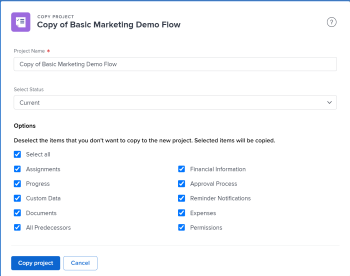

# Copiare un progetto

<!--
<(LINKED TO THE PRODUCT IN THE COPY PROJECT BOX)

-->

È possibile copiare un progetto anziché crearne uno da zero. È possibile copiare un solo progetto alla volta. Non è possibile copiare progetti in blocco.

>[!IMPORTANT]
>
>I seguenti elementi non vengono mai copiati da un progetto esistente a uno nuovo:
>
>* Problemi
>* Tariffe di fatturazione
>* Record fatturazione
>* Note
>* Ore
>* Predecessori tra progetti
>* Ore preventivate
>
>I seguenti elementi vengono sempre copiati da un progetto esistente a uno nuovo:
>
>* Attività
>* Modello
>* Rischi
>* Informazioni impostazione coda
>* Portfolio e programma
>* Scorecard
>* Informazioni predefinite attività (processo di approvazione predefinito attività, Forms personalizzato predefinito attività)
>
> Le date delle attività originali nei progetti vengono copiate nel nuovo progetto. È necessario modificare la data di inizio o di completamento del progetto (a seconda della modalità di programmazione) per aggiornare le date delle attività. I vincoli relativi alle attività potrebbero impedire la modifica delle date nel progetto.

## Requisiti di accesso

<!-- drafted for P&P:
<table style="table-layout:auto"> 
 <col> 
 <col> 
 <tbody> 
  <tr> 
   <td> 
Adobe Workfront plan*
 </td> 
   <td>Any</td> 
  </tr> 
  <tr> 
   <td> 
Adobe Workfront license*
 </td> 
   <td> 
Current license: Standard 
 
   Or
   
Legacy license: Plan 

   </td> 
  </tr> 
  <tr data-mc-conditions=""> 
   <td><strong>Access level configurations*</strong> </td> 
   <td> 
Edit access to Projects with ability to Create and Copy projects
 
<b>NOTE</b>
   
   If you still don't have access, ask your Workfront administrator if they set additional restrictions in your access level. For information on how a Workfront administrator can change your access level, see <a href="../../../administration-and-setup/add-users/configure-and-grant-access/create-modify-access-levels.md" class="MCXref xref">Create or modify custom access levels</a>.
 </td> 
  </tr> 
  <tr data-mc-conditions=""> 
   <td> 
<strong>Object permissions</strong> 
 </td> 
   <td> 
View permissions or higher to the project
 
For information on requesting additional access, see <a href="../../../workfront-basics/grant-and-request-access-to-objects/request-access.md" class="MCXref xref">Request access to objects </a>.
 </td> 
  </tr> 
 </tbody> 
</table>
-->
Devi avere i seguenti:

<table style="table-layout:auto"> 
 <col> 
 <col> 
 <tbody> 
  <tr> 
   <td> 
Piano Adobe Workfront*
 </td> 
   <td>Qualsiasi</td> 
  </tr> 
  <tr> 
   <td> 
Licenza Adobe Workfront*
 </td> 
   <td> 
Piano 
 </td> 
  </tr> 
  <tr data-mc-conditions=""> 
   <td><strong>Configurazioni del livello di accesso*</strong> </td> 
   <td> 
Modifica l'accesso ai progetti con la possibilità di creare  e copiare  progetti
 
<b>NOTA</b>

Se non disponi ancora dell’accesso, chiedi all’amministratore di Workfront se ha impostato restrizioni aggiuntive nel tuo livello di accesso. Per informazioni su come un amministratore di Workfront può modificare il tuo livello di accesso, consulta <a href="../../../administration-and-setup/add-users/configure-and-grant-access/create-modify-access-levels.md" class="MCXref xref">Creare o modificare livelli di accesso personalizzati</a>.
 </td>
</tr> 
  <tr data-mc-conditions=""> 
   <td> 
<strong>Autorizzazioni oggetto</strong> 
 </td> 
   <td> 
Visualizza autorizzazioni o versioni successive per il progetto
 
Per informazioni sulla richiesta di accesso aggiuntivo, vedere <a href="../../../workfront-basics/grant-and-request-access-to-objects/request-access.md" class="MCXref xref">Richiedere l'accesso agli oggetti </a>.
 </td> 
  </tr> 
 </tbody> 
</table>

&#42;Per conoscere il piano, il tipo di licenza o l&#39;accesso di cui si dispone, contattare l&#39;amministratore di Workfront.

## Copiare un singolo progetto

Quando si copia un progetto, alcune informazioni vengono copiate anche dal progetto originale al nuovo progetto. È inoltre possibile specificare quali elementi non devono essere copiati nel nuovo progetto durante il processo di copia.

Per copiare un progetto:

1. Vai al progetto da copiare e fai clic sull&#39;icona **Altro**  a destra del nome del progetto

   

   Oppure

   Vai a un elenco o a un report di progetti e seleziona un progetto, quindi fai clic sull&#39;icona **Altro**  nella parte superiore dell&#39;elenco.

   

1. Fai clic su **Copia**.

1. Aggiorna il nome del nuovo progetto.

   Per impostazione predefinita, il nuovo nome è **Copia di `<Original project name>`.**

   

1. Seleziona **Stato** per il nuovo progetto.

   Per impostazione predefinita, lo **Stato** corrisponde a quello del progetto originale.

1. (Facoltativo) Deseleziona gli elementi da non copiare nel nuovo progetto. La tabella seguente descrive cosa accade quando si deselezionano gli elementi:

   <table style="table-layout:auto"> 
    <col> 
    <col> 
    <tbody> 
     <tr> 
      <td role="rowheader">Seleziona tutto</td> 
      <td> 
Seleziona tutte le opzioni e cancella tutti i campi e gli oggetti elencati dal nuovo progetto.
 
<b>SUGGERIMENTO</b>

   Se si deseleziona <strong>Seleziona tutto</strong>, tutti gli elementi verranno deselezionati. 
 </td>
   </tr> 
     <tr> 
      <td role="rowheader">Assegnazioni</td> 
      <td>Rimuove tutte le assegnazioni di progetto e attività</td> 
     </tr> 
     <tr> 
      <td role="rowheader">Avanzamento</td> 
      <td>Rimuove lo stato di avanzamento di tutte le attività e vengono visualizzate come nuove. </td> 
     </tr> 
     <tr> 
      <td role="rowheader">Dati personalizzati</td> 
      <td> 
Rimuove le informazioni dal modulo personalizzato sul progetto, nonché le informazioni sui moduli personalizzati associati ai seguenti elementi:
 
       <ul> 
        <li>Attività</li> 
        <li>Spese</li> 
        <li> Documenti</li> 
       </ul> 
<b>NOTA</b>

   I moduli personalizzati rimangono allegati alle attività, alle spese, ai documenti e al progetto, ma le informazioni contenute nei campi personalizzati dei moduli non vengono copiate nel nuovo progetto. 
 </td>
   </tr> 
     <tr> 
      <td role="rowheader">Documenti</td> 
      <td> 
Rimuove tutti gli elementi presenti nella scheda documenti, incluse le versioni dei documenti, i documenti collegati e le cartelle.
 
Per impostazione predefinita, le bozze e le approvazioni dei documenti non possono essere copiate in un altro progetto. 
 </td> 
     </tr> 
     <tr> 
      <td role="rowheader">Tutti i predecessori</td> 
      <td> 
Rimuove tutte le relazioni predecessore tra le attività del progetto. 
 
<b>SUGGERIMENTO</b>

   I predecessori tra progetti non vengono mai trasferiti al nuovo progetto, indipendentemente dal fatto che sia selezionato o meno. 
 </td>
   </tr>

<tr> 
      <td role="rowheader">Ore preventivate</td> 
      <td> 
Rimuove le ore preventivate nell'area Pianificazione risorse del Business Case del progetto dal progetto copiato.

<b>NOTA</b>

Le ore preventivate utilizzando la Pianificazione scenario non vengono mai copiate nel nuovo progetto perché il nuovo progetto non è collegato a un&#39;iniziativa nella Pianificazione scenario. Per ulteriori informazioni, consulta <a href="../../../manage-work/projects/define-a-business-case/budget-resources-in-business-case-use-scenario-planner.md">Risorse budget nel caso di business utilizzando Scenario Planner</a>
</tr></td>
    <tr> 
      <td role="rowheader">Informazioni finanziarie</td> 
      <td> 
Rimuove le informazioni nelle seguenti aree: 
 
       <ul> 
        <li>Scheda secondaria Finanza del progetto</li> 
        <li> Vantaggio pianificato nel Business Case</li> 
        <li>Informazioni finanziarie da tutte le attività </li> 
       </ul> 
Per ulteriori informazioni sulla scheda secondaria Finanza progetto, vedere <a href="../../../manage-work/projects/project-finances/manage-project-finance-area.md" class="MCXref xref">Gestire le informazioni nell'area Finanza progetto</a>.
 </td> 
     </tr> 
     <tr> 
      <td role="rowheader">Processo di approvazione</td> 
      <td>Rimuove tutte le approvazioni associate alle attività o al progetto. </td> 
     </tr> 
     <tr> 
      <td role="rowheader">Notifiche promemoria</td> 
      <td> Rimuove gli Avvisi di Promemoria associati alle attività o al progetto. </td> 
     </tr> 
     <tr> 
      <td role="rowheader">Spese</td> 
      <td>Rimuove le spese associate alle attività o al progetto. </td> 
     </tr> 
     <tr> 
      <td role="rowheader">Autorizzazioni</td> 
      <td> Rimuove le autorizzazioni per tutti gli utenti sulle attività o sul progetto.</td> 
     </tr> 
    </tbody> 
   </table>

1. Fai clic su **Copia** per creare una copia del progetto.

   In questo modo viene creato un nuovo progetto simile a quello copiato.

   È possibile iniziare ad apportare modifiche al nuovo progetto copiato, ad esempio rivedere le assegnazioni delle attività o modificare le sequenze temporali.
