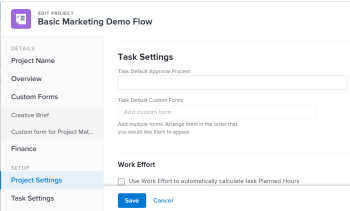

# Modifica progetti

<!--Audited: 01/2024-->

<!--The highlighted information on this page refers to functionality not yet generally available. It is available for all customers in the Preview environment and for a select group of customers in the Production environment.-->

<!--

***Linked to many articles,

The Resource Pools part also duplicates in the "Working with Resource Pools" article 

The Update Type section is also documented in Selecting the Project Update Type article

Keep the reference link to the other article that also documents the Update Type) 

(NOTE 2: information described here also exists in these articles:

** Project Overview area

**Manage project Finance area

If you need to update just one field, check to see if that field is also listed there and update in both places.)

-->

In Adobe Workfront puoi modificare un progetto con la frequenza necessaria. È consigliabile modificare i progetti in modo minimo dopo che lo stato è cambiato in Corrente, per evitare confusione inviando notifiche sulle modifiche all’intero team di progetto.

È consigliabile modificare un progetto quando il progetto è nello stato Pianificazione. Per informazioni sul team del progetto, vedi [Panoramica del team del progetto](../../../manage-work/projects/planning-a-project/project-team-overview.md).

## Requisiti di accesso

<table style="table-layout:auto"> 
 <col> 
 <col> 
 <tbody> 
  <tr> 
   <td role="rowheader">piano Adobe Workfront</td> 
   <td> 
Qualsiasi
 </td> 
  </tr> 
  <tr> 
   <td role="rowheader">Licenza Adobe Workfront</td> 
   <td>
Nuovo: Standard 
 
   Oppure
   
Corrente: Piano 
 </td> 
  </tr> 
  <tr> 
   <td role="rowheader">Configurazioni del livello di accesso</td> 
   <td> 
Modifica accesso ai progetti
 </td> 
  </tr> 
  <tr> 
   <td role="rowheader">Autorizzazioni oggetto</td> 
   <td> 
     
Gestire le autorizzazioni per un progetto 
 
     
 Per informazioni sulle autorizzazioni per i progetti, consulta <a href="../../../workfront-basics/grant-and-request-access-to-objects/share-a-project.md" class="MCXref xref">Condividere un progetto in Adobe Workfront</a>.
 
Per informazioni sulla richiesta di accesso aggiuntivo, consulta <a href="../../../workfront-basics/grant-and-request-access-to-objects/request-access.md" class="MCXref xref">Richiedi accesso agli oggetti </a>.
 </td> 
  </tr> 
 </tbody> 
</table>

Per ulteriori dettagli sulle informazioni contenute in questa tabella, vedere [Requisiti di accesso nella documentazione di Workfront](/help/quicksilver/administration-and-setup/add-users/access-levels-and-object-permissions/access-level-requirements-in-documentation.md).

## Limitazioni per la modifica dei progetti

Esistono alcune limitazioni che potrebbero impedire la modifica dei progetti.

Quando modifichi i progetti, tieni presente quanto segue:

* Non è possibile modificare i progetti in un processo di approvazione, ad eccezione del tempo di registrazione e della modifica dello stato.
* È possibile allegare documenti o modelli a un progetto con stato Completato, Inattivo o In attesa di approvazione solo se l&#39;amministratore di Workfront o un amministratore di gruppo ha abilitato questa funzionalità nell&#39;area Preferenze progetto. Per informazioni sull&#39;impostazione delle preferenze di progetto, vedere [Configurare le preferenze di progetto a livello di sistema](../../../administration-and-setup/set-up-workfront/configure-system-defaults/set-project-preferences.md).
* È possibile modificare solo le seguenti informazioni su un progetto con stato Dead (Inattivo) o Completato (Completato):

   * Modifica le spese esistenti.
   * Aggiungere, rimuovere o modificare moduli personalizzati.

## Modificare un progetto

Modificando un progetto è possibile modificare le informazioni e le impostazioni del progetto, nonché le attività e i problemi relativi al progetto.

Alcune impostazioni menzionate in questo articolo potrebbero essere modificate dal loro stato predefinito in base allo stato nel modello da cui è stato creato il progetto.

Per informazioni sulla modifica dei modelli, consulta [Modificare i modelli di progetto](../../../manage-work/projects/create-and-manage-templates/edit-templates.md).

Per informazioni sulla creazione di un progetto da un modello, consulta [Creare un progetto utilizzando un modello](/help/quicksilver/manage-work/projects/create-projects/create-project-from-template.md).

{{step1-to-projects}}

1. (Facoltativo) Fai clic su **Progetti a cui collaboro** o **Progetti di mia proprietà** nell’angolo in alto a destra per visualizzare i progetti di cui sei il proprietario o i progetti di cui fai parte del team di progetto.

   

   >[!NOTE]
   >
   >Gli amministratori di gruppi possono visualizzare e modificare i progetti del gruppo sia nell&#39;area Gruppi che nell&#39;area Progetti. Per ulteriori informazioni, consulta [Creare e modificare i progetti di un gruppo](../../../administration-and-setup/manage-groups/work-with-group-objects/create-and-modify-a-groups-projects.md).

1. Fai clic sul nome del progetto da modificare per aprire la pagina del progetto.

1. (Facoltativo) Per modificare informazioni limitate su un progetto, fai clic su **Dettagli progetto** nel pannello a sinistra. Se si desidera modificare tutte le informazioni sul progetto, procedere al passaggio 5. <!--accurate?!-->

   

   >[!NOTE]
   >
   >A seconda della modalità di modifica del modello di layout da parte dell’amministratore di Workfront o del gruppo, i campi nell’area Dettagli progetto potrebbero essere ridisposti o non visualizzati. Per informazioni, consulta [Personalizzare la visualizzazione Dettagli utilizzando un modello di layout](../../../administration-and-setup/customize-workfront/use-layout-templates/customize-details-view-layout-template.md).

   Per modificare le informazioni nella sezione Dettagli, effettuare le seguenti operazioni:

   1. (Facoltativo) Fai clic su **Comprimi tutto** icona   nell&#39;angolo superiore destro per comprimere tutte le aree.
   1. (Facoltativo e condizionale) Quando un&#39;area è compressa, fare clic sul pulsante **freccia rivolta verso destra**  accanto a ogni area per espandere l&#39;area da modificare.
   1. Per ulteriori informazioni sulla modifica delle informazioni nella scheda Project Details (Dettagli progetto), vedere gli articoli seguenti:

      * [Gestire le informazioni nell’area Panoramica progetto](../../../manage-work/projects/manage-projects/understand-project-overview-area.md)
      * [Gestire le informazioni nell&#39;area Finanza progetto](../../../manage-work/projects/project-finances/manage-project-finance-area.md)

   1. (Facoltativo) Per allegare un modulo personalizzato, inizia a digitare il nome del modulo nel **Aggiungi modulo personalizzato** , quindi selezionarlo quando viene visualizzato nell&#39;elenco, quindi fare clic su **Salva modifiche**.
   1. (Facoltativo) Fai clic su **Esporta** icona  per esportare le informazioni sulla panoramica e sui moduli personalizzati in un file PDF, fai clic su **Esporta**. Selezionare una delle opzioni seguenti:

      * Seleziona tutto (viene visualizzato solo se è allegato almeno un modulo personalizzato)
      * Panoramica
      * Nome di uno o più moduli personalizzati

      Il file PDF viene scaricato nel computer.

      

      Per ulteriori informazioni, consulta [Esportare moduli personalizzati e dettagli oggetto](../../../workfront-basics/work-with-custom-forms/export-custom-forms-details.md).

   Per informazioni sui campi visibili nella sezione Dettagli progetto, continuare a modificare il progetto nella casella Modifica progetto come descritto di seguito.
1. Per modificare tutte le informazioni sul progetto, fai clic su **Altro** menu  accanto al nome del progetto, quindi fai clic su **Modifica**.

   Oppure

   Da un elenco di progetti, seleziona uno o più progetti, quindi fai clic su **Modifica** icona  nella parte superiore dell’elenco.

   Per ulteriori informazioni sulla modifica in blocco di progetti, consulta la sezione [Modifica progetti in blocco](#edit-projects-in-bulk) in questo articolo.

   Il **Modifica Progetto** viene visualizzata la casella.

   >[!IMPORTANT]
   >
   >Per visualizzare l’opzione Modifica, è necessario disporre delle autorizzazioni di gestione per il progetto.

   Tutti i campi del progetto sono disponibili nella casella Modifica progetto e sono raggruppati per le aree elencate nel pannello a sinistra.

   >[!NOTE]
   >
   >A seconda della modalità di modifica del modello di layout da parte dell&#39;amministratore di Workfront o del gruppo, le aree nel pannello sinistro della casella Modifica progetto o i campi elencati in tali aree potrebbero essere ridisposti o non essere visualizzati. Per informazioni, consulta [Personalizzare la visualizzazione Dettagli utilizzando un modello di layout](../../../administration-and-setup/customize-workfront/use-layout-templates/customize-details-view-layout-template.md).

1. (Condizionale) Se hai selezionato **Altro** menu e quindi **Modifica**, aggiorna le informazioni in una delle seguenti aree elencate nel pannello a sinistra:

   * [Nome progetto](#project-name)
   * [Panoramica](#overview)
   * [Moduli personalizzati](#custom-forms)
   * [Finanza](#finance)
   * [Impostazioni progetto](#project-settings)
   * [Impostazioni attività](#task-settings)
   * [Impostazioni problema](#issue-settings)
   * [Accesso](#access)

   >[!NOTE]
   >
   >A seconda di come l’amministratore di Workfront configura il modello di layout per l’area Dettagli del progetto, le sezioni e i campi nella casella Modifica progetto potrebbero essere diversi nell’ambiente in uso. Per informazioni, consulta [Personalizzare la visualizzazione Dettagli utilizzando un modello di layout](../../../administration-and-setup/customize-workfront/use-layout-templates/customize-details-view-layout-template.md).

### Nome progetto {#project-name}

1. Inizia a modificare il progetto come descritto in precedenza.
1. Clic **Nome progetto** nel pannello a sinistra.

   

1. Aggiorna il nome del progetto.

   Non è possibile modificare il nome del progetto quando si modificano progetti in blocco.

### Panoramica {#overview}

1. Inizia a modificare il progetto come descritto in precedenza.
1. Clic **Panoramica** nel pannello a sinistra.

   

1. Aggiorna le seguenti informazioni sul progetto:

   <table style="table-layout:auto"> 
      <col> 
      <col> 
      <tbody> 
      <tr> 
         <td role="rowheader"><strong>Descrizione</strong> </td> 
         <td> 
Aggiungi ulteriori informazioni sul progetto.
 </td> 
      </tr> 
      <tr> 
         <td role="rowheader"><strong>Stato</strong> </td> 
         <td> 
Seleziona lo stato del progetto. Non puoi contrassegnare un progetto come Completo prima che tutte le attività e i problemi siano stati completati. Per informazioni sugli stati dei progetti, vedi <a href="../../../administration-and-setup/customize-workfront/creating-custom-status-and-priority-labels/project-statuses.md" class="MCXref xref">Accedere all’elenco degli stati del progetto di sistema</a>
 </td> 
      </tr> 
      <tr> 
         <td role="rowheader"><strong>Priorità</strong> </td> 
         <td> 
 
Questo è solo un flag visivo per te che ti consente di assegnare la priorità ai tuoi progetti.
 
A seconda delle Preferenze di progetto selezionate dall'amministratore di Workfront, i nomi delle priorità potrebbero essere diversi. Per ulteriori informazioni sulla modifica delle priorità, consulta <a href="../../../administration-and-setup/customize-workfront/creating-custom-status-and-priority-labels/create-customize-priorities.md" class="MCXref xref">Creare e personalizzare le priorità</a>
 
 </td> 
      </tr> 
      <tr> 
         <td role="rowheader"><strong>URL</strong> </td> 
         <td> 
Specifica un collegamento web relativo alle informazioni sul progetto.
 </td> 
      </tr> 
      <tr> 
         <td role="rowheader"><strong>Tipo di condizione</strong> </td> 
         <td> 
Seleziona uno dei seguenti tipi di condizioni: 
         <ul> 
         <li><strong>Manuale:</strong> Il proprietario del progetto imposta manualmente la condizione sul progetto.</li> 
         <li><strong>Stato avanzamento:</strong> Workfront imposta automaticamente la condizione in base allo stato di avanzamento delle attività nel percorso critico. Per ulteriori informazioni sullo stato di avanzamento, consulta <a href="../../../manage-work/tasks/task-information/task-progress-status.md" class="MCXref xref">Panoramica sullo stato di avanzamento dell’attività</a>.</li> 
         </ul>
Il tuo amministratore Workfront o un amministratore di gruppo seleziona il valore predefinito per il calcolo della condizione dei progetti per il sistema o il tuo gruppo. Per informazioni sull'impostazione delle impostazioni predefinite del progetto, vedere <a href="../../../administration-and-setup/set-up-workfront/configure-system-defaults/set-project-preferences.md" class="MCXref xref">Configurare le preferenze di progetto a livello di sistema</a>. 

 </td> 
      </tr> 
      <tr> 
         <td role="rowheader"><strong>Condizione</strong> </td> 
         <td> 
 
(viene visualizzato solo dopo aver selezionato <strong>Manuale</strong> per <strong>Tipo di condizione</strong>): seleziona una condizione per indicare come procede il progetto. 
 
Per informazioni su come impostare automaticamente o manualmente le Condizioni del progetto, vedere <a href="../../../manage-work/projects/manage-projects/project-condition-and-condition-type.md" class="MCXref xref">Panoramica della condizione e del tipo di condizione del progetto</a>
 
 </td> 
      </tr> 
      <tr> 
         <td role="rowheader"><strong>Modalità Schedule</strong> </td> 
         <td> 
Specifica se il progetto è programmato dalla data di inizio o dalla data di completamento. Questa selezione determina le date pianificate delle attività del progetto. 
         <ul> 
         <li><strong>Data di inizio</strong>: per impostazione predefinita, la prima attività del progetto ha la stessa data di inizio pianificata del progetto. Per informazioni sulla data di inizio pianificata dell'attività, vedere <a href="../../../manage-work/tasks/task-information/task-planned-start-date.md" class="MCXref xref">Panoramica della data di inizio pianificata dell'attività</a>. La sequenza temporale del progetto viene calcolata a partire dalla data di inizio e la data di completamento del progetto viene calcolata dal sistema in base alla durata di tutte le attività. </li> 
         <li><strong>Data di completamento</strong>: l’ultima attività del progetto ha la stessa data di completamento pianificata del progetto. La sequenza temporale del progetto viene calcolata a partire dalla data di completamento e la data di inizio del progetto viene calcolata dal sistema, sottraendo la durata di tutte le attività dalla data di completamento del progetto. </li> 
         </ul>
Il tuo amministratore Workfront o un amministratore di gruppo seleziona l'impostazione predefinita della modalità di pianificazione per il sistema o il gruppo. Per informazioni sull'impostazione delle impostazioni predefinite del progetto, vedere <a href="../../../administration-and-setup/set-up-workfront/configure-system-defaults/set-project-preferences.md" class="MCXref xref">Configurare le preferenze di progetto a livello di sistema</a>.

 </td> 
      </tr> 
      <tr> 
         <td role="rowheader"><strong>Data e ora di inizio pianificate</strong> </td> 
         <td> 
 
Specifica la data in cui fai clic su <strong>Pianifica dalla data di inizio</strong>.  
 
Campo di sola lettura quando si seleziona <strong>Pianifica dalla data di completamento</strong>. 
 
 </td> 
      </tr> 
      <tr> 
         <td role="rowheader"><strong>Data e ora di completamento pianificate</strong> </td> 
         <td> 
Specifica la data in cui fai clic su <strong>Pianifica dalla data di completamento</strong>. 
 
Campo di sola lettura quando si seleziona <strong>Pianifica dalla data di inizio</strong>. 
 </td> 
      </tr> 
      <tr> 
         <td role="rowheader"><strong>Portfolio</strong></td> 
         <td>Indica un Portfolio a cui appartiene il progetto. È necessario creare un Portfolio prima che venga visualizzato nell'elenco a discesa. Solo i portfolio attivi possono essere associati a un progetto. Per ulteriori informazioni sulla creazione dei portfolio, consulta <a href="../../../manage-work/portfolios/create-and-manage-portfolios/create-portfolios.md" class="MCXref xref">Creare un portfolio </a>.</td> 
      </tr> 
      <tr> 
         <td role="rowheader"><strong>Programma</strong></td> 
         <td> 
Se hai selezionato un Portfolio per il progetto, specifica un Programma per il progetto. Alcuni Portfoli potrebbero non disporre di programmi. È innanzitutto necessario creare un programma prima che venga visualizzato in questo elenco a discesa. Solo i programmi attivi possono essere associati a un progetto. 
 
Per ulteriori informazioni sulla creazione di programmi, vedere <a href="../../../manage-work/portfolios/create-and-manage-programs/create-program.md" class="MCXref xref">Creare un programma</a>.
 </td> 
      </tr> 
      <tr> 
         <td role="rowheader"><strong>Gruppo</strong></td> 
         <td> 
 
Specifica il nome del gruppo associato al progetto. 
Questo campo è obbligatorio. Non puoi avere un progetto che non è associato a un gruppo. 
 
Per assicurarsi di selezionare il gruppo corretto, posizionare il puntatore del mouse su di esso e fare clic sull'icona delle informazioni  che viene visualizzato accanto ad esso. In questo modo viene visualizzata una descrizione del gruppo contenente informazioni sul gruppo stesso, ad esempio la gerarchia dei gruppi al di sopra del gruppo e i relativi amministratori.
 Per impostazione predefinita, quando viene creato un progetto, viene automaticamente associato uno dei seguenti gruppi, a meno che non si specifichi un gruppo diverso:
 
         <ul> 
         <li> 
Quando il progetto viene creato dall’area Progetti, al progetto viene associato il Gruppo Predefinito dell’autore del progetto. 
 
Ciò si verifica anche quando il progetto viene creato dalla sezione Progetti di un portfolio o di un programma.
 </li> 
         <li> 
Quando il progetto viene creato dalla pagina principale di un gruppo nell’area Configura, tale gruppo viene associato al progetto.
 </li> 
         </ul> 
 
  
 
         
<b>NOTE</b>

       &lt;ul>
       &lt;li>&lt;p>Se il progetto o le relative attività o problemi sono associati a uno Stato personalizzato a livello di gruppo, la modifica del gruppo del progetto potrebbe causare la modifica dello Stato del progetto, delle attività o dei problemi in modo che corrisponda al nuovo gruppo.&lt;/p>&lt;/li>
       &lt;li>&lt;p>Se il progetto o le relative attività o problemi sono già associati a un processo di approvazione a livello di gruppo che utilizza stati personalizzati a livello di gruppo, la modifica del gruppo potrebbe creare un conflitto tra gli stati di approvazione del gruppo precedente e quelli esistenti a livello di sistema.&lt;/p>
       &lt;p>Prima di aggiornare il gruppo, è consigliabile rimuovere i processi di approvazione a livello di gruppo sul progetto, le relative attività o i problemi.&lt;/p>
       &lt;p>Per informazioni sulla creazione di processi di approvazione a livello di gruppo, vedere &lt;a href=&quot;../../../administration-and-setup/manage-groups/work-with-group-objects/create-and-modify-groups-approval-processes.md&quot; class=&quot;MCXref xref&quot;>Processi di approvazione a livello di gruppo&lt;/a>.&lt;/p>
       &lt;p>Per informazioni sulla creazione di uno stato personalizzato a livello di gruppo, vedere &lt;a href=&quot;../../../administration-and-setup/manage-groups/manage-group-statuses/create-or-edit-a-group-status.md&quot; class=&quot;MCXref xref&quot;>Creazione o modifica dello stato di un gruppo&lt;/a>&lt;/p>&lt;/li>&lt;/ul> &lt;/td>
   </tr> 
      <tr> 
         <td role="rowheader"><strong>Azienda</strong> </td> 
         <td> 
Specifica una società associata al progetto. È necessario creare una società prima di associarla a un progetto. Solo le società attive possono essere associate a un progetto. Per informazioni sulla creazione di società, consulta <a href="../../../administration-and-setup/set-up-workfront/organizational-setup/create-and-edit-companies.md" class="MCXref xref">Creare e modificare le società</a>.
 </td> 
      </tr> 
      <tr> 
         <td role="rowheader"><strong>Proprietario progetto</strong> </td> 
         <td> 
Inizia a digitare il nome di un utente per aggiungerlo al progetto, quindi selezionalo quando viene visualizzato nell’elenco. L’utente viene aggiunto al team del progetto e riceve automaticamente le autorizzazioni di gestione per il progetto. L'utente designato come proprietario del progetto deve essere un utente attivo di Workfront.

         </td> 
      </tr> 
      <tr> 
         <td role="rowheader"><strong>Sponsor Progetto</strong> </td> 
         <td> 
Inizia a digitare il nome di un utente per aggiungerlo al progetto, quindi selezionalo quando viene visualizzato nell’elenco. L’utente viene aggiunto al team del progetto e riceve automaticamente le autorizzazioni di visualizzazione per il progetto. L'utente designato come sponsor del progetto deve essere un utente attivo di Workfront. 
 </td> 
      </tr> 
      <tr> 
         <td role="rowheader"><strong>Responsabile risorse</strong> </td> 
         <td> 
 Inizia a digitare i nomi degli utenti per aggiungerli al progetto, quindi selezionali quando vengono visualizzati nell’elenco. Gli utenti vengono aggiunti al team di progetto e ricevono automaticamente le autorizzazioni di gestione per il progetto, oltre ad assegnare risorse alle attività e ai problemi relativi al progetto. Gli utenti mantengono le autorizzazioni di gestione sul progetto anche quando vengono rimossi dal campo Responsabile risorse. È possibile specificare più di un Responsabile risorse. 
 </td> 
      </tr>

   <tr> 
         <td role="rowheader"><strong>Iniziatore problema convertito</strong> </td> 
         <td> 
 Per impostazione predefinita, questo campo viene compilato automaticamente con il nome dell’utente che ha creato il problema da cui è stato convertito il progetto. In Workfront è possibile aggiornare questo nome con il nome di qualsiasi altro utente.  
 </td> 
      </tr>

   </tbody> 
      </table>

   >[!TIP]
   >
   >Quando aggiorni i campi Proprietario progetto, Sponsor progetto e Responsabile risorse, osserva l’avatar, il Ruolo principale dell’utente o il suo indirizzo e-mail per distinguere gli utenti con nomi identici.
   >
   >Gli utenti devono essere associati ad almeno una mansione per visualizzarla quando vengono aggiunti.
   >
   >Per consentire agli utenti di visualizzare le e-mail degli utenti, nel proprio livello di accesso deve essere abilitata l’impostazione Visualizza informazioni di contatto. Per informazioni, consulta [Concedere l’accesso agli utenti](../../../administration-and-setup/add-users/configure-and-grant-access/grant-access-other-users.md).

1. (Facoltativo) Continua a modificare le sezioni seguenti, a seconda delle informazioni che desideri modificare

   Oppure

   Fai clic su **Salva**.

### Moduli personalizzati {#custom-forms}

A seconda del livello di accesso e dell’autorizzazione sul progetto, esistono i seguenti scenari:

* Se non disponi delle autorizzazioni Modifica modulo personalizzato per il progetto, non puoi modificare i campi in nessuno dei moduli personalizzati allegati. Puoi visualizzare solo i campi nei moduli personalizzati allegati al progetto.
* Se si dispone dell&#39;accesso Visualizzazione (e non Modifica) a una sezione di un modulo personalizzato, non è possibile modificare i campi di tale sezione.
* Se non hai accesso a una sezione in uno dei moduli personalizzati allegati al progetto, la sezione non viene visualizzata nella casella Modifica progetto.

Quando selezioni più di un progetto per modificarli in blocco, esistono i seguenti scenari:

* Se non disponi delle autorizzazioni Modifica modulo personalizzato per almeno uno dei progetti selezionati, non puoi modificare i campi in nessuno dei moduli personalizzati allegati. È possibile visualizzare solo i campi nei moduli personalizzati allegati
* Se si dispone dell&#39;accesso Visualizzazione (e non Modifica) a una sezione di un modulo personalizzato, non è possibile modificare i campi di tale sezione. Puoi visualizzare solo i campi di quella sezione.
* Se non hai accesso a una sezione in uno dei moduli personalizzati allegati ad almeno uno dei progetti, la sezione non viene visualizzata nella casella Modifica progetti.
* Se sono presenti campi obbligatori in uno dei moduli personalizzati allegati a tutti i progetti e si seleziona un campo senza modificarlo effettivamente, è necessario ignorare le modifiche apportate a tale campo o aggiungervi informazioni prima di poter salvare i progetti selezionati. Se non selezioni alcun campo obbligatorio, puoi salvare i progetti selezionati anche se il campo obbligatorio è vuoto.

Per informazioni sull’accesso ai moduli personalizzati, consulta i seguenti articoli:

* [Condividere un modulo personalizzato](../../../administration-and-setup/customize-workfront/create-manage-custom-forms/share-access-to-a-custom-form.md)
* [Aggiungere un’interruzione di sezione a un modulo personalizzato](../../../administration-and-setup/customize-workfront/create-manage-custom-forms/add-a-section-break-to-a-custom-form.md)

Per modificare le informazioni sui moduli personalizzati durante la modifica di un progetto:

1. Inizia a modificare il progetto come descritto in precedenza.
1. Clic **Forms personalizzato** nel pannello a sinistra.

   

1. Fai clic su **Aggiungi modulo personalizzato** e selezionare un modulo dall&#39;elenco per allegarlo al progetto. Per impostazione predefinita, i primi 40 moduli vengono visualizzati in ordine alfabetico. Se il modulo non viene visualizzato nell&#39;elenco, iniziare a digitarne il nome e selezionarlo quando viene visualizzato nell&#39;elenco.

   >[!NOTE]
   >
   >Devi creare i moduli personalizzati prima che siano disponibili per la selezione in questo campo. Nell&#39;elenco vengono visualizzati solo i moduli personalizzati attivi. Per ulteriori informazioni sulla creazione di moduli personalizzati, consulta [Creare o modificare un modulo personalizzato](../../../administration-and-setup/customize-workfront/create-manage-custom-forms/create-or-edit-a-custom-form.md). Puoi aggiungere fino a dieci moduli personalizzati a un progetto.

1. (Condizionale) Se hai allegato un modulo personalizzato al progetto, modifica tutti i campi del modulo. È necessario specificare tutti i campi obbligatori prima di salvare il progetto.
1. (Facoltativo) Fai clic su **Icona X** a destra del nome di un modulo personalizzato per rimuoverlo, quindi fai clic su **Rimuovi**.
1. (Facoltativo) Continua a modificare le sezioni seguenti, a seconda delle informazioni che desideri modificare

   Oppure

   Fai clic su **Salva**.

### Finanz {#finance}

A seconda del livello di accesso e dell’autorizzazione sul progetto, esistono i seguenti scenari:

* Se si dispone dell&#39;accesso di visualizzazione ai dati finanziari e delle autorizzazioni di visualizzazione dei dati finanziari sul progetto, è possibile visualizzare solo i campi nella sezione Finanza. Non è possibile modificare i campi in questa sezione.
* Se si dispone dell&#39;accesso in modifica ai dati finanziari e delle autorizzazioni Gestisci dati finanziari sul progetto, è possibile aggiornare i campi in questa sezione.

Quando selezioni più di un progetto per modificarli in blocco e, esistono i seguenti scenari:

* Se si seleziona almeno un progetto per il quale si dispone delle autorizzazioni Visualizza contabilità (anziché Gestisci contabilità), è possibile visualizzare solo i campi di questa sezione per tutti i progetti selezionati. Non è possibile modificare in blocco i campi nella sezione Finanza.
* Se si seleziona almeno un progetto per il quale non si dispone di autorizzazioni per la contabilità, questa sezione non viene visualizzata.

Per modificare i campi nell&#39;area Finanza:

1. Inizia a modificare il progetto come descritto in precedenza.
1. Clic **Finanza** nel pannello a sinistra.

   

1. Aggiornare le seguenti informazioni finanziarie per il progetto:

   <table style="table-layout:auto"> 
    <col> 
    <col> 
    <tbody> 
     <tr data-mc-conditions=""> 
      <td role="rowheader"><strong>Valuta</strong> </td> 
      <td> 
 
Specifica la valuta per il progetto, se è diversa da quella predefinita del sistema. Non puoi cambiare la valuta di un progetto se sono già presenti informazioni finanziarie. Questo campo non è visibile se nel sistema è presente solo la valuta predefinita. 
 
Per ulteriori informazioni sulla valuta, consulta <a href="../../../administration-and-setup/manage-workfront/exchange-rates/set-up-exchange-rates.md" class="MCXref xref">Imposta tassi di cambio</a>. 
 
 </td> 
     </tr> 
     <tr> 
      <td role="rowheader"><strong>Budget</strong> </td> 
      <td> Specifica un Budget per il progetto. </td> 
     </tr> 
     <tr> 
      <td role="rowheader"><strong>Metodo indice prestazioni</strong> </td> 
      <td> 
Seleziona <b>Basato su Ore</b>, o <b>Basato su Costo</b> per indicare se le metriche Valore guadagnato del progetto (ad esempio Indice prestazioni costi o Costo effettivo stimato) vengono calcolate utilizzando ore o costi. 
 
Per ulteriori informazioni sul metodo dell'indice delle prestazioni, vedere <a href="../../../manage-work/projects/project-finances/set-pim.md" class="MCXref xref">Impostare il metodo PIM (Performance Index Method)</a>. 
 
Il tuo amministratore Workfront o un amministratore di gruppo seleziona l'impostazione predefinita del metodo di indicizzazione delle prestazioni per il sistema o il gruppo. Per informazioni sull'impostazione delle impostazioni predefinite del progetto, vedere <a href="../../../administration-and-setup/set-up-workfront/configure-system-defaults/set-project-preferences.md" class="MCXref xref">Configurare le preferenze di progetto a livello di sistema</a>.
 </td> 
     </tr> 
     <tr> 
      <td role="rowheader"><strong>Stima al completamento</strong> </td> 
      <td> 
 
Specifica come Workfront deve calcolare la stima al completamento (CES). 

      Selezionare una delle opzioni seguenti: 
      <ul><li><b>Calcola a livello di progetto</b></li>
      <li><b>Esegui il rollup da attività/sottoattività</b></li> </ul>
      
Per ulteriori informazioni sul calcolo di Stima al completamento, vedere <a href="../../../manage-work/projects/project-finances/calculate-eac.md" class="MCXref xref">Calcola stima al completamento (EAC)</a>.
 
L'amministratore del Workfront o del gruppo seleziona l'impostazione predefinita Stima al completamento per il sistema o il gruppo. Per informazioni sull'impostazione delle impostazioni predefinite del progetto, vedere <a href="../../../administration-and-setup/set-up-workfront/configure-system-defaults/set-project-preferences.md" class="MCXref xref">Configurare le preferenze di progetto a livello di sistema</a>.
 
 </td> 
     </tr> 
     <tr> 
      <td role="rowheader"><strong>Vantaggio pianificato</strong> </td> 
      <td> 
Stimare il beneficio pianificato del progetto. Viene utilizzato nel caso aziendale del progetto e nell’Ottimizzatore Portfolio. Per ulteriori informazioni sui benefici pianificati di un progetto, consulta <a href="../../../manage-work/projects/project-finances/project-planned-benefit.md" class="MCXref xref">Panoramica del beneficio pianificato del progetto</a>. Il beneficio pianificato di un progetto viene preso in considerazione quando viene calcolato il valore netto di un progetto. 
 
Per ulteriori informazioni, consulta <a href="../../../manage-work/portfolios/portfolio-optimizer/manage-projects-in-portfolio-optimizer.md" class="MCXref xref">Gestire i progetti in Portfoli Optimizer</a> . 
 </td> 
     </tr> 
     <tr> 
      <td role="rowheader"><strong>Vantaggio effettivo</strong> </td> 
      <td> 
Stimare il beneficio effettivo del progetto. Si tratta di un importo in valuta che rappresenta il vantaggio che l'azienda o il reparto otterrebbe dopo il completamento del progetto. 
 </td> 
     </tr> 
      <tr> 
      <td role="rowheader"><strong>Costo fisso</strong> </td> 
      <td> 
Specificare il Costo fisso per il progetto. Questo valore è diverso dal costo manodopera che deriva dalle ore del progetto e dal costo spesa che deriva dall'importo delle spese del progetto. Il Costo Fisso di un progetto viene preso in considerazione nel calcolo del Valore Netto di un progetto e fa parte del Costo Preventivato. 
 </td> 
     </tr> 
     <tr> 
      <td role="rowheader"><strong>Reddito Fisso</strong> </td> 
      <td> 
Specifica il Reddito Fisso per il progetto. 
 </td> 
     </tr> 
    </tbody> 
   </table>

1. (Facoltativo) Continua a modificare le sezioni seguenti, a seconda delle informazioni che desideri modificare.

   Oppure

   Fai clic su **Salva**.

### Impostazione progetto {#project-settings}

1. Inizia a modificare il progetto come descritto in precedenza.
1. Clic **Impostazioni progetto** nel pannello a sinistra.

   

1. Aggiorna le seguenti informazioni:

   <table style="table-layout:auto"> 
      <col> 
      <col> 
      <tbody> 
      <tr> 
      <td role="rowheader"><strong>Percorso milestone</strong> </td> 
       <td> 
Seleziona un Percorso milestone per il progetto. Nell'elenco vengono visualizzati solo i percorsi milestone attivi.
 
Per ulteriori informazioni sui percorsi delle milestone, vedi <a href="../../../administration-and-setup/customize-workfront/configure-approval-milestone-processes/create-milestone-path.md" class="MCXref xref">Creare un percorso milestone</a>.
 </td> 
      </tr> 
      <tr> 
      <td role="rowheader"><strong>Modalità di completamento</strong> </td> 
      <td> 
Controlla il modo in cui il progetto viene contrassegnato come Completato. Selezionare una delle opzioni seguenti: 
       <ul> 
       <li>
<strong>Automatico</strong>: il progetto è contrassegnato come Completo quando tutte le attività e i problemi sono completati.

Lo stato del progetto viene automaticamente modificato in Completo solo quando lo stato del progetto è Corrente al completamento delle attività. 
</li> 
       <li><strong>Manuale</strong>: quando tutte le attività e i problemi sono stati completati, devi selezionare manualmente lo stato Completo per il progetto.</li> 
       </ul>
 </td> 
       </tr> 
       <tr> 
       <td role="rowheader"><strong>Modalità di completamento riepilogo</strong></td> 
       <td> 
Controlla la modalità di contrassegnazione delle attività padre come Completate. Selezionare una delle opzioni seguenti: 
       <ul> 
       <li><strong>Automatico</strong>: le attività padre sono contrassegnate come completate e aggiornano automaticamente la loro percentuale di completamento, man mano che le attività figlio vengono completate e la percentuale di completamento degli elementi figlio viene aggiornata. </li> 
       <li><strong>Manuale</strong>: devi aggiornare manualmente la percentuale di completamento e lo stato delle attività principali, indipendentemente dalle modifiche apportate alle attività secondarie. Ciò consente di contrassegnare un'attività padre completata anche quando le sottoattività sono incomplete. </li> 
       </ul>
 </td> 
       </tr> 
       <tr> 
       <td role="rowheader"><strong>Tipo di aggiornamento</strong></td> 
       <td> 
Controlla quando le modifiche apportate alla sequenza temporale del progetto vengono salvate nel progetto o nelle attività padre. Ad esempio, le seguenti modifiche al progetto attivano un aggiornamento della timeline del progetto: 
       <ul> 
       <li>Aggiornare le date delle attività</li> 
       <li>Modificare le relazioni dei predecessori delle attività</li> 
       <li>
Consente di modificare le relazioni padre-figlio, aggiungendo o rimuovendo assegnazioni e modificando il vincolo attività o il tipo di durata.

Quando le attività vengono aggiornate, gli oggetti padre (attività padre o progetto) vengono aggiornati all'ora indicata dal Tipo di aggiornamento. 

Se gli oggetti padre non vengono aggiornati immediatamente dopo la modifica quando si seleziona "Automatico e in modifica" o "Modifica solo" Tipo di aggiornamento, aggiornare la pagina

Selezionare una delle opzioni seguenti: 

- <strong>Automatico e in caso di modifica</strong> (impostazione predefinita): la sequenza temporale del progetto viene aggiornata ogni volta che si verifica una modifica nel progetto o in un altro progetto da cui dipende il progetto (Alla modifica). Anche la timeline del progetto viene aggiornata ogni notte (Automatico).

Si tratta dell’impostazione consigliata per questo campo, in quanto garantisce che il progetto sia sempre aggiornato.

Quando si esegue un'azione su un'attività o un progetto che attiva un ricalcolo della sequenza temporale, tutte le date disponibili vengono visualizzate immediatamente, consentendo di continuare a lavorare. Nei progetti con più di 100 attività, le date che richiedono calcoli più lunghi vengono visualizzate brevemente come punto interrogativo (tra 1 e 5 secondi o fino a un minuto per i progetti di grandi dimensioni). Questo indica che il ricalcolo non è ancora terminato e che le date sono soggette a modifiche.

- <strong>Solo modifica</strong>: la timeline del progetto viene aggiornata ogni volta che si verifica una modifica nel progetto o in un altro progetto da cui dipende il progetto. È possibile selezionare questa opzione se le modifiche si verificano raramente nel progetto o in altri progetti da cui dipende la sequenza temporale.

- <strong>Solo Automatico</strong>: la timeline del progetto viene aggiornata ogni notte; non viene aggiornata immediatamente dopo le modifiche.

È possibile selezionare questa opzione se si verificano molte modifiche ogni giorno nel progetto o in altri progetti da cui dipende la sequenza temporale. Tuttavia, tieni presente che hai scelto questa impostazione, in quanto il progetto non verrà aggiornato contemporaneamente alle modifiche apportate.

- <strong>Solo manuale</strong>: la timeline del progetto viene aggiornata solo quando selezioni l’opzione Ricalcola timeline. Per ulteriori informazioni sul ricalcolo manuale della sequenza temporale del progetto, consulta <a href="../../../manage-work/projects/manage-projects/recalculate-project-timeline.md" class="MCXref xref">Ricalcolare i timeline dei progetti</a>. 

È possibile selezionare questa opzione se si apportano contemporaneamente molte modifiche al progetto e si desidera che il ricalcolo della sequenza temporale venga eseguito dopo che tutte le modifiche sono state apportate (anziché dopo ogni singola modifica).
</li> 
       </ul>
 </td> 
       </tr> 
       <tr> 
       <td role="rowheader"><strong>Pianificazione</strong> </td> 
       <td> 
Seleziona una pianificazione per il progetto. Questa deve essere la stessa pianificazione assegnata alla maggior parte delle persone che lavorano sul progetto. È necessario creare una pianificazione prima di assegnarla a un progetto o a un utente. Se nel sistema non sono state create programmazioni personalizzate, viene selezionata la Programmazione predefinita.
 
Per ulteriori informazioni sulla creazione di pianificazioni, vedere <a href="../../../administration-and-setup/set-up-workfront/configure-timesheets-schedules/create-schedules.md" class="MCXref xref">Creare una pianificazione</a>. 
 </td> 
       </tr> 
       <tr> 
       <td role="rowheader"><strong>Indisponibilità utente</strong> </td> 
       <td> 
Determina se l'indisponibilità dell'assegnatario principale di un'attività determina l'adeguamento delle date pianificate dell'attività nel progetto. 

Il tuo amministratore Workfront o un amministratore di gruppo seleziona l'impostazione predefinita per il sistema o il tuo gruppo. Per informazioni sull'impostazione delle impostazioni predefinite del progetto, vedere <a href="../../../administration-and-setup/set-up-workfront/configure-system-defaults/set-project-preferences.md" class="MCXref xref">Configurare le preferenze di progetto a livello di sistema</a>. 

Selezionare una delle opzioni seguenti: - <strong>Considerare l'indisponibilità dell'utente durante l'attività</strong>: quando si seleziona questa opzione, le date pianificate delle attività vengono modificate in base all’indisponibilità dell’assegnatario principale dell’attività, se tale indisponibilità si verifica durante la durata dell’attività. 

Ad esempio, se un'attività con un vincolo Il più presto possibile è programmata per iniziare il 1° giugno e completare il 3 giugno e l'assegnatario principale ha il 2 giugno contrassegnato per l'indisponibilità, quando questa selezione è abilitata le date pianificate per l'attività sono dal 1° giugno al 4 giugno. A seconda del vincolo attività, esistono i seguenti scenari: 
 
       <ul> 
       <li>Per i vincoli delle attività relativi alla pianificazione da una data di inizio (il più presto possibile, il più presto possibile, il prima ora disponibile, l'inizio non prima del, l'inizio non più tardi del, deve iniziare il), la data di inizio pianificata non cambia, ma la data di completamento pianificata cambia.</li> 
       <li>Per i vincoli dei task relativi alla pianificazione da una data di completamento (il più tardi possibile, l'ultima ora disponibile, il più presto possibile, il più tardi possibile, il più tardi possibile, il più tardi possibile, la data di completamento pianificata non cambia, ma la data di inizio pianificata cambia.</li> 
       <li>Per le attività con un vincolo di Date fisse, non vengono modificate né l'Inizio pianificato né la Data di completamento. </li> 
       </ul>
La durata dell'attività non cambia quando si seleziona questa impostazione. Solo le date pianificate cambiano, a seconda del Vincolo attività. Per informazioni sul vincolo attività, vedere <a href="../../../manage-work/tasks/task-constraints/task-constraint-overview.md" class="MCXref xref">Panoramica sui vincoli delle attività</a>. 

- <strong>Ignora indisponibilità utente durante l'attività</strong>: quando si seleziona questa opzione, le date pianificate delle attività nel progetto rimangono invariate rispetto alla pianificazione originale, anche se l’assegnatario principale dell’attività presenta un’indisponibilità durante la durata dell’attività. 

Quando selezioni le opzioni per questa impostazione, tieni presente quanto segue:
 
       <ul> 
       <li>
L’opzione predefinita per questa impostazione per un nuovo progetto è la stessa della preferenza di progetto a livello di sistema. 

Per informazioni sulle preferenze del progetto a livello di sistema, consulta <a href="../../../administration-and-setup/set-up-workfront/configure-system-defaults/set-project-preferences.md" class="MCXref xref">Configurare le preferenze di progetto a livello di sistema</a>. 
</li> 
       <li>Quando alleghi un modello a un progetto esistente, l’impostazione sul progetto viene aggiornata in modo da corrispondere a quella del modello. </li> 
       <li>
Workfront determina le date delle attività pianificate da modificare in base al valore di Vincolo attività dell'attività. A seconda di quale sia, l’inizio pianificato o la data di completamento pianificata, o entrambi, potrebbero essere interessati, o potrebbero anche rimanere gli stessi. Ad esempio, se un'attività ha un vincolo di date fisse, le date non vengono modificate quando l'assegnatario principale ha un'indisponibilità, anche quando <strong>Considerare l'indisponibilità dell'utente durante l'attività</strong> è selezionato. 
</li> 
       </ul></td> 
      </tr> 
      <tr> 
       <td role="rowheader"><strong>Modalità livellamento risorse</strong> </td> 
       <td> 
 
Selezionare una delle opzioni seguenti:
 
- <strong>Manuale</strong>: devi livellare manualmente le risorse (impostazione predefinita)
 
- <strong>Automatico</strong>: Workfront livella le risorse.
 
Per ulteriori informazioni sul livellamento delle risorse, vedi <a href="../../../manage-work/gantt-chart/use-the-gantt-chart/level-resources-in-gantt.md" class="MCXref xref">Livellare le risorse nel diagramma di Gantt </a>.
 
 </td> 
      </tr> 
      <tr> 
       <td role="rowheader"><strong>Rischio</strong> </td> 
       <td> 
 
Definire il livello di rischio del progetto. Il rischio è solo un indicatore di quanto un progetto possa essere rischioso. Puoi assegnare la priorità all’esecuzione dei progetti in base al livello di rischio.
 
 
Valuta di scegliere tra i seguenti livelli di rischio:
 
- Molto bassa
 
- Bassa
 
- Media
 
- Alta
 
- Molto alta
 
I livelli di rischio indicati non possono essere personalizzati.
 
Questi non sono correlati ai potenziali rischi che potrebbero verificarsi durante il ciclo di vita di un progetto e che è necessario registrare nella scheda Rischi del progetto o nel Business Case. Per informazioni sui potenziali rischi del progetto, vedi <a href="../../../administration-and-setup/set-up-workfront/configure-system-defaults/edit-create-risk-types.md" class="MCXref xref">Modificare e creare tipi di rischio</a>. 
 
 
 </td> 
      </tr> 
      <tr> 
       <td role="rowheader"><strong>Gruppi di risorse</strong> </td> 
       <td> 
 
Specifica i gruppi di risorse associati al progetto. I Pool di Risorse sono insiemi di utenti necessari contemporaneamente per il completamento di un progetto e che consentono la pianificazione del progetto nella Programmazione delle risorse. Per ulteriori informazioni sui gruppi di risorse, consulta <a href="../../../resource-mgmt/resource-planning/resource-pools/work-with-resource-pools.md" class="MCXref xref"> Panoramica sui pool di risorse </a>. 
 
Quando si modificano i progetti in blocco, in questo campo vengono visualizzati solo i Pool di Risorse comuni a tutti i progetti selezionati. Se i progetti selezionati non hanno gruppi di risorse condivisi, questo campo sarà vuoto. I gruppi di risorse specificati in questo campo sovrascriveranno i singoli gruppi di risorse dei progetti.
 
 </td> 
      </tr> 
      <tr> 
       <td role="rowheader"> <strong>Consenti tariffe di fatturazione a livello di società per sostituire le tariffe di fatturazione a livello di progetto</strong></td> 
       <td>Selezionare questa opzione per consentire alle tariffe di fatturazione a livello aziendale di sostituire le tariffe storiche dei ruoli, a meno che tali tariffe non siano contrassegnate come fatturate. L’abilitazione di questa opzione sostituisce le tariffe storiche per i ruoli a meno che non siano contrassegnate come fatturate.  Per ulteriori informazioni, consulta <a href="../../../manage-work/projects/project-finances/override-project-level-with-company-level-billing-rates.md" class="MCXref xref">Sostituisci tariffe di fatturazione a livello di progetto con tariffe di fatturazione a livello di società</a>.</td> 
      </tr> 
      <tr> 
       <td role="rowheader"><strong>Richiede l'approvazione del tempo per questo progetto</strong></td> 
       <td> 
 Seleziona questa opzione per richiedere al proprietario del progetto di approvare l’ora registrata sul progetto. Se si utilizzano le Fatturazioni e si seleziona questa opzione, solo le ore approvate nel progetto vengono visualizzate come ore fatturabili disponibili per le Fatturazioni. L'approvazione del tempo sul progetto è indipendente dall'approvazione delle schede orario. 
 
Per ulteriori informazioni sulla richiesta di approvazione del tempo per un progetto, consulta <a href="../../../manage-work/projects/manage-projects/require-time-approval-for-projects.md" class="MCXref xref">Richiede l'approvazione del tempo per un progetto</a>.
 </td> 
      </tr> 
      <tr> 
       <td role="rowheader"><strong>Filtra Tipi di Ora</strong> e <strong>Tipi di Ora</strong></td> 
       <td> 
 
Selezionare una delle opzioni seguenti:
 
       <ul> 
       <li> 
Seleziona <strong>No</strong> per rendere disponibili nel progetto tutti i tipi di ore specifici del progetto. Questa è la selezione predefinita.
 
Oppure
 </li> 
       <li>Seleziona <strong>Sì</strong> per rendere disponibile nel progetto solo un sottoinsieme dei tipi di ora specifici del progetto, selezionare i tipi di ora che si desidera rendere disponibili nel <b>Tipi di Ora</b> campo.</li> 
       
<b>SUGGERIMENTO</b>

       
Il <b>Tipi di Ora</b> il campo non è modificabile quando selezioni <b>No</b>.
 
       
Se selezioni questa opzione, solo i tipi di ore selezionati saranno disponibili per la selezione durante la registrazione delle ore sul progetto (o sulle attività e sui problemi all’interno del progetto). È necessario selezionare almeno un tipo di ora; se si seleziona questa opzione e non si seleziona alcun tipo di ora, tutti i tipi di ora verranno resi disponibili sul progetto.
 </ul>

   
Per consentire all'utente di visualizzare le opzioni relative al tipo di ora nel progetto, è necessario selezionare lo stesso tipo di ora a livello di singolo utente. Per ulteriori informazioni sulla definizione dei tipi di ora a livello di utente, consulta <a href="../../../timesheets/create-and-manage-timesheets/log-time.md" class="MCXref xref">Tempo di connessione</a>. 
 
 </td> 
      </tr> 
      <tr data-mc-conditions=""> 
       <td role="rowheader"><strong>Avviso di Promemoria</strong> </td> 
       <td> 
 
Seleziona l’Avviso di Promemoria da associare al progetto. Devi configurare gli Avvisi di Promemoria per i progetti per questo campo da visualizzare durante la modifica di un progetto. Per ulteriori informazioni sulla configurazione delle notifiche di promemoria, vedere <a href="../../../administration-and-setup/manage-workfront/emails/set-up-reminder-notifications.md"><a href="../../../administration-and-setup/manage-workfront/emails/set-up-reminder-notifications.md" class="MCXref xref">Configurare le notifiche di promemoria</a> .</a>
 
 </td> 
      </tr> 
      <tr data-mc-conditions=""> 
       <td role="rowheader"><strong>Processo di approvazione</strong></td> 
       <td> 
Selezionare il processo di approvazione da associare al progetto. Prima di poter associare i processi ai progetti, l'amministratore di Workfront deve definirli a livello di sistema. Un utente con accesso amministrativo ai processi di approvazione può anche creare processi di approvazione specifici per il gruppo. Per ulteriori informazioni sulla creazione di processi di approvazione, consulta <a href="../../../administration-and-setup/customize-workfront/configure-approval-milestone-processes/create-approval-processes.md" class="MCXref xref">Creare un processo di approvazione per gli elementi di lavoro</a>.
 
Quando aggiungi processi di approvazione, tieni presente quanto segue: 
 
       <ul> 
       <li>Nell'elenco vengono visualizzati solo i processi di approvazione attivi. </li> 
       <li> 
I processi di approvazione a livello di sistema e di gruppo vengono visualizzati nell’elenco. Un processo di approvazione associato a un gruppo diverso da quello del progetto non viene visualizzato nell’elenco.
 
Se il gruppo associato al progetto cambia, il processo di approvazione specifico del gruppo diventa un processo di approvazione a utente singolo. Per ulteriori informazioni su come le modifiche al gruppo del progetto o le modifiche nel processo di approvazione influiscono sulle impostazioni di approvazione, vedi <a href="../../../administration-and-setup/customize-workfront/configure-approval-milestone-processes/how-changes-affect-group-approvals.md" class="MCXref xref">Effetti delle modifiche al gruppo e al processo di approvazione sui processi di approvazione assegnati</a>. 
 </li> <!--(NOTE: this bullet stays here although the sections it might appear in are QS only, so we can use the snippet for both Qs and classic)-->
       
Quando si modificano progetti in blocco, esistono i seguenti scenari:
 
       <ul> 
       <li> 
Quando selezioni progetti dallo stesso gruppo, in questo campo vengono visualizzati sia i processi di approvazione a livello di sistema che quelli a livello di gruppo.
 </li> 
       <li> 
Quando si selezionano progetti da gruppi diversi, in questo campo vengono visualizzati solo i processi di approvazione a livello di sistema.
 </li> 
       <li> 
Quando a uno dei progetti è associato un processo di approvazione a utente singolo, questo viene sostituito dal processo di approvazione a livello di sistema o di gruppo selezionato. 
 </li> 
      </ul> </td> 
      </tr> 
      <tr> 
      </tr> 
      </tbody> 
      </table>

1. (Facoltativo) Continua a modificare le sezioni seguenti, a seconda delle informazioni che desideri modificare.

   Oppure

   Fai clic su **Salva**.

### Impostazioni attività {#task-settings}

È possibile definire le impostazioni predefinite che verranno associate a tutte le nuove attività quando vengono aggiunte al progetto.

Per informazioni sull&#39;effetto di queste impostazioni sulla creazione di nuove attività, vedere la sezione [Valori predefiniti attività quando si aggiungono attività a un progetto](../../../manage-work/tasks/create-tasks/create-tasks-overview.md#understa) nell’articolo [Panoramica sulla creazione di attività](../../../manage-work/tasks/create-tasks/create-tasks-overview.md).

1. Inizia a modificare il progetto come descritto in precedenza.
1. Clic **Impostazioni attività** nel pannello a sinistra.

   

1. In **Processo di approvazione predefinito attività** selezionare il processo di approvazione dell&#39;attività che si desidera associare a tutte le nuove attività quando si aggiungono queste al progetto.

   L&#39;amministratore di Workfront (o un utente con accesso amministrativo ai processi di approvazione) deve creare un processo di approvazione a livello di sistema o di gruppo per un&#39;attività prima di associarla a un progetto. Nell&#39;elenco vengono visualizzati solo i processi di approvazione attivi. Per informazioni sulla creazione di processi di approvazione, vedere [Creare un processo di approvazione per gli elementi di lavoro](../../../administration-and-setup/customize-workfront/configure-approval-milestone-processes/create-approval-processes.md). Per informazioni su come le modifiche al gruppo del progetto o le modifiche nel processo di approvazione influiscono sulle impostazioni di approvazione, vedi [Effetti delle modifiche al gruppo e al processo di approvazione sui processi di approvazione assegnati](../../../administration-and-setup/customize-workfront/configure-approval-milestone-processes/how-changes-affect-group-approvals.md).

   Quando si modificano progetti in blocco, esistono i seguenti scenari:

   * Quando si selezionano più progetti dallo stesso gruppo, in questo campo vengono visualizzati sia i processi di approvazione delle attività a livello di sistema che quelli specifici del gruppo.
   * Quando si selezionano più progetti da gruppi diversi, in questo campo vengono visualizzati solo i processi di approvazione delle attività a livello di sistema.

1. In **Forms personalizzato predefinito attività** selezionare il modulo o i moduli personalizzati che si desidera associare a tutte le nuove attività quando vengono aggiunti al progetto. Devi creare i moduli personalizzati prima che siano disponibili per la selezione in questo campo. Nell’elenco vengono visualizzati solo i moduli personalizzati attivi. Per ulteriori informazioni sulla creazione di moduli personalizzati, consulta [Creare o modificare un modulo personalizzato](../../../administration-and-setup/customize-workfront/create-manage-custom-forms/create-or-edit-a-custom-form.md). È possibile associare fino a dieci moduli personalizzati a un&#39;attività.
1. (Facoltativo) Seleziona **Usa Impegno di lavoro per calcolare automaticamente le ore pianificate per l&#39;attività** se si desidera abilitare la gestione dell&#39;impegno di attività utilizzando Impegno di lavoro anziché Ore pianificate.

   

1. (Condizionale e facoltativo) Se è stata selezionata l&#39;opzione Usa impegno di lavoro per calcolare automaticamente le ore pianificate per l&#39;attività, fare clic sul menu a discesa per ogni livello di impegno e selezionare una percentuale per ogni livello. I seguenti valori percentuali sono valori predefiniti:

   | Dimensione | Percentuale |
   |---|---|
   | Piccola | 25% |
   | Medio | 50% |
   | Grande | 75% |

   >[!TIP]
   >
   >Quando il tipo di aggiornamento del progetto è impostato su Automatico e si seleziona questa impostazione, le ore pianificate delle attività vengono aggiornate in base alla durata dell&#39;attività e alla percentuale di impegno di lavoro, se impostate su zero. Per ulteriori informazioni sull&#39;utilizzo di Impegno di lavoro per pianificare l&#39;impegno per un&#39;attività, vedere [Panoramica sull’impegno di lavoro](../../../manage-work/tasks/task-information/work-effort.md).

1. (Facoltativo) Continua a modificare le sezioni seguenti, a seconda delle informazioni che desideri modificare.

   Oppure

   Fai clic su **Salva**.

### Impostazioni problema {#issue-settings}

1. Inizia a modificare il progetto come descritto in precedenza.
1. Clic **Impostazioni problema** nel pannello a sinistra.

   

1. (Facoltativo) Deseleziona il **Consenti agli utenti di aggiungere problemi in linea** opzione. È selezionata per impostazione predefinita.

   Quando si deseleziona questa opzione, gli utenti non possono aggiungere problemi in linea al progetto o alle attività nella sezione Problemi.

   >[!TIP]
   >
   >Deselezionare questa opzione se si desidera imporre agli utenti di completare i campi dei nuovi problemi o i moduli personalizzati associati ai nuovi problemi. Consentendo agli utenti di inserire i problemi in linea, è possibile ignorare i campi Nuovo problema e i moduli personalizzati durante la creazione dei problemi. Per informazioni sull’impostazione di campi e moduli personalizzati per i nuovi problemi, consulta [Creare una coda di richieste](../../../manage-work/requests/create-and-manage-request-queues/create-request-queue.md).

   Quando si deseleziona questa opzione, gli utenti con autorizzazioni per aggiungere problemi al progetto o alle attività possono farlo nei seguenti modi:

   * Fai clic su Nuovo problema nella parte superiore dell’elenco dei problemi nella sezione Problemi del progetto o delle attività.
   * Quando il progetto è configurato come coda di richieste, è possibile immettere una nuova richiesta nell’area Richieste.

   >[!NOTE]
   >
   >Quando si modificano progetti in blocco, questa impostazione è abilitata se almeno un progetto ne ha attivato uno e se è disabilitata se tutti i progetti selezionati lo hanno disabilitato.

   <!--drafted for bulk edit projects: the statement above needs to be corrected when the new UI for bulk edit projects is updated; not sure if we'll need to describe this at all or we can cover this in  a "Considerations" mini section inside the Editing in bulk section below- ??? -->

1. (Facoltativo) Continua a modificare le sezioni seguenti, a seconda delle informazioni che desideri modificare.

   Oppure

   Fai clic su **Salva**.

### Accesso {#access}

1. Inizia a modificare il progetto come descritto in precedenza.
1. Clic **Accesso** nel pannello a sinistra.

   

1. Specifica quanto segue **Accesso** informazioni relative al progetto:

   <table style="table-layout:auto"> 
    <col> 
    <col> 
    <tbody> 
     <tr data-mc-conditions=""> 
      <td role="rowheader"><strong>Quando a un utente viene assegnata un'attività</strong></td> 
      <td>
Seleziona da <strong>Visualizza</strong>, <strong>Contribuisci,</strong> o <strong>Gestisci</strong> accedere a un’attività. L’utente assegnato a un’attività ottiene automaticamente questo accesso all’attività.
</td> 
     </tr> 
     <tr data-mc-conditions=""> 
      <td role="rowheader"><strong>Concedi anche l’accesso al progetto</strong></td> 
      <td>
Seleziona da <strong>Visualizza</strong>, <strong>Contribuisci</strong>, o <strong>Gestisci</strong> accesso al progetto. Anche all’utente assegnato a un’attività viene automaticamente concesso questo accesso al progetto. 
</td> 
     </tr> 
     <tr data-mc-conditions=""> 
      <td role="rowheader"><strong>Quando a un utente viene assegnato un problema</strong></td> 
      <td>
Seleziona da <strong>Visualizza</strong>, <strong>Contribuisci,</strong> o <strong>Gestisci</strong> accesso a un problema. L’utente assegnato a un problema ottiene automaticamente questo accesso al problema. Per ulteriori informazioni, consulta <a href="../../../workfront-basics/grant-and-request-access-to-objects/share-an-issue.md" class="MCXref xref">Condividere un problema </a>. 
</td> 
     </tr> 
     <tr data-mc-conditions=""> 
      <td role="rowheader"><strong>Concedi anche l’accesso al progetto</strong></td> 
      <td>
Seleziona da <strong>Visualizza</strong>, <strong>Contribuisci</strong>, o <strong>Gestisci</strong> accesso al progetto. Anche l’utente assegnato a un problema dispone automaticamente di questo accesso al progetto. 
</td> 
     </tr> 
     <tr data-mc-conditions=""> 
      <td role="rowheader"><strong>Quando un utente invia una richiesta: concedi l’accesso</strong></td> 
      <td>
Seleziona da <strong>Visualizza</strong>, <strong>Contribuisci</strong>, o <strong>Gestisci</strong> accesso alla richiesta. Quando il progetto è anche una coda di richieste e un utente invia una richiesta al progetto, gli viene concesso l’accesso alla richiesta inviata. Per informazioni sulla configurazione di un progetto come coda di richieste, consulta <a href="../../../manage-work/requests/create-and-manage-request-queues/create-request-queue.md" class="MCXref xref">Creare una coda di richieste</a>. 
</td> 
     </tr> 
     <tr data-mc-conditions=""> 
      <td role="rowheader"><strong>Le persone della stessa società erediteranno le stesse autorizzazioni per tutte le richieste.</strong></td> 
      <td>
Seleziona questo campo se desideri che le persone della stessa società abbiano lo stesso accesso a tutte le richieste sul progetto, che le abbiano inviate o meno. 
</td> 
     </tr> 
     <tr> 
      <td role="rowheader"><strong>Quando a un utente viene dato l’accesso a questo progetto: indica il livello di accesso predefinito per ...</strong></td> 
      <td>
Seleziona le opzioni di accesso che desideri che gli utenti abbiano sul progetto, se il progetto è condiviso con loro. Seleziona le opzioni specifiche per il loro accesso se sono designate come <strong>Visualizzatori</strong>, <strong>Collaboratori</strong>, o <strong>Manager</strong> quando condividi il progetto con loro. 

Il <strong>Elimina</strong> accesso in <strong>Gestisci</strong> Il livello di autorizzazione determina se gli utenti possono eliminare il progetto stesso. Utenti con <strong>Gestisci</strong> l’accesso al progetto può eliminare attività e problemi all’interno del progetto, indipendentemente dal fatto che questa opzione sia selezionata o meno, se dispongono di <strong>Gestisci</strong> autorizzazioni per le attività e i problemi. 
</td> 
     </tr> 
    </tbody> 
   </table>

1. Fai clic su **Salva**.

## Modificare un progetto nell’intestazione del progetto (limitato)

Puoi modificare una quantità limitata di informazioni nell’intestazione del progetto.

L’amministratore di sistema o di gruppo può personalizzare i campi visualizzati nell’intestazione del progetto.

Per impostazione predefinita, i campi seguenti sono inclusi nell’intestazione del progetto.

* Nome progetto
* Percentuale completato
* Proprietario progetto
* Data e ora di completamento pianificate

  >[!NOTE]
  >
  >È possibile modificare questo campo solo quando il progetto è programmato dalla data di completamento. Quando il progetto viene programmato dalla data di inizio, Workfront calcola la data e l&#39;ora di completamento pianificate in base alla durata delle attività.

* Condizione

  >[!NOTE]
  >
  >È possibile modificare questo campo solo se il tipo di condizione del progetto è Manuale. Quando Tipo di condizione è impostato su Stato di avanzamento, Workfront calcola la condizione in base all’avanzamento delle attività. Per informazioni, consulta [Panoramica della condizione e del tipo di condizione del progetto](../../../manage-work/projects/manage-projects/project-condition-and-condition-type.md).

* Stato
* Prendere decisioni di approvazione se si è impostati come approvatore in un processo di approvazione corrente

## Modifica progetti in blocco

Puoi modificare i progetti in blocco e aggiornare le informazioni per tutti i progetti selezionati contemporaneamente.

Quando modifichi progetti in blocco, tieni presente quanto segue:

* Le informazioni che si stanno modificando in tutti i progetti selezionati sovrascrivono quelle esistenti nei singoli progetti, ad eccezione del campo Responsabile risorse.

  L’aggiunta di un nuovo Responsabile risorse quando si modificano progetti in blocco aggiunge tale Responsabile a tutti i progetti selezionati. Se ai progetti selezionati sono associati altri responsabili delle risorse, questi rimangono nei progetti oltre a quello aggiunto tramite la modifica in blocco.

* Quando si selezionano progetti che hanno valori diversi per lo stesso campo, nel campo viene visualizzato un indicatore &quot;Più valori&quot; nella casella Modifica progetti. I campi costituiti da caselle di controllo, pulsanti di scelta e interruttori dispongono accanto di un indicatore &quot;Più valori&quot;.

  

* Oltre all’indicatore &quot;Più valori&quot;, quando le opzioni scelte sono diverse in almeno uno dei progetti selezionati, i campi con più opzioni vengono visualizzati in uno dei seguenti modi:

   * I campi della casella di controllo hanno una riga invece di una casella di controllo per l’opzione selezionata per alcuni ma non per tutti i progetti selezionati.

     

   * I campi di tipo Toggle vengono visualizzati in grigio, con l’opzione al centro attivata per alcuni ma non per tutti i progetti selezionati.

  

   * Nei campi del tipo pulsante di opzione che presentano alcune opzioni selezionate ma non tutte, tutti i pulsanti di scelta vengono visualizzati come vuoti.

     

* Quando aggiorni un’opzione in un campo con più opzioni (ad esempio un campo che viene visualizzato come un insieme di interruttori o caselle di controllo), tutte le altre opzioni devono corrispondere tra i progetti selezionati.

  >[!IMPORTANT]
  >
  >Ad esempio, potresti avere un campo casella di controllo con tre caselle di controllo (Opzione1, Opzione 2 e Opzione 3) e l’Opzione 1 è deselezionata per tutti i progetti e le Opzioni 2 e 3 sono selezionate per alcuni progetti e deselezionate per altri progetti selezionati. Se si desidera selezionare l&#39;opzione 1 per tutti i progetti, prima di salvare le modifiche è necessario far corrispondere le opzioni 2 e 3 per tutti i progetti selezionati. È quindi necessario selezionarli o deselezionarli in modo che corrispondano a tutti i progetti selezionati. Se non si modifica alcuna opzione, è possibile salvare il campo così come è e i progetti mantengono la selezione corrente per tutte le opzioni.

* Quando si selezionano più progetti che appartengono a gruppi diversi, gli stati visualizzati nel campo Stato sono stati a livello di sistema e non a livello di gruppo.

Per modificare i progetti in blocco:

{{step1-to-projects}}

1. Seleziona diversi progetti nell’elenco.
1. Fai clic su **Modifica** icona  nella parte superiore dell’elenco.
Il **Modifica Progetti** viene visualizzata.

   

A seconda della modalità di modifica del modello di layout da parte dell&#39;amministratore di Workfront o del gruppo, le aree nel pannello sinistro della casella Modifica progetto o i campi elencati in tali aree potrebbero essere ridisposti o non essere visualizzati. Per informazioni, consulta [Personalizzare la visualizzazione Dettagli utilizzando un modello di layout](../../../administration-and-setup/customize-workfront/use-layout-templates/customize-details-view-layout-template.md).

1. Clic **Panoramica** per modificare le informazioni generali sui progetti selezionati.  Per ulteriori informazioni sulla modifica dell’area Panoramica, consulta la sezione [Panoramica](#overview) in questo articolo.

   >[!TIP]
   >
   >I campi modificati vengono visualizzati con uno sfondo viola chiaro.

1. Clic **Forms personalizzato** per modificare, aggiungere o sostituire moduli personalizzati associati ai progetti selezionati.

   I moduli personalizzati allegati a tutti i progetti selezionati vengono visualizzati nel **Moduli personalizzati in comune** sottosezione nella sezione **Forms personalizzato** area.

   

   >[!TIP]
   >
   >   I nomi dei moduli comuni a tutti i progetti selezionati vengono visualizzati nel pannello sinistro della casella Modifica progetti.

1. Inizia a digitare il nome di un modulo personalizzato nel **Aggiungi modulo personalizzato** campo.

   

   I moduli personalizzati già allegati ai progetti selezionati vengono visualizzati nel **Moduli allegati** sottosezione nella sezione **Aggiungi modulo personalizzato** campo.

   Moduli personalizzati aggiuntivi che possono essere associati a progetti ma che non sono allegati a nessuno dei progetti selezionati vengono visualizzati nella sezione **Forms da aggiungere** sottosezione nella sezione **Aggiungi modulo personalizzato** campo.

1. Fai clic per selezionare altri moduli personalizzati nella **Aggiungi modulo personalizzato** o **Forms da aggiungere** sottosezioni quando viene visualizzato nell’elenco.

   Quando un modulo personalizzato è già allegato ad alcuni dei progetti selezionati, accanto al nome del modulo è presente un’indicazione del numero di progetti a cui è già allegato il modulo, al momento dell’aggiunta di un modulo.

1. (Facoltativo) Fai clic su **x** a destra del nome di un modulo personalizzato, quindi fai clic su **Rimuovi** per rimuoverlo da tutti i progetti selezionati.

   >[!CAUTION]
   >
   >La rimozione dei moduli personalizzati fa sì che tutte le informazioni esistenti sui campi personalizzati nei moduli vadano perse. Questo non può essere recuperato.

   Per ulteriori informazioni sulla modifica di moduli personalizzati, consulta la sezione [Forms personalizzato](#custom-forms) in questo articolo.

1. Clic **Finanza** per modificare le informazioni finanziarie per tutti i progetti selezionati.
Per ulteriori informazioni sulla modifica dell&#39;area Contabilità, vedere la sezione [Finanza](#finance) in questo articolo.
1. Clic **Impostazioni progetto** per modificare le impostazioni per tutti i progetti selezionati.
Per ulteriori informazioni sulla modifica dell’area Impostazioni progetto, consulta la sezione [Impostazioni progetto](#project-settings) in questo articolo.
1. Clic **Impostazioni attività** per modificare le impostazioni delle attività per tutti i progetti selezionati.
Per ulteriori informazioni sulla modifica dell&#39;area Impostazioni attività, vedere la sezione [Impostazioni attività](#task-settings) in questo articolo.
1. Clic **Impostazioni problema** per modificare le impostazioni dei problemi per tutti i progetti selezionati.
Per ulteriori informazioni sulla modifica dell&#39;area Impostazioni problema, vedere la sezione [Impostazioni problema](#issue-settings) in questo articolo.
1. Clic **Accesso** per modificare le impostazioni di accesso per tutti i progetti selezionati.
Per ulteriori informazioni sulla modifica dell&#39;area di accesso, vedere la sezione [Accesso](#access) in questo articolo.
1. (Facoltativo) Per rimuovere le informazioni aggiunte nella casella Modifica progetti, passa il puntatore del mouse su un campo modificato, quindi fai clic su **x** elimina l’icona in alto a destra del campo.

   

1. (Facoltativo) Fai clic su **Annulla** nella parte inferiore della sezione **Modifica progetti** per rimuovere tutte le modifiche apportate a tutti i progetti.
1. Fai clic su **Salva**.

<!-- Old information for how to bulk edit in classic/ before project bulk edit redesign: 

### Edit projects in bulk in the Production environment

To edit projects in bulk:

1. Click the **Main Menu** icon  in the upper-right corner of Adobe Workfront.

1. Click **Projects**.  
1. Select several projects in the list.
1. Click **Edit**.

   The **Edit Projects** dialog box opens.

   

1. Specify the information on all selected projects in the following sections:

   * **Overview**

     For information, see the [Overview](#overview) section in this article.
   
   * **Finance**

     For information, see the [Finance](#finance) section in this article.
   
   * **Portfolio**

     For information, see the "Project association" section in the [Overview](#overview) section in this article.
   
   * **Settings**

     For information, see the [Project Settings](#project-settings) section in this article.
   
   * **Access**

     For information, see the [Access](#access) section in this article.
   
   * **Custom Forms**

     For information, continue with step 7 below.

     <!--   
     
(NOTE:&nbsp;make sure this stays accurate)
   
     

   * **Tasks**

     For information, see the [Task Settings](#task-settings) section in this article.
   
   * **Issues**

     For information, see the   [Issue Settings](#issue-settings) section in this article.
   
   * **Comment**

     For information, continue with step 9 below.

     <!--   
     
(NOTE: ensure this step stays accurate)
   
     

1. (Optional) In the Settings area, select any of the following options:

   * **Recalculate Costs and Revenues**: Select this option to recalculate Costs and Revenues on all projects selected.
   * **Recalculate Timelines**: Select this option to recalculate the Timelines of all projects selected.
   * **Recalculate Scorecards**: Select this option to recalculate the Scorecard values for all projects selected.

   

1. Click **Custom Forms** to edit the custom forms attached to all the projects selected.

   If the projects selected do not have any common custom forms, no forms are listed in this section.

   You can edit only the fields on the forms that are attached to all projects selected and which you have permissions to edit. 

1. (Optional) In the Custom Forms section, select the **Recalculate Custom Expressions** option to ensure that all Calculated Custom Fields that are on the Custom Forms attached to the projects selected are up to date.

   >[!IMPORTANT]
   >
   >We recommend not to select more than 500 projects at a time when you recalculate custom expressions.

1. (Optional) Click **Comment**, then select the Post an update to each project box and specify a comment that you want to display in the updates stream of the project in the available field and do one of the following:

   * Click the **People** icon  to tag a user who will be notified about your comment.
   * Click the **Lock** icon  to restrict your comment only to people within your company.

   This comment is visible for everyone with View access to the project and with access to view Notes.

1. Click **Save Changes**.

   All changes you made are now visible on all the selected projects.

-->