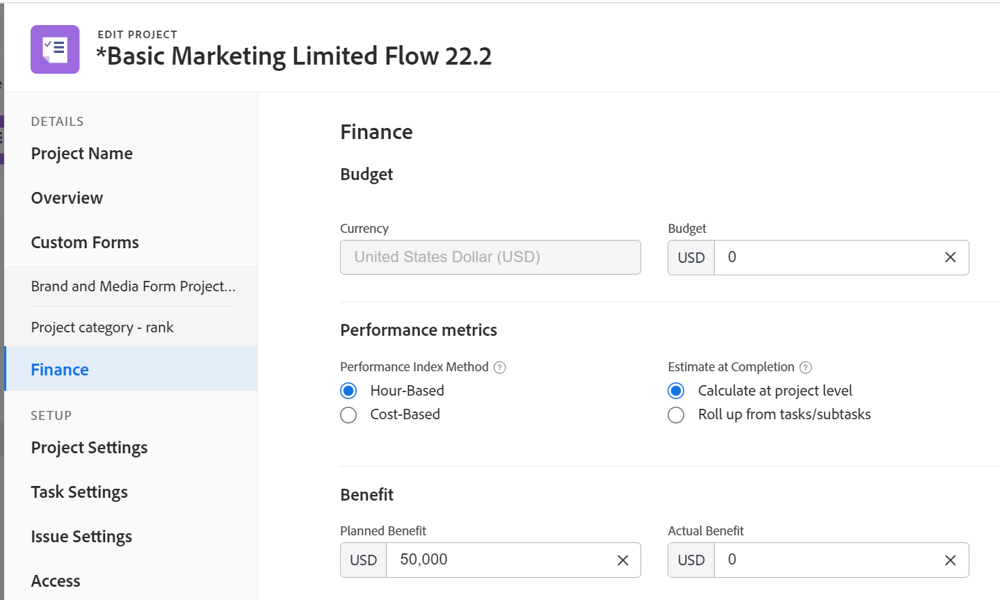
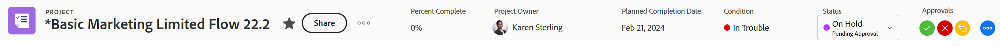
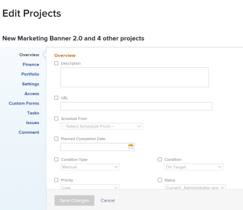
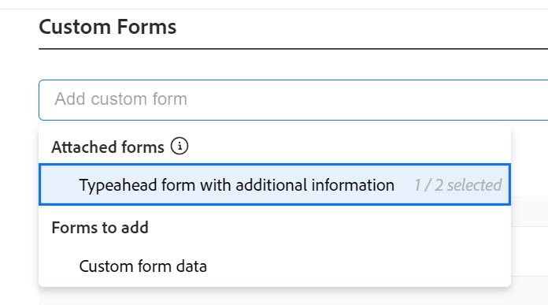

# Modifica progetti

Le informazioni evidenziate in questa pagina fanno riferimento a funzionalità non ancora disponibili al pubblico. È disponibile solo nell’ambiente Anteprima.

<!--

***Linked to many articles,

The Resource Pools part also duplicates in the "Working with Resource Pools" article 

The Update Type section is also documented in Selecting the Project Update Type article

Keep the reference link to the other article that also documents the Update Type) 

(NOTE 2: information described here also exists in these articles:

** Project Overview area

**Manage project Finance area

If you need to update just one field, check to see if that field is also listed there and update in both places.)

-->

Puoi modificare un progetto in Adobe Workfront con la frequenza necessaria. È consigliabile modificare i progetti in modo minimo dopo che il loro stato è stato modificato in Corrente, per evitare confusione inviando notifiche sulle modifiche all’intero team del progetto. È consigliabile modificare un progetto quando il progetto si trova nello stato Planning. Per informazioni sul team del progetto, consulta [Panoramica del team di progetto](../../../manage-work/projects/planning-a-project/project-team-overview.md).

## Requisiti di accesso

<!--drafted - replace table at P&P:

<table style="table-layout:auto"> 
 <col> 
 <col> 
 <tbody> 
  <tr> 
   <td role="rowheader">Adobe Workfront plan*</td> 
   <td> 
Any
 </td> 
  </tr> 
  <tr> 
   <td role="rowheader">Adobe Workfront license*</td> 
   <td>
Current license: Standard 
 
   Or
   
Legacy license: Plan 
 </td> 
  </tr> 
  <tr> 
   <td role="rowheader">Access level configurations*</td> 
   <td> 
Edit access to Projects
 
If you still don't have access, ask your Workfront administrator if they set additional restrictions in your access level. For information about access to projects, see <a href="../../../administration-and-setup/add-users/configure-and-grant-access/grant-access-projects.md" class="MCXref xref">Grant access to projects</a>. For information on how a Workfront administrator can change your access level, see <a href="../../../administration-and-setup/add-users/configure-and-grant-access/create-modify-access-levels.md" class="MCXref xref">Create or modify custom access levels</a>. 
 </td> 
  </tr> 
  <tr> 
   <td role="rowheader">Object permissions</td> 
   <td> 
    <ul> 
     <li> 
Contribute permissions to a project to edit it in the Project Details area 
 </li> 
     <li> 
Manage permissions to a project to edit it in the Edit Project box
 </li> 
    </ul> 
 For information about project permissions, see <a href="../../../workfront-basics/grant-and-request-access-to-objects/share-a-project.md" class="MCXref xref">Share a project in Adobe Workfront</a>.
 
For information on requesting additional access, see <a href="../../../workfront-basics/grant-and-request-access-to-objects/request-access.md" class="MCXref xref">Request access to objects </a>.
 </td> 
  </tr> 
 </tbody> 
</table>
-->

Per eseguire i passaggi descritti in questo articolo, è necessario disporre dei seguenti diritti di accesso:

<table style="table-layout:auto"> 
 <col> 
 <col> 
 <tbody> 
  <tr> 
   <td role="rowheader">piano Adobe Workfront*</td> 
   <td> 
Qualsiasi
 </td> 
  </tr> 
  <tr> 
   <td role="rowheader">Licenza Adobe Workfront*</td> 
   <td> 
Piano 
 </td> 
  </tr> 
  <tr> 
   <td role="rowheader">Configurazioni a livello di accesso*</td> 
   <td> 
Modifica accesso a progetti
 
Se non disponi ancora dell’accesso, chiedi all’amministratore Workfront se ha impostato ulteriori restrizioni nel livello di accesso. Per informazioni sull'accesso ai progetti, vedi <a href="../../../administration-and-setup/add-users/configure-and-grant-access/grant-access-projects.md" class="MCXref xref">Concedere l’accesso ai progetti</a>. Per informazioni su come un amministratore Workfront può modificare il livello di accesso, consulta <a href="../../../administration-and-setup/add-users/configure-and-grant-access/create-modify-access-levels.md" class="MCXref xref">Creare o modificare livelli di accesso personalizzati</a>. 
 </td> 
  </tr> 
  <tr> 
   <td role="rowheader">Autorizzazioni oggetto</td> 
   <td> 
    <ul> 
     <li> 
Autorizzazioni di Contribute per un progetto per modificarlo nell'area Dettagli progetto 
 </li> 
     <li> 
Gestisci le autorizzazioni per un progetto per modificarlo nella casella Modifica progetto
 </li> 
    </ul> 
 Per informazioni sulle autorizzazioni del progetto, consulta <a href="../../../workfront-basics/grant-and-request-access-to-objects/share-a-project.md" class="MCXref xref">Condivisione di un progetto in Adobe Workfront</a>.
 
Per informazioni sulla richiesta di accesso aggiuntivo, vedi <a href="../../../workfront-basics/grant-and-request-access-to-objects/request-access.md" class="MCXref xref">Richiedere l’accesso agli oggetti </a>.
 </td> 
  </tr> 
 </tbody> 
</table>

*Per sapere quale piano, tipo di licenza o accesso si dispone, contattare l&#39;amministratore Workfront.

## Limitazioni per la modifica di progetti

Sono presenti alcune limitazioni che potrebbero impedire la modifica dei progetti.

Quando modifichi un progetto, considera quanto segue:

* Non è possibile modificare i progetti che si trovano in un processo di approvazione, ad eccezione del tempo di registrazione.
* È possibile allegare documenti o modelli a un progetto con stato Completato, Morto o In attesa di approvazione solo se questa funzionalità è stata abilitata dall’amministratore di Workfront o da un amministratore di gruppo nell’area Preferenze progetto. Per informazioni sull&#39;impostazione delle preferenze del progetto, consulta [Configurare le preferenze del progetto a livello di sistema](../../../administration-and-setup/set-up-workfront/configure-system-defaults/set-project-preferences.md).
* È possibile modificare solo le seguenti informazioni su un progetto con stato Morto o Completo:

   * Modifica le spese esistenti.
   * Aggiungere, rimuovere o modificare moduli personalizzati.

## Modificare un progetto

Modificando un progetto è possibile modificare le informazioni e le impostazioni del progetto, nonché le attività e i problemi del progetto.

Alcune impostazioni menzionate in questo articolo possono essere modificate a partire dal loro stato predefinito in base al loro stato nel modello da cui è stato creato il progetto. Per informazioni sulla modifica dei modelli, consulta [Modificare i modelli di progetto](../../../manage-work/projects/create-and-manage-templates/edit-templates.md).

1. Fai clic sul pulsante **Menu principale** icona  nell’angolo in alto a destra di Adobe Workfront, quindi fai clic su **Progetti**.
1. (Facoltativo) Fai clic su **Progetti in corso** o **Progetti di proprietà** nell’angolo in alto a destra per visualizzare i progetti di cui sei il proprietario o i progetti in cui fai parte del team di progetto.

   

1. Fai clic sul nome del progetto da modificare per aprire la pagina del progetto.

   >[!NOTE]
   >
   >Gli amministratori di gruppo possono visualizzare e modificare i progetti del gruppo sia nell’area Gruppi che nell’area Progetti. Per ulteriori informazioni, consulta [Creare e modificare i progetti di un gruppo](../../../administration-and-setup/manage-groups/work-with-group-objects/create-and-modify-a-groups-projects.md).

1. (Facoltativo) Per modificare informazioni limitate su un progetto, fai clic su **Dettagli progetto** nel pannello a sinistra.

   

   >[!NOTE]
   >
   >A seconda del modo in cui l’amministratore di Workfront o di gruppo ha modificato il modello di layout, i campi nell’area Dettagli progetto potrebbero essere ridisposti o non visualizzati. Per informazioni, consulta [Personalizzare la visualizzazione Dettagli utilizzando un modello di layout](../../../administration-and-setup/customize-workfront/use-layout-templates/customize-details-view-layout-template.md).

   Per modificare le informazioni nella sezione Dettagli, procedi come segue:

   1. (Facoltativo) Fai clic sul pulsante **Comprimi tutto** nell’angolo in alto a destra per comprimere tutte le aree.
   1. (Facoltativo e condizionale) Quando un’area viene compressa, fai clic sul pulsante **freccia verso destra**  accanto a ogni area per espandere l’area da modificare.
   1. Per ulteriori informazioni sulla modifica delle informazioni nella scheda Dettagli progetto, consulta i seguenti articoli:

      * [Gestire le informazioni nell’area Panoramica del progetto](../../../manage-work/projects/manage-projects/understand-project-overview-area.md)
      * [Gestire le informazioni nell&#39;area di finanziamento del progetto](../../../manage-work/projects/project-finances/manage-project-finance-area.md)
   1. (Facoltativo) Per allegare un modulo personalizzato, iniziare a digitare il nome di un modulo nel **Aggiungi modulo personalizzato** , quindi selezionalo quando viene visualizzato nell’elenco, quindi fai clic su **Salva modifiche**.
   1. (Facoltativo) Fai clic sul pulsante **Esporta** icona  per esportare le informazioni generali e i moduli personalizzati in un file PDF, fai clic su **Esporta**. Seleziona una delle seguenti opzioni:

      * Seleziona tutto (viene visualizzato solo quando è presente almeno un modulo personalizzato allegato)
      * Panoramica
      * Nome di uno o più moduli personalizzati

      Il file PDF viene scaricato sul computer.

      

      Per ulteriori informazioni, consulta [Esportare moduli personalizzati e dettagli dell’oggetto](../../../workfront-basics/work-with-custom-forms/export-custom-forms-details.md).
   Per informazioni sui campi visibili nella sezione Dettagli progetto , continua a modificare il progetto nella casella Modifica progetto come descritto di seguito.
1. Per modificare tutte le informazioni sul progetto, fai clic sul pulsante **Altro** menu  accanto al nome del progetto, fai clic su **Modifica**.

   Oppure

   Da un elenco di progetti, seleziona un progetto, quindi fai clic sul pulsante **Modifica** icona  in cima all&#39;elenco.

   La **Modifica progetto** si apre la casella.

   >[!IMPORTANT]
   >
   >Per visualizzare l’opzione Modifica è necessario disporre delle autorizzazioni di gestione per il progetto.

   Tutti i campi del progetto sono disponibili nella casella Modifica progetto e sono raggruppati in base alle aree elencate nel pannello a sinistra.

   >[!NOTE]
   >
   >A seconda del modo in cui l’amministratore di Workfront o di gruppo ha modificato il modello di layout, le aree nel pannello a sinistra della casella Modifica progetto o in qualsiasi campo elencato in queste aree potrebbero essere riorganizzate o non visualizzate. Per informazioni, consulta [Personalizzare la visualizzazione Dettagli utilizzando un modello di layout](../../../administration-and-setup/customize-workfront/use-layout-templates/customize-details-view-layout-template.md).

1. (Condizionale) Se hai fatto clic sul pulsante **Altro** e quindi **Modifica**, considera l’aggiornamento delle informazioni in una delle seguenti aree elencate nel pannello a sinistra:

   * [Nome progetto](#project-name)
   * [Panoramica](#overview)
   * [Moduli personalizzati](#custom-forms)
   * [Finanz](#finance)
   * [Impostazione progetto](#project-settings)
   * [Impostazioni attività](#task-settings)
   * [Impostazioni problema](#issue-settings)
   * [Accesso](#access)

   >[!NOTE]
   >
   >A seconda di come l’amministratore di Workfront imposta il modello di layout per l’area Dettagli del progetto, le sezioni e i campi nella casella Modifica progetto potrebbero essere diversi nell’ambiente in uso. Per informazioni, consulta [Personalizzare la visualizzazione Dettagli utilizzando un modello di layout](../../../administration-and-setup/customize-workfront/use-layout-templates/customize-details-view-layout-template.md).

### Nome progetto {#project-name}

1. Inizia a modificare il progetto come descritto in precedenza.
1. Fai clic su **Nome progetto** nel pannello a sinistra.

   

1. Aggiorna il nome del progetto.

   Non puoi modificare il nome del progetto quando modifichi progetti in blocco.

### Panoramica {#overview}

1. Inizia a modificare il progetto come descritto in precedenza.
1. Fai clic su **Panoramica** nel pannello a sinistra.

   

1. Aggiorna le seguenti informazioni sul progetto:

   <table style="table-layout:auto"> 
    <col> 
    <col> 
    <tbody> 
     <tr> 
      <td role="rowheader"><strong>Descrizione</strong> </td> 
      <td> 
Aggiungi ulteriori informazioni sul progetto.
 </td> 
     </tr> 
     <tr> 
      <td role="rowheader"><strong>Stato</strong> </td> 
      <td> 
Seleziona lo stato del progetto. Non è possibile contrassegnare un progetto Completo prima che siano stati completati tutti i problemi e le attività. Per informazioni sugli stati del progetto, consulta <a href="../../../administration-and-setup/customize-workfront/creating-custom-status-and-priority-labels/project-statuses.md" class="MCXref xref">Accedere all’elenco degli stati del progetto di sistema</a>
 </td> 
     </tr> 
     <tr> 
      <td role="rowheader"><strong>Priorità</strong> </td> 
      <td> 
 
Questo è solo un flag visivo che ti consente di assegnare una priorità ai tuoi progetti.
 
A seconda delle preferenze del progetto selezionate dall’amministratore di Workfront, i nomi delle priorità potrebbero essere diversi. Per ulteriori informazioni sulle priorità di modifica, vedi <a href="../../../administration-and-setup/customize-workfront/creating-custom-status-and-priority-labels/create-customize-priorities.md" class="MCXref xref">Creare e personalizzare le priorità</a>
 
 </td> 
     </tr> 
     <tr> 
      <td role="rowheader"><strong>URL</strong> </td> 
      <td> 
Specifica un collegamento web relativo alle informazioni sul progetto.
 </td> 
     </tr> 
     <tr> 
      <td role="rowheader"><strong>Tipo di Condizione</strong> </td> 
      <td> 
Seleziona tra i seguenti tipi di condizioni: 
       <ul> 
       <li><strong>Manuale:</strong> Il proprietario del progetto imposta manualmente la condizione sul progetto.</li> 
       <li><strong>Stato di avanzamento:</strong> Workfront imposta automaticamente la condizione in base allo stato di avanzamento delle attività nel percorso critico. Per ulteriori informazioni sullo stato di avanzamento, consulta <a href="../../../manage-work/tasks/task-information/task-progress-status.md" class="MCXref xref">Panoramica sullo stato dell'avanzamento dell'attività</a>.</li> 
       </ul>
Amministratore Workfront o un amministratore di gruppo seleziona l'impostazione predefinita per il calcolo della condizione del progetto per il sistema o del gruppo. Per informazioni sull’impostazione dei valori predefiniti del progetto, consulta <a href="../../../administration-and-setup/set-up-workfront/configure-system-defaults/set-project-preferences.md" class="MCXref xref">Configurare le preferenze del progetto a livello di sistema</a>. 

 </td> 
     </tr> 
     <tr> 
      <td role="rowheader"><strong>Condizione</strong> </td> 
      <td> 
 
(Visualizza solo dopo aver selezionato <strong>Manuale</strong> per <strong>Tipo di condizione</strong>): Seleziona una condizione per indicare l’andamento del progetto. 
 
Per informazioni su come impostare automaticamente o manualmente le condizioni del progetto, vedi <a href="../../../manage-work/projects/manage-projects/project-condition-and-condition-type.md" class="MCXref xref">Panoramica del tipo di condizione e condizione del progetto</a>
 
 </td> 
     </tr> 
     <tr> 
      <td role="rowheader"><strong>Modalità Schedule</strong> </td> 
      <td> 
Specifica se il progetto è programmato dalla data di inizio o dalla data di completamento. Questa selezione determina le date pianificate delle attività del progetto. 
       <ul> 
       <li><strong>Data di inizio</strong>: Per impostazione predefinita, la prima attività del progetto ha la stessa data di inizio pianificata del progetto. Per informazioni sull'attività Data inizio pianificata, vedere <a href="../../../manage-work/tasks/task-information/task-planned-start-date.md" class="MCXref xref">Panoramica dell'attività Data inizio prevista</a>. La timeline del progetto viene calcolata in base alla data di inizio e alla data di completamento del progetto, in base alla durata di tutte le attività. </li> 
       <li><strong>Data completamento</strong>: L'ultima attività del progetto ha la stessa data di completamento pianificata del progetto. La timeline del progetto viene calcolata in base alla data di completamento e alla data di inizio del progetto, sottraendo la durata di tutte le attività dalla data di completamento del progetto. </li> 
       </ul>
Amministratore Workfront o un amministratore di gruppo seleziona l'impostazione predefinita Modalità pianificazione per il sistema o il gruppo. Per informazioni sull’impostazione dei valori predefiniti del progetto, consulta <a href="../../../administration-and-setup/set-up-workfront/configure-system-defaults/set-project-preferences.md" class="MCXref xref">Configurare le preferenze del progetto a livello di sistema</a>.

 </td> 
     </tr> 
     <tr> 
      <td role="rowheader"><strong>Data e ora di inizio pianificate</strong> </td> 
      <td> 
 
Specifica la data in cui selezioni <strong>Pianificazione dalla data di inizio</strong>.  
 
Questo è un campo di sola lettura quando si seleziona <strong>Pianificazione da data di completamento</strong>. 
 
 </td> 
     </tr> 
     <tr> 
      <td role="rowheader"><strong>Data e ora del completamento pianificati</strong> </td> 
      <td> 
Specifica la data in cui selezioni <strong>Pianificazione da data di completamento</strong>. 
 
Questo è un campo di sola lettura quando si seleziona <strong>Pianificazione dalla data di inizio</strong>. 
 </td> 
     </tr> 
     <tr> 
      <td role="rowheader"><strong>Portfolio</strong></td> 
      <td>Indica un Portfolio a cui appartiene il progetto. È necessario creare prima un Portfolio prima di visualizzarlo nell’elenco a discesa. Solo i portfolio attivi possono essere associati a un progetto. Per ulteriori informazioni sulla creazione dei portfolio, consulta <a href="../../../manage-work/portfolios/create-and-manage-portfolios/create-portfolios.md" class="MCXref xref">Creare un portfolio </a>.</td> 
     </tr> 
     <tr> 
      <td role="rowheader"><strong>Programma</strong></td> 
      <td> 
Se hai selezionato un Portfolio per il progetto, specifica un Programma per il progetto. Alcuni Portfoli potrebbero non disporre di Programmi. È necessario creare prima un programma prima di visualizzarlo in questo elenco a discesa. Solo i programmi attivi possono essere associati a un progetto. 
 
Per ulteriori informazioni sulla creazione di programmi, consulta <a href="../../../manage-work/portfolios/create-and-manage-programs/create-program.md" class="MCXref xref">Crea un programma</a>.
 </td> 
     </tr> 
     <tr> 
      <td role="rowheader"><strong>Gruppo</strong></td> 
      <td> 
 
Specifica il nome del gruppo associato al progetto. 
Questo campo è obbligatorio. Non puoi avere un progetto non associato a un gruppo. 
 
Per selezionare il gruppo di destra, posiziona il cursore sopra di esso e fai clic sull’icona delle informazioni  viene visualizzato accanto a esso. Viene visualizzata una descrizione comandi che elenca le informazioni sul gruppo, ad esempio la gerarchia dei gruppi al di sopra di esso e i relativi amministratori.
 Per impostazione predefinita, uno dei gruppi seguenti viene associato automaticamente a un progetto quando viene creato, a meno che non si specifichi un gruppo diverso:
 
       <ul> 
       <li> 
Quando il progetto viene creato dall’area Progetti, il gruppo Home del creatore del progetto viene associato al progetto. 
 
Questo vale anche quando il progetto viene creato dalla sezione Progetti di un portfolio o programma.
 </li> 
       <li> 
Quando il progetto viene creato dalla pagina principale di un gruppo nell’area Configurazione, tale gruppo viene associato al progetto.
 </li> 
       </ul> 
 
  
 
Se il progetto, le attività o i problemi relativi sono già associati a un processo di approvazione a livello di gruppo utilizzando stati personalizzati a livello di gruppo, la modifica del gruppo potrebbe creare un conflitto tra gli stati di approvazione del gruppo precedente e quelli esistenti a livello di sistema. È consigliabile rimuovere i processi di approvazione a livello di gruppo sul progetto, oppure i relativi compiti o problemi prima di aggiornare il gruppo. Per informazioni sulla creazione di processi di approvazione a livello di gruppo, consulta <a href="../../../administration-and-setup/manage-groups/work-with-group-objects/create-and-modify-groups-approval-processes.md" class="MCXref xref">Processi di approvazione a livello di gruppo</a>. Per informazioni sulla creazione di uno stato personalizzato a livello di gruppo, consulta <a href="../../../administration-and-setup/manage-groups/manage-group-statuses/create-or-edit-a-group-status.md" class="MCXref xref">Creare o modificare uno stato di gruppo</a>
 </td> 
     </tr> 
     <tr> 
      <td role="rowheader"><strong>Azienda</strong> </td> 
      <td> 
Specifica una società associata al progetto. È necessario creare una società prima di poterla associare a un progetto. Solo le aziende attive possono essere associate a un progetto. Per informazioni sulla creazione di aziende, consulta <a href="../../../administration-and-setup/set-up-workfront/organizational-setup/create-and-edit-companies.md" class="MCXref xref">Creare e modificare aziende</a>.
 </td> 
     </tr> 
     <tr> 
      <td role="rowheader"><strong>Proprietario progetto</strong> </td> 
      <td> 
Inizia a digitare il nome di un utente per aggiungerlo al progetto, quindi selezionalo quando viene visualizzato nell’elenco. L’utente viene aggiunto al team di progetto e riceve automaticamente le autorizzazioni di gestione per il progetto. L'utente designato come proprietario del progetto deve essere un utente attivo di Workfront.

      </td> 
     </tr> 
     <tr> 
      <td role="rowheader"><strong>Sponsor Progetto</strong> </td> 
      <td> 
Inizia a digitare il nome di un utente per aggiungerlo al progetto, quindi selezionalo quando viene visualizzato nell’elenco. L’utente viene aggiunto al team di progetto e riceve automaticamente le autorizzazioni di visualizzazione per il progetto. L’utente designato come sponsor del progetto deve essere un utente attivo di Workfront. 
 </td> 
     </tr> 
     <tr> 
      <td role="rowheader"><strong>Responsabile risorse</strong> </td> 
      <td> 
 Inizia a digitare i nomi degli utenti da aggiungere al progetto, quindi selezionali quando vengono visualizzati nell’elenco. Gli utenti vengono aggiunti al team del progetto e ricevono automaticamente le autorizzazioni di gestione per il progetto e possono assegnare risorse alle attività e ai problemi del progetto. Gli utenti gestiscono le autorizzazioni di gestione del progetto anche quando vengono rimossi dal campo Gestione risorse . È possibile specificare più di un Resource Manager. 
 </td> 
     </tr> 
    </tbody> 
   </table>

   >[!TIP]
   >
   >Quando si aggiornano i campi Proprietario progetto, Sponsor progetto e Gestione risorse, notare l’avatar, il Ruolo principale dell’utente o il relativo indirizzo e-mail per distinguere tra utenti con nomi identici. Gli utenti devono essere associati ad almeno un ruolo di lavoro per visualizzarlo durante l&#39;aggiunta.

1. (Facoltativo) Continua a modificare le sezioni seguenti, a seconda delle informazioni che desideri modificare.

   Oppure

   Fai clic su **Salva**.

### Moduli personalizzati {#custom-forms}

A seconda del livello di accesso e dell’autorizzazione al progetto, esistono i seguenti scenari:

* Se non si dispone delle autorizzazioni Modifica modulo personalizzato per il progetto, non è possibile modificare i campi in nessuno dei moduli personalizzati allegati. È possibile visualizzare solo i campi dei moduli personalizzati associati al progetto.
* Se si dispone dell’accesso Visualizza (e non Modifica) a una sezione di un modulo personalizzato, non è possibile modificare i campi di tale sezione.
* Se non si dispone dell’accesso a una sezione di uno dei moduli personalizzati allegati al progetto, la sezione non viene visualizzata nella casella Modifica progetto.

Quando selezioni più di un progetto per modificarli in blocco, esistono i seguenti scenari:

* Se non si dispone delle autorizzazioni Modifica modulo personalizzato per almeno uno dei progetti selezionati, non è possibile modificare i campi in nessuno dei moduli personalizzati allegati. È possibile visualizzare solo i campi nei moduli personalizzati allegati
* Se si dispone dell’accesso Visualizza (e non Modifica) a una sezione di un modulo personalizzato, non è possibile modificare i campi di tale sezione. È possibile visualizzare solo i campi in tale sezione.
* Se non si dispone dell’accesso a una sezione di uno dei moduli personalizzati allegati ad almeno uno dei progetti, la sezione non viene visualizzata nella casella Modifica progetti.

Per informazioni sull’accesso personalizzato ai moduli, vedere i seguenti articoli:

* [Condivisione di un modulo personalizzato](../../../administration-and-setup/customize-workfront/create-manage-custom-forms/share-access-to-a-custom-form.md)
* [Aggiungere un’interruzione di sezione a un modulo personalizzato](../../../administration-and-setup/customize-workfront/create-manage-custom-forms/add-a-section-break-to-a-custom-form.md)

Per modificare le informazioni sui moduli personalizzati:

1. Inizia a modificare il progetto come descritto in precedenza.
1. Fai clic su **Forms personalizzato** nel pannello a sinistra.

   

1. Fai clic sul pulsante **Aggiungi modulo personalizzato** selezionare un modulo dall’elenco per allegarlo al progetto. Per impostazione predefinita, i primi 40 moduli vengono visualizzati in ordine alfabetico. Se il modulo non viene visualizzato nell’elenco, inizia a digitarne il nome, quindi selezionalo quando viene visualizzato nell’elenco.

   >[!NOTE]
   >
   >È necessario creare i moduli personalizzati prima che siano disponibili per la selezione in questo campo. Nell’elenco vengono visualizzati solo i moduli personalizzati attivi. Per ulteriori informazioni sulla creazione di moduli personalizzati, vedere [Creare o modificare un modulo personalizzato](../../../administration-and-setup/customize-workfront/create-manage-custom-forms/create-or-edit-a-custom-form.md). È possibile aggiungere fino a dieci moduli personalizzati a un progetto.

1. (Condizionale) Se hai allegato un modulo personalizzato al progetto, modifica tutti i campi del modulo. È necessario specificare tutti i campi obbligatori prima di salvare il progetto.
1. (Facoltativo) Fai clic sul pulsante **Icona X** a destra del nome di un modulo personalizzato per rimuoverlo, quindi fare clic su **Rimuovi**.
1. (Facoltativo) Continua a modificare le sezioni seguenti, a seconda delle informazioni che desideri modificare

   Oppure

   Fai clic su **Salva**.

### Finanz {#finance}

A seconda del livello di accesso e dell’autorizzazione al progetto, esistono i seguenti scenari:

* Se si dispone dell&#39;accesso Visualizza a dati finanziari e delle autorizzazioni Visualizza contabilità per il progetto, è possibile visualizzare solo i campi nella sezione Finanza. Non è possibile modificare i campi in questa sezione.
* Se disponi delle autorizzazioni Modifica accesso ai dati finanziari e Gestisci finanziamenti per il progetto, puoi aggiornare i campi in questa sezione.

Quando selezioni più di un progetto per modificarli in blocco e, esistono i seguenti scenari:

* Se si seleziona almeno un progetto in cui si dispone delle autorizzazioni Visualizza contabilità (anziché Gestisci finanza), è possibile visualizzare solo i campi di questa sezione per tutti i progetti selezionati. Non è possibile modificare in blocco i campi nella sezione Finanza.
* Se selezioni almeno un progetto in cui non disponi di autorizzazioni di finanziamento, questa sezione non viene visualizzata.

Per modificare i campi nell&#39;area Finanza:

1. Inizia a modificare il progetto come descritto in precedenza.
1. Fai clic su **Finanza** nel pannello a sinistra.

   

1. Aggiorna le seguenti informazioni finanziarie per il progetto:

   <table style="table-layout:auto"> 
    <col> 
    <col> 
    <tbody> 
     <tr data-mc-conditions=""> 
      <td role="rowheader"><strong>Valuta</strong> </td> 
      <td> 
 
Specifica la valuta del progetto, se è diversa dalla valuta predefinita del sistema. Non è possibile modificare la valuta di un progetto se sono già presenti informazioni finanziarie sul progetto. Questo campo non è visibile se nel sistema è presente solo la valuta predefinita. 
 
Per ulteriori informazioni sulla valuta, consulta <a href="../../../administration-and-setup/manage-workfront/exchange-rates/set-up-exchange-rates.md" class="MCXref xref">Imposta i tassi di cambio</a>. 
 
 </td> 
     </tr> 
     <tr> 
      <td role="rowheader"><strong>Bdg</strong> </td> 
      <td> 
Specifica un budget per il progetto. 
 </td> 
     </tr> 
     <tr> 
      <td role="rowheader"><strong>Metodo Indicizzazione Performance</strong> </td> 
      <td> 
Seleziona <b>Basato su ora</b>oppure <b>Basato sui costi</b> per indicare se le metriche del valore generato del progetto (ad esempio Indice prestazioni costo o Costo effettivo stimato) vengono calcolate utilizzando ore o costi. 
 
Per ulteriori informazioni sul metodo dell'indice delle prestazioni, vedi <a href="../../../manage-work/projects/project-finances/set-pim.md" class="MCXref xref">Impostare il metodo Performance Index (PIM)</a>. 
 
Amministratore Workfront o un amministratore di gruppo seleziona l'impostazione predefinita Metodo indice prestazioni per il sistema o il gruppo. Per informazioni sull’impostazione dei valori predefiniti del progetto, consulta <a href="../../../administration-and-setup/set-up-workfront/configure-system-defaults/set-project-preferences.md" class="MCXref xref">Configurare le preferenze del progetto a livello di sistema</a>.
 </td> 
     </tr> 
     <tr> 
      <td role="rowheader"><strong>Stima al completamento</strong> </td> 
      <td> 
 
Specifica come Workfront deve calcolare la stima al completamento (EAC). 

      Seleziona tra le seguenti opzioni: 
      <ul><li><b>Calcola a livello di progetto</b></li>
      <li><b>Esegui il rollup dalle attività/sottoattività</b></li> </ul>
      
Per ulteriori informazioni sul calcolo della stima al completamento, vedere <a href="../../../manage-work/projects/project-finances/calculate-eac.md" class="MCXref xref">Calcola Stima Al Completamento (EAC)</a>.
 
L'amministratore di Workfront o di gruppo seleziona l'impostazione predefinita Stima al completamento per il sistema o il gruppo. Per informazioni sull’impostazione dei valori predefiniti del progetto, consulta <a href="../../../administration-and-setup/set-up-workfront/configure-system-defaults/set-project-preferences.md" class="MCXref xref">Configurare le preferenze del progetto a livello di sistema</a>.
 
 </td> 
     </tr> 
     <tr> 
      <td role="rowheader"><strong>Benef Pian</strong> </td> 
      <td> 
Stimare quale sia il beneficio previsto del progetto. Viene utilizzato nel Business Case del progetto e in Portfoli Optimizer. Per ulteriori informazioni sul beneficio pianificato di un progetto, consulta <a href="../../../manage-work/projects/project-finances/project-planned-benefit.md" class="MCXref xref">Panoramica del progetto Vantaggio pianificato</a>. Quando si calcola il valore netto di un progetto, si tiene conto del beneficio pianificato di un progetto. 
 
Per ulteriori informazioni, consulta <a href="../../../manage-work/portfolios/portfolio-optimizer/manage-projects-in-portfolio-optimizer.md" class="MCXref xref">Gestisci progetti in Portfoli Optimizer</a> . 
 </td> 
     </tr> 
     <tr> 
      <td role="rowheader"><strong>Benef Real</strong> </td> 
      <td> 
Stimare il beneficio effettivo del progetto. Si tratta di un importo in valuta che rappresenta il vantaggio che la tua azienda o il tuo reparto otterrebbe al termine del progetto. 
 </td> 
     </tr> 
      <tr> 
      <td role="rowheader"><strong>Costo Fisso</strong> </td> 
      <td> 
Specifica il costo fisso per il progetto. Questo è diverso dal costo del lavoro che deriva dalle ore del progetto e dal costo della spesa che deriva dall'importo delle spese del progetto. Il costo fisso di un progetto viene preso in considerazione quando si calcola il valore netto di un progetto e fa parte del costo preventivato. 
 </td> 
     </tr> 
     <tr> 
      <td role="rowheader"><strong>Reddito Fisso</strong> </td> 
      <td> 
Specifica i ricavi fissi per il progetto. 
 </td> 
     </tr> 
    </tbody> 
   </table>

1. (Facoltativo) Continua a modificare le sezioni seguenti, a seconda delle informazioni che desideri modificare.

   Oppure

   Fai clic su **Salva**.

### Impostazione progetto {#project-settings}

1. Inizia a modificare il progetto come descritto in precedenza.
1. Fai clic su **Impostazioni progetto** nel pannello a sinistra.

   

1. Aggiorna le seguenti informazioni:

   <table style="table-layout:auto"> 
      <col> 
      <col> 
      <tbody> 
      <tr> 
      <td role="rowheader"><strong>Percorso milestone</strong> </td> 
       <td> 
Seleziona un percorso Milestone per il progetto. Nell’elenco vengono visualizzati solo i percorsi di cardine attivi.
 
Per ulteriori informazioni sui percorsi Milestone, consulta <a href="../../../administration-and-setup/customize-workfront/configure-approval-milestone-processes/create-milestone-path.md" class="MCXref xref">Creare un percorso cardine</a>.
 </td> 
      </tr> 
      <tr> 
      <td role="rowheader"><strong>Modalità di completamento</strong> </td> 
      <td> 
Controlla il modo in cui il progetto viene contrassegnato come Completo. Seleziona tra le seguenti opzioni: 
       <ul> 
       <li>
<strong>Automatico</strong>: Il progetto viene contrassegnato come Completo quando vengono completate tutte le attività e i problemi.

Lo stato del progetto viene automaticamente modificato in Completato solo quando lo stato del progetto è Corrente al termine delle attività. 
</li> 
       <li><strong>Manuale</strong>: È necessario selezionare manualmente lo stato Completa per il progetto, al termine di tutte le attività e i problemi.</li> 
       </ul>
 </td> 
       </tr> 
       <tr> 
       <td role="rowheader"><strong>Modalità di completamento riepilogo</strong></td> 
       <td> 
Controlla il modo in cui le attività principali vengono contrassegnate come Complete. Seleziona tra le seguenti opzioni: 
       <ul> 
       <li><strong>Automatico</strong>: Le attività principali sono contrassegnate come completate e aggiornano automaticamente la percentuale di completamento, quando le attività figlio vengono completate e la percentuale di completamento delle attività figlio viene aggiornata. </li> 
       <li><strong>Manuale</strong>: È necessario aggiornare manualmente la percentuale di completamento e lo stato delle attività principali, indipendentemente dalle modifiche apportate alle attività figlio.</li> 
       </ul>
 </td> 
       </tr> 
       <tr> 
       <td role="rowheader"><strong>Tipo Aggiornamento</strong></td> 
       <td> 
Controlla quando le modifiche apportate alla timeline del progetto vengono salvate nel progetto o nelle attività principali. Ad esempio, le seguenti modifiche al progetto attivano un aggiornamento della timeline del progetto: 
       <ul> 
       <li>Aggiornare le date delle attività</li> 
       <li>Modificare le relazioni predecessori delle attività</li> 
       <li>
Modificare le relazioni padre-figlio, aggiungere o rimuovere assegnazioni oltre a modificare il vincolo di attività o il tipo di durata.

Quando le attività vengono aggiornate, i relativi oggetti principali (attività principali o progetto) vengono aggiornati al momento indicato dal tipo di aggiornamento. 

Se gli oggetti principali non vengono aggiornati immediatamente dopo la modifica quando si seleziona "Automatico e al momento della modifica" o "Cambia solo" Tipo di aggiornamento, aggiornare la pagina

Seleziona tra le seguenti opzioni: 

- <strong>Automatico e On Change</strong> (Impostazione predefinita): La timeline del progetto viene aggiornata ogni volta che si verifica una modifica nel progetto o in un altro progetto da cui dipende il progetto (In seguito a modifica). La timeline del progetto viene aggiornata ogni notte (automatica).

Questa è l’impostazione consigliata per questo campo perché assicura che il progetto sia sempre aggiornato.

Quando esegui un'azione su un'attività o su un progetto che attiva il ricalcolo della timeline, vengono visualizzate immediatamente tutte le date disponibili, consentendo di continuare a lavorare. Nei progetti con più di 100 attività, le date che richiedono un ricalcolo più lungo vengono visualizzate brevemente sotto forma di punto interrogativo (tra 1 e 5 secondi, o fino a un minuto per i progetti di grandi dimensioni). Questo indica che il ricalcolo non è ancora completato e che le date sono soggette a modifiche.

- <strong>Cambia solo</strong>: La timeline del progetto viene aggiornata ogni volta che si verifica una modifica nel progetto o in un altro progetto da cui dipende il progetto. È possibile selezionare questa opzione se si verificano raramente modifiche nel progetto o in altri progetti da cui dipende la timeline.

- <strong>Solo automatico</strong>: La tempistica del progetto viene aggiornata ogni notte; la timeline non viene aggiornata immediatamente dopo le modifiche.

È possibile selezionare questa opzione se si verificano più modifiche quotidiane nel progetto o in altri progetti da cui dipende la timeline. Tuttavia, tieni presente che hai scelto questa impostazione, poiché il progetto non verrà aggiornato contemporaneamente alle modifiche apportate.

- <strong>Solo manuale</strong>: La timeline del progetto viene aggiornata solo quando selezioni l’opzione Ricalcola timeline . Per ulteriori informazioni sul ricalcolo manuale della timeline del progetto, consulta <a href="../../../manage-work/projects/manage-projects/recalculate-project-timeline.md" class="MCXref xref">Ricalcolare le timeline dei progetti</a>. 

È possibile selezionare questa opzione se si apportano più modifiche al progetto contemporaneamente e si desidera che il ricalcolo della timeline si verifichi dopo che sono state apportate tutte le modifiche (anziché dopo ogni singola modifica).
</li> 
       </ul>
 </td> 
       </tr> 
       <tr> 
       <td role="rowheader"><strong>Pianificazione</strong> </td> 
       <td> 
Seleziona una pianificazione per il progetto. Questa deve essere la stessa pianificazione assegnata alla maggior parte delle persone che lavorano sul progetto. È necessario creare una pianificazione prima di poterla assegnare a un progetto o a un utente. Se nel sistema non sono state create pianificazioni personalizzate, viene selezionata l'opzione Pianificazione predefinita.
 
Per ulteriori informazioni sulla creazione delle pianificazioni, consulta <a href="../../../administration-and-setup/set-up-workfront/configure-timesheets-schedules/create-schedules.md" class="MCXref xref">Creare una pianificazione</a>. 
 </td> 
       </tr> 
       <tr> 
       <td role="rowheader"><strong>Indisponibilità utente</strong> </td> 
       <td> 
Determina se l'ora dell'assegnatario principale di un'attività regola le date pianificate dell'attività sul progetto. 

Amministratore Workfront o un amministratore di gruppo seleziona l'impostazione predefinita per il sistema o del gruppo. Per informazioni sull’impostazione dei valori predefiniti del progetto, consulta <a href="../../../administration-and-setup/set-up-workfront/configure-system-defaults/set-project-preferences.md" class="MCXref xref">Configurare le preferenze del progetto a livello di sistema</a>. 

Seleziona tra le seguenti opzioni: - <strong>Considerare il tempo di inattività dell'utente nelle durate delle attività</strong>: Quando si seleziona questa opzione, le date pianificate delle attività vengono regolate in base all'ora dell'assegnatario principale dell'attività, se l'orario di inattività si verifica durante la durata dell'attività. 

Ad esempio, se un'attività con un vincolo di Al più presto è pianificata per l'inizio il 1° giugno e completa il 3 giugno, e l'Assegnatario principale ha contrassegnato il 2 giugno come Time-off, quando questa selezione è abilitata, le date previste dell'attività sono dal 1° giugno al 4 giugno. A seconda del vincolo di attività, esistono i seguenti scenari: 
 
       <ul> 
       <li>Per i vincoli di attività relativi alla pianificazione da una data di inizio (non appena possibile, prima ora disponibile, Start No early Than, Start No Next Than, Must Start On) la data di inizio pianificata non cambia ma la data di completamento pianificata cambia.</li> 
       <li>Per i vincoli delle attività relativi alla pianificazione a partire da una data di completamento (il più tardi possibile, l'ultima ora disponibile, Fine non prima di, Fine entro e non oltre, Fine deve terminare il), la data di completamento pianificata non cambia, ma la data di inizio pianificata cambia.</li> 
       <li>Per le attività con un vincolo di date fisse, non viene modificata né la data di inizio prevista né la data di completamento. </li> 
       </ul>
La durata dell'attività non cambia quando si seleziona questa impostazione. Cambiano solo le date pianificate, a seconda del Vincolo attività. Per informazioni sul vincolo dell'attività, vedere <a href="../../../manage-work/tasks/task-constraints/task-constraint-overview.md" class="MCXref xref">Panoramica sul vincolo di attività</a>. 

- <strong>Ignora il tempo di inattività dell'utente nelle durate dell'attività</strong>: Quando si seleziona questa opzione, le date pianificate delle attività del progetto rimangono come pianificate in origine, anche se l'Assegnatario principale dell'attività ha un tempo di inattività durante la durata dell'attività. 

Quando selezioni le opzioni per questa impostazione, tieni presente quanto segue:
 
       <ul> 
       <li>
L’opzione predefinita per questa impostazione per un nuovo progetto è la stessa della preferenza di progetto a livello di sistema. 

Per informazioni sulle preferenze del progetto a livello di sistema, consulta <a href="../../../administration-and-setup/set-up-workfront/configure-system-defaults/set-project-preferences.md" class="MCXref xref">Configurare le preferenze del progetto a livello di sistema</a>. 
</li> 
       <li>Quando alleghi un modello a un progetto esistente, l’impostazione del progetto viene aggiornata in modo che corrisponda a quella del modello. </li> 
       <li>
Workfront decide le date dell'attività pianificate da modificare in base al valore Vincolo attività dell'attività. A seconda di ciò che si intende, potrebbe essere influenzato o rimanere invariato sia la data di inizio pianificata che la data di completamento pianificata. Ad esempio, se un'attività ha un Vincolo di date fisse, le date non vengono modificate quando l'Assegnatario principale ha un tempo di inattività, anche quando <strong>Considerare il tempo di inattività dell'utente nelle durate delle attività</strong> è selezionato. 
</li> 
       </ul></td> 
      </tr> 
      <tr> 
       <td role="rowheader"><strong>Modalità Livellamento Risorse</strong> </td> 
       <td> 
 
Seleziona tra le seguenti opzioni:
 
- <strong>Manuale</strong>: è necessario livellare manualmente le risorse (impostazione predefinita)
 
- <strong>Automatico</strong>: Workfront livella le risorse.
 
Per ulteriori informazioni sul livellamento delle risorse, consulta <a href="../../../manage-work/gantt-chart/use-the-gantt-chart/level-resources-in-gantt.md" class="MCXref xref">Risorse di livello nel diagramma di Gantt </a>.
 
 </td> 
      </tr> 
      <tr> 
       <td role="rowheader"><strong>Rischio</strong> </td> 
       <td> 
 
Definisci il livello di rischio del progetto. Il rischio è solo un indicatore di quanto un progetto possa essere rischioso. Puoi assegnare priorità all’esecuzione dei progetti in base al livello di rischio.
 
 
Prendi in considerazione la scelta tra i seguenti livelli di rischio:
 
- Bassisimo
 
- Basso
 
- Medio
 
- Alta
 
- Altissimo
 
I livelli di rischio indicati non possono essere personalizzati.
 
Questi non sono correlati ai rischi potenziali che possono verificarsi durante la durata di un progetto e che è necessario registrare nella scheda Rischi del progetto o nel Business Case. Per informazioni sui potenziali rischi del progetto, consulta <a href="../../../administration-and-setup/set-up-workfront/configure-system-defaults/edit-create-risk-types.md" class="MCXref xref">Modificare e creare tipi di rischio</a>. 
 
 
 </td> 
      </tr> 
      <tr> 
       <td role="rowheader"><strong>Gruppi di risorse</strong> </td> 
       <td> 
 
Specifica i pool di risorse associati al progetto. I pool di risorse sono raccolte di utenti che sono necessari allo stesso tempo per il completamento di un progetto e consentono l’impostazione del budget del progetto nel Planner risorse. Per ulteriori informazioni sui pool di risorse, consulta <a href="../../../resource-mgmt/resource-planning/resource-pools/work-with-resource-pools.md" class="MCXref xref"> Panoramica dei pool di risorse </a>. 
 
Quando si modificano progetti in blocco, in questo campo vengono visualizzati solo i pool di risorse comuni a tutti i progetti selezionati. Se i progetti selezionati non dispongono di pool di risorse condivisi, questo campo sarà vuoto. I pool di risorse specificati in questo campo sovrascriveranno i singoli pool di risorse dei progetti.
 
 </td> 
      </tr> 
      <tr> 
       <td role="rowheader"> <strong>Consenti tariffe di fatturazione a livello di società per sovrascrivere le tariffe di fatturazione a livello di progetto</strong></td> 
       <td>Selezionare questa opzione per consentire ai tassi di fatturazione a livello aziendale di ignorare i tassi storici dei ruoli di lavoro, a meno che tali tassi non siano contrassegnati come fatturati. L’abilitazione di questa opzione sostituisce le percentuali storiche dei ruoli del lavoro a meno che non siano contrassegnate come fatturate.  Per ulteriori informazioni, consulta <a href="../../../manage-work/projects/project-finances/override-project-level-with-company-level-billing-rates.md" class="MCXref xref">Sostituisci i tassi di fatturazione a livello di progetto con i tassi di fatturazione a livello di società</a>.</td> 
      </tr> 
      <tr> 
       <td role="rowheader"><strong>Richiede l'approvazione del tempo per questo progetto</strong></td> 
       <td> 
 Selezionare questa opzione per richiedere al proprietario del progetto di approvare il tempo di accesso al progetto. Se si utilizzano i record di fatturazione e si seleziona questa opzione, solo le ore approvate sul progetto vengono visualizzate come ore fatturabili disponibili per i record di fatturazione. L’approvazione del tempo di esecuzione del progetto è indipendente dall’approvazione dei fogli presenze. 
 
Per ulteriori informazioni sulla richiesta di tempo per l'approvazione di un progetto, consulta <a href="../../../manage-work/projects/manage-projects/require-time-approval-for-projects.md" class="MCXref xref">Richiedi tempo per l’approvazione di un progetto</a>.
 </td> 
      </tr> 
      <tr> 
       <td role="rowheader"><strong>Tipi di ora filtro</strong> e <strong>Tipi di ore</strong></td> 
       <td> 
 
Seleziona tra le seguenti opzioni:
 
       <ul> 
       <li> 
Seleziona <strong>No</strong> per rendere disponibili nel progetto tutti i tipi di ora specifici per il progetto. (Questa è la selezione predefinita)
 
Oppure
 </li> 
       <li>Seleziona <strong>Sì</strong> per rendere disponibile nel progetto solo un sottoinsieme dei tipi di ora specifici del progetto, seleziona i tipi di ora che desideri rendere disponibili. Tenete premuto il tasto Maiusc per selezionare più tipi di ora.</li> 
       
Se selezioni questa opzione, solo i tipi di ora selezionati vengono resi disponibili per selezionare durante la registrazione delle ore sul progetto (o su attività e problemi all’interno del progetto). Selezionare almeno un tipo di ora; se selezioni questa opzione e non selezioni alcun tipo di ora, nel progetto vengono resi disponibili tutti i tipi di ora.
 </ul>

   
Per visualizzare queste opzioni relative al tipo di ora nel progetto, è necessario effettuare le selezioni dello stesso tipo di ora a livello di singolo utente. Per ulteriori informazioni sulla definizione dei tipi di ora a livello di utente, consulta <a href="../../../timesheets/create-and-manage-timesheets/log-time.md" class="MCXref xref">Tempo di log</a>. 
 
 </td> 
      </tr> 
      <tr data-mc-conditions=""> 
       <td role="rowheader"><strong>Notifica promemoria</strong> </td> 
       <td> 
 
Selezionare la notifica del promemoria da associare al progetto. È necessario configurare le notifiche dei promemoria affinché i progetti per questo campo vengano visualizzati durante la modifica di un progetto. Per ulteriori informazioni sulla configurazione delle notifiche dei promemoria, vedi <a href="../../../administration-and-setup/manage-workfront/emails/set-up-reminder-notifications.md"><a href="../../../administration-and-setup/manage-workfront/emails/set-up-reminder-notifications.md" class="MCXref xref">Impostare le notifiche dei promemoria</a> .</a>
 
 </td> 
      </tr> 
      <tr data-mc-conditions=""> 
       <td role="rowheader"><strong>Processo di approvazione</strong></td> 
       <td> 
Selezionare il processo di approvazione da associare al progetto. Per poter essere associati ai progetti, l’amministratore di Workfront deve definire i processi di approvazione a livello di sistema. Un utente con accesso amministrativo ai processi di approvazione può anche creare processi di approvazione specifici per gruppo. Per ulteriori informazioni sulla creazione dei processi di approvazione, consulta <a href="../../../administration-and-setup/customize-workfront/configure-approval-milestone-processes/create-approval-processes.md" class="MCXref xref">Creazione di un processo di approvazione per gli elementi di lavoro</a>.
 
Quando si aggiungono processi di approvazione, considera quanto segue: 
 
       <ul> 
       <li>Nell’elenco vengono visualizzati solo i processi di approvazione attivi. </li> 
       <li> 
Nell'elenco vengono visualizzati i processi di approvazione a livello di sistema e di gruppo. Un processo di approvazione associato a un gruppo diverso da quello del progetto non viene visualizzato nell’elenco.
 
Se il gruppo associato al progetto viene modificato, il processo di approvazione specifico per gruppo diventa un processo di approvazione a uso singolo. Per ulteriori informazioni su come le modifiche apportate al gruppo del progetto o al processo di approvazione influiscono sulle impostazioni di approvazione, vedere <a href="../../../administration-and-setup/customize-workfront/configure-approval-milestone-processes/how-changes-affect-group-approvals.md" class="MCXref xref">Effetti delle modifiche al processo di approvazione e di gruppo sui processi di approvazione assegnati</a>. 
 </li> <!--(NOTE: this bullet stays here although the sections it might appear in are QS only, so we can use the snippet for both Qs and classic)-->
       
Quando si esegue la modifica in serie di progetti, esistono i seguenti scenari:
 
       <ul> 
       <li> 
Quando selezioni progetti dello stesso gruppo, in questo campo vengono visualizzati sia i processi di approvazione a livello di sistema che quelli a livello di gruppo.
 </li> 
       <li> 
Quando selezioni progetti da gruppi diversi, in questo campo vengono visualizzati solo i processi di approvazione a livello di sistema.
 </li> 
       <li> 
Quando uno dei progetti presenta un processo di approvazione a uso singolo allegato, viene sostituito dal processo di approvazione a livello di sistema o di gruppo selezionato. 
 </li> 
      </ul> </td> 
      </tr> 
      <tr> 
      </tr> 
      </tbody> 
      </table>

1. (Facoltativo) Continua a modificare le sezioni seguenti, a seconda delle informazioni che desideri modificare.

   Oppure

   Fai clic su **Salva**.

### Impostazioni attività {#task-settings}

È possibile definire le impostazioni predefinite che verranno associate a tutte le nuove attività quando le si aggiunge al progetto.

Per informazioni su come queste impostazioni influiscono sulla creazione di nuove attività, consulta la sezione [Valori predefiniti delle attività quando si aggiungono attività a un progetto](../../../manage-work/tasks/create-tasks/create-tasks-overview.md#understa) nell&#39;articolo [Panoramica sulla creazione di attività](../../../manage-work/tasks/create-tasks/create-tasks-overview.md).

1. Inizia a modificare il progetto come descritto in precedenza.
1. Fai clic su **Impostazioni attività** nel pannello a sinistra.

   

1. In **Processo di approvazione predefinito dell&#39;attività** selezionare il processo di approvazione dell&#39;attività che si desidera associare a tutte le nuove attività quando si aggiungono al progetto.

   Prima di associare un&#39;attività a un progetto, l&#39;amministratore di Workfront o un utente con accesso amministrativo ai processi di approvazione deve creare un processo di approvazione a livello di sistema. Nell’elenco vengono visualizzati solo i processi di approvazione attivi. Per informazioni sulla creazione dei processi di approvazione, vedere [Creazione di un processo di approvazione per gli elementi di lavoro](../../../administration-and-setup/customize-workfront/configure-approval-milestone-processes/create-approval-processes.md). Per informazioni su come le modifiche apportate al gruppo del progetto o al processo di approvazione influiscono sulle impostazioni di approvazione, vedere [Effetti delle modifiche al processo di approvazione e di gruppo sui processi di approvazione assegnati](../../../administration-and-setup/customize-workfront/configure-approval-milestone-processes/how-changes-affect-group-approvals.md).

   Quando si esegue la modifica in serie di progetti, esistono i seguenti scenari:

   * Quando si selezionano più progetti dallo stesso gruppo, in questo campo vengono visualizzati sia i processi di approvazione delle attività a livello di sistema che quelli a livello di gruppo.
   * Quando si selezionano più progetti da gruppi diversi, in questo campo vengono visualizzati solo i processi di approvazione delle attività a livello di sistema.

1. In **Forms personalizzato predefinito dell&#39;attività** selezionare il modulo o i moduli personalizzati che si desidera associare a tutte le nuove attività quando si aggiungono al progetto. È necessario creare i moduli personalizzati prima che siano disponibili per la selezione in questo campo. Nell’elenco vengono visualizzati solo i moduli personalizzati attivi. Per ulteriori informazioni sulla creazione di moduli personalizzati, vedere [Creare o modificare un modulo personalizzato](../../../administration-and-setup/customize-workfront/create-manage-custom-forms/create-or-edit-a-custom-form.md). È possibile associare fino a dieci moduli personalizzati a un’attività.
1. (Facoltativo) Seleziona **Utilizzare gli sforzi di lavoro per calcolare automaticamente le ore pianificate delle attività** se si desidera abilitare la gestione dello sforzo dell&#39;attività utilizzando l&#39;impegno di lavoro invece che le ore pianificate.

   

1. (Condizionale e facoltativo) Se hai selezionato Usa impegno di lavoro per calcolare automaticamente le ore pianificate delle attività, fai clic sul menu a discesa per ogni livello di impegno e seleziona una percentuale per ogni livello. I seguenti valori percentuali sono predefiniti:

   | Dimensione | Percentuale |
   |---|---|
   | Piccolo | 25% |
   | Medio | 50% |
   | Grande | 75% |

   >[!TIP]
   >
   >Quando il tipo di aggiornamento del progetto è impostato su Automatico e si seleziona questa impostazione, l&#39;ora pianificata delle attività viene aggiornata in base alla durata dell&#39;attività e alla percentuale di sforzo di lavoro, se impostata su zero. Per ulteriori informazioni sull&#39;utilizzo dello sforzo di lavoro per pianificare lo sforzo per un&#39;attività, vedere [Panoramica sullo sforzo di lavoro](../../../manage-work/tasks/task-information/work-effort.md).

1. (Facoltativo) Continua a modificare le sezioni seguenti, a seconda delle informazioni che desideri modificare.

   Oppure

   Fai clic su **Salva**.

### Impostazioni problema {#issue-settings}

1. Inizia a modificare il progetto come descritto in precedenza.
1. Fai clic su **Impostazioni dei problemi** nel pannello a sinistra.

   

1. (Facoltativo) Deseleziona la **Consenti agli utenti di aggiungere problemi in linea** opzione . È selezionata per impostazione predefinita.

   Quando si deseleziona questa opzione, gli utenti non possono aggiungere problemi in linea al progetto o alle attività nella sezione Problemi .

   >[!TIP]
   >
   >Deseleziona questa opzione se desideri che gli utenti compilino i campi Nuovo problema o i moduli personalizzati associati ai nuovi problemi. Consentire agli utenti di inserire i problemi in linea consente loro di ignorare i campi Nuovo problema e i moduli personalizzati durante la creazione dei problemi. Per informazioni sull’impostazione dei campi e dei moduli personalizzati per i nuovi problemi, consulta [Creare una coda di richiesta](../../../manage-work/requests/create-and-manage-request-queues/create-request-queue.md).

   Quando deselezioni questa opzione, gli utenti con autorizzazioni per aggiungere problemi al progetto o alle attività possono farlo nei seguenti modi:

   * Fai clic su Nuovo problema nella parte superiore dell’elenco dei problemi nella sezione Problemi del progetto o delle attività.
   * Quando il progetto è configurato come coda di richiesta, può immettere una nuova richiesta nell’area Richieste.

   >[!NOTE]
   >
   >Quando si modificano progetti in blocco, questa impostazione è abilitata se almeno un progetto è abilitato e viene disabilitata se tutti i progetti selezionati lo hanno disattivato.

   <!--drafted for bulk edit projects: the statement above needs to be corrected when the new UI for bulk edit projects is updated; not sure if we'll need to describe this at all or we can cover this in  a "Considerations" mini section inside the Editing in bulk section below- ??? -->

1. (Facoltativo) Continua a modificare le sezioni seguenti, a seconda delle informazioni che desideri modificare.

   Oppure

   Fai clic su **Salva**.

### Accesso {#access}

1. Inizia a modificare il progetto come descritto in precedenza.
1. Fai clic su **Accesso** nel pannello a sinistra.

   

1. Specifica quanto segue **Accesso** informazioni relative al progetto:

   <table style="table-layout:auto"> 
    <col> 
    <col> 
    <tbody> 
     <tr data-mc-conditions=""> 
      <td role="rowheader"><strong>Quando un utente viene assegnato a un'attività</strong></td> 
      <td>
Seleziona da <strong>Visualizza</strong>, <strong>Contribuisci,</strong> o <strong>Gestisci</strong> accesso a un'attività. L’accesso all’attività viene concesso automaticamente all’utente assegnato a un’attività.
</td> 
     </tr> 
     <tr data-mc-conditions=""> 
      <td role="rowheader"><strong>Concedere anche l’accesso al progetto</strong></td> 
      <td>
Seleziona da <strong>Visualizza</strong>, <strong>Collaborare</strong>oppure <strong>Gestisci</strong> accesso al progetto. Anche all’utente assegnato a un’attività viene concesso automaticamente questo accesso al progetto. 
</td> 
     </tr> 
     <tr data-mc-conditions=""> 
      <td role="rowheader"><strong>Quando un utente viene assegnato a un problema</strong></td> 
      <td>
Seleziona da <strong>Visualizza</strong>, <strong>Contribuisci,</strong> o <strong>Gestisci</strong> accesso a un problema. All’utente assegnato a un problema viene automaticamente concesso questo accesso al problema. Per ulteriori informazioni, consulta <a href="../../../workfront-basics/grant-and-request-access-to-objects/share-an-issue.md" class="MCXref xref">Condividere un problema </a>. 
</td> 
     </tr> 
     <tr data-mc-conditions=""> 
      <td role="rowheader"><strong>Concedere anche l’accesso al progetto</strong></td> 
      <td>
Seleziona da <strong>Visualizza</strong>, <strong>Collaborare</strong>oppure <strong>Gestisci</strong> accesso al progetto. Anche all’utente assegnato a un problema viene concesso automaticamente questo accesso al progetto. 
</td> 
     </tr> 
     <tr data-mc-conditions=""> 
      <td role="rowheader"><strong>Quando qualcuno invia una richiesta: Dare loro accesso</strong></td> 
      <td>
Seleziona da <strong>Visualizza</strong>, <strong>Collaborare</strong>oppure <strong>Gestisci</strong> accesso alla richiesta. Quando il progetto è anche una coda di richiesta e un utente invia una richiesta al progetto, gli viene concesso l’accesso alla richiesta inviata. Per informazioni sulla configurazione di un progetto come coda di richiesta, consulta <a href="../../../manage-work/requests/create-and-manage-request-queues/create-request-queue.md" class="MCXref xref">Creare una coda di richiesta</a>. 
</td> 
     </tr> 
     <tr data-mc-conditions=""> 
      <td role="rowheader"><strong>Le persone della stessa società erediteranno le stesse autorizzazioni per tutte le richieste</strong></td> 
      <td>
Seleziona questo campo se desideri che le persone della stessa azienda abbiano lo stesso accesso a tutte le richieste del progetto, sia che le abbiano inviate o meno. 
</td> 
     </tr> 
     <tr> 
      <td role="rowheader"><strong>Quando un utente ha accesso a questo progetto: Dare loro accesso a ...</strong></td> 
      <td>
Seleziona le opzioni di accesso che vuoi che gli utenti dispongano del progetto se il progetto è condiviso con loro. Seleziona le opzioni specifiche per il loro accesso se sono designate come <strong>Visualizzatori</strong>, <strong>Collaboratori</strong>oppure <strong>Manager</strong> quando condividi il progetto con loro. 

La <strong>Elimina</strong> accesso al <strong>Gestisci</strong> il livello di autorizzazione determina se gli utenti possono eliminare il progetto stesso. Utenti con <strong>Gestisci</strong> l’accesso al progetto può eliminare attività e problemi all’interno del progetto, a prescindere dal fatto che questa opzione sia selezionata, se dispongono di <strong>Gestisci</strong> autorizzazioni per le attività e i problemi. 
</td> 
     </tr> 
    </tbody> 
   </table>

1. Fai clic su **Salva**.

## Modificare un progetto nell’intestazione del progetto (limitato)

Puoi modificare una quantità limitata di informazioni nell’intestazione del progetto.

L’amministratore di sistema o di gruppo può personalizzare i campi visualizzati nell’intestazione del progetto.

Per impostazione predefinita, nell’intestazione del progetto sono inclusi i campi seguenti.

* Nome progetto
* Proprietario progetto
* Data e ora del completamento pianificati

   >[!NOTE]
   >
   >È possibile modificare questo campo solo quando il progetto è programmato da Data completamento. Quando il progetto viene pianificato a partire dalla data di inizio, Workfront calcola la data e l&#39;ora di completamento pianificati in base alla durata delle attività.

* Condizione

   >[!NOTE]
   >
   >Puoi modificare questo campo solo quando il tipo di condizione del progetto è Manuale. Quando Tipo condizione è impostato su Stato avanzamento, Workfront calcola la condizione in base all&#39;avanzamento delle attività. Per informazioni, consulta [Panoramica del tipo di condizione e condizione del progetto](../../../manage-work/projects/manage-projects/project-condition-and-condition-type.md).

* Stato
* Prendere decisioni di approvazione se si è impostati come approvatore in un processo di approvazione corrente

## Modifica di progetti in serie

Puoi modificare i progetti in blocco e aggiornare le informazioni per tutti i progetti selezionati contemporaneamente.

Le informazioni che si modificano su tutti i progetti selezionati sovrascrivono le informazioni esistenti sui singoli progetti, ad eccezione del campo Gestione risorse .

L’aggiunta di un nuovo gestore di risorse durante la modifica collettiva di progetti aggiunge tale manager a tutti i progetti selezionati. Se altri gestori di risorse sono associati ai progetti selezionati, rimangono nei progetti oltre a quello aggiunto tramite la modifica collettiva.

La modifica collettiva dei progetti varia a seconda dell’ambiente in cui si sceglie di aggiornarli.

### Modificare progetti in blocco nell’ambiente Produzione

Per modificare progetti in blocco:

1. Fai clic sul pulsante **Menu principale** icona  nell’angolo in alto a destra di Adobe Workfront.

1. Fai clic su **Progetti**.
1. Seleziona diversi progetti nell’elenco.
1. Fai clic su **Modifica**.

   La **Modifica progetti** viene visualizzata la finestra di dialogo.

   

1. Specifica le informazioni su tutti i progetti selezionati nelle sezioni seguenti:

   * **Panoramica**

      Per informazioni, consulta la sezione [Panoramica](#overview) in questo articolo.

   * **Finanz**

      Per informazioni, consulta la sezione [Finanza](#finance) in questo articolo.

   * **Portfolio**

      Per informazioni, consulta la sezione &quot;Associazione progetto&quot; nella sezione [Panoramica](#overview) in questo articolo.

   * **Impostazioni**

      Per informazioni, consulta la sezione [Impostazioni progetto](#project-settings) in questo articolo.

   * **Accesso**

      Per informazioni, consulta la sezione [Accesso](#access) in questo articolo.

   * **Moduli personalizzati**

      Per informazioni, continua con il passaggio 7 qui sotto.

      <!--   
     
(NOTE:&nbsp;make sure this stays accurate)
   
     -->

   * **Attività**

      Per informazioni, consulta la sezione [Impostazioni attività](#task-settings) in questo articolo.

   * **Problemi**

      Per informazioni, consulta la sezione   [Impostazioni dei problemi](#issue-settings) in questo articolo.

   * **Commento**

      Per informazioni, continua con il passaggio 9 riportato di seguito.

      <!--   
     
(NOTE: ensure this step stays accurate)
   
     -->

1. (Facoltativo) Nell’area Impostazioni, seleziona una delle seguenti opzioni:

   * **Ricalcolare costi e ricavi**: Selezionare questa opzione per ricalcolare i costi e le entrate per tutti i progetti selezionati.
   * **Ricalcola timeline**: Selezionare questa opzione per ricalcolare le timeline di tutti i progetti selezionati.
   * **Ricalcola scorecard**: Seleziona questa opzione per ricalcolare i valori delle scorecard per tutti i progetti selezionati.

   

1. Fai clic su **Forms personalizzato** per modificare i moduli personalizzati allegati a tutti i progetti selezionati.

   Se i progetti selezionati non dispongono di moduli personalizzati comuni, in questa sezione non sono elencati moduli.

   È possibile modificare solo i campi dei moduli allegati a tutti i progetti selezionati e che si dispone delle autorizzazioni di modifica.

1. (Facoltativo) Nella sezione Forms personalizzato, seleziona la **Ricalcola espressioni personalizzate** per garantire che tutti i campi personalizzati calcolati che si trovano nella Forms personalizzata associata ai progetti selezionati siano aggiornati.

   >[!IMPORTANT]
   >
   >È consigliabile non selezionare più di 500 progetti alla volta quando si ricalcolano le espressioni personalizzate.

1. (Facoltativo) Fai clic su **Commento**, quindi seleziona la casella Pubblica un aggiornamento per ogni progetto e specifica un commento da visualizzare nel flusso degli aggiornamenti del progetto nel campo disponibile ed effettua una delle seguenti operazioni:

   * Fai clic sul pulsante **Persone** icona  per assegnare un tag a un utente a cui verrà inviata una notifica del commento.
   * Fai clic sul pulsante **Blocca** icona  per limitare il tuo commento solo alle persone all&#39;interno della tua azienda.

   Questo commento è visibile a tutti coloro che dispongono dell’accesso Visualizza al progetto e con accesso a Visualizza note.

1. Fai clic su **Salva modifiche**.

   Tutte le modifiche apportate sono ora visibili su tutti i progetti selezionati.

### Modificare progetti in buk nell’ambiente di anteprima

Quando modifichi progetti in blocco nell’ambiente di anteprima, considera quanto segue:

* Quando si selezionano progetti con valori diversi per lo stesso campo, il campo visualizza un indicatore di &quot;Valori multipli&quot; nella casella Modifica progetti. Accanto ai campi che sono caselle di controllo, pulsanti di scelta e pulsanti di attivazione/disattivazione è presente un indicatore &quot;Valori multipli&quot;.

   

* Oltre all’indicatore &quot;Valori multipli&quot;, quando le opzioni scelte sono diverse su almeno uno dei progetti selezionati, i campi con più opzioni vengono visualizzati in uno dei seguenti modi:

   * I campi casella di controllo hanno una riga invece di una casella di controllo per l’opzione selezionata per alcuni ma non per tutti i progetti selezionati.

      

   * I campi a forma di interruttore vengono visualizzati in grigio e l’opzione attivata per alcuni ma non per tutti i progetti selezionati viene attivata al centro di essa.

   

   * I campi di tipo pulsante di scelta che presentano alcune opzioni selezionate ma non tutte, presentano tutti i pulsanti di scelta come vuoti.

      

* Quando aggiorni un’opzione in un campo con più opzioni (ad esempio un campo che viene visualizzato come un insieme di pulsanti o caselle di controllo), tutte le altre opzioni devono corrispondere tra i progetti selezionati.

   >[!IMPORTANT]
   >
   >Ad esempio, è possibile che un campo casella di controllo con tre caselle di controllo (Opzione1, Opzione 2 e Opzione 3) e l&#39;Opzione 1 siano deselezionati per tutti i progetti e che l&#39;Opzione 2 e l&#39;Opzione 3 siano selezionate per alcuni progetti e deselezionate per altri progetti selezionati. Se si desidera selezionare l&#39;Opzione 1 per tutti i progetti, è necessario impostare la corrispondenza tra l&#39;Opzione 2 e l&#39;Opzione 3 per tutti i progetti selezionati prima di salvare le modifiche, quindi è necessario selezionarle o deselezionarle in modo che possano corrispondere a tutti i progetti selezionati. Se non si modificano le opzioni, è possibile salvare il campo così com&#39;è e i progetti mantengono la selezione corrente per tutte le opzioni.

* Quando si selezionano più progetti appartenenti a gruppi diversi, gli stati visualizzati nel campo Stato sono stati a livello di sistema e non a livello di gruppo.

Per modificare i progetti nell’ambiente Anteprima:

1. Fai clic sul pulsante **Menu principale** icona  nell’angolo in alto a destra di Adobe Workfront.
1. Fai clic su **Progetti**.
1. Seleziona diversi progetti nell’elenco.
1. Fai clic sul pulsante **Modifica** icona  in cima all&#39;elenco.
La **Modifica progetti** viene visualizzata la finestra di dialogo.

   

A seconda del modo in cui l’amministratore di Workfront o di gruppo ha modificato il modello di layout, le aree nel pannello a sinistra della casella Modifica progetto o in qualsiasi campo elencato in queste aree potrebbero essere riorganizzate o non visualizzate. Per informazioni, consulta [Personalizzare la visualizzazione Dettagli utilizzando un modello di layout](../../../administration-and-setup/customize-workfront/use-layout-templates/customize-details-view-layout-template.md).

1. Fai clic su **Panoramica** per modificare le informazioni generali sui progetti selezionati.  Per ulteriori informazioni sulla modifica dell’area Panoramica, consulta la sezione . [Panoramica](#overview) in questo articolo.

   >[!TIP]
   >
   >I campi modificati vengono visualizzati con uno sfondo viola chiaro.

1. Fai clic su **Forms personalizzato** per modificare, aggiungere o sostituire moduli personalizzati associati ai progetti selezionati.

   I moduli personalizzati allegati a tutti i progetti selezionati vengono visualizzati nella **Moduli personalizzati in comune** nella sottosezione **Forms personalizzato** area.

   

   >[!TIP]
   >
   >   I nomi dei moduli comuni a tutti i progetti selezionati vengono visualizzati nel pannello a sinistra della casella Modifica progetti.

1. Iniziare a digitare il nome di un modulo personalizzato nel **Aggiungi modulo personalizzato** campo .

   

   I moduli personalizzati già allegati ai progetti selezionati vengono visualizzati nella sezione **Moduli allegati** nella sottosezione **Aggiungi modulo personalizzato** campo .

   I moduli personalizzati aggiuntivi che possono essere associati a progetti ma non associati a nessuno dei progetti selezionati vengono visualizzati nella sezione **Forms da aggiungere** nella sottosezione **Aggiungi modulo personalizzato** campo .

1. Fai clic su per selezionare il modulo personalizzato aggiuntivo nel **Aggiungi modulo personalizzato** o **Forms da aggiungere** sottosezioni quando vengono visualizzate nell’elenco.

   Quando un modulo personalizzato è già allegato ad alcuni dei progetti selezionati, accanto al nome del modulo è indicato il numero di progetti per i quali è già stato selezionato il modulo durante l’aggiunta.

1. (Facoltativo) Fai clic sul pulsante **x** a destra del nome di un modulo personalizzato, quindi fai clic su **Rimuovi** per rimuoverlo da tutti i progetti selezionati.

   >[!CAUTION]
   >
   >La rimozione dei moduli personalizzati comporta la perdita di tutte le informazioni sui campi personalizzati esistenti nei moduli. Questo non può essere recuperato.

   Per ulteriori informazioni sulla modifica dei moduli personalizzati, consulta la sezione [Forms personalizzato](#custom-forms) in questo articolo.

1. Fai clic su **Finanza** per modificare le informazioni finanziarie per tutti i progetti selezionati.
Per ulteriori informazioni sulla modifica dell&#39;area Finanza, vedere la sezione [Finanza](#finance) in questo articolo.
1. Fai clic su **Impostazioni progetto** per modificare le impostazioni di tutti i progetti selezionati.
Per ulteriori informazioni sulla modifica dell’area Impostazioni progetto, consulta la sezione [Impostazioni progetto](#project-settings) in questo articolo.
1. Fai clic su **Impostazioni attività** per modificare le impostazioni delle attività per tutti i progetti selezionati.
Per ulteriori informazioni sulla modifica dell’area Impostazioni attività, consulta la sezione [Impostazioni attività](#task-settings) in questo articolo.
1. Fai clic su **Impostazioni dei problemi** per modificare le impostazioni del problema per tutti i progetti selezionati.
Per ulteriori informazioni sulla modifica dell&#39;area Impostazioni problema, consulta la sezione [Impostazioni dei problemi](#issue-settings) in questo articolo.
1. Fai clic su **Accesso** per modificare le impostazioni di accesso per tutti i progetti selezionati.
Per ulteriori informazioni sulla modifica dell&#39;area di Access, vedere la sezione [Accesso](#access) in questo articolo.
1. (Facoltativo) Per rimuovere le informazioni aggiunte nella casella Modifica progetti , passa il puntatore del mouse su un campo modificato e fai clic sul pulsante **x** elimina l’icona in alto a destra del campo.

   

1. (Facoltativo) Fai clic su **Annulla** nella parte inferiore del **Modifica progetti** per rimuovere tutte le modifiche apportate a tutti i progetti.
1. Fai clic su **Salva**.

