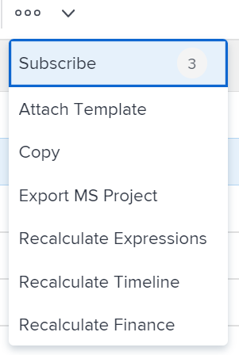

# Esportare un progetto in un progetto Microsoft

Puoi esportare i progetti Adobe Workfront in un progetto Microsoft. 

>[!IMPORTANT]
>
>* Non tutti i campi Workfront vengono trasferiti nel file di progetto Microsoft.\
   >  Per ulteriori informazioni sulla compatibilità dei campi tra Workfront e Microsoft Project, consulta l’articolo [Mappatura dei campi del progetto Microsoft su progetti Adobe Workfront](../../../manage-work/projects/manage-projects/map-ms-project-fields-to-workfront.md).
>* È consigliabile limitare il numero di volte in cui si trasferiscono i progetti da un’applicazione all’altra. 
>

## Requisiti di accesso

<!--drafted for P&P:

<table style="table-layout:auto"> 
 <col> 
 <col> 
 <tbody> 
  <tr> 
   <td role="rowheader">Adobe Workfront plan*</td> 
   <td> 
Any
 </td> 
  </tr> 
  <tr> 
   <td role="rowheader">Adobe Workfront license*</td> 
   <td>  
Current license: Light or higher

   Or
   
Legacy license: Review or higher
 </td> 
  </tr> 
  <tr> 
   <td role="rowheader">Access level configurations*</td> 
   <td> 
View or higher access to Projects
 
<b>NOTE</b> 
   
   If you still don't have access, ask your Workfront administrator if they set additional restrictions in your access level. For information about access to projects, see <a href="../../../administration-and-setup/add-users/configure-and-grant-access/grant-access-projects.md" class="MCXref xref">Grant access to projects</a>. For information on how a Workfront administrator can change your access level, see <a href="../../../administration-and-setup/add-users/configure-and-grant-access/create-modify-access-levels.md" class="MCXref xref">Create or modify custom access levels</a>. 
 </td> 
  </tr> 
  <tr> 
   <td role="rowheader">Object permissions</td> 
   <td> 
 View or higher permissions to the project
 
For information about project permissions, see <a href="../../../workfront-basics/grant-and-request-access-to-objects/share-a-project.md" class="MCXref xref">Share a project in Adobe Workfront</a>.
 
For information on requesting additional access, see <a href="../../../workfront-basics/grant-and-request-access-to-objects/request-access.md" class="MCXref xref">Request access to objects </a>.
 </td> 
  </tr> 
 </tbody> 
</table>
-->
Per eseguire i passaggi descritti in questo articolo, è necessario disporre dei seguenti diritti di accesso:

<table style="table-layout:auto"> 
 <col> 
 <col> 
 <tbody> 
  <tr> 
   <td role="rowheader">piano Adobe Workfront*</td> 
   <td> 
Qualsiasi
 </td> 
  </tr> 
  <tr> 
   <td role="rowheader">Licenza Adobe Workfront*</td> 
   <td> 
Revisione o superiore
 </td> 
  </tr> 
  <tr> 
   <td role="rowheader">Configurazioni a livello di accesso*</td> 
   <td> 
Visualizzare o accedere in modo più rapido ai progetti
 
<b>NOTA</b>

Se non disponi ancora dell’accesso, chiedi all’amministratore Workfront se ha impostato ulteriori restrizioni nel livello di accesso. Per informazioni sull&#39;accesso ai progetti, vedi <a href="../../../administration-and-setup/add-users/configure-and-grant-access/grant-access-projects.md" class="MCXref xref">Concedere l’accesso ai progetti</a>. Per informazioni su come un amministratore Workfront può modificare il livello di accesso, consulta <a href="../../../administration-and-setup/add-users/configure-and-grant-access/create-modify-access-levels.md" class="MCXref xref">Creare o modificare livelli di accesso personalizzati</a>. 
 </td>
</tr> 
  <tr> 
   <td role="rowheader">Autorizzazioni oggetto</td> 
   <td> 
 Visualizza o autorizzazioni superiori per il progetto
 
Per informazioni sulle autorizzazioni del progetto, consulta <a href="../../../workfront-basics/grant-and-request-access-to-objects/share-a-project.md" class="MCXref xref">Condivisione di un progetto in Adobe Workfront</a>.
 
Per informazioni sulla richiesta di accesso aggiuntivo, vedi <a href="../../../workfront-basics/grant-and-request-access-to-objects/request-access.md" class="MCXref xref">Richiedere l’accesso agli oggetti </a>.
 </td> 
  </tr> 
 </tbody> 
</table>

&#42;Per informazioni sul piano, il tipo di licenza o l&#39;accesso, contattare l&#39;amministratore Workfront.

## Esportare un progetto da Workfront a un progetto Microsoft

Puoi esportare un progetto da Workfront dalla pagina del progetto oppure da un elenco o da un rapporto di progetto.

1. Vai al progetto da esportare e fai clic sul pulsante **Altro** icona  a destra del nome del progetto

   

   Oppure

   Vai a un elenco o a un rapporto di progetto e seleziona un progetto, quindi fai clic sull’icona Altro  in cima all&#39;elenco.

   

1. Fai clic su **Esporta progetto MS**.

   Il progetto viene scaricato come file XML nel computer ed è pronto per essere importato in Microsoft Project. 
