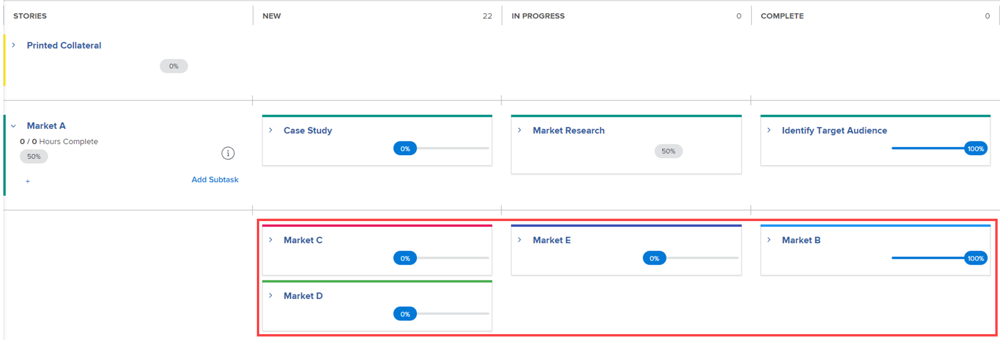

# Gestire un progetto nella visualizzazione Agile

{{preview-and-fast-release}}

<!--
Required plans, license types, and access

<table style="table-layout:auto"> 
 <col> 
 <col> 
 <tbody> 
  <tr> 
   <td> 
<a href="https://www.workfront.com/plans" target="_blank">Adobe Workfront Plan</a> 
 </td> 
   <td> 
Team, Pro, Business, or Enterprise 
 </td> 
  </tr> 
  <tr> 
   <td> 
Workfront License Type
 </td> 
   <td> 
Review, Work, or Plan 
 </td> 
  </tr> 
   <tr data-mc-conditions="QuicksilverOrClassic.Draft mode"> 
    <td> 
Permissions in the access model
 </td> 
    <td> <li>Edit access and ability to create reports, dashboards, and calendars</li> </td> 
   </tr>
 </tbody> 
</table>
-->

Puoi sfruttare le funzionalità agili per il tuo progetto senza le problematiche amministrative che in genere accompagnano le procedure agili (come la gestione del backlog di un team o la creazione di iterazioni).

Se desideri lavorare in un ambiente agile che utilizza un backlog team e ti consente di creare iterazioni dalle attività nel backlog, segui le istruzioni riportate in [Lavorare in un ambiente agile](../../../agile/work-in-an-agile-environment/work-in-an-agile-environment.md).

## Requisiti di accesso

Per eseguire i passaggi descritti in questo articolo, è necessario disporre dei seguenti diritti di accesso:

<table style="table-layout:auto"> 
 <col> 
 <col> 
 <tbody> 
  <tr> 
   <td role="rowheader">Piano Adobe Workfront*</td> 
   <td> 
Qualsiasi
 </td> 
  </tr> 
  <tr> 
   <td role="rowheader">Licenza Adobe Workfront*</td> 
   <td> 
Revisione o successiva
 </td> 
  </tr> 
  <tr> 
   <td role="rowheader">Configurazioni del livello di accesso*</td> 
   <td> 
Modifica accesso alle seguenti aree:
 
    <ul> 
     <li> 
Progetti
 </li> 
     <li> 
Report, dashboard, calendari
 </li> 
     <li> 
Filtri, Viste, Raggruppamenti
 </li> 
    </ul> 
Nota: se non disponi ancora dell’accesso, chiedi all’amministratore di Workfront se ha impostato restrizioni aggiuntive nel tuo livello di accesso. Per informazioni su come un amministratore di Workfront può modificare il tuo livello di accesso, consulta <a href="../../../administration-and-setup/add-users/configure-and-grant-access/create-modify-access-levels.md" class="MCXref xref">Creare o modificare livelli di accesso personalizzati</a>.
 </td> 
  </tr> 
  <tr> 
   <td role="rowheader">Autorizzazioni oggetto</td> 
   <td> 
Visualizzare le autorizzazioni per il progetto
 
Per informazioni sulla richiesta di accesso aggiuntivo, consulta <a href="../../../workfront-basics/grant-and-request-access-to-objects/request-access.md" class="MCXref xref">Richiedi accesso agli oggetti </a>.
 </td> 
  </tr> 
 </tbody> 
</table>

&#42;Per conoscere il piano, il tipo di licenza o l&#39;accesso di cui si dispone, contattare l&#39;amministratore Workfront.

## Comprendere i progetti Agile

>[!NOTE]
>
>Questa sezione si applica solo alla vista Agile legacy, non alla vista bacheca di un progetto.

* [Funzionalità Agile in un progetto](#agile-functionality-in-a-project)
* [Differenze quando si utilizza la vista Agile su un progetto rispetto a un’iterazione](#differences-when-using-the-agile-view-on-a-project-versus-on-an-iteration)

### Funzionalità Agile in un progetto {#agile-functionality-in-a-project}

La seguente funzionalità agile è disponibile quando gestisci un progetto in una visualizzazione agile:

* Stato di completamento\
  Per informazioni più dettagliate sullo stato di completamento, vedi [Panoramica sullo stato di completamento dell&#39;iterazione](../../../agile/use-scrum-in-an-agile-team/burndown/iteration-completion-status-overview.md).

* Storyboard\
  Per informazioni più dettagliate sulla bacheca delle storie, vedere [Bacheca Scrum](../../../agile/use-scrum-in-an-agile-team/scrum-board/scrum-board.md) sezione.

Esistono alcune differenze quando si utilizzano visualizzazioni agili su un progetto anziché in un ambiente agile puro (con backlog e iterazioni). Per ulteriori informazioni, consulta [Differenze quando si utilizza la vista Agile su un progetto rispetto a un’iterazione](#differences-when-using-the-agile-view-on-a-project-versus-on-an-iteration) in questo articolo.

### Differenze quando si utilizza la vista Agile su un progetto rispetto a un’iterazione {#differences-when-using-the-agile-view-on-a-project-versus-on-an-iteration}

* [Le attività e le sottoattività seguono regole di visualizzazione diverse sullo storyboard](#tasks-and-subtasks-follow-different-display-rules-on-the-story-board)
* [Backlog e iterazioni non utilizzati](#backlogs-and-iterations-are-not-used)
* [L&#39;ordine delle attività viene mantenuto nella vista Agile e non può essere riordinato](#task-order-is-maintained-in-the-agile-view-and-cannot-be-reordered)
* [Le attività vengono misurate solo nelle ore pianificate](#tasks-are-measured-only-in-planned-hours)
* [Il team Agile non è utilizzato](#the-agile-team-is-not-used)
* [Ogni utente del progetto può visualizzare il progetto in una visualizzazione Agile diversa](#each-user-on-the-project-can-view-the-project-in-a-different-agile-view)

#### Le attività e le sottoattività seguono regole di visualizzazione diverse sullo storyboard {#tasks-and-subtasks-follow-different-display-rules-on-the-story-board}

* Le attività che non hanno né un&#39;attività padre né un&#39;attività secondaria vengono sempre visualizzate come una singola scheda storia sullo storyboard.\
  Ad esempio, nella vista a elenco dei progetti vengono visualizzate le seguenti attività:

   Queste attività vengono visualizzate come segue nella visualizzazione agile del progetto:

  

* Le attività padre con sottoattività vengono sempre visualizzate nel **Storie** colonna dello storyboard. Le sottoattività vengono visualizzate nella corsia preferenziale dell&#39;attività padre.\
  Ad esempio, nella vista a elenco dei progetti vengono visualizzate le seguenti attività:

  \
  Queste attività vengono visualizzate come segue nella visualizzazione agile del progetto:

  

* Le sottoattività di secondo livello (sottoattività delle sottoattività) vengono visualizzate come una scheda grigia sporgente rispetto all’attività padre immediata.
* Le sottoattività di terzo livello (sottoattività delle sottoattività delle sottoattività) non vengono mai visualizzate sullo storyboard.

#### Backlog e iterazioni non utilizzati {#backlogs-and-iterations-are-not-used}

Quando si visualizza un progetto in una visualizzazione agile, i seguenti componenti agile non vengono utilizzati:

* **Backlog:** Non viene utilizzato alcun backlog perché tutte le attività del progetto vengono visualizzate automaticamente come storie.
* **Iterazioni:** Anziché creare iterazioni per definire le date in cui il lavoro verrà completato, i giorni attualmente indicati nella sequenza temporale del progetto diventano i giorni lavorativi.

#### L&#39;ordine delle attività viene mantenuto nella vista Agile e non può essere riordinato {#task-order-is-maintained-in-the-agile-view-and-cannot-be-reordered}

L&#39;ordine in cui le attività vengono visualizzate in un progetto viene mantenuto quando si visualizza il progetto in una bacheca delle storie agile.

Non è possibile riordinare le attività nel progetto quando si visualizza il progetto in una visualizzazione agile. Poiché la modifica dell&#39;ordine delle attività può influire su altre attività che potrebbero avere dipendenze, è necessario visualizzare il progetto in una visualizzazione standard per modificare l&#39;ordine delle attività.

#### Le attività vengono misurate solo nelle ore pianificate {#tasks-are-measured-only-in-planned-hours}

Le attività di un progetto sono sempre misurate in Ore Pianificate.

In un’iterazione, le attività (storie) possono essere misurate in ore o punti.

#### Il team Agile non è utilizzato {#the-agile-team-is-not-used}

Poiché i team Agile completano il lavoro sulle iterazioni loro assegnate, non vengono utilizzati quando si visualizza un progetto in una visualizzazione Agile.

Invece, tutti gli utenti del progetto diventano essenzialmente il team agile di quel progetto.

#### Ogni utente del progetto può visualizzare il progetto in una visualizzazione Agile diversa {#each-user-on-the-project-can-view-the-project-in-a-different-agile-view}

A differenza di un’iterazione agile, gli utenti di un progetto possono personalizzare la visualizzazione agile autonomamente, mentre altri utenti utilizzano una visualizzazione agile diversa.

In un’iterazione Agile, le informazioni disponibili sullo storyboard Agile (come le colonne di stato disponibili) vengono determinate a livello di team.

Per informazioni su come personalizzare una visualizzazione agile, consulta [Creare o personalizzare una visualizzazione Agile](../../../reports-and-dashboards/reports/reporting-elements/views-overview.md#customizing-an-agile-view) in [Panoramica delle visualizzazioni in Adobe Workfront](../../../reports-and-dashboards/reports/reporting-elements/views-overview.md).

## Visualizzare un progetto nella visualizzazione Agile

1. Passare al progetto che si desidera visualizzare in una visualizzazione agile nell&#39;elenco delle attività o l’elenco dei problemi.
1. Fai clic su **Scheda madre** icona .

   La vista bacheca del progetto viene visualizzata per impostazione predefinita.

   

   <!--(Legacy agile view only) If you previously viewed the project in a custom agile view, the project is displayed in that view rather than in the default agile view.-->

1. (Facoltativo) Fai clic su **Configura** per impostare le opzioni per le colonne e le schede.

   Per ulteriori informazioni, consulta [Gestisci colonne bacheca](/help/quicksilver/agile/get-started-with-boards/manage-board-columns.md) e [Personalizzare i campi visualizzati su una scheda](/help/quicksilver/agile/get-started-with-boards/customize-fields-on-card.md). Non è possibile definire i criteri di colonna nella vista bacheca di un progetto.

1. (Facoltativo) Fai clic su **Usa agile legacy** per utilizzare la vista agile legacy invece della vista bacheca.

1. (Facoltativo - solo vista agile legacy) Se hai creato una vista agile personalizzata o se un altro utente ha creato una vista agile personalizzata e l’ha condivisa con te, puoi visualizzarla al posto della vista agile predefinita.

   Fai clic su **Visualizza** , quindi fare clic sulla visualizzazione agile personalizzata che si desidera visualizzare.

   La visualizzazione agile personalizzata viene utilizzata la volta successiva che fai clic su **Agile** icona.

   Per informazioni su come creare una nuova visualizzazione agile, consulta [Creare e personalizzare viste Agile](#create-and-customize-agile-views).

   Il progetto viene visualizzato nella visualizzazione agile personalizzata.

1. (Condizionale - solo per la visualizzazione agile legacy) Se le attività nel progetto utilizzano stati diversi da &quot;Nuovo&quot;, &quot;In corso&quot; o &quot;Completo&quot; (stati predefiniti per la visualizzazione agile), è necessario aggiungere gli stati aggiuntivi alla visualizzazione agile affinché vengano visualizzate tutte le attività con tali stati.

   Se le attività si trovano in uno stato che non viene visualizzato sullo storyboard Agile, l&#39;attività stessa non viene visualizzata sullo storyboard Agile (tuttavia, la percentuale di completamento di queste attività contribuisce ancora alla percentuale di completamento di tutte le attività padre e alla percentuale di completamento del progetto complessivo).

   Per aggiungere stati alla vista Agile, crea una nuova vista Agile o personalizza una vista Agile esistente, come descritto nella sezione &quot;Creare o personalizzare una vista Agile&quot; nell’articolo [Panoramica delle visualizzazioni in Adobe Workfront](../../../reports-and-dashboards/reports/reporting-elements/views-overview.md).

1. (Facoltativo) Per tornare alla vista a elenco, fai clic sul pulsante **Elenco** icona.

## Creare e personalizzare viste Agile {#create-and-customize-agile-views}

>[!NOTE]
>
>Questa sezione si applica solo alla vista Agile legacy, non alla vista bacheca di un progetto.

Come per le viste standard in Workfront, puoi personalizzare le viste agili esistenti o crearne di nuove da zero. A differenza delle viste standard, non è possibile creare nuove viste agili basate su viste agili esistenti.

Per ulteriori informazioni sulla creazione e la personalizzazione di viste Agile, consultate la sezione &quot;Creare o personalizzare una vista Agile&quot; nell&#39;articolo [Panoramica delle visualizzazioni in Adobe Workfront](../../../reports-and-dashboards/reports/reporting-elements/views-overview.md).

## Condividere una visualizzazione Agile esistente

>[!NOTE]
>
>Questa sezione si applica solo alla vista Agile legacy, non alla vista bacheca di un progetto.

Per informazioni su come condividere una visualizzazione agile, consulta [Condividere un filtro, una visualizzazione o un raggruppamento](../../../reports-and-dashboards/reports/reporting-elements/share-filter-view-grouping.md).

## Rimuovi una vista Agile esistente

>[!NOTE]
>
>Questa sezione si applica solo alla vista Agile legacy, non alla vista bacheca di un progetto.

Per informazioni sull&#39;eliminazione di una visualizzazione, vedere la sezione &quot;Rimuovere una visualizzazione&quot; nell&#39;articolo [Panoramica delle visualizzazioni in Adobe Workfront](../../../reports-and-dashboards/reports/reporting-elements/views-overview.md).
