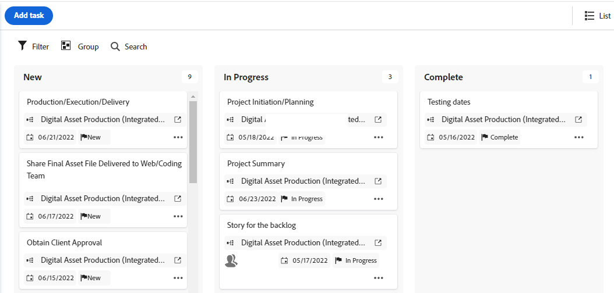

# Gestire un progetto nella visualizzazione Agile

<!-- Audited: 2/2024 -->

Puoi sfruttare le funzionalità agili per il tuo progetto senza le problematiche amministrative che in genere accompagnano le procedure agili (come la gestione del backlog di un team o la creazione di iterazioni).

Se si desidera lavorare in un ambiente agile che utilizza un backlog team e consente di creare iterazioni dalle attività nel backlog, seguire le istruzioni in [Operazioni in un ambiente agile](../../../agile/work-in-an-agile-environment/work-in-an-agile-environment.md).

## Requisiti di accesso

+++ Espandi per visualizzare i requisiti di accesso per la funzionalità in questo articolo.

Per eseguire i passaggi descritti in questo articolo, è necessario disporre dei seguenti diritti di accesso:

<table style="table-layout:auto"> 
 <col> 
 <col> 
 <tbody> 
  <tr> 
   <td role="rowheader">piano Adobe Workfront</td> 
   <td> 
Qualsiasi
 </td> 
  </tr> 
  <tr> 
   <td role="rowheader">Licenza Adobe Workfront</td> 
   <td> 
Corrente: revisione o versione successiva
 
   
Nuovo: Collaboratore o versione successiva
 </td> 
  </tr> 
  <tr> 
   <td role="rowheader">Configurazione del livello di accesso</td> 
   <td> 
Modifica accesso alle seguenti aree:
 
    <ul> 
     <li> 
Progetti
 </li> 
     <li> 
Report, dashboard, calendari
 </li> 
     <li> 
Filtri, Viste, Raggruppamenti
 </li> 
    </ul> </td> 
  </tr> 
  <tr> 
   <td role="rowheader">Autorizzazioni oggetto</td> 
   <td> 
Visualizzare le autorizzazioni per il progetto
  </td> 
  </tr> 
 </tbody> 
</table>

Per ulteriori dettagli sulle informazioni contenute in questa tabella, vedere [Requisiti di accesso nella documentazione di Workfront](/help/quicksilver/administration-and-setup/add-users/access-levels-and-object-permissions/access-level-requirements-in-documentation.md).

+++

## Visualizzare un progetto nella visualizzazione Agile

1. Vai al progetto che desideri visualizzare in una visualizzazione agile, sull’elenco delle attività o sull’elenco dei problemi.
1. Fai clic sull&#39;icona **Vista bacheca** .

   La vista bacheca del progetto viene visualizzata per impostazione predefinita.

   

1. (Facoltativo) Fai clic su **Configura** per impostare le opzioni per le colonne e le schede.

   Per ulteriori informazioni, vedere [Gestire le colonne della bacheca](/help/quicksilver/agile/get-started-with-boards/manage-board-columns.md) e [Personalizzare i campi visualizzati in una scheda](/help/quicksilver/agile/get-started-with-boards/customize-fields-on-card.md). Non è possibile definire i criteri di colonna nella vista bacheca di un progetto.

1. (Facoltativo) Per tornare alla vista a elenco, fai clic sull&#39;icona **Elenco**.
