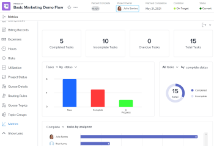
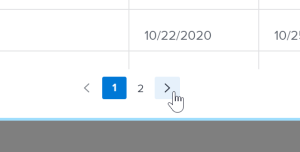

# Panoramica delle metriche del progetto

Le metriche del progetto forniscono una visualizzazione generale delle prestazioni di un progetto in formato grafico.

## Requisiti di accesso

<table style="table-layout:auto"> 
 <col> 
 <col> 
 <tbody> 
  <tr> 
   <td role="rowheader">Piano Workfront*</td> 
   <td> 
Qualsiasi
 </td> 
  </tr> 
  <tr> 
   <td role="rowheader">Licenza Workfront*</td> 
   <td> 
Revisione o superiore 
 </td> 
  </tr> 
  <tr> 
   <td role="rowheader">Livello di accesso*</td> 
   <td> 
Visualizza accesso a progetti
 
<b>NOTA</b>

Se non disponi ancora dell’accesso, chiedi all’amministratore Workfront se ha impostato ulteriori restrizioni nel livello di accesso. Per informazioni sull&#39;accesso ai progetti, vedi <a href="../../../administration-and-setup/add-users/configure-and-grant-access/grant-access-projects.md" class="MCXref xref">Concedere l’accesso ai progetti</a>. Per informazioni su come un amministratore Workfront può modificare il livello di accesso, consulta <a href="../../../administration-and-setup/add-users/configure-and-grant-access/create-modify-access-levels.md" class="MCXref xref">Creare o modificare livelli di accesso personalizzati</a>. 
 </td>
</tr> 
  <tr> 
   <td role="rowheader">Autorizzazioni oggetto</td> 
   <td> 
Visualizzare le autorizzazioni per un progetto
 
 Per informazioni sulle autorizzazioni del progetto, consulta <a href="../../../workfront-basics/grant-and-request-access-to-objects/share-a-project.md" class="MCXref xref">Condivisione di un progetto in Adobe Workfront</a>.
 
Per informazioni sulla richiesta di accesso aggiuntivo, vedi <a href="../../../workfront-basics/grant-and-request-access-to-objects/request-access.md" class="MCXref xref">Richiedere l’accesso agli oggetti </a>.
 </td> 
  </tr> 
 </tbody> 
</table>

*Per sapere quale piano, tipo di licenza o accesso si dispone, contattare l&#39;amministratore Workfront.

## Prerequisiti

Per accedere all’area Metriche dal pannello a sinistra di un progetto, devi:

* Abilitare l’opzione Metriche del pannello a sinistra nell’area Progetti del modello di layout.

   Per scoprire come un amministratore di gruppo o di Workfront può personalizzare il pannello di sinistra con un modello di layout, consulta [Personalizzare il pannello a sinistra utilizzando un modello di layout](../../../administration-and-setup/customize-workfront/use-layout-templates/customize-left-panel.md).

## Panoramica dell’area Metriche del progetto

Le metriche del progetto forniscono una visualizzazione di ciò che sta accadendo in un progetto, consentendoti di valutare rapidamente le esigenze e lo stato di un progetto.

Nell’area Metriche puoi vedere lo stato generale di un progetto e:

* Dove il lavoro è attivo o bloccato
* A chi sono assegnati gli elementi di lavoro aperti
* Dettagli su attività o problemi in ritardo o prossimi alla data di completamento pianificata

È inoltre possibile eseguire un drill-in a ciascun grafico per esaminare più da vicino le attività o i problemi di una categoria specifica.

Per ulteriori informazioni su questi compiti o problemi, consulta [Visualizzare i dettagli delle metriche](#view-metrics-details).

>[!TIP]
>
>Per visualizzare le metriche a un livello superiore per un gruppo di progetti all’interno di un programma, un portfolio, ecc., passa all’area Analisi avanzata.\
>Per ulteriori informazioni sull’analisi avanzata, consulta [Panoramica dell’analisi migliorata](../../../enhanced-analytics/enhanced-analytics-overview.md).

## KPI del progetto

Gli indicatori prestazioni chiave (KPI, Key Performance Indicators) vengono visualizzati nella parte superiore dell’area Metriche.

Questi KPI sono suddivisi nelle seguenti categorie:

| Attività completate | **Attività completate** mostra il numero di attività in uno stato Completa. Questo numero include anche le attività con uno stato personalizzato che equivale a Completa. |
|---|---|
| Attività incomplete | **Attività incomplete** mostra il numero di attività che non si trovano in uno stato Completo o Chiuso o uno stato che equivale a Completo. |
| Attività scadute | **Attività scadute** mostra il numero di attività che superano la data di completamento pianificata e che non si trovano in uno stato Completo o Chiuso o in uno stato che equivale a Completo o Chiuso. |
| Totale attività | **Totale attività** mostra il numero totale di attività nel progetto. |

>[!TIP]
>
>Per visualizzare un elenco di elementi di lavoro per un indicatore KPI specifico, fare clic su tale indicatore. In tale elenco, è possibile fare clic su un elemento di lavoro specifico per visualizzare ulteriori dettagli in una nuova scheda.\
>\
>Per ulteriori informazioni, consulta [Visualizzare i dettagli delle metriche](#view-metrics-details).

## Grafico a barre dei problemi o delle attività

Nel grafico a barre visualizzato sotto i KPI del progetto è possibile esaminare lo stato o la priorità degli elementi di lavoro nel progetto. La visualizzazione attività è selezionata per impostazione predefinita.

Quando lo stato è selezionato in questo grafico, è possibile visualizzare tutti gli stati delle attività o dei problemi di un progetto. Ogni stato è raggruppato in una barra del grafico. In questo grafico vengono visualizzati tutti gli stati di sistema predefiniti e gli stati personalizzati.

Quando si seleziona la priorità in questo grafico, è possibile visualizzare tutte le priorità di attività o problemi di un progetto.

>[!TIP]
>
>Per visualizzare un elenco di elementi di lavoro con uno stato o una priorità specifici, fare clic su una barra nel grafico. In tale elenco, è possibile fare clic su un elemento di lavoro specifico per visualizzare ulteriori dettagli in una nuova scheda.\
>\
>Per ulteriori informazioni, consulta [Visualizzare i dettagli delle metriche](#view-metrics-details).

## Grafico a torta

Il grafico ad anello situato sotto i KPI del progetto consente di esaminare il rapporto tra elementi di lavoro completati e elementi di lavoro incompleti in un progetto.

Nel menu a discesa sopra il grafico, puoi selezionare:

| Tutte le attività | Selezione **attività** mostra il numero totale di attività nel progetto e il rapporto tra attività completate e attività incomplete. |
|---|---|
| Tutti i problemi | Selezione **questioni** mostra il numero totale di problemi nel progetto, nonché il rapporto tra problemi completati e problemi incompleti. |

>[!TIP]
>
>Per visualizzare un elenco degli elementi di lavoro completati o incompleti, fare clic su tale sezione nel grafico ad anello. In tale elenco, è possibile fare clic su un elemento di lavoro specifico per visualizzare ulteriori dettagli in una nuova scheda.\
>\
>Per ulteriori informazioni, consulta [Visualizzare i dettagli delle metriche](#view-metrics-details).

## Grafico a barre assegnato

Il grafico a barre degli assegnatari mostra il numero di attività assegnate a ogni persona del progetto. Questo numero varia in base alla categoria selezionata dal menu a discesa.

È possibile scegliere di esaminare le assegnazioni delle attività per un progetto nelle seguenti categorie:

| Completato | Selezione **Completa** mostra il numero di attività assegnate a ciascun utente che sono state completate. |
|---|---|
| Incompleto | Selezione **Incompleto** mostra il numero di attività assegnate a ciascun utente che non sono ancora state completate. |
| In arrivo | Selezione **Prossima** mostra il numero di attività assegnate a ciascun utente che non hanno ancora raggiunto la data di inizio pianificata. |
| In ritardo | Selezione **Scaduto** mostra il numero di attività assegnate a ciascun utente che superano la data di completamento pianificata e non sono ancora state completate. |

>[!TIP]
>
>Per visualizzare un elenco degli elementi di lavoro della categoria selezionata assegnati a un utente specifico, fare clic sulla barra accanto al nome dell&#39;utente nel grafico. In tale elenco, è possibile fare clic su un elemento di lavoro specifico per visualizzare ulteriori dettagli in una nuova scheda.\
>\
>Per ulteriori informazioni, consulta [Visualizzare i dettagli delle metriche](#view-metrics-details).

## Visualizzare i dettagli delle metriche {#view-metrics-details}

È possibile interagire con i grafici nell’area Metriche per esaminare diversi aspetti di un grafico o per esaminare più da vicino le attività e i problemi di un grafico.

1. Passa al progetto per il quale desideri visualizzare le metriche.
1. Nel pannello a sinistra, fai clic su **Mostra altro** per visualizzare altre sezioni, fai clic su **Metriche**.\
   Per impostazione predefinita, i grafici nell’area Metriche visualizzano le informazioni relative alle attività.\
   

1. (Condizionale) Se in un grafico è visualizzata una freccia a discesa, fai clic sul pulsante **Freccia a discesa** icona  nel grafico e selezionare l&#39;opzione desiderata dal menu.\
   Per informazioni sulle opzioni visualizzate nei menu di ciascun grafico, vedere la sezione relativa sopra.

1. (Facoltativo) Per esaminare più da vicino le attività o i problemi relativi a qualsiasi metrica nella pagina, procedi come segue:

   1. Fai clic sull’elemento, ad esempio le attività assegnate a un utente specifico, i problemi con priorità elevata o tutte le attività scadute, per il quale desideri visualizzare i dettagli.

      Viene visualizzato un elenco di attività o problemi.

      

   1. Utilizzare le frecce nella parte inferiore dell&#39;elenco per individuare l&#39;attività o il problema che si desidera esaminare.

      Oppure

      Selezionare un numero specifico per visualizzare attività o problemi su una pagina specifica.

      

   1. Seleziona un’attività o un problema per visualizzare ulteriori dettagli.

      L’attività o il problema si apre in una nuova scheda.

1. (Facoltativo) Per esportare il dashboard delle metriche del progetto in un file .png, fai clic sul pulsante **Esporta** icona , quindi seleziona **Esporta come PNG** dal menu a discesa.

   >[!TIP]
   >
   >Quando si esporta il dashboard, il file esportato include solo ciò che attualmente viene visualizzato nel riquadro di visualizzazione. Per includere alcuni elementi nel file esportato, potrebbe essere necessario scorrere verso l&#39;alto o verso il basso sulla pagina o regolare le impostazioni di zoom del browser.
