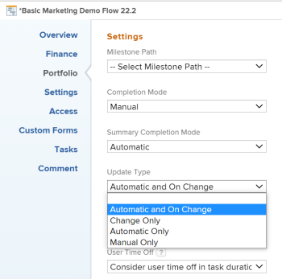

# Ricalcolare i timeline dei progetti

<!--Audited: 06/2025-->

Il ricalcolo delle sequenze temporali consente ai responsabili di vedere in che modo fattori diversi correlati al progetto influiscono sulla sequenza temporale del progetto. La tempistica di un progetto si riferisce a date pianificate e previste.

Le modifiche apportate alle pianificazioni, alle ferie del personale e ad altri elementi al di fuori dell’ambito di un progetto non influiscono immediatamente sulla sequenza temporale del progetto. La sequenza temporale del progetto è interessata dal ricalcolo. Le influenze esterne non hanno effetto sul progetto fino a quando non si verifica il ricalcolo.

Questo articolo descrive i modi in cui si verifica il ricalcolo della sequenza temporale.

Il ricalcolo automatico della sequenza temporale viene eseguito senza l&#39;accesso speciale per gli utenti coinvolti nel progetto. Inoltre, è possibile ricalcolare manualmente la timeline.

## Requisiti di accesso

+++ Espandi per visualizzare i requisiti di accesso per la funzionalità in questo articolo.

<table style="table-layout:auto"> 
 <col> 
 <col> 
 <tbody> 
  <tr> 
   <td role="rowheader">piano Adobe Workfront</td> 
   <td> 
Qualsiasi
 </td> 
  </tr> 
  <tr> 
   <td role="rowheader">Licenza Adobe Workfront*</td> 
   <td> 
Nuova licenza: Standard 
 
   Oppure
   
Licenza corrente: Piano 

   </td> 
  </tr> 
  <tr> 
   <td role="rowheader">Configurazioni del livello di accesso</td> 
   <td> 
Modifica accesso ai progetti
 
L’amministratore di sistema ricalcola la timeline per tutti i progetti nel sistema
  </td> 
  </tr> 
  <tr> 
   <td role="rowheader">Autorizzazioni oggetto</td> 
   <td> 
Gestire le autorizzazioni per un progetto
  </td> 
  </tr> 
 </tbody> 
</table>

*Per informazioni, consulta [Requisiti di accesso nella documentazione di Workfront](/help/quicksilver/administration-and-setup/add-users/access-levels-and-object-permissions/access-level-requirements-in-documentation.md).

+++

## Ricalcolo automatico

Per impostazione predefinita, le sequenze temporali del progetto vengono ricalcolate automaticamente ogni giorno quando l’ambito del progetto cambia o ogni notte. L’amministratore di Workfront determina se calcolare automaticamente le timeline ogni notte o con ogni modifica dell’ambito gestendo le impostazioni delle Timeline nell’area Preferenze progetto di Configura. Per ulteriori informazioni, vedere [Configurare i ricalcoli della sequenza temporale per i progetti](../../../administration-and-setup/set-up-workfront/configure-system-defaults/configure-timeline-recalculations-projects.md).

>[!NOTE]
>
>Se la cronologia di un progetto supera i 15 anni, il ricalcolo automatico viene disattivato per tale progetto. È possibile selezionare solo il tipo di aggiornamento Manuale per un progetto di durata superiore a 15 anni. Se si modificano le date del progetto in meno di 15 anni, è necessario ricalcolare manualmente la sequenza temporale una volta prima che venga calcolata automaticamente.

* [Ricalcolo automatico delle sequenze temporali del progetto](#automatic-recalculation-of-project-timelines)
* [Azioni che attivano il ricalcolo automatico delle sequenze temporali del progetto](#actions-that-trigger-an-automatic-recalculation-of-project-timelines)

>[!IMPORTANT]
>
>Per gli ambienti Sandbox di anteprima e aggiornamento personalizzato, il ricalcolo notturno è disattivato e le timeline del progetto non vengono ricalcolate automaticamente. Devi ricalcolare manualmente la timeline del progetto per gli ambienti Sandbox di anteprima e aggiornamento personalizzati.

### Ricalcolo automatico delle sequenze temporali del progetto {#automatic-recalculation-of-project-timelines}

Adobe Workfront ricalcola le sequenze temporali ogni giorno solo per i progetti in cui sono soddisfatte tutte le seguenti condizioni:

* Hanno lo stato Attuale
* Tipo di aggiornamento del progetto è impostato su Automatico o Automatico e su In modifica

  Per informazioni sul tipo di aggiornamento del progetto, vedere [Panoramica sul tipo di aggiornamento del progetto](../../../manage-work/projects/planning-a-project/project-update-type-overview.md).

* Hanno una data dell’ultimo aggiornamento negli ultimi tre mesi\
  L&#39;amministratore di Workfront può modificare questa funzionalità predefinita, come descritto in [Configurare i ricalcoli della sequenza temporale per i progetti](../../../administration-and-setup/set-up-workfront/configure-system-defaults/configure-timeline-recalculations-projects.md).

* L&#39;ultima data di calcolo della sequenza temporale del progetto non rientra nel giorno di calendario corrente. Ciò significa che la data dell&#39;ultimo calcolo della sequenza temporale del progetto è precedente alle 00:00 del giorno corrente.

Puoi configurare la frequenza con cui viene aggiornata la timeline per il progetto. Quando la sequenza temporale del progetto viene aggiornata, viene ricalcolata in base alle modifiche apportate al progetto.

<!--
<MadCap:conditionalText data-mc-conditions="QuicksilverOrClassic.Draft mode">
or changes made to another project that the timeline is dependent on
</MadCap:conditionalText>
-->

<!--

(NOTE: above, the last part is drafted because of this: I don't think this is right because we told people that in the case of cross-project predecessors, the timeline must be calculated manually for the successor to see the updates in the predecessor's project. Drafting for now.)

-->

Per informazioni, vedere [Selezionare il tipo di aggiornamento del progetto](../../../manage-work/projects/manage-projects/select-project-update-type.md).

<!--

(NOTE:&nbsp;content moved to the article linked above)

You can configure how the timeline for your project is updated:

<ol>
<li value="1">Go to the project for which you want to configure how the timeline is updated.</li>
<li value="2"> 
  Click the <strong>More</strong> icon  to the right of the project name, then click&nbsp; <strong>Edit</strong>. 
 
The <strong>Edit Project</strong> dialog box is displayed.
 </li>
<li value="3"> 
Click<strong>Settings.</strong> 
 </li>
<li value="4">In the <strong>Update Type</strong> drop-down list, select from the following options: <strong>- Automatic and On Change:</strong> (Default setting) The project timeline is updated each time a change occurs in the project or in another project that the timeline is dependent on. The project timeline is also updated each night.  This is the recommended setting for this field because it ensures that the project timeline is always up to date. When you update a task or the project and trigger a timeline recalculation, all available dates are immediately displayed, allowing you to continue working. On projects with more than 100 tasks, dates that require longer calculations are dimmed.

 This indicates that the recalculation is not yet finished, and the dates are subject to change.  <strong>- Change Only:</strong> The project timeline is updated each time a change occurs in the project or in another project that the timeline is dependent on; scheduled updates do not occur. You might want to select this option if changes rarely occur in the project or in other projects that the timeline is dependent on. <strong>- Automatic Only:</strong> The project timeline is updated each night; it is not updated immediately after changes are made. You might want to select this option if many changes occur each day in the project or in other projects that the timeline is dependent on. <note type="note">
A project does not automatically recalculate each night if it is in Planning status. It only recalculates on change.
</note> <strong>- Manual Only:</strong> The project timeline is updated only when you select the option to Recalculate Timelines, as described in <a href="#manual-recalculation" class="MCXref xref">Manual recalculation</a>. You might want to select this option if you are making many changes to the project at one time, and you want the timeline recalculation to occur after all of the changes have been made (rather than after each individual change). For more information about the project Update Type, see <a href="../../../manage-work/projects/manage-projects/select-project-update-type.md" class="MCXref xref">Select the project Update Type </a><note type="note">
If the timeline of a project is longer than 15 years, the automatic recalculation is disabled. If you change the dates on the project to less than 15 years, you must manually recalculate your timeline one time before it is calculated automatically.
</note></li>
<li value="5">Click <strong>Save Changes.</strong></li>
</ol>

-->

### Azioni che attivano il ricalcolo automatico delle sequenze temporali del progetto {#actions-that-trigger-an-automatic-recalculation-of-project-timelines}

Varie modifiche di ambito nella durata di un progetto ricalcolano automaticamente la sequenza temporale del progetto, incluse le azioni seguenti:

* Aggiornamento dello stato dell&#39;attività.
* Spostamento di un&#39;attività in un progetto diverso.
* Aggiornamento della data pianificata o delle date di completamento pianificate delle attività.
* Aggiornamento del tipo di durata, del vincolo dell&#39;attività o del numero di assegnatari delle attività.
* Aggiornamento delle relazioni dei predecessori delle attività.
* Aggiungendo un&#39;approvazione a un&#39;attività si aggiunge anche del tempo alla Data di completamento pianificata dell&#39;attività.\
  Per ulteriori informazioni sulle impostazioni di approvazione, vedere [Configurare le impostazioni di approvazione globali](../../../administration-and-setup/customize-workfront/configure-approval-milestone-processes/establish-approval-settings.md).

## Ricalcolo manuale {#manual-recalculation}

In qualità di proprietario di un progetto, puoi ricalcolare manualmente le tempistiche per i singoli progetti. L’amministratore di Workfront può ricalcolare manualmente tutte le timeline in Workfront.

* [Ricalcolare i timeline per singoli progetti o in blocco](#recalculate-timelines-for-individual-projects-or-in-bulk)
* [Ricalcolare manualmente le timeline in blocco nella casella Modifica progetti](#manually-recalculate-timelines-in-bulk-in-the-edit-projects-box)
* [Ricalcolare le tempistiche per tutti i progetti nel sistema (solo per amministratori Workfront)](#recalculate-timelines-for-all-projects-in-the-system-workfront-administrators-only)

### Ricalcolare le tempistiche per singoli progetti o in blocco {#recalculate-timelines-for-individual-projects-or-in-bulk}

È possibile ricalcolare la sequenza temporale di un progetto in Workfront dalla pagina del progetto o da un elenco o report di progetti.

1. Vai al progetto per il quale vuoi ricalcolare la timeline e fai clic sull&#39;icona **Altro**  a sinistra del nome del progetto

   

   Oppure

   Vai a un elenco o a un report di progetti e seleziona uno o più progetti, quindi fai clic sull&#39;icona **Altro**  nella parte superiore dell&#39;elenco.

   

   >[!TIP]
   >
   >A seconda della complessità dei progetti, si consiglia di non selezionare un numero elevato di progetti durante il ricalcolo in blocco delle rispettive sequenze temporali per garantire prestazioni ottimali. Alcuni elementi che potrebbero rendere un progetto troppo complesso potrebbero essere più dipendenze o assegnazioni o un numero elevato di campi personalizzati.

1. Fare clic su **Ricalcola sequenza temporale**.

   Dopo il ricalcolo della sequenza temporale, viene visualizzato un messaggio che indica che il ricalcolo è stato eseguito correttamente.

   >[!TIP]
   >
   >Prima che il ricalcolo della sequenza temporale sia completato, alcune date pianificate o previste potrebbero apparire inattive. Ciò significa che il ricalcolo non è ancora terminato e che le date sono soggette a modifiche.

### Ricalcolare manualmente le sequenze temporali in blocco nella casella Modifica progetti {#manually-recalculate-timelines-in-bulk-in-the-edit-projects-box}

Puoi ricalcolare manualmente le timeline di diversi progetti modificandoli in blocco.

>[!TIP]
>
>A seconda della complessità dei progetti, si consiglia di non selezionare un numero elevato di progetti quando li si modifica in blocco per garantire prestazioni ottimali. Alcuni elementi che potrebbero rendere un progetto troppo complesso potrebbero essere più dipendenze o assegnazioni o un numero elevato di campi personalizzati.

1. Consente di passare a un elenco di progetti.
1. Seleziona diversi progetti nell&#39;elenco, quindi fai clic su **Modifica**.
1. Fai clic su **Impostazioni**, quindi seleziona **Ricalcola timeline**.

1. Fai clic su **Salva modifiche**.

### Ricalcolare le tempistiche per tutti i progetti nel sistema (solo per amministratori Workfront) {#recalculate-timelines-for-all-projects-in-the-system-workfront-administrators-only}

Gli amministratori di Workfront possono eseguire la diagnostica Ricalcola sequenza temporale per ricalcolare immediatamente tutte le sequenze temporali nel sistema Workfront. Questo consente a tutti i project manager di visualizzare immediatamente l&#39;influenza di modifiche esterne sia nelle date pianificate che in quelle previste.

Per ulteriori informazioni sul ricalcolo delle sequenze temporali per l&#39;intero sito Workfront, vedere la sezione &quot;Ricalcolare le sequenze temporali per l&#39;intera istanza Workfront&quot; in [Configurare i ricalcoli delle sequenze temporali per i progetti](../../../administration-and-setup/set-up-workfront/configure-system-defaults/configure-timeline-recalculations-projects.md).

<!--

<h2>Project Update Types</h2>

(NOTE: drafted and moved to thisa rticle: /Content/Manage work/Projects/Planning a Project/project-update-type-overview.htm)

For information about how to update the project's Update Type, see <a href="../../../manage-work/projects/manage-projects/select-project-update-type.md" class="MCXref xref">Select the project Update Type </a>. 
 <note type="important">
If the timeline of a project is longer than 15 years, Workfront does not calculate the timeline automatically or on change. The Update Type of a project longer than 15 years is always Manual.
</note>

You can select how each project calculates its timeline by choosing between the following Update Types:
 <note type="important">
If the timeline of a project is longer than 15 years, Workfront does not calculate the timeline automatically or on change. The Update Type of a project longer than 15 years is always Manual.
</note>
<ul>
<li> 
<strong>Automatic and On Change:</strong>&nbsp;This is the default setting. The project timeline is updated each time a change occurs&nbsp;in the project or in another project that the timeline is dependent on. The project timeline is also updated each night.&nbsp;  This is the recommended setting as it ensures that the project timeline is always up to date.
 
When you update a task or the project and trigger a timeline recalculation, all available dates are immediately displayed, allowing you to continue working. On projects with more than 100 tasks, dates that require longer calculations are dimmed. 
 
  
 
This indicates that the recalculation is not yet finished, and the dates are subject to change. 
 </li>
<li><strong>Change Only:</strong>&nbsp;The project timeline is updated each time a change occurs in the project or in another project that the timeline is dependent on; scheduled updates do not occur.  You might want to select this option if you are concerned about system performance and if&nbsp;changes rarely occur in the project or in other projects that the timeline is dependent on.</li>
<li> 
<strong>Automatic Only:</strong>&nbsp;The project timeline is updated each night; it is not updated immediately after changes are made. You might want to select this option if you are concerned about system performance and if many changes occur each day in the project or in other projects that the timeline is dependent on.
 <note type="note">
A project does not automatically recalculate each night if it is in Planning status. It only recalculates on change.
</note> </li>
<li><strong>Manual Only:</strong>&nbsp;The project timeline is updated only&nbsp;when you select the option to <strong>Recalculate Timelines</strong>, as described in the section "Manual Recalculation" in&nbsp;the article <a href="#" class="MCXref xref selected">Recalculate project timelines</a>. You might want to select this option if you are making many changes to the project at one time, and you want the timeline recalculation to occur after all of the changes have been made (rather than after each individual change).</li>
</ul>

-->
