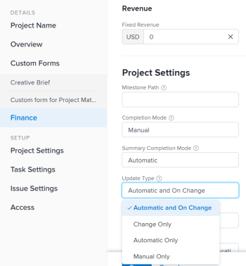

# Selezionare il tipo di aggiornamento del progetto

Selezionando un Tipo di aggiornamento per un progetto, è possibile controllare la frequenza con cui le modifiche apportate alla sequenza temporale del progetto vengono salvate nelle attività padre o nel progetto.

Quando la sequenza temporale del progetto viene aggiornata, viene ricalcolata in base alle modifiche apportate al progetto, alle relative attività o alle modifiche apportate a un altro progetto da cui dipende la sequenza temporale.

Ad esempio, le seguenti modifiche apportate alle attività del progetto attivano un aggiornamento della sequenza temporale del progetto:

* Aggiornare le date delle attività
* Modificare le relazioni dei predecessori delle attività
* Consente di modificare le relazioni padre-figlio, aggiungendo o rimuovendo assegnazioni e modificando il vincolo attività o il tipo di durata.

## Requisiti di accesso

+++ Espandi per visualizzare i requisiti di accesso per la funzionalità descritta in questo articolo. 

<table style="table-layout:auto"> 
 <col> 
 <col> 
 <tbody> 
  <tr> 
   <td role="rowheader">Pacchetto Adobe Workfront</td> 
   <td> 
Qualsiasi
 </td> 
  </tr> 
  <tr> 
   <td role="rowheader">Licenza di Adobe Workfront</td> 
   <td>
Standard
 
   
Piano
 </td> 
  </tr> 
  <tr> 
   <td role="rowheader">Configurazioni del livello di accesso</td> 
   <td> 
Modifica accesso ai progetti
 </td> 
  </tr> 
  <tr> 
   <td role="rowheader">Autorizzazioni sugli oggetti</td> 
   <td> 
Gestire le autorizzazioni per un progetto
 </td> 
  </tr> 
 </tbody> 
</table>

Per informazioni, consulta [Requisiti di accesso nella documentazione di Workfront](/help/quicksilver/administration-and-setup/add-users/access-levels-and-object-permissions/access-level-requirements-in-documentation.md).

+++

## Aggiornare il tipo di aggiornamento di un progetto

Quando le attività vengono aggiornate, gli oggetti padre (attività padre o progetto) vengono aggiornati all&#39;ora indicata dal Tipo di aggiornamento.  Per specificare un tipo di aggiornamento per il progetto:

1. Vai al progetto di cui desideri specificare il Tipo di aggiornamento.
1. Fai clic sull&#39;icona Altro  accanto al nome del progetto, quindi fai clic su **Modifica** .

1. Fare clic su **Progetto** **Impostazioni**.

   

1. Nel campo **Tipo di aggiornamento**, selezionare se si desidera che Workfront calcoli automaticamente la sequenza temporale del progetto ogni giorno, quando viene apportata una modifica oppure se si desidera che il project manager la calcoli manualmente.

   Seleziona tra le opzioni nell’elenco seguente.

   >[!IMPORTANT]
   >
   >Se la timeline di un progetto è più lunga di 15 anni, Workfront non la calcola automaticamente o in caso di modifica. Il tipo di aggiornamento di un progetto di durata superiore a 15 anni è sempre Manuale.

   * **Automatico e alla modifica:** Questa è l&#39;impostazione predefinita. La timeline del progetto viene aggiornata ogni volta che si verifica una modifica nel progetto o in un altro progetto da cui dipende. Anche la timeline del progetto viene aggiornata ogni notte.\
     Si tratta dell’impostazione consigliata in quanto garantisce che la timeline del progetto sia sempre aggiornata.

     Quando si aggiorna un&#39;attività o un progetto e si attiva un ricalcolo della sequenza temporale, tutte le date disponibili vengono visualizzate immediatamente, consentendo di continuare a lavorare. Nei progetti con più di 100 attività, le date che richiedono calcoli più lunghi vengono disattivate.

     

     Questo indica che il ricalcolo non è ancora terminato e che le date sono soggette a modifiche.

   * **Solo modifica:** la sequenza temporale del progetto viene aggiornata ogni volta che si verifica una modifica nel progetto o in un altro progetto da cui dipende la sequenza temporale. Gli aggiornamenti pianificati non vengono eseguiti.\
     È possibile selezionare questa opzione se si è preoccupati delle prestazioni del sistema e se raramente si verificano modifiche nel progetto o in altri progetti da cui dipende la sequenza temporale.

   * **Solo automatico:** La sequenza temporale del progetto viene aggiornata ogni notte e non viene aggiornata immediatamente dopo le modifiche apportate.\
     È possibile selezionare questa opzione se si è preoccupati delle prestazioni del sistema e se si verificano molte modifiche ogni giorno nel progetto o in altri progetti da cui dipende la sequenza temporale.

     >[!NOTE]
     >
     >Un progetto non viene ricalcolato automaticamente ogni notte se si trova nello stato Pianificazione. Viene ricalcolato solo in seguito a modifica.

   * **Solo manuale:** la sequenza temporale del progetto viene aggiornata solo quando si seleziona l&#39;opzione **Ricalcola sequenze temporali**, come descritto nella sezione &quot;Ricalcolo manuale&quot; nell&#39;articolo [Ricalcola sequenze temporali del progetto](../../../manage-work/projects/manage-projects/recalculate-project-timeline.md).\
     È possibile selezionare questa opzione se si apportano contemporaneamente molte modifiche al progetto e si desidera che il ricalcolo della sequenza temporale venga eseguito dopo che tutte le modifiche sono state apportate (anziché dopo ogni singola modifica).

1. Fai clic su **Salva**.
