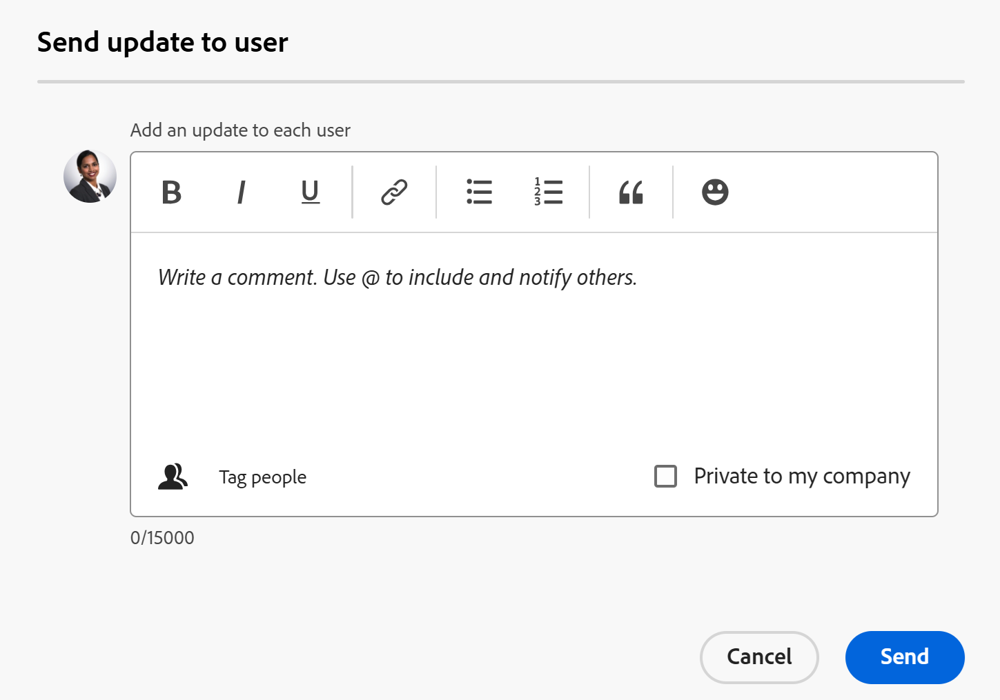

# Gestione del team di progetto

<!--take preview and production references out at production - August 7-->

<!--
 

The highlighted information on this page refers to functionality not yet generally available. It is available only in the Preview environment for all customers. The same features will also be available in the Production environment for all customers after a week from the Preview release.      

For more information, see [Interface modernization](/help/quicksilver/product-announcements/product-releases/interface-modernization/interface-modernization.md).  

-->

Il team del progetto è costituito da utenti associati al progetto. Per ulteriori informazioni, vedere [Panoramica team di progetto](/help/quicksilver/manage-work/projects/planning-a-project/project-team-overview.md).

I membri del team di progetto vengono visualizzati nella sezione Persone del progetto.

Gli utenti visualizzati nella sezione Persone di un modello di progetto diventeranno il team di progetto dopo che il progetto è stato creato dal modello.

I seguenti utenti vengono aggiunti automaticamente al team di progetto, sia per i progetti che per i modelli:

* Proprietario
* Sponsor
* Utenti assegnati alle attività
* Utenti assegnati ai problemi (solo per un progetto)

Gli utenti del team di progetto ricevono notifiche sul progetto. Per ulteriori informazioni, vedere [Tipi di notifica eventi](/help/quicksilver/administration-and-setup/manage-workfront/emails/event-notifications-available-in-wf.md).

Puoi gestire gli utenti del progetto e i team del modello aggiungendoli (solo per il progetto), rimuovendoli o inviando loro un aggiornamento.

## Requisiti di accesso

+++ Espandi per visualizzare i requisiti di accesso per la funzionalità in questo articolo. 

<table style="table-layout:auto"> 
 <col> 
 <col> 
 <tbody> 
  <tr> 
   <td role="rowheader">Pacchetto Adobe Workfront</td> 
   <td> 
Qualsiasi
 </td> 
  </tr> 
  <tr> 
   <td role="rowheader">Licenza Adobe Workfront</td> 
   <td> 
Standard

    
Piano

    </td> 
  </tr> 
  <tr> 
   <td role="rowheader">Configurazioni del livello di accesso</td> 
   <td> 
Modificare l’accesso a progetti e modelli
 
Accesso di visualizzazione o superiore agli utenti
 </td> 
  </tr> 
  <tr> 
   <td role="rowheader">Autorizzazioni oggetto</td> 
   <td> 
Visualizzare o autorizzazioni superiori per un progetto o un modello
 </td> 
  </tr> 
 </tbody> 
</table>

Per informazioni, consulta [Requisiti di accesso nella documentazione di Workfront](/help/quicksilver/administration-and-setup/add-users/access-levels-and-object-permissions/access-level-requirements-in-documentation.md).

+++

<!--Old access: 

<table style="table-layout:auto"> 
 <col> 
 <col> 
 <tbody> 
  <tr> 
   <td role="rowheader">Adobe Workfront plan*</td> 
   <td> 
Any
 </td> 
  </tr> 
  <tr> 
   <td role="rowheader">Adobe Workfront license*</td> 
   <td> 
Standard 

    
Plan 

    </td> 
  </tr> 
  <tr> 
   <td role="rowheader">Access level</td> 
   <td> 
Edit access to Projects and Templates
 
View or higher access to Users
 </td> 
  </tr> 
  <tr> 
   <td role="rowheader">Object permissions</td> 
   <td> 
View or higher permissions to a project or to a template
 </td> 
  </tr> 
 </tbody> 
</table>

*For information, see [Access requirements in Workfront documentation](/help/quicksilver/administration-and-setup/add-users/access-levels-and-object-permissions/access-level-requirements-in-documentation.md).

## Add users to a Project Team

When you add users to the project team, they gain View permissions on the project and the tasks, issues, and documents of the project. For more information, see the article [Project Team overview](../../../manage-work/projects/planning-a-project/project-team-overview.md).

>[!TIP]
>
>Users on the Project Team are not automatically added to the resource management tools for the project.

You can add users to the project team in the following ways:

* [Automatically add users to a Project Team](#automatically-add-users-to-a-project-team) 
* [Manually add users to a Project Team](#manually-add-users-to-a-project-team)

### Automatically add users to a Project Team {#automatically-add-users-to-a-project-team}

The users that fulfill the following roles on the project are automatically added to the project team and appear  in the People section when the project is created:

* The creator of the project
* The project owner
* The project sponsor

Users are also automatically added to the project team when they are assigned to the following:

* Tasks
* Issues

### Manually add users to a Project Team {#manually-add-users-to-a-project-team}

If users that don't fulfill any role on the project want to be notified about certain updates or changes during the life of the project, you can manually add them to the project team. 

 For more information about what notifications can be enabled for users on the project team, see [Event notification types](../../../administration-and-setup/manage-workfront/emails/event-notifications-available-in-wf.md). 

 <!--drafted - this used to be the case, in the note below but this limitation was removed on Jan 5, 2023 - as a patch, not a release feature:

>[!IMPORTANT]
>
>You can add to the Project Team only users that belong to the Group associated with the project. You cannot add users that belong to the Subgroups of the project's group. 

## Manage people on a project

1. Go to the project you want to manage the project team for.

   >[!TIP]
   >
   >You must have users assigned to tasks, issues or as stakeholders on the project to have them display in the People section.

1. Click **People** in the left panel. 

1. Click **Add users**. 

   The **Add users to Project Team** box displays.

   

1. In the **Add users** box, begin typing the name of an active Workfront user that you want to add to the project team, then click the name when it appears in the list.

   Repeat this step to add multiple users to the project team. The users must belong to the group associated with the project. 

   >[!TIP]
   >
   >* You cannot add users by adding their teams, groups, companies, or job roles.
   >* As you add the users, notice the avatar, the user's Primary Role, and their email address to distinguish between users with identical names. Users must be associated with at least one job role to view it as you add them.
   >
   >  You must have the View Contact Info setting enabled in your access level for Users to view users' emails. For information, see [Grant access to users](../../../administration-and-setup/add-users/configure-and-grant-access/grant-access-other-users.md).

1. Click **Add**.

   The users gain View permissions to the project and receive notifications about the project as part of the project team.

1. (Optional) If you want a user to receive a  notification when their job role is added to a task, issue, or project approval, click inside the **Job Role** column for the user, and select a job role that will be associated with the approval. 

   The users will receive notifications related to the approvals assigned to the selected job role. 

   For more information see the "Role-based approvals" section in the article [Project Team overview](/help/quicksilver/manage-work/projects/planning-a-project/project-team-overview.md).

1. Select one or several users in the list, then click the **Remove** icon  to remove them from the team. 
 
1. Click **Yes, Remove Selected Users** to confirm and remove the users.

   Users are removed and unassigned from incomplete work items.

   For more information, see the [Considerations for removing users from a project team](#considerations-for-removing-users-from-a-project-team) section in this article.
1. (Optional) To send an update for this project to users, click **Update All** to send the update to everyone on the team

   Or 

   Select one or multiple users in the list, then click **Send Update to User**.

   <!--update screen shot when they fix the bug - the text above the box needs to match the OLD box, below-->

<!--Old UI for projects but the text above the comment box is right and matches the functionality):
   -->

Viene visualizzata la casella **Invia aggiornamento all&#39;utente**.

1. Esegui una delle operazioni seguenti:

   * Aggiungi un aggiornamento per gli utenti selezionati.
   * Fai clic sull’icona del lucchetto per rendere l’aggiornamento privato per gli utenti della tua azienda.
   * Assegna tag ad altri utenti per ricevere lo stesso aggiornamento.
   * Fai clic su **Invia**.

   L&#39;aggiornamento viene aggiunto alla sezione **Aggiornamenti** del progetto e tutti gli utenti selezionati vengono visualizzati come utenti taggati.

   Gli utenti possono ricevere una notifica e-mail, se sono abilitati per loro, e una notifica in-app sul nuovo aggiornamento.

1. (Facoltativo) Fai clic sull&#39;icona **Esporta**  per esportare l&#39;elenco degli utenti in un file

   Oppure

   Seleziona gli utenti, quindi fai clic sull&#39;icona **Esporta** per esportare solo utenti specifici.

## Gestire le persone su un modello

1. Vai al modello per il quale desideri gestire il team di progetto.

   >[!TIP]
   >
   >Affinché gli utenti siano visualizzati nella sezione Persone, è necessario che siano assegnati alle attività o come stakeholder del modello.

1. Fai clic su **Persone** nel pannello a sinistra.

1. Seleziona uno o più utenti nell&#39;elenco, quindi fai clic sull&#39;icona **Rimuovi** per rimuoverli dal team.

1. Fare clic su **Sì, Rimuovi utenti selezionati** per confermare e rimuovere gli utenti.

   Gli utenti vengono rimossi e non assegnati alle attività modello.

   Per ulteriori informazioni, vedere la sezione [Considerazioni per la rimozione di utenti da un team di progetto](#considerations-for-removing-users-from-a-project-team) in questo articolo.

1. (Facoltativo) Per inviare un aggiornamento agli utenti, fare clic su **Aggiorna tutti** per inviare l&#39;aggiornamento a tutti gli utenti dell&#39;elenco

   Oppure

   Selezionare uno o più utenti nell&#39;elenco, quindi fare clic su **Invia aggiornamento all&#39;utente**.

   <!--update screen shot for unshim production, notice the text above the box - it needs to say "Post an update to each person's profile"-->

   

   Viene visualizzata la casella **Invia aggiornamento all&#39;utente**.

1. Effettua le seguenti operazioni:

   * Aggiungi un aggiornamento per gli utenti selezionati.
   * Fai clic su **Assegna tag a persone** per assegnare tag ad altri utenti per ricevere lo stesso aggiornamento.
   * Seleziona l&#39;opzione **Privato per la mia azienda** per rendere l&#39;aggiornamento privato per gli utenti della tua azienda.
   * Fai clic su **Invia**.

     >[!TIP]
     >
     >L&#39;impostazione **Privato per la mia società** è disponibile solo quando il tuo profilo Workfront è associato a una società.

   L&#39;aggiornamento viene aggiunto alla sezione **Aggiornamenti** del profilo di ciascun utente taggato.

   Gli utenti possono ricevere una notifica e-mail, se sono abilitati per loro, e una notifica in-app sul nuovo aggiornamento.

1. Fai clic sull&#39;icona **Esporta**  per esportare l&#39;elenco degli utenti in un file

   Oppure

   Seleziona gli utenti, quindi fai clic sull&#39;icona **Esporta** per esportare solo utenti specifici.

## Considerazioni per la rimozione di utenti da un team di progetto

Quando rimuovi gli utenti dai loro ruoli sul progetto, questi rimangono parte del team del progetto.

È necessario rimuoverli dal team del progetto, dalla sezione Persone del progetto, affinché non ricevano più le notifiche inviate al team del progetto.

Se si rimuove un utente dal team del progetto e l&#39;utente viene assegnato ad attività o problemi del progetto, l&#39;utente non viene assegnato alle attività e ai problemi non completati. In questo caso, le attività e i problemi tornano nell’area Lavoro non assegnato nel Bilanciatore dei carichi di lavoro.

Gli utenti assegnati ad attività e problemi completati rimangono assegnati ad attività e problemi, anche dopo che sono stati rimossi dal team di progetto.

I seguenti utenti vengono rimossi dai loro ruoli nel progetto quando li rimuovi dalla sezione Persone di un progetto o di un modello:

* Utenti assegnati ad attività incomplete
* Utenti assegnati a problemi incompleti

I seguenti utenti non vengono rimossi dai loro ruoli nel progetto quando li rimuovi dalla sezione Persone di un progetto o di un modello:

* Proprietario
* Sponsor

Per ulteriori informazioni sulla rimozione degli utenti dal team di progetto, vedere [Rimuovere gli utenti dai progetti](../../../manage-work/projects/manage-projects/remove-users-from-projects.md).

