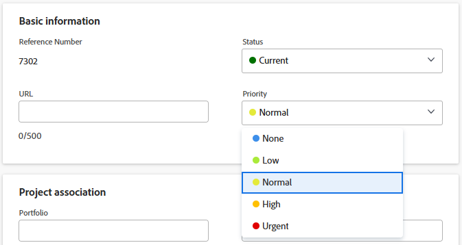

# Comprendere e aggiornare le priorità del progetto

Esistono diversi modi per utilizzare le priorità per i progetti e non comunicano tra loro. È consigliabile selezionare una delle priorità per i progetti che soddisfano le proprie esigenze e farvi riferimento quando si categorizza l&#39;importanza dei progetti.

## Requisiti di accesso

<!--drafted for P&P:

<table style="table-layout:auto"> 
 <col> 
 <col> 
 <tbody> 
  <tr> 
   <td role="rowheader">Adobe Workfront plan*</td> 
   <td> 
Any
 </td> 
  </tr> 
  <tr> 
   <td role="rowheader">Adobe Workfront license*</td> 
   <td> 
Current license: Standard 

   Or
   
Legacy license: Plan 
 </td> 
  </tr> 
  <tr> 
   <td role="rowheader">Access level configurations*</td> 
   <td> 
Edit access to Projects
 
<b>NOTE</b> 
   
   If you still don't have access, ask your Workfront administrator if they set additional restrictions in your access level. For information on how a Workfront administrator can modify your access level, see <a href="../../../administration-and-setup/add-users/configure-and-grant-access/create-modify-access-levels.md" class="MCXref xref">Create or modify custom access levels</a>.
 </td> 
  </tr> 
  <tr> 
   <td role="rowheader">Object permissions</td> 
   <td> 
Manage permissions to the project
 
For information on requesting additional access, see <a href="../../../workfront-basics/grant-and-request-access-to-objects/request-access.md" class="MCXref xref">Request access to objects </a>.
 </td> 
  </tr> 
 </tbody> 
</table>
-->
Per eseguire i passaggi descritti in questo articolo, è necessario disporre dei seguenti diritti di accesso:

<table style="table-layout:auto"> 
 <col> 
 <col> 
 <tbody> 
  <tr> 
   <td role="rowheader">Piano Adobe Workfront*</td> 
   <td> 
Qualsiasi
 </td> 
  </tr> 
  <tr> 
   <td role="rowheader">Licenza Adobe Workfront*</td> 
   <td> 
Piano 
 </td> 
  </tr> 
  <tr> 
   <td role="rowheader">Configurazioni del livello di accesso*</td> 
   <td> 
Modifica accesso ai progetti
 
<b>NOTA</b>

Se non disponi ancora dell’accesso, chiedi all’amministratore di Workfront se ha impostato restrizioni aggiuntive nel tuo livello di accesso. Per informazioni su come un amministratore di Workfront può modificare il tuo livello di accesso, consulta <a href="../../../administration-and-setup/add-users/configure-and-grant-access/create-modify-access-levels.md" class="MCXref xref">Creare o modificare livelli di accesso personalizzati</a>.
 </td>
</tr> 
  <tr> 
   <td role="rowheader">Autorizzazioni oggetto</td> 
   <td> 
Gestire le autorizzazioni per il progetto
 
Per informazioni sulla richiesta di accesso aggiuntivo, vedere <a href="../../../workfront-basics/grant-and-request-access-to-objects/request-access.md" class="MCXref xref">Richiedere l'accesso agli oggetti </a>.
 </td> 
  </tr> 
 </tbody> 
</table>

&#42;Per conoscere il piano, il tipo di licenza o l&#39;accesso di cui si dispone, contattare l&#39;amministratore di Workfront.

## Tipi di priorità del progetto in Adobe Workfront

Di seguito sono riportati i tipi di priorità che è possibile utilizzare per classificare i progetti in Adobe Workfront:

* **Campo Priorità progetto**: è possibile assegnare manualmente una priorità a un progetto. Questo articolo descrive come assegnare manualmente una priorità a un progetto.

  Per ulteriori informazioni, vedere la sezione [Considerazioni sulla priorità del progetto](#considerations-about-project-priority) in questo articolo.

* **Priorità di un progetto in Portfolio Optimizer**, se il progetto è associato a un portfolio:

  Per ulteriori informazioni sulla priorità di un progetto in Portfolio Optimizer, vedi nell&#39;articolo [Assegnare la priorità ai progetti in Portfolio Optimizer](../../../manage-work/portfolios/portfolio-optimizer/prioritize-projects-in-portfolio-optimizer.md).

* **Priorità di un progetto nella Programmazione delle risorse**: è possibile assegnare manualmente la priorità ai progetti nella Programmazione delle risorse, per indicare quali progetti devono ricevere le risorse per primi.

  Per ulteriori informazioni sull&#39;assegnazione delle priorità ai progetti nella Programmazione delle risorse, vedere la sezione &quot;Project Planning Priority&quot; nell&#39;articolo [Panoramica sulla navigazione nella Programmazione delle risorse](../../../resource-mgmt/resource-planning/resource-planner-navigation.md).

## Considerazioni sulla priorità del progetto {#considerations-about-project-priority}

È possibile associare una priorità ai progetti in Workfront. L’indicazione di una priorità per il progetto comunica a tutti gli utenti del sistema l’importanza del progetto.

Quando selezioni una priorità per i progetti, tieni presente quanto segue:

* L’amministratore di Workfront definisce le Priorità disponibili in Workfront. Una volta stabiliti, possono essere associati ai progetti nel campo Priorità.

  Per ulteriori informazioni sulla creazione di priorità in Workfront, vedere l&#39;articolo [Creare e personalizzare le priorità](../../../administration-and-setup/customize-workfront/creating-custom-status-and-priority-labels/create-customize-priorities.md).

* Quando si aggiorna il campo Priorità di un progetto, questa Priorità non viene trasferita a Portfolio Optimizer o alla Programmazione delle risorse. Il campo Priorità del progetto è semplicemente un flag manuale inserito sul progetto per indicarne l’importanza agli altri utenti.
* Il valore Priorità di un progetto viene utilizzato principalmente a scopo di reporting.

  Ad esempio, puoi cercare tutti i progetti con priorità Urgente quando utilizzi questo campo in un filtro di progetto.
* Le attività e i problemi hanno anche Priorità, ma le Priorità di attività, problema e progetto funzionano in modo indipendente l’una dall’altra e non si influenzano automaticamente l’una con l’altra. È possibile avere un problema di priorità alta o un&#39;attività di priorità media in un progetto di priorità bassa.
* Puoi aggiornare la Priorità dei progetti nelle seguenti aree di Workfront:

   * Nella finestra di dialogo **Modifica progetto**.
   * Nella scheda **Dettagli progetto** di un progetto.
   * In un elenco o report di progetti.

## Aggiornare il campo Priorità progetto

1. Vai al progetto di cui desideri aggiornare la Priorità.
1. Fai clic su **Dettagli progetto** nel pannello a sinistra.
1. Fai clic sull&#39;icona **Modifica**  nell&#39;angolo superiore destro dell&#39;area Dettagli progetto, quindi fai clic su **Panoramica**.

1. Nel campo **Priorità**, selezionare una delle opzioni seguenti:

   * Nessuno
   * Basso
   * Normal

     Priorità predefinita.

   * Alta
   * Urgente

   

1. Fai clic su **Salva modifiche**.

   È necessario comunicare con altri utenti e comprendere il significato di ogni livello di priorità per il progetto.
