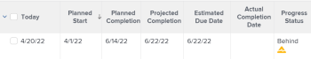

# Panoramica sullo stato di avanzamento del progetto

<!--Audited: 12/2023-->

Adobe Workfront determina lo stato di avanzamento di un progetto osservando l’avanzamento del progetto lungo la relativa sequenza temporale. È possibile configurare Workfront per determinare la condizione di un progetto in base al valore dello stato di avanzamento delle attività. Per ulteriori informazioni sulla configurazione della condizione del progetto, vedere l&#39;articolo [Panoramica della condizione e del tipo di condizione del progetto](../../../manage-work/projects/manage-projects/project-condition-and-condition-type.md).

Di seguito sono riportati gli stati di avanzamento dei progetti in Workfront:

<table style="table-layout:auto"> 
 <col> 
 <col> 
 <tbody> 
  <tr> 
   <td>Nei Tempi</td> 
   <td> Lo stato di avanzamento di un progetto è <strong>Nei tempi</strong> se:<ul><li>Se le date di completamento previste e quelle di completamento stimato sono precedenti o uguali alla data di completamento pianificata del progetto</li></ul> 
  
 </td> 
  </tr> 
  <tr> 
   <td>A Rischio</td> 
   <td> Lo stato di avanzamento di un progetto è <strong>A rischio</strong> se <strong>tutti</strong> dei seguenti valori sono true:<ul><li>Le date di completamento previste e quelle previste sono entrambe nel futuro</li><li> Le date di completamento previste e quelle stimate sono successive alla data di completamento pianificata</li><li> La data di completamento stimata è successiva alla data di completamento prevista</li></ul>
  
 </td> 
  </tr> 
  <tr> 
   <td>Indietro</td> 
   <td> Lo stato di avanzamento di un progetto è <strong>Indietro</strong> se <strong>tutti</strong> dei seguenti valori sono true:<ul><li>Le date di completamento previste e quelle previste sono entrambe nel futuro</li><li> Le date di completamento previste e quelle previste sono successive alla data di completamento pianificata del progetto</li><li> La data di completamento stimata non è successiva alla data di completamento prevista</li></ul> 
  
 </td> 
  </tr> 
  <tr> 
   <td>In Ritardo</td> 
   <td> 
     Lo stato di avanzamento di un progetto è <strong>Late</strong> se <strong>any</strong> dei seguenti è true:<ul><li>Il progetto è completo e la data di completamento effettiva è successiva alla data di completamento pianificata 
  
 </li> 
     <li> 
Il progetto non è completo e la data di completamento pianificata è nel passato 
  
 </li> 
    </ul> </td> 
  </tr> 
 </tbody> 
</table>

Considera quanto segue:

* La data di completamento prevista del progetto dipende dall&#39;attività nel percorso critico con la data di completamento prevista più recente.
* La data di completamento stimata del progetto dipende dall&#39;attività nel percorso critico con la data di completamento stimata più recente.

Per informazioni sul percorso critico del progetto, vedere [Panoramica del percorso critico del progetto](../../../manage-work/tasks/manage-tasks/critical-path.md).

Per informazioni sulle date di completamento previste, vedere [Panoramica sulla data di completamento prevista per progetti, attività e problemi](../../../manage-work/projects/planning-a-project/project-projected-completion-date.md).
