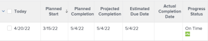

# Panoramica sullo stato di avanzamento del progetto

Adobe Workfront determina lo stato di avanzamento di un progetto osservando la progressione del progetto nella relativa timeline. È possibile configurare Workfront per determinare la condizione di un progetto in base al valore dello stato di avanzamento delle attività. Per ulteriori informazioni sulla configurazione della condizione del progetto, consulta l’articolo [Panoramica del tipo di condizione e condizione del progetto](../../../manage-work/projects/manage-projects/project-condition-and-condition-type.md).

Di seguito sono riportati gli stati di avanzamento dei progetti in Workfront:

<table style="table-layout:auto"> 
 <col> 
 <col> 
 <tbody> 
  <tr> 
   <td>Ora di attivazione</td> 
   <td> 
Se le date di completamento previste e stimate sono precedenti o uguali alla data di completamento pianificata del progetto, lo stato di avanzamento del progetto è <strong>Ora di attivazione</strong>.
 
  
 </td> 
  </tr> 
  <tr> 
   <td>A Rischio</td> 
   <td> 
Se le date di completamento previste e stimate sono future ma successive alla data di completamento prevista del progetto e la data di completamento stimato è successiva alla data di completamento prevista, lo stato di avanzamento del progetto è <strong>A rischio</strong>. 
 
  
 </td> 
  </tr> 
  <tr> 
   <td>Indietro</td> 
   <td> 
Se le date di completamento previste e stimate sono future ma successive alla data di completamento prevista del progetto, ma la data di completamento stimato non è successiva alla data di completamento prevista, lo stato di avanzamento del progetto è <strong>Dietro</strong>.
 
  
 </td> 
  </tr> 
  <tr> 
   <td>In Ritardo</td> 
   <td> 
    <ul> 
     <li> 
Se il progetto è completo e la data di completamento effettivo è successiva alla data di completamento pianificata, lo stato di avanzamento del progetto è <strong>In ritardo</strong>. 
 
  
 </li> 
     <li> 
Se il progetto non è completo e la data di completamento pianificata del progetto è passata, lo stato di avanzamento del progetto è <strong>In ritardo</strong>. 
 
  
 </li> 
    </ul> </td> 
  </tr> 
 </tbody> 
</table>

Considera quanto segue:

* La data di completamento prevista del progetto è guidata dall&#39;attività nel percorso critico con l&#39;ultima data di completamento prevista.
* La data di completamento stimata del progetto è determinata dall&#39;attività nel percorso critico con l&#39;ultima data di completamento stimata.

Per informazioni sul percorso critico del progetto, consulta [Panoramica del progetto Percorso critico](../../../manage-work/tasks/manage-tasks/critical-path.md).

Per informazioni sulle date di completamento previste, vedere [Panoramica della data di completamento prevista per progetti, attività e problemi](../../../manage-work/projects/planning-a-project/project-projected-completion-date.md).
