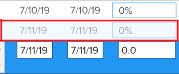

# Panoramica sul tipo di aggiornamento del progetto

Il tipo di aggiornamento di un progetto indica in che modo Adobe Workfront calcola la timeline di un progetto. Le modifiche nel piano di progetto potrebbero causare modifiche nella timeline del progetto. La timeline del progetto deve essere ricalcolata automaticamente o manualmente per essere sempre aggiornata con queste modifiche.

Per informazioni sul ricalcolo della timeline del progetto, consulta [Ricalcolare le timeline dei progetti](../../../manage-work/projects/manage-projects/recalculate-project-timeline.md).

## Tipi di aggiornamento dei progetti

Esistono quattro tipi di aggiornamento per un progetto, a seconda di quando desideri che Workfront ricalcoli la timeline del progetto. Scegli un tipo di aggiornamento dall’elenco seguente.

Per informazioni su come aggiornare il tipo di aggiornamento del progetto, consulta [Seleziona il tipo di aggiornamento del progetto](../../../manage-work/projects/manage-projects/select-project-update-type.md).

>[!IMPORTANT]
>
>Se la timeline di un progetto ha una durata superiore a 15 anni, Workfront non calcola la timeline in modo automatico o quando cambia. Il tipo di aggiornamento di un progetto per un periodo superiore a 15 anni è sempre Manuale.

* **Automatico e On Change:** Questa è l’impostazione predefinita. La timeline del progetto viene aggiornata ogni volta che si verifica una modifica nel progetto o in un altro progetto da cui dipende la timeline. La timeline del progetto viene aggiornata ogni notte. \
   Questa è l’impostazione consigliata in quanto assicura che la timeline del progetto sia sempre aggiornata.

   Quando si aggiorna un&#39;attività o un progetto e si attiva il ricalcolo della timeline, vengono visualizzate immediatamente tutte le date disponibili, consentendo di continuare a lavorare. Nei progetti con più di 100 attività, le date che richiedono calcoli più lunghi vengono disattivate.

   

   Questo indica che il ricalcolo non è ancora completato e che le date sono soggette a modifiche.

* **Solo modifica:** La timeline del progetto viene aggiornata ogni volta che si verifica una modifica nel progetto o in un altro progetto da cui dipende la timeline; gli aggiornamenti pianificati non si verificano.\
   È possibile selezionare questa opzione se si è preoccupati delle prestazioni del sistema e se si verificano raramente modifiche nel progetto o in altri progetti da cui dipende la timeline.

* **Solo automatico:** La tempistica del progetto viene aggiornata ogni notte; non viene aggiornato immediatamente dopo le modifiche.\
   È possibile selezionare questa opzione se si è preoccupati delle prestazioni del sistema e se si verificano molte modifiche quotidiane nel progetto o in altri progetti da cui dipende la timeline.

   >[!NOTE]
   >
   >Un progetto non viene ricalcolato automaticamente ogni notte se è in stato di pianificazione. Ricalcola solo al cambiamento.

* **Solo manuale:** La timeline del progetto viene aggiornata solo quando selezioni l’opzione per **Ricalcola timeline**, come descritto nella sezione &quot;Ricalcolo manuale&quot; dell&#39;articolo [Ricalcolare le timeline dei progetti](../../../manage-work/projects/manage-projects/recalculate-project-timeline.md).\
   È possibile selezionare questa opzione se si apportano più modifiche al progetto contemporaneamente e si desidera che il ricalcolo della timeline si verifichi dopo che sono state apportate tutte le modifiche (anziché dopo ogni singola modifica).
