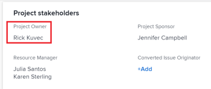

# Aggiornare i proprietari e gli sponsor del progetto

Quando crei un progetto in Adobe Workfront, viene automaticamente impostato come Proprietario del progetto. È possibile aggiornare questo campo con un altro utente. È inoltre possibile aggiornare il campo Sponsor del progetto di un progetto.

Per informazioni sui proprietari e gli sponsor dei progetti, consulta [Panoramica dei proprietari e degli sponsor del progetto](../../../manage-work/projects/planning-a-project/project-owners-and-sponsors.md).

>[!TIP]
>
>Puoi identificare un proprietario e uno sponsor per un modello. Quando crei un progetto da tale modello, il proprietario del modello diventa il proprietario del progetto e lo sponsor del modello diventa sponsor del progetto. Per informazioni sulla modifica dei modelli, consulta [Modificare i modelli di progetto](../../../manage-work/projects/create-and-manage-templates/edit-templates.md).

## Requisiti di accesso

<!--drafted for P&P:

<table style="table-layout:auto"> 
 <col> 
 <col> 
 <tbody> 
  <tr> 
   <td role="rowheader">Adobe Workfront plan*</td> 
   <td> 
Any
 
&nbsp;
 </td> 
  </tr> 
  <tr> 
   <td role="rowheader">Adobe Workfront license*</td> 
   <td> 
Current license: Standard 
 
   Or
   
Legacy license: Plan 
 
   </td> 
  </tr> 
  <tr> 
   <td role="rowheader">Access level configurations*</td> 
   <td> 
Edit access to Projects
 
<b>NOTE</b>
   
   If you still don't have access, ask your Workfront administrator if they set additional restrictions in your access level. For information on how a Workfront administrator can modify your access level, see <a href="../../../administration-and-setup/add-users/configure-and-grant-access/create-modify-access-levels.md" class="MCXref xref">Create or modify custom access levels</a>.
 </td> 
  </tr> 
  <tr> 
   <td role="rowheader">Object permissions</td> 
   <td> 
Edit permissions to a project
 
For information on requesting additional access, see <a href="../../../workfront-basics/grant-and-request-access-to-objects/request-access.md" class="MCXref xref">Request access to objects </a>.
 </td> 
  </tr> 
 </tbody> 
</table>
-->

Per eseguire i passaggi descritti in questo articolo, è necessario disporre dei seguenti diritti di accesso:

<table style="table-layout:auto"> 
 <col> 
 <col> 
 <tbody> 
  <tr> 
   <td role="rowheader">piano Adobe Workfront*</td> 
   <td> 
Qualsiasi
 
 
 </td> 
  </tr> 
  <tr> 
   <td role="rowheader">Licenza Adobe Workfront*</td> 
   <td> 
Piano 
 </td> 
  </tr> 
  <tr> 
   <td role="rowheader">Configurazioni a livello di accesso*</td> 
   <td> 
Modifica accesso a progetti
 
<b>NOTA</b>

Se non disponi ancora dell’accesso, chiedi all’amministratore Workfront se ha impostato ulteriori restrizioni nel livello di accesso. Per informazioni su come un amministratore Workfront può modificare il livello di accesso, consulta <a href="../../../administration-and-setup/add-users/configure-and-grant-access/create-modify-access-levels.md" class="MCXref xref">Creare o modificare livelli di accesso personalizzati</a>.
 </td>
</tr> 
  <tr> 
   <td role="rowheader">Autorizzazioni oggetto</td> 
   <td> 
Modificare le autorizzazioni per un progetto
 
Per informazioni sulla richiesta di accesso aggiuntivo, vedi <a href="../../../workfront-basics/grant-and-request-access-to-objects/request-access.md" class="MCXref xref">Richiedere l’accesso agli oggetti </a>.
 </td> 
  </tr> 
 </tbody> 
</table>

&#42;Per informazioni sul piano, il tipo di licenza o l&#39;accesso, contattare l&#39;amministratore Workfront.

## Aggiornare il proprietario del progetto di un progetto

Quando aggiungi un utente come proprietario del progetto, Workfront concede loro automaticamente le autorizzazioni per visualizzare il progetto.

1. Passa al progetto da aggiornare.
1. Fai clic su **Dettagli progetto** nel pannello a sinistra.
1. Fai clic sul pulsante **Modifica** icona  nell&#39;angolo superiore destro dell&#39;area Dettagli progetto, quindi fai clic su **Panoramica**.

1. Specifica il nome di un utente per il **Proprietario progetto** campo .

   Solo gli utenti attivi possono essere specificati come Proprietari del progetto.

1. Fai clic su **Salva modifiche**.

   Gli aggiornamenti del proprietario del progetto sono disponibili nell’intestazione del progetto e nell’area Dettagli progetto.

## Aggiornare lo sponsor del progetto di un progetto

Quando aggiungi un utente come sponsor di un progetto, Workfront concede loro automaticamente le autorizzazioni per visualizzare il progetto.

>[!TIP]
>
>Se l’utente aggiunto come sponsor di progetto è un amministratore di sistema, non viene aggiunto all’elenco Condivisione del progetto.

1. Passa al progetto da aggiornare.
1. Fai clic su **Dettagli progetto** nel pannello a sinistra.
1. Fai clic sul pulsante **Modifica** icona  nell&#39;angolo superiore destro dell&#39;area Dettagli progetto, quindi fai clic su **Panoramica**.

1. Specifica il nome di un utente per il **Sponsor del progetto** campo .

   Solo gli utenti attivi possono essere specificati come sponsor del progetto.

1. Fai clic su **Salva modifiche**.

   Lo sponsor del progetto viene aggiornato nell’area Dettagli progetto.

   
