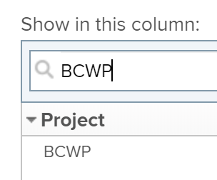

# Calcola costo preventivato del lavoro eseguito (BCWP)

## Panoramica del costo preventivato del lavoro eseguito (BCWP)

Noto anche come Valore realizzato, il BCWP (Budgeted Cost of Work Performed) è una metrica di prestazioni del progetto che rappresenta la quantità dell&#39;attività effettivamente completata al momento del calcolo di questa metrica.

Adobe Workfront calcola il costo preventivato del lavoro eseguito (BCWP) sia per i progetti che per le attività.

Quando rivedi i valori per il BCWP su un&#39;attività o un progetto, considera quanto segue:

* Workfront calcola il BCWP per un&#39;attività in base alla configurazione per il metodo di indice delle prestazioni (PMI) del progetto.

   È possibile configurare il progetto per il calcolo delle PMI utilizzando ore o costi e il BCWP viene calcolato utilizzando gli stessi valori.

   Per informazioni sulla configurazione del calcolo del BCWP, consulta la sezione . [Configurare il calcolo del BCWP](#configure-how-bcwp-is-calculated) in questo articolo.

* Workfront calcola il BCWP per un progetto aggiungendo tutti i valori BCWP da tutte le attività principali e dalle singole attività sul progetto.

   I valori delle attività figlio non vengono aggiunti al BCWP del progetto.

## Requisiti di accesso

Per eseguire i passaggi descritti in questo articolo, è necessario disporre dei seguenti diritti di accesso:

<table style="table-layout:auto"> 
 <col> 
 <col> 
 <tbody> 
  <tr> 
   <td role="rowheader">piano Adobe Workfront*</td> 
   <td> <p>Qualsiasi</p> </td> 
  </tr> 
  <tr> 
   <td role="rowheader">Licenza Adobe Workfront*</td> 
   <td> <p>Piano </p> </td> 
  </tr> 
  <tr> 
   <td role="rowheader">Configurazioni a livello di accesso*</td> 
   <td> <p>Modifica accesso a progetti</p> <p>Se non disponi ancora dell’accesso, chiedi all’amministratore Workfront se ha impostato ulteriori restrizioni nel livello di accesso. Per informazioni su come un amministratore Workfront può modificare il livello di accesso, consulta <a href="../../../administration-and-setup/add-users/configure-and-grant-access/create-modify-access-levels.md" class="MCXref xref">Creare o modificare livelli di accesso personalizzati</a>.</p> </td> 
  </tr> 
  <tr> 
   <td role="rowheader">Autorizzazioni oggetto</td> 
   <td> <p>Gestisci le autorizzazioni per il progetto</p> <p>Per informazioni sulla richiesta di accesso aggiuntivo, vedi <a href="../../../workfront-basics/grant-and-request-access-to-objects/request-access.md" class="MCXref xref">Richiedere l’accesso agli oggetti </a>.</p> </td> 
  </tr> 
 </tbody> 
</table>

&#42;Per informazioni sul piano, il tipo di licenza o l&#39;accesso, contattare l&#39;amministratore Workfront.

## Configurare il calcolo del BCWP {#configure-how-bcwp-is-calculated}

Puoi configurare il calcolo del BCWP in ore o costi configurando il metodo di calcolo del parametro Performance Index Method (PIM) del progetto.

1. Passa a un progetto ed espandi **Dettagli progetto** nel pannello a sinistra.
1. In **Finanza** area, individuare **Metodo indice prestazioni** e fai doppio clic su per modificarlo.

   

1. Seleziona tra le seguenti opzioni:

   | Opzione | Modalità di esecuzione del calcolo |
   |---|---|
   | Basato su Ore | Workfront calcola il BCWP utilizzando l&#39;orario pianificato delle attività. |
   | Basato su Costo | Workfront calcola il BCWP utilizzando il costo pianificato delle attività. |

1. Fai clic su **Salva modifiche**.

Il BCWP delle attività del progetto viene calcolato utilizzando ore o costi.

## Calcola BCWP

Workfront calcola il costo preventivato del lavoro eseguito (BCWP) per un&#39;attività o un progetto utilizzando le seguenti formule:

```
Task BCWP = Actual Percent Complete x Task Budget
```

```
Project BCWP = SUM(BCWP values of all parent and individual tasks)
```

Nel calcolo vengono utilizzati i seguenti valori:

| Valore utilizzato | Descrizione del valore utilizzato |
|---|---|
| Percentuale effettiva completata | Questa è la percentuale effettiva di completamento dell&#39;attività come visualizzata in Workfront. |
| Budget attività | Valore per l&#39;ora pianificata o il costo pianificato dell&#39;attività. |

Ad esempio, se la percentuale effettiva di completamento dell&#39;attività è del 25% e il budget attività o il costo pianificato è di 10.000 $, il BCWP per l&#39;attività è il seguente:

```
BCWP = 25% x $10,000 = $2,500
```

## Individuare il BCWP per un progetto o un&#39;attività

È possibile visualizzare il valore del costo preventivato del lavoro eseguito in un rapporto o in un elenco, aggiungendo la colonna BCWP alla visualizzazione.

1. Passare a un elenco di attività o progetti.
1. Espandi la **Visualizza** menu e seleziona **Nuova vista** o **Personalizza visualizzazione**.

1. Fai clic su **Aggiungi colonna**.
1. In **Mostra in questa colonna:** battitura inizio campo **BCWP** e fai clic su per selezionarlo quando viene visualizzato nell’elenco.

   

1. Fai clic su **Salva visualizzazione**.
1. Il campo BCWP viene visualizzato nella visualizzazione.
