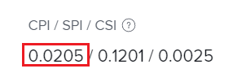

# Calcola indice prestazioni costi (IPC)

<!-- Audited: 5/2025 -->

<!--
<p data-mc-conditions="QuicksilverOrClassic.Draft mode">(NOTE: Linked to the product. Do not change link.)</p>
-->

L&#39;indice di prestazioni dei costi (IPC) descrive la relazione a livello di progetto o task tra il costo pianificato e il costo effettivo. I project manager esaminano questa metrica per identificare le attività o i progetti che registrano il sovraccosto in un determinato momento. Il costo può essere misurato in ore o in dollari, a seconda del metodo PIM (Performance Index Method). Per ulteriori informazioni sull&#39;impostazione del metodo di indicizzazione delle prestazioni, vedere [Impostare il metodo di indicizzazione delle prestazioni (PIM)](../../../manage-work/projects/project-finances/set-pim.md).

Solo le organizzazioni che richiedono immissione di ore possono utilizzare l&#39;IPC. Inoltre, i valori PIM basati sui costi sono accurati solo nelle organizzazioni che dispongono di tassi di costo definiti per gli assegnatari delle attività (mansioni o utenti).

## Requisiti di accesso

+++ Espandi per visualizzare i requisiti di accesso per la funzionalità in questo articolo.

<table style="table-layout:auto"> 
 <col> 
 <col> 
 <tbody> 
  <tr> 
   <td>Pacchetto Adobe Workfront</td> 
   <td>Qualsiasi</td> 
  </tr> 
  <tr> 
   <td>Licenza Adobe Workfront</td> 
   <td>
   <p>Chiaro o superiore</p>
   <p>Revisione o successiva</p></td>  
  </tr> 
  <tr> 
   <td>Configurazioni del livello di accesso</td> 
   <td>Accesso ai progetti e ai dati finanziari</td> 
  </tr> 
  <tr> 
   <td>Autorizzazioni oggetto</td> 
   <td>Visualizza o autorizzazioni superiori per il progetto con autorizzazioni Visualizza contabilità</td> 
  </tr> 
 </tbody> 
</table>

Per informazioni, consulta [Requisiti di accesso nella documentazione di Workfront](/help/quicksilver/administration-and-setup/add-users/access-levels-and-object-permissions/access-level-requirements-in-documentation.md).

+++

## Panoramica dell’indice di prestazione dei costi (IPC)

### Valore dell’IPC {#the-cpi-value}

I project manager hanno capito che un valore CPI pari a 1 indica che il progetto è esattamente nel budget. I valori maggiori di 1 indicano che un progetto è sotto il preventivo (sono state registrate meno ore o spese rispetto a quanto originariamente pianificato) e i valori minori di 1 indicano che un progetto è fuori preventivo (sono state registrate più ore o spese rispetto a quanto originariamente pianificato). Più lontano da 1, maggiore è la deviazione dal piano.

| **Valore CPI** | **Indicazione sul budget** |
|---|---|
| 1 | Nel piano o nel budget |
| > 1 (maggiore di 1) | Sotto il budget |
| &lt; 1 (meno di 1) | Oltre il budget |


### Come viene calcolato CPI {#how-cpi-is-calculated}

In Adobe Workfront, il calcolo dell’indice dei prezzi al consumo dipende dal metodo dell’indice delle prestazioni selezionato per il progetto. Per ulteriori informazioni sull&#39;impostazione del metodo di indicizzazione delle prestazioni, vedere [Impostare il metodo di indicizzazione delle prestazioni (PIM)](../../../manage-work/projects/project-finances/set-pim.md).

* [Calcoli CPI quando si utilizza un PIM basato su ore](#cpi-calculations-when-using-hour-based-pim)
* [Calcoli dell&#39;IPC quando si utilizza la funzione PIM basata sui costi](#cpi-calculations-when-using-cost-based-pim)

#### Calcoli CPI quando si utilizza una PIM basata su ore {#cpi-calculations-when-using-hour-based-pim}

Se

```
Actual Hours > 0 THEN CPI = Total Budgeted Cost Work Performed / Actual Hours
```

Altrimenti

```
CPI = 1
```

* **Per attività non padre:**

  ```
  Total Budgeted Cost Work Performed = Planned Hours * (Percent Complete / 100)
  ```

* **Per un&#39;attività padre:**
Costo preventivato totale lavoro eseguito = somma del campo Costo preventivato totale lavoro eseguito per tutte le attività figlio dirette.

* **Per un progetto:**
Costo preventivato totale lavoro eseguito = somma del campo Costo preventivato totale lavoro eseguito per tutte le attività di livello superiore (attività padre e attività autonome).

Per informazioni sul valore BCWP (Total Budgeted Cost Work Performed), vedere [Calcolare il lavoro BCWP (Calculate Cost Work Performed)](../../../manage-work/projects/project-finances/calculate-bcwp.md).

#### Calcoli dell&#39;IPC quando si utilizza la funzione PIM basata sui costi {#cpi-calculations-when-using-cost-based-pim}

<!--
<p data-mc-conditions="QuicksilverOrClassic.Draft mode"><code>CPI = (Planned Cost of Work Performed + Planned Cost of Incurred Expenses) / (Total Actual Cost + Actual Cost of Incurred Expenses) </code> </p>
-->

<!--
<p data-mc-conditions="QuicksilverOrClassic.Draft mode"><code>NOTE: this used to be here before - above - but Anna sent me the one below. I kept the other one, although she is still researching its validity - see this issue: https://hub.workfront.com/issue/5fc7b1cf00012aeebf9e822db8ea2513/overview)</code> </p>
-->

Se

```
Actual Labor Cost + Incurred Actual Expense Cost <> 0 THEN CPI = (Total Budgeted Cost Work Performed + Incurred Planned Expense Cost) / (Actual Labor Cost + Incurred Actual Expense Cost)
```


Altrimenti

```
CPI = 1
```

<!--
<p data-mc-conditions="QuicksilverOrClassic.Draft mode"><code>(NOTE: above: this used to say: CPI = CPI Labor, but Anna had me fix it on July 21, 2021)</code> </p>
-->

I campi di questo calcolo sono descritti di seguito:

```
Total Actual Cost = Actual (logged) Hours * Hourly Rate of assignees
```

```
Incurred Actual Expense Cost = Actual Cost
```

Spesa sostenuta è la spesa sulla quale il Costo effettivo è > 0

```
Planned Cost of Incurred Expenses = Total of Planned Cost of all incurred expenses
```


<!--
  <p data-mc-conditions="QuicksilverOrClassic.Draft mode">(NOTE: Old calculation - taken out by Lilit and replaced below: Planned Cost of Work Performed= (planned labor cost) * (percent complete) / 100 where planned labor cost is the planned hours allocated to assignees * their rates.)</p>
  -->

* Il costo pianificato del lavoro eseguito viene calcolato con la formula seguente:

  ```
  Planned Cost of Work Performed = Planned cost * Percent Complete / 100
  ```

Il costo preventivato totale lavoro eseguito viene calcolato per i seguenti elementi:

* **Per attività non padre:**

  ```
  Total Budgeted Cost Work Performed = Planned Labor Cost * Percent Complete / 100
  ```

* **Per un&#39;attività padre:**

  ```
  Total Budgeted Cost Work Performed = SUM(Total Budgeted Cost Work Performed field from all direct child tasks)
  ```

* **Per un progetto:**

  ```
  Total Budgeted Cost Work Performed = SUM(Total Budgeted Cost Work Performed field for all top-level tasks)
  ```


## Individuare l&#39;IPC in un progetto o in un task

È possibile visualizzare l&#39;indice dei prezzi al consumo di un progetto o di un task in un progetto o in un elenco di task o in un report. È inoltre possibile visualizzarlo a livello di progetto o di task.

1. Passare al progetto o al task in cui si desidera visualizzare l&#39;IPC.
1. Espandi **Dettagli progetto** o **Dettagli attività** nel pannello a sinistra, a seconda che sia visualizzato l&#39;IPC per un progetto o un&#39;attività.

1. Fare clic su **Finanza**. Il CPI viene visualizzato nel campo **CPI/ SPI/ CSI**.

   
