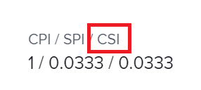

# Calcola indice prestazioni pianificazione costi (CSI)

<!--
<p data-mc-conditions="QuicksilverOrClassic.Draft mode">(NOTE: Linked to the product. Do not change link.) </p>
-->

## Panoramica dell&#39;indice di prestazioni della pianificazione dei costi (CSI)

L&#39;indice delle prestazioni della pianificazione dei costi (CSI) è un calcolo automatico che combina l&#39;indice delle prestazioni dei costi (CPI) e l&#39;indice delle prestazioni della programmazione (SPI) in un&#39;unica metrica generale che bilancia i costi e la pianificazione. Moltiplicando insieme questi valori, una singola metrica può rappresentare un programma prolungato a un budget inferiore o viceversa. I responsabili del progetto possono utilizzare questa opzione per determinare lo stato generale del progetto o delle attività quando il costo viene sacrificato per guidare la pianificazione a metà progetto.

>[!TIP]
>
>Adobe Workfront calcola CSI sia per le attività che per i progetti. Workfront non calcola un valore CSI per i problemi.

Puoi trarre vantaggio dalle informazioni fornite da questa metrica solo se nell’organizzazione sono presenti i seguenti elementi:

* Gli utenti registrano il tempo di registrazione per il lavoro completato.\
   Questo calcola CSI in base alle ore.
* Gli utenti o i ruoli di lavoro sono associati ai tassi di costo per ora. 

   In questo modo viene calcolato il CSI in base ai costi.

## Modalità di calcolo dell&#39;indice delle prestazioni della pianificazione dei costi (CSI) da parte di Workfront

Workfront calcola l&#39;indice di prestazione dei costi (CSI) di un progetto o di un&#39;attività utilizzando la formula seguente:

```
CSI = CPI x SPI
```

Per informazioni sull’IPC, consulta l’articolo [Calcola indice di prestazione dei costi (CPI)](../../../manage-work/projects/project-finances/calculate-cpi.md).

Per informazioni su SPI, consulta l’articolo [Calcola indice delle prestazioni della pianificazione (SPI)](../../../manage-work/projects/project-finances/calculate-spi.md).

Il CSI ha i tre valori possibili seguenti:

* 1 = segue il piano generale   
* 
   >1 = Combinazione dei programmi di budget
* &lt;1 = Combinazione di piani di budget in eccesso



## Individua l&#39;indice delle prestazioni della pianificazione dei costi (CSI)

>[!CAUTION]
>
>Per visualizzare il valore CSI di un progetto o di un&#39;attività, è necessario disporre dell&#39;accesso a Visualizza dati finanziari nel livello di accesso e delle autorizzazioni per visualizzare il progetto o l&#39;attività.

Puoi individuare CSI nelle seguenti aree di Workfront:

* Area finanziamenti nella sezione Dettagli progetto.
* Area Contabilità nella sezione Dettagli attività.
* Visualizzazione di un progetto o di un&#39;attività
* Un progetto o un rapporto di attività
