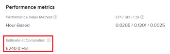

# Calcola Stima Al Completamento (EAC)

<!--
<p data-mc-conditions="QuicksilverOrClassic.Draft mode">(NOTE: Linked to the product. Do not change link!) </p>
-->

Come metrica delle prestazioni, la funzione Stima al completamento (EAC) rappresenta il costo totale previsto del progetto o dell’attività al completamento.

Come impostazione, ti consente di definire come deve essere calcolato il valore EAC. 

## Requisiti di accesso

Per eseguire i passaggi descritti in questo articolo, è necessario disporre dei seguenti diritti di accesso:

<table style="table-layout:auto"> 
 <col> 
 <col> 
 <tbody> 
  <tr> 
   <td role="rowheader">piano Adobe Workfront*</td> 
   <td> <p>Qualsiasi</p> </td> 
  </tr> 
  <tr> 
   <td role="rowheader">Licenza Adobe Workfront*</td> 
   <td> <p>Revisione o superiore</p> </td> 
  </tr> 
  <tr> 
   <td role="rowheader">Configurazioni a livello di accesso*</td> 
   <td> <p>Accesso a progetti e dati finanziari</p> <p><b>NOTA</b>

Se non disponi ancora dell’accesso, chiedi all’amministratore Workfront se ha impostato ulteriori restrizioni nel livello di accesso. Per informazioni su come un amministratore Workfront può modificare il livello di accesso, consulta <a href="../../../administration-and-setup/add-users/configure-and-grant-access/create-modify-access-levels.md" class="MCXref xref">Creare o modificare livelli di accesso personalizzati</a>.</p> </td>
</tr> 
  <tr> 
   <td role="rowheader">Autorizzazioni oggetto</td> 
   <td> <p>Visualizza o autorizzazioni superiori per il progetto con autorizzazioni per visualizzare Finanza</p> <p>Per informazioni sulla richiesta di accesso aggiuntivo, vedi <a href="../../../workfront-basics/grant-and-request-access-to-objects/request-access.md" class="MCXref xref">Richiedere l’accesso agli oggetti </a>.</p> </td> 
  </tr> 
 </tbody> 
</table>

&#42;Per informazioni sul piano, il tipo di licenza o l&#39;accesso, contattare l&#39;amministratore Workfront.

## Definire come calcolare l’EAC

Come parte delle preferenze del sistema di progetto, l’amministratore Adobe Workfront può definire come calcolare l’EAC. L’EAC può essere calcolato in uno dei due modi seguenti:

* [Calcola a livello di progetto](#calculate-at-the-project-level)
* [Eseguire il rollup da attività e sottoattività](#roll-up-from-tasks-and-subtasks)

Per ulteriori informazioni sull’impostazione delle preferenze di progetto in Workfront, tra cui come calcolare la stima al completamento, consulta [Configurare le preferenze del progetto a livello di sistema](../../../administration-and-setup/set-up-workfront/configure-system-defaults/set-project-preferences.md).

In qualità di project manager, puoi anche modificare questa preferenza a livello di progetto, nella sottoscheda Finanza del progetto. Per ulteriori informazioni sulla modifica della sottoscheda Finanza di un progetto, consulta [Gestire le informazioni nell&#39;area di finanziamento del progetto](../../../manage-work/projects/project-finances/manage-project-finance-area.md).

### Calcola a livello di progetto {#calculate-at-the-project-level}

L&#39;EAC per l&#39;attività e il progetto padre viene determinato inserendo le ore effettive/il costo effettivo del lavoro nelle formule EAC. Questo calcolo include le ore/costi effettivi e le spese aggiunte direttamente all&#39;attività o al progetto padre.

### Eseguire il rollup da attività e sottoattività {#roll-up-from-tasks-and-subtasks}

L&#39;EAC per l&#39;attività e il progetto padre viene determinato sommando l&#39;EAC per ogni attività figlio. Questo calcolo esclude le ore/i costi effettivi e le spese aggiunte direttamente all&#39;attività o al progetto padre.

## Come calcolare l&#39;EAC in base al metodo dell&#39;indice delle prestazioni (PIM)

In Workfront, il calcolo per EAC dipende dal metodo PIM (Performance Index Method) selezionato del progetto. Per ulteriori informazioni sull&#39;impostazione del PIM per il sistema o il progetto, consulta [Impostare il metodo Performance Index (PIM)](../../../manage-work/projects/project-finances/set-pim.md).

* [Calcola EAC utilizzando un PIM basato su ora](#calculate-eac-using-hour-based-pim)
* [Calcola EAC utilizzando PIM basato sui costi](#calculate-eac-using-cost-based-pim)

### Calcola EAC utilizzando un PIM basato su ora {#calculate-eac-using-hour-based-pim}

```
EAC = Total Planned Hours / CPI*
```

&#42;Se Indice di prestazione dei costi [Calcola indice di prestazione dei costi (CPI)](../../../manage-work/projects/project-finances/calculate-cpi.md) = 0, EAC = ore pianificate totali + ore effettive. Ciò si verifica quando sono state acquisite ore, ma il progetto/attività è completato allo 0%.

Per ulteriori informazioni sul calcolo dell’IPC, vedi [Calcola indice di prestazione dei costi (CPI)](../../../manage-work/projects/project-finances/calculate-cpi.md).

### Calcola EAC utilizzando PIM basato sui costi {#calculate-eac-using-cost-based-pim}

L’EAC di un progetto viene calcolato con la seguente formula:

```
EAC = EAC Labor + EAC Expense 
```

<pre>Lavoro EAC =  <em>IF</em> Lavoro CPI &lt;&gt; 0 THEAC Labor = Costo del lavoro pianificato / Lavoro CPI</pre><pre><em>ELSE</em> Lavoro EAC = Costo del lavoro pianificato + Costo del lavoro effettivo</pre><pre>Lavoro CPI = Costo del lavoro effettivo &lt;&gt; 0 THEN Lavoro CPI = CostoCostoCostoLavoroRealizzato/Costo del lavoro effettivo</pre><pre>manodopera ELSE CPI = 1 </pre>Nel calcolo dell’EAC si tiene conto dei seguenti campi:

* Costo totale a budget eseguito (BCWP) = Il risultato della moltiplicazione del costo preventivato del lavoro pianificato (costo preventivato) e della percentuale del task completato fino ad ora.

   Per informazioni sul lavoro di costo totale a budget eseguito (BCWP), vedere [Calcola il lavoro dei costi a budget eseguito (BCWP)](../../../manage-work/projects/project-finances/calculate-bcwp.md).

   * **Per un&#39;attività non padre:**

      ```
      Total Budgeted Cost Work Performed = Planned Hours * (Percent Complete/100)
      ```

   * **Per un&#39;attività padre:**
Lavoro costo totale in budget eseguito = la somma del campo Lavoro costo totale in budget eseguito per tutte le attività figlio dirette.

   * **Per un progetto:**
Lavoro costo totale in budget eseguito = la somma del campo Lavoro costo totale in budget eseguito per tutte le attività di primo livello (attività principali e attività standalone). 

* Spesa CA = il risultato dell&#39;aggiunta del costo effettivo garantito al costo di spesa pianificato non garantito. Viene calcolata con la seguente formula:

   ```
   EAC Expense = Incurred Actual Expense Cost + Not Incurred Planned Expense
   ```

   * Costo effettivo garantito = la somma del campo Importo pianificato per tutte le spese in cui il campo Importo effettivo > 0. Ad esempio, se si crea una spesa per il task 1 e si immette $500,00 nel campo Importo pianificato e un importo > 0 nel campo Importo effettivo (ovvero $600,00), il costo previsto garantito per questa attività è $500,00.
   * Spese pianificate non garantite = la somma del campo Importo pianificato per tutte le spese in cui il campo Importo effettivo = 0. Ad esempio, se si creano due spese per il task 1 in cui per la prima spesa il valore nel campo Importo pianificato è $500,00 e il valore nel campo Importo effettivo è $600,00 e per la seconda spesa, il valore nel campo Importo pianificato è $300,00 e il valore del campo Importo effettivo è $0,00, il valore del campo Non inserito La spesa pianificata corrente per questa attività è di $300,00. 

## Individua l’EAC in un progetto o in un’attività

1. Vai al progetto o all&#39;attività in cui desideri visualizzare l&#39;EAC.
1. Espandi **Dettagli progetto** o **Dettagli attività** nel pannello a sinistra del progetto o dell’attività, a seconda di dove viene visualizzato l’EAC.

1. Fai clic su **Finanza**. 

   Il valore EAC viene visualizzato nel **Stima al completamento** campo .

   
