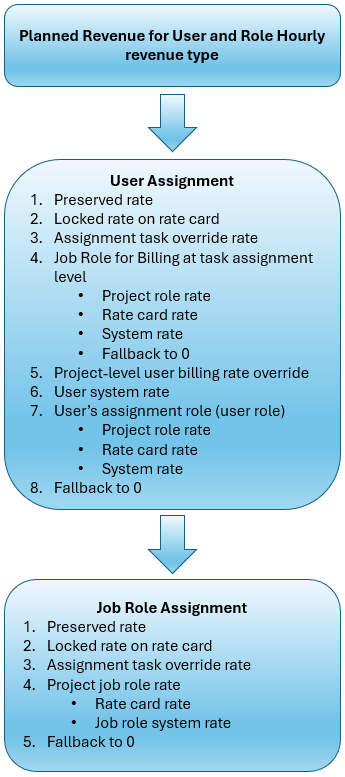

# Panoramica sulla gerarchia dei ricavi e dei costi

{{highlighted-preview-article-level}}

{{ultimate-package}}

Per fornire calcoli finanziari precisi, Workfront utilizza le tariffe di fatturazione appropriate per il calcolo dei ricavi di un&#39;attività o di un progetto. Per ottenere calcoli finanziari accurati, i tassi di occupazione e di utenza devono essere ben definiti a tutti i livelli.

Le sezioni in questo articolo descrivono il processo passo per passo per determinare la fatturazione e i tassi di costo appropriati per le mansioni e gli utenti per il tipo di reddito Orario utente e ruolo e per il tipo di costo.

>[!NOTE]
>
>La gerarchia dei tassi illustrata in questo articolo viene utilizzata solo quando all&#39;attività viene applicato il tipo di costo o di ricavi Orario utente e ruolo.

Per ulteriori informazioni sulle tariffe di fatturazione, i tipi di ricavi e il metodo di calcolo dei ricavi, vedere [Panoramica su fatturazione e ricavi](/help/quicksilver/manage-work/projects/project-finances/billing-and-revenue-overview.md).

## Eccezioni per la gerarchia e il tipo di ricavi Orario utente e Ruolo

* Le tariffe aziendali non sono supportate all’interno della gerarchia.
* Per i calcoli della gerarchia viene utilizzato solo il ruolo primario. Non vengono utilizzati altri ruoli.
* Quando il tipo di reddito di un&#39;attività è Ore utente e Ruolo, un utente che ha registrato ore sull&#39;attività non può essere rimosso da tale attività.

## Panoramica delle date di validità

Gli amministratori di Workfront possono facoltativamente impostare le date effettive che determinano quando le tariffe di fatturazione, le tariffe di costo e altri attributi finanziari hanno effetto nel sistema. Ad esempio, una mansione o un utente potrebbe avere una tariffa di fatturazione predefinita di $50. Applicando le date di validità, quel tasso di 50 $ potrebbe scadere il 31 marzo e un nuovo tasso di 55 $ inizierebbe automaticamente il 1 aprile.

Per i calcoli dei ricavi pianificati, le tariffe di fatturazione si basano sulla data per le ore pianificate. Le ore pianificate vengono distribuite in modo uniforme sulla durata dell&#39;attività. Utilizzando l’esempio precedente, per le ore pianificate per il 31 marzo o versioni precedenti viene utilizzato il tasso di $50 e per le ore pianificate per il 1 aprile o versioni successive viene utilizzato il tasso di $55.

Per i calcoli dei ricavi effettivi, le tariffe di fatturazione si basano sulla data delle ore registrate. Utilizzando l’esempio precedente, le ore registrate il 31 marzo o versioni precedenti utilizzano la tariffa di $ 50 e le ore registrate il 1° aprile o versioni successive utilizzano la tariffa di $ 55.

>[!NOTE]
>
>Le assegnazioni di attività non sono definite con date di validità. Al contrario, le assegnazioni richiamano le tariffe applicabili dal sistema, da una scheda tariffa, da un profilo utente o da una sostituzione a livello di assegnazione. Le date effettive garantiscono che venga applicato il tasso corretto in base alla tempistica del lavoro, ma non definiscono direttamente le assegnazioni.

## Panoramica del ruolo per la fatturazione

Una mansione **per la fatturazione** è impostata per un utente a livello di assegnazione o di progetto. Si applica solo agli utenti e non può essere utilizzato su altre mansioni. Ad esempio, il ruolo principale di un utente è Designer, ma su un’attività o un progetto l’utente svolge la funzione di Designer senior e il tasso dovrebbe rispecchiare tale funzione.

Un ruolo a livello di assegnazione per la fatturazione è solo per l&#39;assegnazione specifica e non viene applicato automaticamente alle altre assegnazioni dell&#39;utente. Un ruolo a livello di progetto per la fatturazione si applica a tutte le assegnazioni dell&#39;utente in quel progetto. Se necessario, è possibile sostituirlo a livello di singola assegnazione.

Quando una mansione per la fatturazione viene applicata a livello di assegnazione utente o di progetto, è possibile utilizzare la tariffa associata alla mansione per la fatturazione al posto delle tariffe utente o mansione nei calcoli dei ricavi. La mansione per la fatturazione è disponibile solo quando vengono utilizzati i tipi di ricavi Orario utente e Orario mansione.

>[!NOTE]
>
>Anche se un utente può agire con un ruolo diverso a scopo di fatturazione, i calcoli dei costi continuano a utilizzare la propria mansione principale. Il ruolo per la fatturazione influisce solo sui calcoli di fatturazione.

Per ulteriori informazioni, vedere [Impostare una mansione per la fatturazione](/help/quicksilver/manage-work/projects/project-finances/set-up-job-role-for-billing.md).

## Panoramica delle percentuali di mantenimento

Il flag **Mantieni informazioni sulle tariffe di fatturazione del progetto** in un progetto controlla se il sistema utilizza le informazioni di fatturazione per le assegnazioni al momento in cui la scheda delle tariffe viene finalizzata o consente modifiche in base a modifiche durante il corso del progetto. Qualsiasi modifica alla mansione, allo stipendio, alla scheda della tariffa o ad altre informazioni relative alla fatturazione dell&#39;utente non influirà sulle tariffe di fatturazione per le assegnazioni. I tassi vengono conservati in base alla scheda dei tassi finale al momento dell’attivazione del flag di progetto. Queste proprietà di assegnazione (ad esempio mansione e stipendio) vengono aggiornate, garantendo che il costo effettivo dell&#39;assegnazione sia accurato.

Quando il flag è attivato, il sistema blocca le tariffe di fatturazione della data effettiva (impostate sulla scheda delle tariffe finalizzate allegata al progetto) per la durata del progetto.

Il flag può essere attivato su un progetto quando il lavoro è iniziato e le assegnazioni e le ore esistono già. In quel momento:

* La tariffa finale approvata diventa l&#39;origine delle tariffe di fatturazione per tutte le assegnazioni del progetto.
* Tutte le assegnazioni passate, correnti e future vengono ricalcolate utilizzando i tassi approvati finali.
* I valori effettivi e pianificati vengono ricalcolati.

>[!NOTE]
>
>Una volta attivato il flag per mantenere le tariffe di fatturazione, non può essere disattivato a meno che il progetto non abbia assegnazioni e ore. Ciò assicura che tutti i rendiconti finanziari riflettano i veri tassi contrattuali.
>Quando il flag è disattivato, il sistema consente di ricalcolare o regolare dinamicamente le tariffe di fatturazione. Eventuali aggiornamenti al ruolo, allo stipendio o alla tariffa di fatturazione dell&#39;utente vengono immediatamente rispecchiati nella tariffa di fatturazione dell&#39;assegnazione.

Per ulteriori informazioni, consulta [Modifica progetti](/help/quicksilver/manage-work/projects/manage-projects/edit-projects.md) e [Gestione schede tariffarie](/help/quicksilver/administration-and-setup/manage-enterprise-operations/manage-rate-cards.md).

## Ricavi pianificati - Ore utente e ruolo

Quando il tipo di ricavi per l&#39;attività è Ore utente e Ruolo, Workfront utilizza le gerarchie di tassi utente e ruolo per determinare la tariffa di fatturazione per i ricavi pianificati.

Questa immagine mostra il flusso della gerarchia dei ricavi pianificata:

Quando un utente viene assegnato all’attività, Workfront esegue ricerche in base a questa gerarchia:

1. Il sistema cerca innanzitutto un tasso di mantenimento nell&#39;assegnazione per l&#39;utente.

   Un tasso mantenuto segue ancora la gerarchia, ma viene congelato quando il progetto viene mantenuto. Per ulteriori informazioni, vedere [Panoramica sulle tariffe mantenute](#overview-of-preserved-rates).

1. Successivamente, il sistema cerca la tariffa di fatturazione su una scheda tariffa, per la mansione principale o la mansione per la fatturazione dell&#39;utente assegnato all&#39;attività. Se esiste un tasso bloccato, questo viene utilizzato nel calcolo dei ricavi.

   Se nella scheda tariffa è presente una tariffa sbloccata, il sistema non utilizza tale tariffa e cerca la tariffa successiva nella gerarchia.

1. Successivamente, il sistema cerca il tasso di sostituzione a livello di assegnazione per l&#39;utente. Si tratta di una tariffa aggiunta manualmente associata all&#39;assegnazione specifica e sostituisce tutte le altre tariffe per l&#39;utente di questa assegnazione (ad eccezione di una tariffa bloccata per la scheda delle tariffe). Se viene trovato un tasso, questo viene utilizzato nel calcolo dei ricavi.
1. Successivamente, il sistema cerca una mansione per la fatturazione a livello di assegnazione dell&#39;attività.

   Il ruolo per la fatturazione è solo per un&#39;assegnazione specifica e si applica all&#39;assegnazione invece della tariffa del ruolo principale dell&#39;utente. Ad esempio, il ruolo principale di un utente è Designer, ma su un’attività si comporta come Designer senior con una tariffa di fatturazione più elevata.

   Workfront cerca la mansione per la tariffa di fatturazione:

   * Il sistema cerca innanzitutto la tariffa di fatturazione della mansione per la fatturazione dall&#39;assegnazione (Senior Designer nell&#39;esempio), tenendo conto delle date di validità. Questo è visibile nell&#39;area Tariffe > Fatturazione del progetto, in un raggruppamento di **Tariffa Source: Overrides > Tipo risorsa: Ruolo**. Questo è un tasso di sostituzione sul progetto.
   * Successivamente, il sistema cerca la mansione per la tariffa di fatturazione da una scheda della tariffa, tenendo conto delle date di validità. Questo è visibile nell&#39;area Tariffe > Fatturazione del progetto, in un raggruppamento di **Tariffa Source: scheda tariffa allegata > Tipo risorsa: Mansione**.
   * Se la tariffa per la mansione per la fatturazione non è presente nel progetto o nella scheda della tariffa, il sistema cerca la tariffa per la mansione a livello di sistema (Senior Designer nell&#39;esempio), tenendo conto delle date di validità.
   * Se viene assegnata una mansione per la fatturazione e non viene trovata alcuna delle tariffe dei passaggi precedenti, la tariffa di fatturazione è 0.

     >[!NOTE]
     >
     >Quando viene assegnato un ruolo per la fatturazione, ma la tariffa di fatturazione è 0, questo è un indicatore per rivedere l’impostazione della tariffa. Un tasso pari a 0 significa che in Workfront non sono state impostate tariffe per quella mansione (Senior Designer nell’esempio). Aggiungere tariffe per la mansione o eliminare la mansione per la fatturazione dall&#39;assegnazione.
     >
     >Poiché le attività ereditano le tariffe dei ruoli dal progetto quando tali tariffe sono disponibili a livello di progetto, tutte le tariffe da una ricerca della mansione per la fatturazione sul progetto sarebbero già state individuate quando Workfront ha eseguito la ricerca della mansione per la fatturazione a livello di assegnazione dell&#39;attività. La ricerca a livello di progetto di una mansione per la fatturazione rimane ancora nella gerarchia di ricerca.

1. Se un ruolo per la fatturazione non era disponibile a livello di assegnazione dell&#39;attività, il sistema cerca quindi la tariffa di fatturazione sul progetto, per l&#39;utente specifico assegnato all&#39;attività, tenendo conto delle date di validità. Questo è visibile nell&#39;area Tariffe > Fatturazione del progetto, in un raggruppamento di **Tariffa Source: Overrides > Tipo risorsa: Utente**. Questo è un tasso di sostituzione sul progetto.
1. Successivamente, il sistema cerca la tariffa di fatturazione a livello di sistema sul profilo dell’utente, tenendo conto delle date di validità.
1. Successivamente, il sistema cerca la tariffa di fatturazione della mansione principale dell&#39;utente (Designer nell&#39;esempio).

   * Il sistema cerca innanzitutto la tariffa di fatturazione sul progetto, per la mansione principale dell’utente, tenendo conto delle date di validità. Questo è visibile nell&#39;area Tariffe > Fatturazione del progetto, in un raggruppamento di **Tariffa Source: Overrides > Tipo risorsa: Ruolo**. Questo è un tasso di sostituzione sul progetto.
   * Successivamente, il sistema cerca la tariffa per le mansioni da una scheda delle tariffe, tenendo conto delle date di validità. Questo è visibile nell&#39;area Tariffe > Fatturazione del progetto, in un raggruppamento di **Tariffa Source: scheda tariffa allegata > Tipo risorsa: Mansione**.
   * Successivamente, il sistema cerca il tasso di ruolo a livello di sistema, tenendo conto delle date di validità.

1. Se non viene trovata nessuna di queste tariffe, la tariffa di fatturazione è 0.

Quando un utente non è assegnato all’attività, Workfront cerca le tariffe dei ruoli in base a questa gerarchia:

1. Il sistema cerca innanzitutto un tasso di mantenimento nell&#39;assegnazione della mansione.
1. Il sistema cerca la tariffa di fatturazione su una scheda della tariffa, per la mansione assegnata all&#39;attività. Se esiste un tasso bloccato, questo viene utilizzato nel calcolo dei ricavi.

   Se nella scheda tariffa è presente una tariffa sbloccata, il sistema non utilizza tale tariffa e cerca la tariffa successiva nella gerarchia.

1. Successivamente, il sistema cerca il tasso di sostituzione dell&#39;attività di assegnazione per il ruolo. Si tratta di un tasso aggiunto manualmente per la mansione nell&#39;assegnazione specifica e sostituisce tutti gli altri tassi per la mansione nell&#39;attività. Se viene trovato un tasso, questo viene utilizzato nel calcolo dei ricavi.
1. Successivamente, il sistema cerca la tariffa di fatturazione per la mansione assegnata all&#39;attività.

   * Il sistema cerca innanzitutto la tariffa di fatturazione del progetto per la mansione, tenendo conto delle date di validità. Questo è visibile nell&#39;area Tariffe > Fatturazione del progetto, in un raggruppamento di **Tariffa Source: Overrides > Tipo risorsa: Ruolo**. Questo è un tasso di sostituzione sul progetto.
   * Successivamente, il sistema cerca la tariffa per le mansioni da una scheda delle tariffe, tenendo conto delle date di validità. Questo è visibile nell&#39;area Tariffe > Fatturazione del progetto, in un raggruppamento di **Tariffa Source: scheda tariffa allegata > Tipo risorsa: Mansione**.
   * Successivamente, il sistema cerca il tasso di ruolo a livello di sistema, tenendo conto delle date di validità.

1. Se non viene trovata nessuna di queste tariffe, la tariffa di fatturazione è 0.

## Ricavi effettivi - Ore Utente e Ruolo

Quando il tipo di reddito dell&#39;attività è Ore utente e Ruolo, Workfront utilizza due gerarchie per determinare la tariffa di fatturazione dei ricavi effettivi. La tariffa di fatturazione si basa sulle ore di registrazione dell’utente su un’attività.

L&#39;&quot;utente&quot; nelle gerarchie è la persona assegnata all&#39;attività. Il &quot;proprietario&quot; è la persona il cui tempo viene registrato per l’attività, anche se non è assegnata all’attività. Ad esempio, a Michael viene assegnata un&#39;attività, ma Joanna completa il lavoro perché Michael era malato. Il manager può registrare il tempo rispetto all&#39;attività e impostare il proprietario delle ore registrate su Joanna. I valori dei ricavi pianificati si basano sull&#39;assegnazione e sul tasso di Michael nella gerarchia, ma i valori dei ricavi effettivi si basano sul tasso di Joanna.

L’immagine mostra il flusso della gerarchia dei ricavi effettivi:

### Quando il proprietario delle ore registrate e l’utente assegnato all’attività coincidono

Workfront cerca innanzitutto una tariffa di fatturazione in base all’assegnazione utente. Se un utente non è assegnato all’attività, cerca una tariffa di fatturazione in base all’assegnazione della mansione.

La gerarchia per questo scenario è la stessa della gerarchia dei ricavi pianificata. Vedi [Entrate pianificate - Ore utente e mansione](#planned-revenue--user-and-role-hourly) per questo flusso di lavoro.

### Quando il proprietario delle ore registrate non è l’utente assegnato all’attività

Workfront esegue ricerche nelle proprietà utente del proprietario in base a questa gerarchia:

1. Il sistema cerca innanzitutto un tasso di mantenimento nell&#39;assegnazione per il proprietario.
1. Successivamente, il sistema cerca la tariffa di fatturazione su una scheda tariffaria, per la mansione principale del proprietario. Se esiste un tasso bloccato, questo viene utilizzato nel calcolo dei ricavi.

   Se nella scheda tariffa è presente una tariffa sbloccata, il sistema non utilizza tale tariffa e cerca la tariffa successiva nella gerarchia.

1. Successivamente, il sistema cerca la tariffa di fatturazione del progetto, per il proprietario, tenendo in considerazione le date di validità. Questo è visibile nell’area Tariffe > Fatturazione del progetto, in un Source tariffe: Sostituzioni > Tipo risorsa: Raggruppamento utenti. Questo è un tasso di sostituzione sul progetto.
1. Successivamente, il sistema cerca una mansione per la fatturazione a livello di progetto.

   La mansione per la fatturazione è solo per un progetto specifico e si applica al progetto invece della tariffa della mansione principale del proprietario. Ad esempio, il ruolo principale del proprietario è Designer, ma su un progetto si comporta come Designer senior con una tariffa di fatturazione più elevata.

   Workfront cerca la mansione per la tariffa di fatturazione:

   * Il sistema cerca innanzitutto la mansione per la tariffa di fatturazione da una scheda tariffaria, tenendo conto delle date di validità. Questo è visibile nell&#39;area Tariffe > Fatturazione del progetto, in un raggruppamento di **Tariffa Source: scheda tariffa allegata > Tipo risorsa: Mansione**.
   * Se la tariffa per la mansione per la fatturazione non è presente nella scheda della tariffa, il sistema cerca la tariffa per la mansione a livello di sistema (Senior Designer nell’esempio), tenendo conto delle date di validità.
   * Se viene assegnata una mansione per la fatturazione e non viene trovata alcuna delle tariffe dei passaggi precedenti, la tariffa di fatturazione è 0.

     >[!NOTE]
     >
     >Quando viene assegnato un ruolo per la fatturazione, ma la tariffa di fatturazione è 0, questo è un indicatore per rivedere l’impostazione della tariffa. Un tasso pari a 0 significa che in Workfront non sono state impostate tariffe per quella mansione (Senior Designer nell’esempio). Aggiungi le tariffe per la mansione o elimina la mansione per la fatturazione dal progetto.

1. Successivamente, il sistema cerca la tariffa di fatturazione a livello di sistema sul profilo utente del proprietario, tenendo conto delle date di validità.
1. Successivamente, il sistema cerca la tariffa di fatturazione della mansione principale del proprietario (Designer nell&#39;esempio).

   * Il sistema cerca innanzitutto la tariffa di fatturazione sul progetto, per la mansione principale del proprietario, tenendo conto delle date di validità. Questo è visibile nell&#39;area Tariffe > Fatturazione del progetto, in un raggruppamento di **Tariffa Source: Overrides > Tipo risorsa: Ruolo**. Questo è un tasso di sostituzione sul progetto.
   * Successivamente, il sistema cerca la tariffa per le mansioni da una scheda delle tariffe, tenendo conto delle date di validità. Questo è visibile nell&#39;area Tariffe > Fatturazione del progetto, in un raggruppamento di **Tariffa Source: scheda tariffa allegata > Tipo risorsa: Mansione**.
   * Successivamente, il sistema cerca il tasso di ruolo a livello di sistema, tenendo conto delle date di validità.

1. Se non viene trovata nessuna di queste tariffe, la tariffa di fatturazione è 0.

## Costo pianificato - Ore Utente e Ruolo

Quando il tipo di costo dell&#39;attività è Ore utente e Ruolo, Workfront utilizza le gerarchie di tassi utente e ruolo per determinare la tariffa per il costo pianificato.

L&#39;immagine mostra il flusso della gerarchia dei costi pianificata:

Quando un utente viene assegnato all’attività, Workfront esegue ricerche in base a questa gerarchia:

1. Il sistema cerca il tasso di sostituzione dell&#39;attività di assegnazione per l&#39;utente. Si tratta di una frequenza aggiunta manualmente per l&#39;utente nell&#39;assegnazione specifica e sostituisce tutte le altre tariffe per l&#39;utente in questa attività. Se viene individuato un tasso, questo viene utilizzato nel calcolo del costo.
1. Quindi, il sistema cerca la tariffa del progetto per l&#39;utente specifico assegnato all&#39;attività, tenendo conto delle date di validità. Questo è visibile nell&#39;area Tariffe > Costo del progetto, in un raggruppamento di **Tariffa Source: Overrides > Tipo risorsa: Utente**. Questo è un tasso di sostituzione sul progetto.
1. Successivamente, il sistema cerca la tariffa a livello di sistema nel profilo dell&#39;utente, tenendo conto delle date di validità.
1. Successivamente, il sistema cerca la tariffa della mansione principale dell&#39;utente con la combinazione di attributi assegnata, in base al punteggio dell&#39;attributo.
1. Se non viene trovato nessuno di questi tassi, il tasso di costo è 0.

Quando un utente non è assegnato all’attività, Workfront cerca le tariffe dei ruoli in base a questa gerarchia:

1. Il sistema cerca il tasso di sostituzione dell&#39;attività di assegnazione per il ruolo. Si tratta di un tasso aggiunto manualmente per la mansione nell&#39;assegnazione specifica e sostituisce tutti gli altri tassi per la mansione nell&#39;attività. Se viene individuato un tasso, questo viene utilizzato nel calcolo del costo.
1. Successivamente, il sistema cerca il tasso di costo della mansione a livello di sistema con la combinazione di attributi assegnati, in base al punteggio dell&#39;attributo, tenendo conto delle date di validità.
1. Se non viene trovato nessuno di questi tassi, il tasso di costo è 0.

## Costo effettivo - Ore Utente e Ruolo

Quando il tipo di costo dell&#39;attività è Ore utente e Ruolo, Workfront utilizza due gerarchie per determinare la tariffa di fatturazione del costo effettivo. La tariffa di fatturazione si basa sulle ore di registrazione dell’utente su un’attività.

L&#39;&quot;utente&quot; nelle gerarchie è la persona assegnata all&#39;attività. Il &quot;proprietario&quot; è la persona il cui tempo viene registrato per l’attività, anche se non è assegnata all’attività. Ad esempio, a Michael viene assegnata un&#39;attività, ma Joanna completa il lavoro perché Michael era malato. Il manager può registrare il tempo rispetto all&#39;attività e impostare il proprietario delle ore registrate su Joanna. I valori dei ricavi pianificati si basano sull&#39;assegnazione e sul tasso di Michael nella gerarchia, ma i valori dei ricavi effettivi si basano sul tasso di Joanna.

L&#39;immagine mostra il flusso della gerarchia dei costi effettivi:

### Quando il proprietario delle ore registrate e l’utente assegnato all’attività coincidono

Workfront cerca innanzitutto una tariffa in base all&#39;assegnazione utente. Se un utente non è assegnato all&#39;attività, cerca una tariffa in base all&#39;assegnazione della mansione.

La gerarchia per questo scenario è la stessa della gerarchia dei costi pianificata. Vedi [Costo pianificato - Ore utente e mansione](#planned-cost--user-and-role-hourly) per questo flusso di lavoro.

### Quando il proprietario delle ore registrate non è l’utente assegnato all’attività

Workfront esegue ricerche nelle proprietà utente del proprietario in base a questa gerarchia:

1. Il sistema cerca la tariffa di costo del progetto, per il proprietario, tenendo conto delle date di validità. Questo è visibile nell&#39;area Tariffe > Costo del progetto, in un raggruppamento di **Tariffa Source: Overrides > Tipo risorsa: Utente**. Questo è un tasso di sostituzione sul progetto.
1. Successivamente, il sistema cerca la tariffa a livello di sistema nel profilo utente del proprietario, tenendo conto delle date di validità.
1. Successivamente, il sistema cerca la tariffa della mansione principale del proprietario (Designer nell&#39;esempio).

   * Il sistema cerca innanzitutto la tariffa del progetto per la mansione principale del proprietario, tenendo conto delle date di validità. Questo è visibile nell&#39;area Tariffe > Costo del progetto, in un raggruppamento di **Tariffa Source: Overrides > Tipo risorsa: Mansione**. Questo è un tasso di sostituzione sul progetto.
   * Successivamente, il sistema cerca la tariffa per le mansioni da una scheda delle tariffe, tenendo conto delle date di validità. Questo è visibile nell&#39;area Tariffe > Costo del progetto, in un raggruppamento di **Tariffa Source: scheda tariffa collegata > Tipo risorsa: mansione**.
   * Successivamente, il sistema cerca il tasso di ruolo a livello di sistema, tenendo conto delle date di validità.

1. Se non viene trovata nessuna di queste tariffe, la tariffa di fatturazione è 0.
