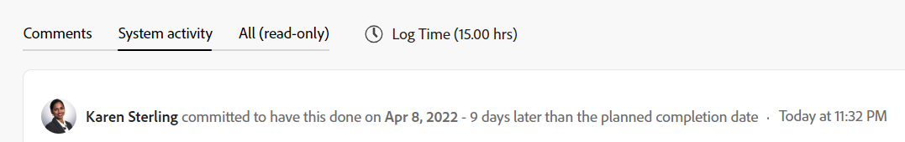

# Panoramica sulla data del commit

La data di commit è la data in cui un utente assegnato a un&#39;attività o a un problema si impegna a completare l&#39;attività o il problema. Si tratta di una stima più realistica della data di completamento prevista fornita solo dall&#39;utente responsabile del lavoro. Per informazioni sulla data di completamento pianificata, vedere [Panoramica dell&#39;attività Data completamento pianificata](../../../manage-work/tasks/task-information/task-planned-completion-date.md).

## Panoramica sulla data del commit

Quando si lavora con le date di commit, considera quanto segue:

* Solo le attività e i problemi hanno una data di commit.
* Le date di commit non vengono impostate automaticamente da Adobe Workfront.\
   Quando crei un&#39;attività o un problema, non esiste una data di commit assegnata all&#39;attività o al problema.
* Se sei assegnato a un&#39;attività o a un problema, puoi impostare la Data di commit eseguendo una delle operazioni seguenti:

   * Impostare la data di completamento pianificata in modo che corrisponda alla data di completamento pianificata esistente dell&#39;attività o del problema facendo clic su Lavoro su di essa, Avvia problema o Avvia attività sull&#39;attività o sul problema. Per informazioni sulla sostituzione del pulsante Work On It con un pulsante Start, vedere  [Sostituire il pulsante Work On It con un pulsante Start](../../../people-teams-and-groups/create-and-manage-teams/work-on-it-button-to-start-button.md).
   * Imposta manualmente la data di commit in base a quando ritieni che l&#39;attività o il problema possa essere completato. Questa è la tua stima e il tuo impegno, in qualità di assegnatario, per il Project Manager, di avere l&#39;attività o il problema completato entro una data specifica.

>[!NOTE]
>
>È necessario essere il proprietario attività di un&#39;attività per modificare la data di commit. I seguenti utenti non possono modificare la data di commit di un&#39;attività:
>
>* Proprietario progetto
>* Sponsor del progetto
>* Responsabile risorse
>* Amministratore di Sistema
>* Qualsiasi altro assegnatario sull&#39;attività
>* Qualsiasi altro utente con autorizzazioni per l’attività.
>
>Per ulteriori informazioni sul proprietario dell&#39;attività, consulta la sezione [Modifica delle attività](../../../manage-work/tasks/manage-tasks/edit-tasks.md#assignments) nell&#39;articolo [Modifica delle attività](../../../manage-work/tasks/manage-tasks/edit-tasks.md).

## Notifiche e aggiornamenti attivati modificando la data di commit {#notifications-and-updates-triggered-by-changing-the-commit-date}

Quando un&#39;attività o l&#39;assegnatario di un problema seleziona una Data di completamento diversa dalla Data di completamento pianificata impostata dal proprietario del progetto, sono disponibili diverse notifiche e aggiornamenti che avvisano il proprietario del progetto e altri utenti di questa modifica.

>[!NOTE]
>
>Le modifiche apportate alla data di commit non modificano automaticamente le date pianificate e le modifiche apportate alle date pianificate non modificano automaticamente la data di commit. 

L&#39;impostazione della data di commit per un&#39;attività o un problema attiva le seguenti modifiche:

* La data di commit viene compilata nel flusso di aggiornamento dell&#39;attività o del problema.

   

   La modifica della Data di commit viene visualizzata nell’area Aggiornamenti dell’attività o del problema quando l’amministratore di Workfront abilita questo aggiornamento nell’area Feed aggiornamenti in Configurazione. Per informazioni, consulta [Aggiornamenti tracciati dal sistema](../../../administration-and-setup/set-up-workfront/system-tracked-update-feeds/system-tracked-update-feeds.md).

* La data di completamento prevista per l&#39;attività o il problema è impostata sulla stessa data, perché l&#39;attività dispone ora di un&#39;indicazione più precisa di quando è probabile che venga completata.

   Per ulteriori informazioni sulla data di completamento prevista, vedere [Panoramica della data di completamento prevista per progetti, attività e problemi](../../../manage-work/projects/planning-a-project/project-projected-completion-date.md).

   

* Nell’area Notifiche e nella scheda Aggiornamenti dell’attività viene notificato al proprietario del progetto se questa modifica influisce sulla timeline del progetto.

   

   <!--
  
(NOTE: the tip below is actually wrong and the updates feeds should not control this setting, but at this time it does, according to this issue in Hub: https://hub.workfront.com/issue/61e1aa5e0002a186fdd0a73a10db0fc3/updates?email-source=comm

  -->

   >[!TIP]
   La notifica della modifica della data di commit viene inviata al proprietario del progetto solo quando l’amministratore Workfront abilita la visualizzazione della data di commit nell’area Feed aggiornamenti in Configurazione. Per informazioni, consulta [Aggiornamenti tracciati dal sistema](../../../administration-and-setup/set-up-workfront/system-tracked-update-feeds/system-tracked-update-feeds.md).

   Se un proprietario del progetto non desidera accettare la modifica, si consiglia agli utenti di inviare un commento all’utente proponendo una nuova data per chiedere loro di modificare la data di commit alla data pianificata originale o di selezionare una nuova data. Se un proprietario del progetto accetta la modifica, può regolare manualmente la data di completamento pianificata in modo che corrisponda alla data di commit offerta dall&#39;utente assegnato all&#39;elemento.

   Il proprietario del progetto può utilizzare la data di commit per reimpostare la data di completamento pianificata. A tale scopo, seleziona l’opzione Imposta data pianificata su nella scheda Aggiornamenti dell’attività. Per accettare questa modifica, è necessario disporre dell’accesso per gestire l’attività e il progetto.

   >[!NOTE]
   Se si desidera visualizzare il modo in cui la timeline del progetto viene influenzata dall&#39;accettazione della modifica della data di completamento pianificata dell&#39;attività, fare clic su **Timeline del progetto**. Viene aperto il Diagramma di Gantt in cui è possibile valutare le modifiche alla data.
     >

Per informazioni sulle funzionalità aggiuntive disponibili durante l&#39;aggiornamento di un elemento di lavoro, vedere  [Aggiorna lavoro](../../../workfront-basics/updating-work-items-and-viewing-updates/update-work.md). 

Per informazioni sull&#39;aggiornamento delle date di commit per attività e problemi, vedi [Aggiorna date di commit su attività e problemi](../../../manage-work/projects/updating-work-in-a-project/update-commit-date-on-tasks-and-issues.md).

<!--

<h2>Update Commit Dates on tasks and issues</h2>

(NOTE:&nbsp;moved to its own article) 

Updating the Commit Date is identical for tasks and issues.

<ol>
<li value="1"> 
Go to a task or issue that you are assigned to as the <strong>Task Owner</strong>.
 
For more information about finding out who the Task Owner for an issue or task is, see the section <a href="../../../manage-work/tasks/manage-tasks/edit-tasks.md#assignments" class="MCXref xref">Edit tasks</a> in the article <a href="../../../manage-work/tasks/manage-tasks/edit-tasks.md" class="MCXref xref">Edit tasks</a>.
 </li>
<li value="2"> 
Click Work on it in the task or issue header
 
Or
 
Click <strong>Start Task</strong> or <strong>Start Issue</strong> if the Work on it button has been customized in your environment to indicate that you are now working on the work item. 
 
At this time, the Commit Date and the Planned Completion Date of the task or issue are the same.
 </li>
<li value="3"> 
(Optional) If you clicked Start Task or Start Issue, click <strong>Undo</strong> in the lower-left corner of the screen. The Commit Date is removed. 
 
For information about replacing the Work On&nbsp;It button with a Start button, see <a href="../../../people-teams-and-groups/create-and-manage-teams/work-on-it-button-to-start-button.md" class="MCXref xref">Replace the Work On It button with a Start button</a>.
 <note type="tip">
The option to undo your selection to start your work is not available when you click
Work on it.
</note> </li>
<li value="4"> 
 Expand the <strong>This will be done by</strong> date picker, and select a new Commit Date.

Click <strong>Updates</strong> in the left panel, then click the <strong>Start a new update</strong>><strong>Commit Date</strong>

Or

Click <strong>Task Details</strong> or <strong>Issue Details</strong> in the left panel, then double click&nbsp;<strong>Commit Date</strong> and select a new date from calendar. 

The Commit Date and the Planned Completion date are no longer the same.

Instead, the Commit Date and the Projected Completion Date of the task or issue become the same.

The changes are saved automatically.

The Project Owner is notified that you have suggested a new Commit Date for the task or issue and can, at this time, update the Planned Completion Date of the task or issue to match the Commit Date you suggested. For information about the notifications and updates that are triggered by this change, see the section <a href="#notifications-and-updates-triggered-by-changing-the-commit-date" class="MCXref xref">Notifications and updates triggered by changing the Commit Date</a> in this article.

 </li>
</ol>

-->
