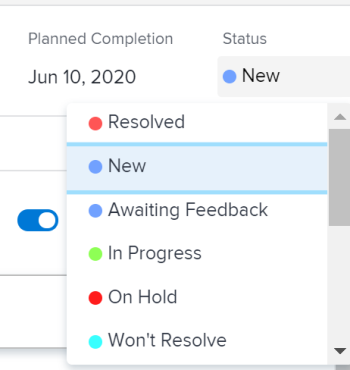

# Aggiorna stato problema

<!--Audited: 01/2024-->

È possibile aggiornare lo stato di un problema per informare gli altri utenti sulla posizione del problema e sul suo avanzamento.

## Requisiti di accesso

Per eseguire i passaggi descritti in questo articolo, è necessario disporre dei seguenti diritti di accesso:

<table style="table-layout:auto"> 
 <col> 
 <col> 
 <tbody> 
  <tr> 
   <td role="rowheader">piano Adobe Workfront</td> 
   <td> 
Qualsiasi
 </td> 
  </tr> 
  <tr> 
   <td role="rowheader">Licenza Adobe Workfront*</td> 
   <td> 
Nuova licenza: Collaboratore o versione successiva

   Oppure
   
Licenza corrente: richiesta o successiva

   </td> 
  </tr> 
  <tr> 
   <td role="rowheader">Configurazioni del livello di accesso</td> 
   <td> 
Modifica l'accesso alle Issues
 </td> 
  </tr> 
  <tr> 
   <td role="rowheader">Autorizzazioni oggetto</td> 
   <td> 
Gestire le autorizzazioni per il problema
 </td> 
  </tr> 
 </tbody> 
</table>

*Per informazioni sulla pianificazione, il tipo di licenza o l&#39;accesso disponibili, contattare l&#39;amministratore Workfront. Per ulteriori informazioni, consulta [Requisiti di accesso nella documentazione di Workfront](/help/quicksilver/administration-and-setup/add-users/access-levels-and-object-permissions/access-level-requirements-in-documentation.md).

## Stati problemi

Di seguito sono riportati gli stati predefiniti per i problemi in Workfront:

* Nuovo
* In corso
* In attesa di Riscontro
* In sospeso
* Non Risolvibile
* Ri-Aperto
* Chiuso
* Risolto

Il tuo amministratore Adobe Workfront può aggiungere stati personalizzati per i problemi della tua organizzazione. A seconda del tipo di problema, possono anche rendere disponibili gli stati.

Per ulteriori informazioni sugli stati personalizzati e sui tipi di problemi, consulta i seguenti articoli:

* [Creare o modificare uno stato](../../../administration-and-setup/customize-workfront/creating-custom-status-and-priority-labels/create-or-edit-a-status.md)
* [Crea problemi](../../../manage-work/issues/manage-issues/create-issues.md)

Puoi aggiornare manualmente gli stati dei problemi oppure puoi consentire a Workfront di aggiornarli automaticamente quando si verificano determinate azioni.

## Aggiorna manualmente lo stato del problema

È possibile aggiornare lo stato del problema nelle seguenti aree di Workfront:

* L’intestazione del problema sulla pagina dell’attività.
* La casella Modifica problema, quando si modifica un problema.
* La sezione Dettagli sulla pagina del problema.
* In un elenco o in un report di problemi, quando il campo Stato è visibile nella visualizzazione.
* Nel pannello Riepilogo del problema.

Per aggiornare manualmente lo stato del problema nell’intestazione del problema:

1. Passa a un problema per il quale desideri aggiornare lo stato.
1. Fai clic su **Stato** nell’intestazione del problema e seleziona un nuovo stato.
1. Per fornire un’indicazione visiva del completamento del problema, trascina o fai doppio clic sulla bolla sotto **Percentuale completamento** nell’intestazione del problema

   Oppure

   Per immettere una percentuale, fai clic all’interno della bolla nell’intestazione del problema.

   

1. (Facoltativo) Per fornire ulteriori informazioni sull&#39;aggiornamento, effettuare una delle seguenti operazioni:

   * Per aggiungere una nota sull&#39;aggiornamento, passare alla **Aggiornamenti** e fai clic su **Nuovo commento**, quindi digita una nota.

     

   * Per avvisare alcuni utenti dell’aggiornamento, digita i loro nomi nel **Assegna tag a persone o team** che viene visualizzato quando si digita un commento. Per ulteriori informazioni, consulta [Assegna tag ad altri utenti in caso di aggiornamenti](../../../workfront-basics/updating-work-items-and-viewing-updates/tag-others-on-updates.md).
   * Per aggiornare la data di conferma del problema, fai clic su **Dettagli problema**, quindi modifica il **Conferma data** campo. Per informazioni, consulta [Modifica problemi](/help/quicksilver/manage-work/issues/manage-issues/edit-issues.md).

   >[!IMPORTANT]
   >
   >  Solo gli assegnatari dei problemi possono aggiornare la Data di conferma.

<!--Old instructions, in old commenting: 

When you are updating an issue status, you can also add an explanation about the new status and change other issue information such as the commit date.

1. Go to an issue that you are assigned to for which you want to update the status.
1. Click the **Status** field in the issue header and select a new status.

   

1. To provide a visual indication of issue completion, drag or double-click the bubble under **Percent Complete** in the header of the issue.

   Or

   Click inside the bubble in the header of the issue to enter a percentage.

   

-->

## Aggiorna automaticamente lo stato del problema

Quando si verificano le azioni elencate nella tabella seguente, Workfront aggiorna automaticamente lo stato esistente di un problema, impostandolo su un altro stato.

>[!NOTE]
>
>Gli stati riportati nella tabella seguente sono stati di sistema predefiniti. L’amministratore di Workfront o un amministratore di gruppo può rinominare gli stati nell’istanza di Workfront. Per informazioni sulla creazione e la gestione degli stati in Workfront, consulta [Creare o modificare uno stato](../../../administration-and-setup/customize-workfront/creating-custom-status-and-priority-labels/create-or-edit-a-status.md).

<table style="table-layout:auto"> 
 <col> 
 <col> 
 <col> 
 <tbody> 
  <tr> 
   <td><b>Azione</b></td> 
   <td><b>Stato originale</b></td> 
   <td><b>Nuovo stato</b></td> 
  </tr> 
  <tr> 
   <td>Aggiorna la percentuale di completamento del problema al 100%</td> 
   <td>Nuovo o in corso</td> 
   <td>Chiuso</td> 
  </tr> 
  <tr> 
   <td>Aggiorna la percentuale di completamento del problema da 100% a un numero inferiore</td> 
   <td>Chiuso </td> 
   <td>In corso</td> 
  </tr> 
  <tr> 
   <td>Aggiornare lo stato di un oggetto di risoluzione associato al problema</td> 
   <td>Vari stati</td> 
   <td> 
Vari stati
 
Per informazioni sulla risoluzione degli oggetti e sul modo in cui influiscono sullo stato dei problemi, vedere la sezione "Sincronizzare lo stato dell'oggetto risolvibile con quello dell'oggetto risolutivo" nell'articolo <a href="../../../manage-work/issues/convert-issues/resolving-and-resolvable-objects.md" class="MCXref xref">Panoramica sugli oggetti risolvibili e risolvibili </a>.
 </td> 
  </tr> 
  <tr data-mc-conditions=""> 
   <td>Fai clic sul pulsante Avvia problema per accettare di lavorare su un problema assegnato a te </td> 
   <td>Nuovo </td> 
   <td> 
Qualsiasi stato associato al pulsante Avvia problema nelle impostazioni del team predefinito. 
 
Per informazioni sulla sostituzione del pulsante Lavoraci con un pulsante Avvia problema, vedi <a href="../../../people-teams-and-groups/create-and-manage-teams/work-on-it-button-to-start-button.md" class="MCXref xref">Sostituire il pulsante Lavoraci con un pulsante Start</a>. 
 
Suggerimento: clic il pulsante Annulla dopo aver fatto clic su Avvia problema, lo stato viene ripristinato su Nuovo. 
 </td> 
  </tr> 
 </tbody> 
</table>
