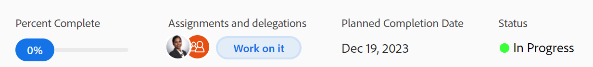

# Visualizza e aggiorna la percentuale di completamento per le attività

<!--Audited: 05/2025-->

È possibile aggiornare la percentuale di completamento di un&#39;attività per indicare lo stato di avanzamento dell&#39;attività verso il completamento.

Aggiornare la percentuale di completamento per i problemi è simile ad aggiornarla per un&#39;attività. In questo articolo viene descritto come aggiornare la percentuale di completamento di un&#39;attività.

## Requisiti di accesso

+++ Espandere per visualizzare i requisiti di accesso.

Per aggiornare manualmente le attività, è necessario disporre dei seguenti diritti di accesso:

<table style="table-layout:auto"> 
 <col> 
 <col> 
 <tbody> 
  <tr> 
   <td role="rowheader">piano Adobe Workfront</td> 
   <td> 
Qualsiasi
 </td> 
  </tr> 
  <tr> 
   <td role="rowheader">Licenza Adobe Workfront*</td> 
   <td> 
Nuova licenza: Standard
 
   Oppure
   
Licenza corrente: Lavoro o versione successiva

   </td> 
  </tr> 
  <tr> 
   <td role="rowheader">Configurazioni del livello di accesso</td> 
   <td> 
Modifica l'accesso alle Attività
 </td> 
  </tr> 
  <tr> 
   <td role="rowheader">Autorizzazioni oggetto</td> 
   <td> 
Gestire le autorizzazioni per l’attività
  </td> 
  </tr> 
 </tbody> 
</table>

*Per informazioni, consulta [Requisiti di accesso nella documentazione di Workfront](/help/quicksilver/administration-and-setup/add-users/access-levels-and-object-permissions/access-level-requirements-in-documentation.md).

+++

## Aree in cui è possibile aggiornare la percentuale di completamento di un&#39;attività

È possibile aggiornare la percentuale di completamento di un&#39;attività in una delle seguenti aree:

* **In un elenco attività**: è possibile aggiornare la percentuale di completamento di un&#39;attività quando viene visualizzata la colonna Percentuale di completamento.

  Per ulteriori informazioni sulla modifica in linea, vedere [Elementi di modifica in linea in un elenco in Adobe Workfront](../../../workfront-basics/navigate-workfront/use-lists/inline-edit-objects.md).

* **Nella vista Milestone**: è possibile aggiornare la percentuale di completamento di un&#39;attività quando si utilizza la vista Milestone in un elenco di progetti o in un report di progetti.

  >[!TIP]
  >
  >  Non è possibile aggiornare la percentuale di completamento dei problemi nella vista Milestone (Attività cardine).

  Per ulteriori informazioni, vedere [Utilizzare la vista Milestone](../../../reports-and-dashboards/reports/reporting-elements/use-milestone-view.md).

* **Nell&#39;intestazione attività**: è possibile aggiornare la percentuale di completamento di un&#39;attività nell&#39;intestazione attività.

  

* **Nel pannello Riepilogo di un&#39;attività**: puoi aggiornare la percentuale di completamento di un&#39;attività nella parte superiore del pannello Riepilogo quando visualizzi l&#39;attività nelle seguenti aree:

   * Elenco o rapporto attività
   * Scheda orario
   * Bilanciatore dei carichi di lavoro

  

  Per ulteriori informazioni, vedere [Panoramica di riepilogo](/help/quicksilver/workfront-basics/the-new-workfront-experience/summary-overview.md)

* **Home**: è possibile aggiornare la percentuale di completamento di un&#39;attività o di un problema dal pannello Riepilogo nell&#39;area Home o dal widget Il mio lavoro.

  Per informazioni, vedere [Guida introduttiva alla Home](/help/quicksilver/workfront-basics/using-home/using-the-home-area/get-started-with-home.md).

## Considerazioni sull&#39;aggiornamento della percentuale di completamento di un&#39;attività

* Quando si contrassegna un&#39;attività come completata al 100%, lo Stato dell&#39;attività viene aggiornato a Completo. Lo stato di un problema viene aggiornato a Chiuso.
* Il completamento di un’attività aggiorna anche la percentuale di completamento dell’attività padre e del progetto.
* Esistono i seguenti scenari per le attività e i progetti padre:
   * Non è possibile aggiornare al 100% la percentuale di completamento di un&#39;attività padre quando la modalità di completamento riepilogo del progetto è impostata su Automatico e le sottoattività non sono completate.
   * È possibile aggiornare al 100% la percentuale di completamento di un&#39;attività padre o di un progetto quando la Modalità di completamento riepilogo del progetto è impostata su Manuale e le sottoattività sono completate o incomplete.

  Per ulteriori informazioni, vedere [Modifica progetti](../manage-projects/edit-projects.md).

## Aggiornare la percentuale di completamento di un&#39;attività

1. Passare a una delle aree in cui si desidera aggiornare la percentuale di completamento di un&#39;attività.

   Per informazioni, vedere la sezione [Aree in cui è possibile aggiornare la percentuale di completamento di un&#39;attività](#areas-where-you-can-update-the-percent-complete-of-a-task) in questo articolo.

1. Individua il campo **Percentuale completata** per l&#39;attività di cui desideri aggiornare la percentuale di completamento.

   >[!TIP]
   >
   >Il campo Percentuale di completamento viene sempre visualizzato nella parte superiore del pannello Riepilogo.

1. Fai clic nel campo **Percentuale completata** e digita un numero compreso tra 0 e 100

   Oppure

   Fai clic e trascina la bolla blu **Percentuale completata** sul numero necessario per indicare quanta attività hai completato, quando disponibile.

   >[!NOTE]
   >
   >    * Non è possibile immettere un numero decimale quando si fa clic all&#39;interno della bolla Percentuale di completamento.
   >    * Quando trascinate la bolla blu nel pannello Riepilogo, la percentuale di completamento viene aggiornata con incrementi di un punto.
   >
   >    * Quando si trascina e si rilascia la bolla blu nell’intestazione dell’attività, la percentuale di completamento viene aggiornata con incrementi di 5 punti.

1. Premi Invio sulla tastiera per salvare la percentuale di completamento.

   Anche la percentuale di completamento del progetto o di qualsiasi attività padre può essere aggiornata automaticamente.

   Anche lo stato dell’attività o del problema viene aggiornato.

