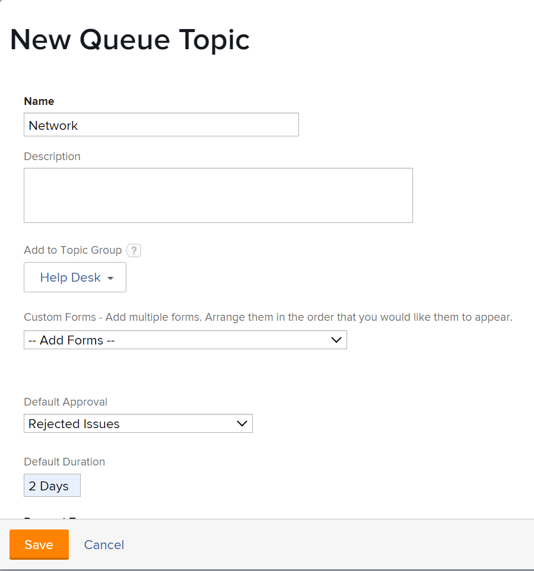

# Crea argomenti coda

<!-- Audited: 12/2023 -->

Gli argomenti della coda funzionano insieme alle regole di instradamento per assegnare automaticamente il lavoro in arrivo a un utente, a una mansione, a un team o per inserirlo in un progetto. Argomenti coda definiscono le condizioni necessarie per l&#39;implementazione della regola di routing.

Non esiste alcun limite al numero di argomenti della coda che è possibile assegnare a un gruppo di argomenti o a un progetto. Gli Argomenti coda sono un tipo di oggetto segnalabile.

## Requisiti di accesso

+++ Espandi per visualizzare i requisiti di accesso per la funzionalità in questo articolo.

<!--drafted - replace table with P&P:

<table style="table-layout:auto"> 
 <col> 
 <col> 
 <tbody> 
  <tr> 
   <td role="rowheader">Adobe Workfront plan*</td> 
   <td> 
Any 
 </td> 
  </tr> 
  <tr> 
   <td role="rowheader">Adobe Workfront license*</td> 
   <td> 
Current license: Standard 
 
   Or
   
Legacy license: Plan 
 </td> 
  </tr> 
  <tr> 
   <td role="rowheader">Access level configurations*</td> 
   <td> 
Edit access to Projects
 
Note: If you still don't have access, ask your Workfront administrator if they set additional restrictions in your access level. For information on how a Workfront administrator can modify your access level, see <a href="../../../administration-and-setup/add-users/configure-and-grant-access/create-modify-access-levels.md" class="MCXref xref">Create or modify custom access levels</a>.
 </td> 
  </tr> 
  <tr> 
   <td role="rowheader">Object permissions</td> 
   <td> 
 Manage permissions to the project
 
For information on requesting additional access, see <a href="../../../workfront-basics/grant-and-request-access-to-objects/request-access.md" class="MCXref xref">Request access to objects </a>.
 </td> 
  </tr> 
 </tbody> 
</table>
-->

Per eseguire i passaggi descritti in questo articolo, è necessario disporre dei seguenti diritti di accesso:

<table style="table-layout:auto"> 
 <col> 
 <col> 
 <tbody> 
  <tr> 
   <td role="rowheader">piano Adobe Workfront</td> 
   <td> 
Qualsiasi 
 </td> 
  </tr> 
  <tr> 
   <td role="rowheader">Licenza Adobe Workfront</td> 
   <td>
    
Nuovo: Standard

    
oppure

    
Corrente: Piano
</td>  
  </tr> 
  <tr> 
   <td role="rowheader">Configurazioni del livello di accesso</td> 
   <td> 
Modifica accesso ai progetti
 </td> 
  </tr> 
  <tr> 
   <td role="rowheader">Autorizzazioni oggetto</td> 
   <td> 
 Gestire le autorizzazioni per il progetto
 </td> 
  </tr> 
 </tbody> 
</table>

Per ulteriori dettagli sulle informazioni contenute in questa tabella, vedere [Requisiti di accesso nella documentazione di Workfront](/help/quicksilver/administration-and-setup/add-users/access-levels-and-object-permissions/access-level-requirements-in-documentation.md).

+++

## Creare un argomento coda

1. Creare una Regola di indirizzamento, un Gruppo di argomenti e un modulo personalizzato, se si intende associarli all&#39;Argomento coda.\
   Per ulteriori informazioni su come creare Regole di indirizzamento, Gruppi di argomenti o moduli personalizzati, consulta i seguenti articoli:

   * [Creare regole di instradamento](../../../manage-work/requests/create-and-manage-request-queues/create-routing-rules.md)
   * [Crea gruppi di argomenti](../../../manage-work/requests/create-and-manage-request-queues/create-topic-groups.md)
   * [Creare o modificare un modulo personalizzato](../../../administration-and-setup/customize-workfront/create-manage-custom-forms/create-or-edit-a-custom-form.md)

1. Passare al progetto che si è scelto di abilitare come coda di richieste di aiuto e dove si desidera creare un nuovo argomento della coda.\
   Per ulteriori informazioni su come designare un progetto come coda di richieste di aiuto, consultate [Creare una coda di richieste](../../../manage-work/requests/create-and-manage-request-queues/create-request-queue.md).

   È possibile organizzare gli argomenti correlati della coda in un gruppo di argomenti. In questo modo il richiedente disporrà di una serie di menu a discesa quando effettua una richiesta.

   Oppure

   È possibile nidificare gli argomenti della coda direttamente sotto il progetto designato come coda di richieste di aiuto, senza un gruppo di argomenti.

   Per informazioni sulla creazione di gruppi di argomenti, vedere [Crea gruppi di argomenti](../../../manage-work/requests/create-and-manage-request-queues/create-topic-groups.md).

1. Clic **Argomenti Coda** nel pannello a sinistra. Potrebbe essere necessario fare clic su **Mostra altro**, quindi **Argomenti Coda**.
1. Clic **Nuovo argomento coda**.
1. Il giorno **Nuovo argomento coda** immetti quanto segue:

   <table style="table-layout:auto"> 
    <col> 
    <col> 
    <tbody> 
     <tr> 
      <td role="rowheader"><strong>Nome</strong> </td> 
      <td> Nome dell'argomento coda.</td> 
     </tr> 
     <tr> 
      <td role="rowheader"><strong>Descrizione</strong> </td> 
      <td>Descrivere la coda di richieste. La descrizione viene visualizzata quando gli utenti selezionano l’argomento della coda durante il processo di invio di una nuova richiesta. </td> 
     </tr> 
     <tr> 
      <td role="rowheader"><strong>Aggiungi a gruppo di argomenti</strong> </td> 
      <td> Se nel progetto non sono presenti gruppi di argomenti, il nome predefinito del progetto sarà Gruppo di argomenti. Se si desidera creare gruppi di argomenti aggiuntivi da qui, selezionare <strong>Crea nuovo gruppo di argomenti</strong> dal menu a discesa. </td> 
     </tr> 
     <tr> 
      <td role="rowheader"><strong>Moduli personalizzati</strong> </td> 
      <td>Selezionare i moduli personalizzati da associare all'argomento della coda. È necessario creare moduli personalizzati per i problemi prima di associarli agli argomenti della coda. Per informazioni sulla creazione di moduli personalizzati, consulta <a href="../../../administration-and-setup/customize-workfront/create-manage-custom-forms/create-or-edit-a-custom-form.md" class="MCXref xref">Creare o modificare un modulo personalizzato</a>.</td> 
     </tr> 
     <tr> 
      <td role="rowheader"><strong>Approvazione predefinita</strong></td> 
      <td> 
Associa un processo di approvazione a questo argomento della coda. In questo menu a discesa sono visibili solo i processi di approvazione del problema. Tutti i problemi inviati a questa coda saranno associati a questo processo di approvazione. Prima di poter associare i processi di approvazione a livello di sistema agli argomenti della coda, l'amministratore di Adobe Workfront deve definirli. Un utente con accesso amministrativo ai processi di approvazione può anche creare processi di approvazione specifici per il gruppo. Per ulteriori informazioni sulla creazione di processi di approvazione, vedere <a href="../../../administration-and-setup/customize-workfront/configure-approval-milestone-processes/create-approval-processes.md" class="MCXref xref">Creare un processo di approvazione per gli elementi di lavoro</a>. 
 
       
 
        
Importante: se il gruppo del progetto cambia, il processo di approvazione specifico del gruppo allegato ai problemi esistenti diventa un processo di approvazione a utente singolo. Per ulteriori informazioni su come le modifiche al gruppo del progetto o le modifiche nel processo di approvazione influiscono sulle impostazioni di approvazione, vedi <a href="../../../administration-and-setup/customize-workfront/configure-approval-milestone-processes/how-changes-affect-group-approvals.md" class="MCXref xref">Effetti delle modifiche al gruppo e al processo di approvazione sui processi di approvazione assegnati</a>.
 
        
Quando aggiungi processi di approvazione agli argomenti in coda, tieni presente quanto segue: 
 
        <ul style="list-style-type: circle;"> 
         <li>Nell'elenco vengono visualizzati solo i processi di approvazione attivi. </li> 
         <li> 
I processi di approvazione a livello di sistema e di gruppo vengono visualizzati nell’elenco. Un processo di approvazione associato a un gruppo diverso da quello del progetto non viene visualizzato nell’elenco.
 </li> 
        </ul> 
       
 </td> 
     </tr> 
     <tr> 
      <td role="rowheader"><strong>Durata predefinita</strong> </td> 
      <td>Questa è la durata predefinita della richiesta e la data di completamento pianificata della richiesta viene calcolata in base a questo valore.</td> 
     </tr> 
     <tr> 
      <td role="rowheader"><strong>Percorso predefinito</strong> </td> 
      <td>Specificare la regola di routing da associare all'argomento coda. È necessario creare la regola di routing prima di allegarla a un Argomento coda. Per informazioni, consulta <a href="../../../manage-work/requests/create-and-manage-request-queues/create-routing-rules.md">Creare regole di instradamento</a>. </td> 
     </tr> 
     <tr> 
      <td role="rowheader"><strong>Tipi di richieste</strong> </td> 
      <td> 
Scegliere il tipo di richieste archiviate dall'argomento coda. Le opzioni visibili sono impostate su <strong>Dettagli coda</strong> del progetto. Questo è un campo obbligatorio. 

   
<b>NOTA</b>:

   I tipi vengono visualizzati come selezione nell&#39;area Richieste solo se il tipo di richiesta è selezionato nelle pagine Dettagli coda e Argomento coda. Per informazioni sulla configurazione dell’area Dettagli coda di un progetto, consulta <a href="../../../manage-work/requests/create-and-manage-request-queues/create-request-queue.md" class="MCXref xref">Creare una coda di richieste</a>. 
 
Selezionare uno dei tipi seguenti:

   <ul>
   <li>Segnalazione Bug</li>
   <li>Richiesta di Modifica</li>
   <li>Problema</li>
   <li>Richiesta</li>
   </ul> 
L&#39;amministratore di Workfront potrebbe aver rinominato alcune di queste opzioni. 
 </td>
   </tr> 
    </tbody> 
   </table>

   

1. Fai clic su **Salva**.\
   L&#39;argomento Coda è ora disponibile ed è visibile nell&#39;area Richieste di Workfront, dopo aver selezionato una coda di richieste e un gruppo di argomenti.
