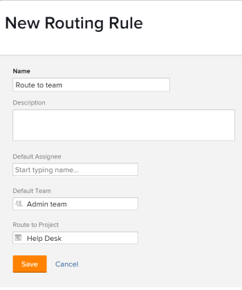

# Creare regole di instradamento

Le regole di instradamento controllano le operazioni di Adobe Workfront con i problemi quando vengono inviati a una coda di richieste. Per ulteriori informazioni sulla creazione di code di richieste, consulta [Creare una coda di richieste](../../../manage-work/requests/create-and-manage-request-queues/create-request-queue.md).

Le regole di instradamento inviano i problemi a utenti o ruoli specifici in grado di risolvere nel modo migliore il problema o la richiesta inviati. Le regole di instradamento sono solitamente associate agli argomenti della coda, utilizzati per controllare quale regola di instradamento verrà applicata al problema o alla richiesta.

## Requisiti di accesso

<!--drafted - replace the table at P&P:

<table style="table-layout:auto"> 
 <col> 
 <col> 
 <tbody> 
  <tr> 
   <td role="rowheader">Adobe Workfront plan*</td> 
   <td> 
Any 
 </td> 
  </tr> 
  <tr> 
   <td role="rowheader">Adobe Workfront license*</td> 
   <td> 
Current license: Standard 
 
   Or
   
Legacy license: Plan 
 </td> 
  </tr> 
  <tr> 
   <td role="rowheader">Access level configurations*</td> 
   <td> 
Edit access to Projects
 
<b>NOTE</b>
   
   If you still don't have access, ask your Workfront administrator if they set additional restrictions in your access level. For information on how a Workfront administrator can modify your access level, see <a href="../../../administration-and-setup/add-users/configure-and-grant-access/create-modify-access-levels.md" class="MCXref xref">Create or modify custom access levels</a>.
 </td> 
  </tr> 
  <tr> 
   <td role="rowheader">Object permissions</td> 
   <td> 
 Manage permissions to the project
 
For information on requesting additional access, see <a href="../../../workfront-basics/grant-and-request-access-to-objects/request-access.md" class="MCXref xref">Request access to objects </a>.
 </td> 
  </tr> 
 </tbody> 
</table>
-->

Devi avere i seguenti:

<table style="table-layout:auto"> 
 <col> 
 <col> 
 <tbody> 
  <tr> 
   <td role="rowheader">Piano Adobe Workfront*</td> 
   <td> 
Qualsiasi 
 </td> 
  </tr> 
  <tr> 
   <td role="rowheader">Licenza Adobe Workfront*</td> 
   <td> 
Piano 
 </td> 
  </tr> 
  <tr> 
   <td role="rowheader">Configurazioni del livello di accesso*</td> 
   <td> 
Modifica accesso ai progetti
 
<b>NOTA</b>

Se non disponi ancora dell’accesso, chiedi all’amministratore di Workfront se ha impostato restrizioni aggiuntive nel tuo livello di accesso. Per informazioni su come un amministratore di Workfront può modificare il tuo livello di accesso, consulta <a href="../../../administration-and-setup/add-users/configure-and-grant-access/create-modify-access-levels.md" class="MCXref xref">Creare o modificare livelli di accesso personalizzati</a>.
 </td>
</tr> 
  <tr> 
   <td role="rowheader">Autorizzazioni oggetto</td> 
   <td> 
 Gestire le autorizzazioni per il progetto
 
Per informazioni sulla richiesta di accesso aggiuntivo, consulta <a href="../../../workfront-basics/grant-and-request-access-to-objects/request-access.md" class="MCXref xref">Richiedi accesso agli oggetti </a>.
 </td> 
  </tr> 
 </tbody> 
</table>

*Per conoscere la pianificazione, il tipo di licenza o l&#39;accesso disponibili, contattare l&#39;amministratore Workfront

## Creare una regola di instradamento

1. Vai al progetto a cui desideri aggiungere le regole di instradamento per le richieste.
1. Clic **Regole di instradamento** nel pannello a sinistra. Potrebbe essere necessario fare clic su **Mostra altro**, quindi **Regole di instradamento**.
1. Clic **Nuove regole di instradamento** per aggiungere la nuova regola.
1. Specificare le informazioni seguenti per la Regola di instradamento:

   <table style="table-layout:auto"> 
    <col> 
    <col> 
    <thead> 
     </thead> 
    <tbody> 
     <tr> 
      <td role="rowheader"><strong>Nome</strong> </td> 
      <td> 
Nome della regola di routing. Se si dispone dell'accesso per visualizzare queste informazioni sul progetto, è possibile visualizzare la regola di instradamento.
 </td> 
     </tr> 
     <tr> 
      <td role="rowheader"><strong>Descrizione</strong> </td> 
      <td>Aggiungere una descrizione per la regola di routing.</td> 
     </tr> 
     <tr> 
      <td role="rowheader"><strong>l'Incaricato Predefinito*</strong> </td> 
      <td>Aggiungi un utente attivo o una mansione attiva a cui assegnare i nuovi problemi. In questo campo può essere presente un solo assegnatario predefinito. </td> 
     </tr> 
     <tr> 
      <td role="rowheader"><strong>Team predefinito*</strong> </td> 
      <td>Aggiungi un team attivo a cui assegnare il nuovo problema. In questo campo è disponibile un solo team predefinito.

   
<b>NOTA</b>

   Dopo l’invio del problema, puoi modificarne le assegnazioni e assegnare altri utenti, ruoli o team. Per informazioni, consulta  <a href="../../../manage-work/issues/manage-issues/assign-issues.md">Assegna problemi </a>.

   </td> 
     </tr> 
     <tr> 
      <td role="rowheader"><strong>Instrada al Progetto</strong> </td> 
      <td>Questo è il progetto in cui viene aggiunto il problema.</td> 
     </tr> 
    </tbody> 
   </table>

   >[!NOTE]
   >
   >*Se un utente, una mansione o un team viene disattivato dopo essere stato associato a una regola di instradamento, le richieste continuano a essere instradate a loro. È necessario eseguire periodicamente un inventario di tutte le regole di instradamento e sostituire le assegnazioni disattivate con quelle attive.

   Quando si indirizza un problema a un progetto, gli utenti con autorizzazioni per il problema ricevono le autorizzazioni impostate per tale progetto. Per informazioni sull’impostazione delle autorizzazioni per i progetti, consulta [Condividere un progetto in Adobe Workfront](../../../workfront-basics/grant-and-request-access-to-objects/share-a-project.md).

   

1. Fai clic su **Salva**.

   Questo processo definisce solo la Regola di instradamento. Per garantire che il problema venga instradato quando viene inviato alla coda richieste, è necessario selezionare la regola di instradamento nella **Dettagli coda** scheda in **Percorso predefinito**.

   Per informazioni sull&#39;aggiunta di una route predefinita a una coda di richieste, vedere [Creare una coda di richieste](../../../manage-work/requests/create-and-manage-request-queues/create-request-queue.md).

   Se si desidera associare più regole di instradamento alla coda di richieste, è necessario creare più argomenti della coda e associarli a una regola di instradamento separata. Per ulteriori informazioni sulla creazione di un argomento della coda, vedere [Crea argomenti coda](../../../manage-work/requests/create-and-manage-request-queues/create-queue-topics.md).
