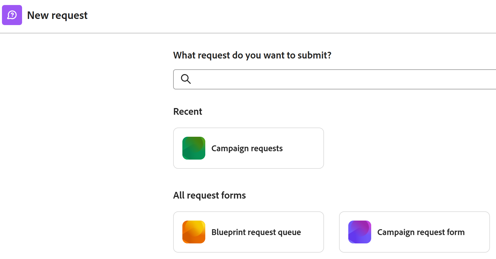

# Creare e inviare richieste

<!--Audited: 12/2023-->

<!--The highlighted information on this page refers to functionality not yet generally available. It is available only in the Preview environment for all customers. After the monthly releases to Production, the same features are also available in the Production environment for customers who enabled fast releases.    

For information about fast releases, see [Enable or disable fast releases for your organization](/help/quicksilver/administration-and-setup/set-up-workfront/configure-system-defaults/enable-fast-release-process.md). -->

Il lavoro pianificato è rappresentato in Adobe Workfront dai progetti e dalle attività. Tuttavia, puoi lavorare in un ambiente in cui è possibile inserire lavoro non pianificato, sotto forma di richieste, in qualsiasi momento. Workfront fornisce un flusso di lavoro per questo tipo di ambiente tramite l’utilizzo di Code di richieste.

Dopo aver creato una richiesta in una coda di richieste, è possibile assegnarla a una richiesta da completare oppure convertirla in un&#39;attività o un progetto.\
Per ulteriori informazioni sulla conversione dei problemi in un&#39;attività o un progetto, vedere l&#39;articolo [Panoramica sulla conversione dei problemi in Adobe Workfront](../../../manage-work/issues/convert-issues/convert-issues.md).

Puoi creare una richiesta Workfront nei seguenti modi:

* Da zero come descritto in questo articolo.
* Dalle bozze. Per informazioni, vedere [Creare richieste dalle bozze](../../../manage-work/requests/create-requests/create-requests-from-drafts.md).
* Da una richiesta esistente, copiandone e inviandone una copia. Per informazioni, vedere [Copiare e inviare richieste](../../../manage-work/requests/create-requests/copy-and-submit-requests.md).

È possibile creare una richiesta di Workfront Planning da zero per creare record in Workfront Planning nei modi seguenti:

* Da un collegamento a un modulo di richiesta di Workfront Planning.

* Da un modulo di richiesta Workfront Planning nell&#39;area Richieste di Workfront.

  L&#39;organizzazione deve acquistare un pacchetto Workfront Planning. Per informazioni, vedere [Inviare le richieste di Adobe Workfront Planning per la creazione di record](/help/quicksilver/planning/requests/submit-requests.md).

## Requisiti di accesso

+++ Espandi per visualizzare i requisiti di accesso per la funzionalità in questo articolo.

Per eseguire i passaggi descritti in questo articolo, è necessario disporre dei seguenti diritti di accesso:

<table style="table-layout:auto"> 
 <col> 
 <col> 
 <tbody> 
  <tr> 
   <td role="rowheader">piano Adobe Workfront</td> 
   <td> 
Qualsiasi 
 </td> 
  </tr> 
  <tr> 
   <td role="rowheader">Licenza Adobe Workfront</td> 
   <td> 
Nuovo: Collaboratore o versione successiva

   Oppure
   
Corrente: richiesta o successiva

    </td> 
  </tr> 
  <tr> 
   <td role="rowheader">Configurazioni del livello di accesso</td> 
   <td> 
Modifica l'accesso alle Issues
  </td> 
  </tr> 
 </tbody> 
</table>

Per ulteriori dettagli sulle informazioni contenute in questa tabella, vedere [Requisiti di accesso nella documentazione di Workfront](/help/quicksilver/administration-and-setup/add-users/access-levels-and-object-permissions/access-level-requirements-in-documentation.md).

+++

## Prerequisiti per l’utilizzo delle code di richieste

Prima di poter utilizzare questa funzionalità, un amministratore di Workfront deve creare code di richieste e renderle disponibili agli utenti. Anche un utente con una licenza Planner e con l’accesso di modifica ai progetti e le autorizzazioni di gestione a un progetto specifico può creare code di richieste.

Per informazioni su come creare code di richieste, vedere l&#39;articolo [Creare una coda di richieste](../../../manage-work/requests/create-and-manage-request-queues/create-request-queue.md).

Un amministratore di Workfront deve creare i seguenti componenti di una coda di richieste:

* Progetto in stato Corrente, pubblicato come coda di richieste di aiuto.
* Argomenti Coda.\
  Per ulteriori informazioni, vedere l&#39;articolo [Crea argomenti coda](../../../manage-work/requests/create-and-manage-request-queues/create-queue-topics.md).

* Regole di instradamento.\
  Per ulteriori informazioni, vedere l&#39;articolo [Creare regole di routing](../../../manage-work/requests/create-and-manage-request-queues/create-routing-rules.md).

* Gruppi di argomenti (facoltativo).\
  Per ulteriori informazioni, vedere l&#39;articolo [Creare gruppi di argomenti](../../../manage-work/requests/create-and-manage-request-queues/create-topic-groups.md).

* (Facoltativo) Richiedi modulo personalizzato.\
  Per ulteriori informazioni, vedere l&#39;articolo [Creare un modulo personalizzato](/help/quicksilver/administration-and-setup/customize-workfront/create-manage-custom-forms/form-designer/design-a-form/design-a-form.md).

* (Facoltativo) Processo di approvazione delle richieste.\
  Per ulteriori informazioni, vedere l&#39;articolo [Creare un processo di approvazione per gli elementi di lavoro](../../../administration-and-setup/customize-workfront/configure-approval-milestone-processes/create-approval-processes.md).

## Creare richieste e generare bozze nell’app web Workfront

Quando crei una richiesta nell’app web Workfront, Workfront la salva come bozza prima dell’invio. Workfront crea una bozza non appena selezioni la coda di richieste e inizi a immettere le informazioni per essa.

È possibile continuare a inviare la richiesta oppure completare tutte le informazioni disponibili e spostarsi da tale richiesta per completarla in un secondo momento. Workfront salva la richiesta bozza avviata nella cartella Bozze.

>[!IMPORTANT]
>
>Quando utilizzate le bozze, tenete presente quanto segue:
>
>* Workfront non crea bozze di richieste quando le invii da un’applicazione di terze parti, ad esempio inviandole tramite e-mail a Workfront o creandole utilizzando un’altra applicazione. Quando invii una richiesta dall’esterno dell’app web Workfront, la richiesta viene salvata nella sezione Inviata.
>* Se la struttura di una coda di richieste cambia, non è più possibile accedere alle bozze esistenti. Ad esempio, se un argomento della coda viene rimosso o viene aggiunto un gruppo di argomenti, le bozze salvate non sono più accessibili.
>

Per informazioni sulla creazione di richieste da bozze esistenti, vedere [Creare richieste da bozze](../../../manage-work/requests/create-requests/create-requests-from-drafts.md). Per informazioni sull&#39;eliminazione delle bozze di richiesta, vedere anche [Eliminare una bozza di richiesta](../../../manage-work/requests/create-requests/delete-request-draft.md).

Per creare una richiesta nell’app web Workfront:

{{step1-to-requests}}

1. (Facoltativo e condizionale) Seleziona l&#39;impostazione **Passa alla nuova esperienza** in alto a destra dello schermo, se all&#39;organizzazione e all&#39;istanza di Workfront si applicano le seguenti condizioni:

   * La tua organizzazione ha acquistato un pacchetto Workfront
   * La tua organizzazione è stata integrata in Adobe Unified Experience.
   * L&#39;amministratore ti ha concesso l&#39;accesso a Workfront Planning
   * Si dispone almeno delle autorizzazioni di visualizzazione per un&#39;area di lavoro di Workfront Planning

   Per ulteriori informazioni, vedere [Inviare le richieste di Adobe Workfront Planning per la creazione di record](/help/quicksilver/planning/requests/submit-requests.md)

1. Fai clic su **Nuova richiesta** nell&#39;angolo superiore destro della pagina.

   >[!TIP]
   >
   >* È possibile accedere all’opzione Nuova richiesta da qualsiasi sezione nell’area Richieste.
   >* L’opzione Nuova richiesta non è attiva quando non disponi dell’accesso per creare problemi.

   Viene visualizzata la casella **Nuova richiesta**.

1. (Condizionale) Se si è passati alla nuova esperienza che include Workfront Planning e si trova nell&#39;ambiente di produzione, nella casella **Nuova richiesta** viene visualizzato quanto segue:

   * Le 6 code di richieste Workfront e i moduli di richiesta Planning utilizzati più di recente vengono visualizzati nella sezione Recenti.
   * Nella sezione **Tutti i moduli di richiesta** vengono visualizzate in ordine alfabetico 50 code di richiesta Workfront e moduli di richiesta Planning aggiuntivi. Puoi cercare una coda di richieste che non viene visualizzata per impostazione predefinita.

   

   Fai clic su una delle schede della coda di richieste di Workfront o cercalo, quindi fai clic su di essa quando viene visualizzata nell’elenco.
1. (Condizionale) Se si è passati alla nuova esperienza che include Workfront Planning e si trova nell&#39;ambiente di anteprima, nella casella **Nuova richiesta** viene visualizzato quanto segue:

   <ul><li>Le 6 code di richieste Workfront e i moduli di richiesta Planning utilizzati più di recente vengono visualizzati nella sezione Recenti. </li>
    <li>Tutti i moduli di richiesta aggiuntivi di Workfront e Planning <b>Sezione Tutti i moduli di richiesta</b>. È possibile cercare moduli di richiesta non visualizzati per impostazione predefinita. </li>
    <li>Tutti i percorsi aggiuntivi della coda richieste di Workfront e Planning vengono visualizzati nella sezione <b>Tutti i percorsi richieste</b>. Puoi cercare una coda di richieste che non viene visualizzata per impostazione predefinita.</li></ul>
   Fai clic su uno dei percorsi o moduli della coda di richieste di Workfront oppure cercalo, quindi fai clic su di esso quando viene visualizzato nell’elenco.

1. (Condizionale) Se si è passati alla nuova esperienza che include Workfront Planning, selezionare i gruppi di argomenti e gli argomenti della coda e continuare ad aggiornare il modulo.

   In caso contrario, fare clic all&#39;interno del campo **Tipo di richiesta** ed eseguire una delle operazioni seguenti:

   * Dalla sezione **Percorsi recenti**, seleziona un percorso utilizzato di recente per aprire una coda di richieste. Un percorso include la coda delle richieste, i gruppi di argomenti e l&#39;argomento della coda a cui hai inviato di recente. Per impostazione predefinita, vengono visualizzati gli ultimi tre percorsi.

     >[!NOTE]
     >
     >Workfront salva un percorso solo quando è stata effettivamente inviata una richiesta. Non crea percorsi per le richieste di bozze.

     

   * Dalla sezione **Code di richieste**, seleziona una coda di richieste.
   * Per cercare una coda di richieste, immetti una parola chiave che appartiene a un percorso a cui si è effettuato l’accesso in precedenza.

     Ad esempio, se disponi di una coda di richieste denominata &quot;Help Desk&quot; con un Topic Group denominato &quot;Location&quot; e un Queue Topic denominato &quot;Remote&quot;, puoi digitare &quot;remote&quot; e tutte le code di richieste che contengono &quot;remote&quot; in qualsiasi elemento del loro percorso vengono visualizzate.

     >[!TIP]
     >
     >Quando si digita un nome che contiene un carattere speciale, la coda di richieste, l&#39;argomento della coda o il gruppo di argomenti vengono visualizzati anche se si omette di digitare il carattere.

     

     L’elenco delle code di richieste disponibili e dei percorsi recenti viene aggiornato in modo dinamico, includendo solo i percorsi che contengono la parola chiave evidenziata nei risultati.

     I risultati della ricerca vengono visualizzati nelle seguenti aree:

     <table style="table-layout:auto"> 
      <col> 
      <col> 
      <tbody> 
       <tr> 
        <td role="rowheader">Code di richieste</td> 
        <td>Code di richieste che contengono la parola chiave nel nome</td> 
       </tr> 
       <tr> 
        <td role="rowheader">Percorsi delle richieste</td> 
        <td> 
Percorsi (che includono code di richieste, gruppi di argomenti, argomenti della coda) che contengono la parola chiave in uno qualsiasi dei nomi dei relativi elementi
 </td> 
       </tr> 
      </tbody> 
     </table>

   >[!TIP]
   >
   >* Per impostazione predefinita, le prime 200 code di richieste vengono visualizzate in ordine alfabetico.
   >* Il nome della coda di richieste è il nome del progetto che è stato pubblicato come coda di richieste di aiuto.
   >* La descrizione del progetto configurato come coda di richieste selezionata viene visualizzata a destra del nome della coda di richieste.
   >   
   >Per ulteriori informazioni su come pubblicare un progetto come coda di richieste di aiuto, vedere l&#39;articolo [Creare una coda di richieste](../../../manage-work/requests/create-and-manage-request-queues/create-request-queue.md).

1. Nel modulo **Nuova richiesta** eseguire una delle operazioni seguenti:

   * (Facoltativo) Seleziona una bozza disponibile dal messaggio di notifica visualizzato nel campo Tipo di richiesta.

     Questa area viene visualizzata solo se prima sono state salvate delle bozze senza inviarle.

     Per impostazione predefinita vengono visualizzate le tre bozze più recenti di tre diversi argomenti della coda.

     

   * Inizia a immettere una nuova richiesta nella coda selezionata.

     Una nuova bozza viene salvata automaticamente nella sezione Bozze dopo l&#39;immissione delle informazioni per la nuova richiesta e l&#39;assegnazione di un nome alla richiesta nel campo Oggetto.

1. (Facoltativo) Se la Coda richieste include Gruppi di argomenti, seleziona il nome del Gruppo di argomenti nel primo campo a discesa. In caso contrario, selezionare un argomento coda.

   >[!TIP]
   >
   >Quando passi il cursore su un Topic Group (Gruppo di argomenti) o su un Queue Topic (Argomento coda), il campo Description (Descrizione) viene visualizzato a destra. Contiene informazioni aggiuntive sul gruppo di argomenti o sull&#39;argomento della coda.
   >
   >
   >
   >

   Nella coda richieste è possibile incorporare fino a 10 livelli di gruppi di argomenti.\
   Per ulteriori informazioni sulla creazione di gruppi di argomenti, vedere l&#39;articolo [Creare gruppi di argomenti](../../../manage-work/requests/create-and-manage-request-queues/create-topic-groups.md). Per ulteriori informazioni sulla creazione degli argomenti della coda, vedere l&#39;articolo [Creare argomenti della coda](../../../manage-work/requests/create-and-manage-request-queues/create-queue-topics.md).

   >[!TIP]
   >
   >Se avete selezionato una bozza o un percorso precedente, i gruppi di argomenti e gli argomenti della coda sono già selezionati. Se necessario, puoi selezionarne uno diverso.

1. A seconda dei campi abilitati dall&#39;amministratore di Workfront nella sezione **Nuovi campi problema** della scheda secondaria **Dettagli coda** del progetto, quando si invia una nuova richiesta è possibile che siano presenti i campi seguenti:

   <table style="table-layout:auto"> 
    <col> 
    <col> 
    <tbody> 
     <tr> 
      <td role="rowheader"><strong>Oggetto</strong> </td> 
      <td>Specifica un nome per la richiesta. Questo è un campo obbligatorio.</td> 
     </tr> 
     <tr> 
      <td role="rowheader"><strong>Descrizione</strong> </td> 
      <td>Specifica una descrizione per la richiesta.</td> 
     </tr> 
     <tr> 
      <td role="rowheader"><strong>URL</strong> </td> 
      <td> 
Specifica un URL che potrebbe essere correlato alla richiesta.
 </td> 
     </tr> 
     <tr> 
      <td role="rowheader"><strong>Priorità</strong> </td> 
      <td> 
Specifica una priorità per la richiesta. La priorità deve definire la velocità con cui pensi che questa richiesta debba essere risolta. Le opzioni predefinite sono: 
 
       <ul> 
        <li>Nessuno</li> 
        <li>Basso </li> 
        <li>Normal</li> 
        <li>Alta</li> 
        <li>Urgente</li> 
       </ul> 
L’amministratore di sistema può modificare i nomi delle priorità.
 </td> 
     </tr> 
     <tr> 
      <td role="rowheader"><strong>Gravità</strong> </td> 
      <td> 
Specifica la gravità della richiesta. La gravità deve definire l’impatto di questa richiesta sul lavoro nel caso non venga risolta in tempo. Le opzioni predefinite sono:
 
       <ul> 
        <li>Cosmetico</li> 
        <li>Causa Confusione</li> 
        <li>Bug con workaround</li> 
        <li>Bug senza workaround</li> 
        <li>Errore Fatale</li> 
       </ul> 
L’amministratore di sistema può modificare i nomi delle gravità.
 </td> 
     </tr> 
     <tr> 
      <td role="rowheader"><strong>Contatto principale</strong> </td> 
      <td>Il contatto principale di una richiesta viene impostato automaticamente su di te, in quanto sei la persona che risponde a tutte le domande relative alla richiesta. Tuttavia, puoi modificarlo in qualsiasi altro utente di Workfront.</td> 
     </tr> 
     <tr data-mc-conditions="QuicksilverOrClassic.Quicksilver"> 
      <td role="rowheader"><strong>Assegnazioni</strong> </td> 
      <td> 
Specificare il nome di un utente attivo, una mansione o un team a cui assegnare la richiesta. 
 
È possibile specificare un solo team.

   
 A seconda di come è stata impostata la coda di richieste, è possibile assegnare solo uno o due tipi di risorse alla richiesta, anziché tutti e tre (ad esempio, è possibile assegnare la richiesta solo agli utenti).

   
Se alla coda di richieste è associata anche una regola di instradamento che instrada automaticamente la richiesta a un tipo diverso di risorsa (ad esempio, un team), la richiesta viene assegnata sia all'entità specificata manualmente durante l'invio della richiesta (utenti) sia alla risorsa specificata nella regola di instradamento (team). 

   
 Per ulteriori informazioni, consulta i seguenti articoli:
 
      <ul> 
      <li> 
<a href="../../../manage-work/requests/create-and-manage-request-queues/create-request-queue.md" class="MCXref xref">Creare una coda di richieste</a> 
 </li> 
      <li> 
<a href="../../../manage-work/requests/create-and-manage-request-queues/create-routing-rules.md" class="MCXref xref">Crea regole di routing</a>   
 </li> 
      </ul> 

   
È consigliabile utilizzare le regole di routing per le code di richieste in modo che possano essere instradate automaticamente alle risorse appropriate. 
 </td> 
     </tr>

   <tr> 
      <td role="rowheader"><strong>Ore pianificate</strong> </td> 
      <td> 
Stimare quante ore occorrerebbe per completare la richiesta.
 </td> 
     </tr> 
     <tr> 
      <td role="rowheader"><strong>Data inizio pianificata</strong> </td> 
      <td> 
Specifica la data di inizio dei lavori per questa richiesta.
 </td> 
     </tr> 
     <tr> 
      <td role="rowheader"><strong>Data di completamento Pianificata</strong> </td> 
      <td>Specifica la data in cui desideri risolvere la richiesta.</td> 
     </tr> 
     <tr> 
      <td role="rowheader"><strong>Stato</strong> </td> 
      <td>Lo stato predefinito di una nuova richiesta è "Nuovo". È possibile che l'amministratore di sistema abbia modificato il nome di questo stato. Puoi anche cambiare lo stato da questo menu a discesa.</td> 
     </tr> 
     <tr> 
      <td role="rowheader"><strong>Documenti</strong> </td> 
      <td> 
Aggiungi documenti alla tua richiesta. 
 
 A seconda della configurazione della coda di richieste, la sezione Documenti potrebbe essere visualizzata prima o dopo i campi personalizzati. 
 
I documenti caricati su Workfront vengono memorizzati per 24 ore in una bozza di richiesta. Successivamente, è necessario ricollegarli quando si torna alla modifica e si invia la bozza. I documenti collegati da altre unità vengono salvati in modo permanente nella bozza. 
 </td> 
     </tr> 
    </tbody> 
   </table>

1. (Facoltativo) Se l’amministratore di Workfront ha associato un modulo personalizzato alla coda richieste o all’argomento Coda, specifica i campi all’interno del modulo personalizzato.\
   I moduli personalizzati sono diversi per ogni istanza di Workfront.
1. (Facoltativo e condizionale) In qualsiasi momento durante l&#39;immissione della richiesta, fare clic su [!UICONTROL **Elimina bozza**] per eliminare la bozza creata automaticamente. In questo modo viene eliminata la bozza che non può essere recuperata. Viene visualizzato un messaggio di conferma per confermare l’eliminazione della bozza.

1. (Facoltativo) Fai clic su [!UICONTROL **Annulla**] nel messaggio di conferma se desideri ripristinare l&#39;azione e mantenere la bozza.

1. Esegui una delle operazioni seguenti:

   * Fare clic su **Invia** per inviare la richiesta. La richiesta viene salvata nella sezione Inviata. A seconda della Regola di indirizzamento della Coda richieste, questa richiesta potrebbe essere indirizzata a un progetto diverso da quello designato come Coda richieste. Per informazioni sulle regole di routing, vedere [Creare regole di routing](../../../manage-work/requests/create-and-manage-request-queues/create-routing-rules.md).

     Oppure

     Fai clic su **Chiudi** se non sei ancora pronto per inviarlo e potresti tornare indietro e terminarlo in un secondo momento. La richiesta viene salvata nella sezione Bozze e sarà disponibile al prossimo invio di una richiesta per questa coda di richieste.

     

   Quando inviate la richiesta, la bozza viene eliminata automaticamente e non può essere ripristinata.

   Le richieste inviate sono elencate nella sezione **Inviate** dell&#39;area Richieste. Se si utilizza la nuova esperienza che include Workfront Planning, le richieste inviate da Workfront verranno visualizzate nella scheda **Workfront** dell&#39;area Richieste.

   Per informazioni sulla gestione delle richieste in arrivo, vedere l&#39;articolo [Gestione delle richieste del team e del lavoro](../../../people-teams-and-groups/work-with-team-requests/manage-work-and-team-requests.md).

   Per informazioni sull&#39;individuazione delle richieste inviate o bozze, vedere anche [Individuare le richieste inviate](../../../manage-work/requests/create-requests/locate-submitted-requests.md).

## Creare richieste dall’esterno di Workfront

È possibile condividere un collegamento diretto a una coda di richieste quando si invia una nuova richiesta e incorporarla in altre applicazioni. Gli utenti che accedono a questo collegamento dal web o da altre applicazioni devono inoltre aver effettuato l’accesso con un account Workfront attivo per poter accedere a questa coda e inviare richieste. Per informazioni, vedere [Condividere un collegamento a una coda di richieste](../../../manage-work/requests/create-requests/share-link-to-request-queue.md).

## Creare le richieste inviando un’e-mail a Workfront

Se la Coda richieste è abilitata a ricevere le richieste tramite e-mail, puoi inviare le richieste tramite e-mail direttamente all’indirizzo e-mail associato alla Coda richieste.

Il corpo del testo dell’e-mail viene aggiunto come descrizione della richiesta.

>[!NOTE]
>
>La formattazione di HTML viene rimossa quando la richiesta entra in Workfront, ma le firme e il contenuto del thread di risposta esistente non vengono rimossi e vengono visualizzati nella descrizione della richiesta.

Per informazioni su come consentire a una coda richieste di ricevere richieste tramite e-mail, vedere [Consentire agli utenti di inviare un problema tramite e-mail a un progetto della coda richieste](../../../manage-work/requests/create-requests/enable-email-issues-into-projects.md).

## Creare richieste utilizzando il client di Outlook

È possibile inviare richieste utilizzando il client di Outlook. Puoi creare una nuova richiesta oppure convertire un’e-mail in una richiesta.

Per informazioni sull&#39;invio di richieste tramite il client Outlook, vedere l&#39;articolo [Creare una richiesta Adobe Workfront da un messaggio di posta elettronica di Outlook](../../../workfront-integrations-and-apps/using-workfront-with-outlook/create-a-wf-request-from-an-outlook-email.md).

## Creare richieste tramite l’app mobile di Workfront

Puoi inviare richieste utilizzando l’app mobile sul tuo smartphone. Puoi creare una nuova richiesta e inviarla alle code di richieste a cui hai accesso e che potrai visualizzare nell’applicazione web.

Per informazioni sull’invio delle richieste tramite l’app mobile, consulta la sezione Richieste negli articoli:

* [Adobe Workfront per Android](../../../workfront-basics/mobile-apps/using-the-workfront-mobile-app/workfront-for-android.md#requests)
* [Adobe Workfront per iOS](../../../workfront-basics/mobile-apps/using-the-workfront-mobile-app/workfront-for-ios.md#requests)

## Creare richieste da altre applicazioni

Puoi inviare richieste utilizzando qualsiasi applicazione integrata con Workfront:

* Puoi creare un’integrazione personalizzata tra Workfront e un’altra applicazione che ti consenta di inviare richieste a Workfront dall’altra applicazione.\
  Per ulteriori informazioni sulle integrazioni Workfront personalizzate, vedere l&#39;articolo [Integrazioni Adobe Workfront](../../../administration-and-setup/configure-integrations/workfront-integrations-1.md).

## Creare richieste utilizzando un modulo di richiesta Workfront Planning

È possibile aggiungere una richiesta di Workfront Planning utilizzando un modulo di richiesta Planning. L&#39;aggiunta di richieste di Workfront Planning può creare record di Planning, se il modulo di richiesta è approvato o non richiede l&#39;approvazione.

Per poter inviare richieste Planning, l&#39;organizzazione deve acquistare un pacchetto Workfront Planning.

Per informazioni, vedere i seguenti articoli:

* [Crea e gestisci un modulo di richiesta in Adobe Workfront Planning](/help/quicksilver/planning/requests/create-request-form.md).
* [Inviare le richieste di Adobe Workfront Planning per creare record](/help/quicksilver/planning/requests/submit-requests.md).

## Individuare le richieste inviate

Per informazioni sull&#39;individuazione delle richieste inviate o bozze, vedere [Individuare le richieste inviate](../../../manage-work/requests/create-requests/locate-submitted-requests.md).
