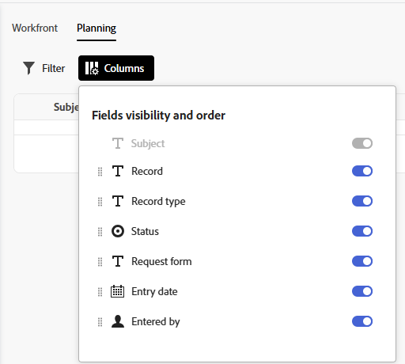
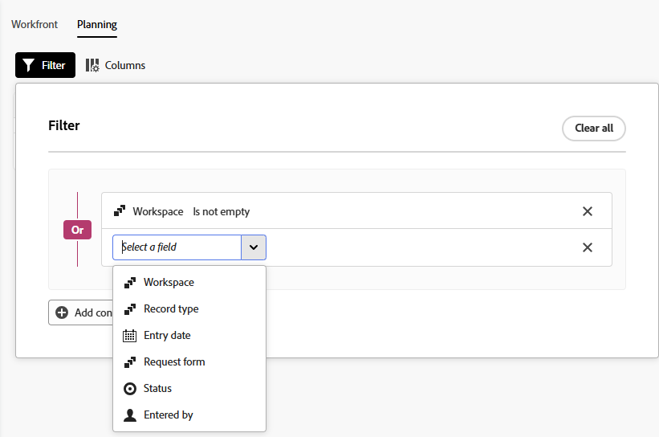

# Creare e gestire le viste nell’area Richieste

Le informazioni evidenziate in questa pagina si riferiscono a funzionalità non ancora generalmente disponibili. È disponibile solo nell&#39;ambiente Sandbox di anteprima.

Se utilizzi la nuova esperienza di richiesta, puoi creare e salvare viste per l’area Richieste. Queste visualizzazioni includono filtri e disposizioni per le colonne.

Le visualizzazioni possono essere create e gestite nell’area Richieste di Workfront e nel widget Richieste personali nella Home. Le impostazioni di visualizzazione vengono mantenute tra l&#39;area Richieste e il widget.

>[!IMPORTANT]
>
>Questa funzionalità è disponibile solo nella nuova esperienza di richiesta.

## Requisiti di accesso

+++ Espandi per visualizzare i requisiti di accesso per la funzionalità descritta in questo articolo.

<table style="table-layout:auto"> 
 <col> 
 <col> 
 <tbody> 
 <tbody> 
  <tr> 
   <td role="rowheader">Pacchetto Adobe Workfront</td> 
   <td> 
Qualsiasi 
 </td> 
  </tr> 
  <tr> 
   <td role="rowheader">Licenza Adobe Workfront</td> 
   <td> 
Collaboratore o versione successiva

   
Richiedi o superiore

    </td> 
  </tr> 
  <tr> 
   <td role="rowheader">Configurazioni del livello di accesso</td> 
   <td> 
Modifica l'accesso alle Issues
  
Per aggiungere visualizzazioni ai modelli di layout è necessario essere un amministratore Workfront</td> 
  </tr> 
  <tr> 
   <td role="rowheader"> Prodotto</td> 
   <td> <ul><li>Adobe Workfront</li><li>È necessario disporre di Adobe Workfront Planning per visualizzare le richieste o i moduli di richiesta di Planning</td> 
  </tr> 
 </tbody> 
</table>

Per ulteriori dettagli sulle informazioni contenute in questa tabella, vedere [Requisiti di accesso nella documentazione di Workfront](/help/quicksilver/administration-and-setup/add-users/access-levels-and-object-permissions/access-level-requirements-in-documentation.md).

+++

## Creare una vista nell’area Richieste

È possibile creare una visualizzazione nell&#39;area Richieste di Workfront o nel widget Richieste personali della Home.

1. Per accedere all’elenco Richieste:

   {{step1-to-requests}}

1. Per accedere al widget Richieste personali nella Home:

   {{step1-to-home}}

   1. Individuare il widget Richieste personali.

      Per ulteriori informazioni sul widget Richieste personali, vedere [Utilizzare il widget Richieste personali](/help/quicksilver/workfront-basics/using-home/using-the-home-area/my-requests-widget.md).

1. Nell&#39;elenco Richieste o nel widget Richieste personali, fare clic sul menu a discesa **Visualizzazioni**  e selezionare **Nuova visualizzazione**.

   

1. Immettere un nome per la nuova visualizzazione e fare clic su **Crea**.
1. Continuare a [Modificare una visualizzazione nell&#39;area Richieste](#edit-a-view-in-the-requests-area).

## Modificare una vista nell’area Richieste

È possibile modificare le viste esistenti, incluse quelle appena create.

1. Per accedere all’elenco Richieste:

   {{step1-to-requests}}

1. Per accedere al widget Richieste personali nella Home:

   {{step1-to-home}}

   1. Individuare il widget Richieste personali.

      Per ulteriori informazioni sul widget Richieste personali, vedere [Utilizzare il widget Richieste personali](/help/quicksilver/workfront-basics/using-home/using-the-home-area/my-requests-widget.md).

1. Nell&#39;elenco Richieste o nel widget Richieste personali individuare la visualizzazione che si desidera modificare.

1. (Facoltativo) Per rinominare una visualizzazione, fai clic sul menu a discesa **Visualizzazioni**  e fai clic sul menu a tre punti accanto alla visualizzazione, seleziona **Rinomina**, quindi digita il nuovo nome per la visualizzazione.
1. Fai clic sul menu a discesa **Viste**  e seleziona la vista da modificare.
1. Per aggiungere un campo personalizzato come colonna, fare clic sull&#39;icona **Aggiungi colonna**  a destra dello schermo e fare clic sull&#39;icona più accanto al campo modulo personalizzato che si desidera aggiungere come colonna alla visualizzazione.

   I campi personalizzati nei moduli allegati all&#39;oggetto nell&#39;elenco sono disponibili per l&#39;aggiunta come colonne.

   >[!TIP]
   >
   >Al momento non è possibile aggiungere colonne nell’ambiente di produzione.
1. (Facoltativo) Fai clic su **Colonne** e nascondi, mostra o ridisponi le colonne nell&#39;elenco richieste.

   

   >[!TIP]
   >
   >Al momento non è possibile aggiungere altre colonne nell’ambiente di produzione.

1. (Facoltativo) Fai clic su **Filtri** e inizia ad aggiungere le condizioni per le richieste che desideri visualizzare nella scheda Planning.

   

   Puoi filtrare in base ai seguenti campi:

   * **Workspace**: area di lavoro a cui è associato il modulo di richiesta.
   * **Tipo di record**: il tipo di record a cui è associato il modulo di richiesta.
   * **Data di ingresso**: la data in cui la richiesta è stata inviata.
   * **Modulo di richiesta**: nome del modulo di richiesta utilizzato per inviare la richiesta.
   * **Stato**: lo stato della richiesta.
   * **Inserito da**: nome dell&#39;utente che ha aggiunto la richiesta. Se la richiesta è stata aggiunta da un utente esterno a Workfront, il campo **Immesso da** visualizza `N/A`.

   Nell&#39;ambiente di anteprima è inoltre possibile filtrare in base a qualsiasi campo personalizzato aggiunto alla visualizzazione.

   È possibile unire più filtri con **And** o **Or**.
L’elenco delle richieste viene filtrato automaticamente, man mano che aggiungi le condizioni del filtro.

>[!IMPORTANT]
>
> * Le modifiche alle viste vengono salvate automaticamente.
> * Le modifiche apportate alle viste sono visibili a tutti gli utenti della vista.

## Aggiungere la visualizzazione a un modello di layout.

Un amministratore di Workfront può aggiungere la nuova visualizzazione ai modelli di layout.

Per istruzioni, vedere [Personalizzare filtri, visualizzazioni e raggruppamenti utilizzando un modello di layout](/help/quicksilver/administration-and-setup/customize-workfront/use-layout-templates/customize-fvg-list-controls-layout-template.md).

## Condividere una visualizzazione

Puoi condividere le viste create con altri utenti, team o gruppi.

1. Per accedere all’elenco Richieste:

   {{step1-to-requests}}

1. Per accedere al widget Richieste personali nella Home:

   {{step1-to-home}}

   1. Individuare il widget Richieste personali.

      Per ulteriori informazioni sul widget Richieste personali, vedere [Utilizzare il widget Richieste personali](/help/quicksilver/workfront-basics/using-home/using-the-home-area/my-requests-widget.md).

1. Nell&#39;elenco Richieste o nel widget Richieste personali individuare la visualizzazione che si desidera condividere.
1. Passa il puntatore del mouse sulla vista da condividere, quindi fai clic sul menu a tre punti quando viene visualizzato.
1. Seleziona **Condividi**.
1. Nella finestra di dialogo visualizzata, immetti i nomi degli utenti, dei team o dei gruppi con cui desideri condividere la visualizzazione, quindi selezionali dall’elenco quando vengono visualizzati.
1. Fai clic su **Salva**.

