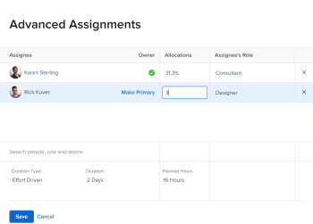

# Crea assegnazioni avanzate

Le informazioni evidenziate in questa pagina si riferiscono a funzionalità non ancora generalmente disponibili. È disponibile solo nell&#39;ambiente di anteprima per tutti i clienti oppure nell&#39;ambiente di produzione per i clienti che hanno abilitato le versioni rapide.

Per informazioni sulle versioni rapide, vedi [Abilitare o disabilitare le versioni rapide per la tua organizzazione](/help/quicksilver/administration-and-setup/set-up-workfront/configure-system-defaults/enable-fast-release-process.md).

Per informazioni sulla versione corrente, consulta [Panoramica sulla versione del terzo trimestre 2024](/help/quicksilver/product-announcements/product-releases/24-q3-release-activity/24-q3-release-overview.md).

È possibile gestire le assegnazioni di attività o problemi utilizzando Assegnazioni avanzate.

È possibile modificare le seguenti informazioni di assegnazione quando si eseguono assegnazioni avanzate:

* Assegnare utenti all&#39;attività o al problema (operazione che può essere eseguita al di fuori di un&#39;assegnazione avanzata).
* Regola e ridistribuisci il numero di ore assegnate a ciascun assegnatario.
* Determina quale utente deve essere designato come proprietario o assegnatario principale dell’attività o del problema.
* Specifica il ruolo che ogni utente svolge quando lavora sull&#39;attività o sul problema.
  <!--* Override the billing rate for a job role.-->

>[!NOTE]
>
>Quando si assegnano gli utenti al lavoro, la loro disponibilità in base alle loro pianificazioni influisce sulle date pianificate e previste delle attività e dei problemi. Per informazioni sulle pianificazioni, vedere [Creare una pianificazione](../../../administration-and-setup/set-up-workfront/configure-timesheets-schedules/create-schedules.md).

## Aree di Adobe Workfront in cui è possibile effettuare assegnazioni avanzate

Questo articolo descrive come accedere ad Assegnazioni anticipate nell’intestazione dell’attività o del problema.

Inoltre, puoi effettuare assegnazioni avanzate nelle seguenti aree di Workfront:

* Negli elenchi e nei report quando il campo Assegnazioni viene visualizzato nella visualizzazione.
* Nella sezione Assegnazioni durante la modifica di un&#39;attività. Per ulteriori informazioni, vedere [Modifica attività](../../../manage-work/tasks/manage-tasks/edit-tasks.md).
* Nell’intestazione dell’attività o del problema, nell’area Assegnazioni.
* Nel Bilanciatore dei carichi di lavoro. Per ulteriori informazioni, consulta [Assegnare il lavoro manualmente utilizzando il Bilanciatore dei carichi di lavoro](../../../resource-mgmt/workload-balancer/assign-work-in-workload-balancer-manually.md).

## Requisiti di accesso

Per eseguire i passaggi descritti in questo articolo, è necessario disporre dei seguenti diritti di accesso:

<table style="table-layout:auto"> 
 <col> 
 <col> 
 <tbody> 
  <tr> 
   <td role="rowheader">Piano Adobe Workfront*</td> 
   <td> 
Qualsiasi
 </td> 
  </tr> 
  <tr> 
   <td role="rowheader">Licenza Adobe Workfront*</td> 
   <td> 
Lavoro o superiore
 </td> 
  </tr> 
  <tr> 
   <td role="rowheader">Configurazioni del livello di accesso*</td> 
   <td> 
Modifica l'accesso ad Attività e Issues
 
<b>NOTA</b>

Se non disponi ancora dell’accesso, chiedi all’amministratore di Workfront se ha impostato restrizioni aggiuntive nel tuo livello di accesso. Per informazioni su come un amministratore di Workfront può modificare il tuo livello di accesso, consulta <a href="../../../administration-and-setup/add-users/configure-and-grant-access/create-modify-access-levels.md" class="MCXref xref">Creare o modificare livelli di accesso personalizzati</a>.
 </td>
</tr> 
  <tr> 
   <td role="rowheader">Autorizzazioni oggetto</td> 
   <td> 
Autorizzazioni Contribute o superiori per un’attività o un problema
 
Per informazioni sulla richiesta di accesso aggiuntivo, vedere <a href="../../../workfront-basics/grant-and-request-access-to-objects/request-access.md" class="MCXref xref">Richiedere l'accesso agli oggetti </a>.
 </td> 
  </tr> 
 </tbody> 
</table>

&#42;Per conoscere il piano, il tipo di licenza o l&#39;accesso di cui si dispone, contattare l&#39;amministratore di Workfront.

## Assegnazioni avanzate

1. Vai al progetto a cui desideri assegnare un’attività o un problema.
1. Fai clic su **Attività** o **Problemi** nel pannello a sinistra, quindi fai clic sul nome di un&#39;attività o di un problema nell&#39;elenco.

   >[!TIP]
   >
   >Se sono presenti due o più persone assegnate, è possibile effettuare assegnazioni avanzate direttamente nell&#39;elenco delle attività o dei problemi. Fai clic all&#39;interno del campo **Assegnazioni** sulla stessa riga dell&#39;attività o del problema, quindi fai clic sull&#39;icona **Persone** per aprire la finestra Assegnazioni avanzate. Passare al passaggio 5 per continuare la creazione di assegnazioni avanzate.\
   >
   >

1. Fai clic su **Assegna a** nel campo **Assegnazioni** nell&#39;intestazione dell&#39;attività o del problema

   Oppure

   Se l’attività o il problema è già assegnato, fai clic sul nome delle assegnazioni.

1. Fare clic su **Avanzate**.

   Immagine di esempio nell’ambiente di produzione:
   

   Immagine di esempio nell&#39;ambiente di anteprima:
   

1. Nel campo **Cerca persone, mansione e team**, inizia a digitare il nome di un utente, una mansione o un team e fai clic sul nome quando viene visualizzato nell&#39;elenco a discesa.

   >[!NOTE]
   >
   >Se il nome dell&#39;utente contiene un carattere speciale, è necessario includere tale carattere nel campo di ricerca.

1. (Facoltativo) Continua ad aggiungere assegnatari nella casella **Cerca persone, mansione o team** per aggiungere più risorse all&#39;attività o al problema.

   >[!TIP]
   >
   >* Puoi assegnare più utenti, mansioni o team. Puoi assegnare solo utenti attivi, mansioni e team.
   >
   >
   >* Quando aggiungi un’assegnazione utente, osserva l’avatar, il ruolo principale dell’utente o il suo indirizzo e-mail per distinguere gli utenti con nomi identici.
   >Gli utenti devono essere associati ad almeno una mansione per visualizzarla quando vengono aggiunti.
   >Per consentire agli utenti di visualizzare le e-mail degli utenti, nel proprio livello di accesso deve essere abilitata l’impostazione Visualizza informazioni di contatto. Per informazioni, vedere [Concedere l&#39;accesso agli utenti](../../../administration-and-setup/add-users/configure-and-grant-access/grant-access-other-users.md).
   >
   >
   >* Se un utente, una mansione o un team è stato assegnato prima della disattivazione, rimane assegnato all&#39;elemento di lavoro. In questo caso, consigliamo quanto segue:
   >   
   >   * Riassegnare l&#39;elemento di lavoro alle risorse attive.
   >   * Associare gli utenti di un team disattivato a un team attivo e riassegnare l&#39;elemento di lavoro al team attivo.
   >

   <!-- SHOULD BE THIRD BULLET POINT IN TIP TABLE WHEN THIS FEATURE IS RELEASED 
    * When adding a job role assignment, you can search for the job role or location. Select the System/Default Job Role to use the default billing rate for the assignment, or select a Rate Card Job Role to override the rate at the assignment level. For more information on rate cards, see [Manage rate cards](/help/quicksilver/administration-and-setup/set-up-workfront/configure-system-defaults/manage-rate-cards.md).
    -->

1. Per ogni utente nella colonna **Assegnatario**, specificare le informazioni seguenti:

   * **Proprietario**: passa il puntatore del mouse sul nome dell&#39;assegnatario e fai clic su **Imposta come principale** nel campo Proprietario se desideri contrassegnare l&#39;assegnatario come proprietario dell&#39;attività o del problema. Una casella di controllo verde indica che l’utente specificato è il contatto principale dell’attività o del problema. Adobe Workfront contrassegna come Proprietario o Assegnazione principale il primo utente o mansione assegnato a un&#39;attività o a un problema. Un team non può essere designato come proprietario principale di un’attività o di un problema.

     >[!IMPORTANT]
     >
     >A seconda della modalità di impostazione delle preferenze di progetto da parte dell&#39;amministratore di Workfront o del gruppo, Workfront potrebbe utilizzare la pianificazione del proprietario dell&#39;attività per calcolare la sequenza temporale dell&#39;attività quando più utenti sono assegnati all&#39;attività. Per informazioni su più assegnatari di attività, vedere la sezione &quot;Assegnare più utenti a un&#39;attività&quot; nell&#39;articolo [Assegnare attività](../../../manage-work/tasks/assign-tasks/assign-tasks.md).

   * **Allocazioni**: quando il tipo di durata di un&#39;attività è Semplice, specificare il numero di ore che ogni utente o mansione deve assegnare all&#39;attività. La somma di tutte le ore assegnate a ciascun utente è uguale al numero nel campo **Ore pianificate** nella parte inferiore della colonna Allocazioni. In tutti gli altri casi, specifica la percentuale di tempo (o allocazione) che l’assegnatario deve dedicare alla risoluzione dell’attività o del problema.

     <!--   
     
(NOTE: make sure this is right in the new UI for both classic and QS???)
   
     -->

     >[!TIP]
     >
     >
     >   
     >   
     >   * Dopo aver modificato manualmente le allocazioni delle assegnazioni per le attività, le ore pianificate delle attività potrebbero essere aggiornate di conseguenza. Per ulteriori informazioni, consulta la sezione &quot;Aggiornare le ore pianificate per l&#39;attività durante la gestione delle allocazioni utente&quot; nell&#39;articolo [Panoramica sulle ore pianificate](../../../manage-work/tasks/task-information/planned-hours.md).
     >   * Non è possibile modificare manualmente le allocazioni di assegnazione in caso di problemi.
     >   * Non è possibile modificare manualmente le allocazioni per i team assegnati alle attività.
     >   
     >

   * **Ruolo dell&#39;assegnatario:** Selezionare il ruolo che l&#39;utente deve utilizzare per l&#39;esecuzione di questa assegnazione.  Il Ruolo principale dell’utente viene visualizzato per impostazione predefinita. Fare clic nella casella Ruolo dell&#39;assegnatario per selezionare un altro ruolo.  Quando prima assegni l’attività o il problema a un ruolo e poi aggiungi un utente che può svolgere quel ruolo come seconda assegnazione, l’elenco degli utenti suggeriti viene filtrato per gli utenti che possono adempiere ai ruoli già assegnati all’attività e al problema.

     Immagine di esempio nell’ambiente di produzione:
     

     Immagine di esempio nell&#39;ambiente di anteprima:
     

   <!--

   * **Location**: The location comes from the rate card, if a rate card attached to the project uses locations with the job roles. The location can't be changed. 

   * **Billing Rates**: The billing rate for a user comes from the system rate for the user or their associated job role. The billing rate for a job role comes from the system rate or from the rate card, if a rate card is attached to the project. Existing billing rates are not displayed in this field. Click in the field to change the billing rate for this specific task assignment.

   
-->

   * **Tipo di durata**: disponibile solo per le attività. Fai clic sul nome del Tipo di durata e seleziona un Tipo di durata dal menu a discesa. Per informazioni sui tipi di durata, vedere [Panoramica sulla durata dell&#39;attività e sul tipo di durata](../../../manage-work/tasks/taskdurtn/task-duration-and-duration-type.md).

   * **Durata:** È possibile aggiornare questo campo per un&#39;attività quando si dispone delle autorizzazioni di gestione per l&#39;attività.

     Per ulteriori informazioni, vedere [Panoramica sulla durata e sul tipo di durata dell&#39;attività](../../../manage-work/tasks/taskdurtn/task-duration-and-duration-type.md). Quando si modificano in blocco le informazioni di assegnazione, viene visualizzata una finestra di dialogo simile che consente di assegnare utenti, ore, allocazione e proprietario dell&#39;attività.

   * **Ore pianificate**: quando il tipo di durata è Assegnazione calcolata o Semplice, aggiorna il numero di ore pianificate. Di conseguenza, le percentuali di allocazione o le ore per ogni risorsa vengono distribuite in modo uniforme. Workfront calcola le ore pianificate quando il tipo di durata è Lavoro calcolato o Impegno guidato. Per ulteriori informazioni, vedere [Panoramica sulla durata e sul tipo di durata dell&#39;attività](../../../manage-work/tasks/taskdurtn/task-duration-and-duration-type.md).

     Immagine di esempio nell’ambiente di produzione:
     

     

     Immagine di esempio nell’ambiente di anteprima:
     

     

1. Fai clic su **Salva**.
