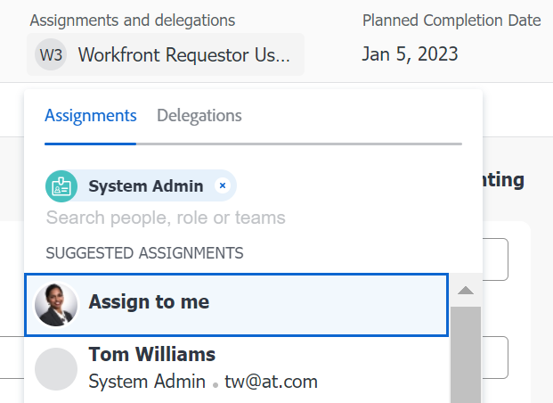

# Effettuare assegnazioni Smart

<!--Audited: 07/2024-->

È possibile utilizzare le assegnazioni avanzate per identificare l&#39;utente migliore per completare il lavoro.

Le assegnazioni intelligenti sono suggerimenti per utenti, ruoli o team che Adobe Workfront presenta quando si assegnano elementi di lavoro alle risorse. Workfront basa i suoi suggerimenti su un algoritmo che determina la risorsa più appropriata per il processo.

<!--There are two separate algorithms in Workfront that calculate smart assignments that work differently for tasks and for issues. -->

Per ulteriori informazioni sui criteri utilizzati per determinare le assegnazioni Smart, vedere [Panoramica assegnazioni Smart](/help/quicksilver/manage-work/tasks/assign-tasks/smart-assignments.md).

## Requisiti di accesso

+++ Espandi per visualizzare i requisiti di accesso per la funzionalità descritta in questo articolo.

<table style="table-layout:auto"> 
 <col> 
 <col> 
 <tbody> 
  <tr> 
   <td>Pacchetto Adobe Workfront</td> 
   <td> 
Qualsiasi
 </td> 
  </tr> 
  <tr> 
   <td>Licenza di Adobe Workfront</td> 
   <td> 
Standard

   
Work o successiva

   </td> 
  </tr> 
  <tr> 
   <td>Configurazioni del livello di accesso</td> 
   <td> 
Modifica l'accesso ad Attività e Issues
 
Accesso ai progetti di visualizzazione o superiore
 </td> 
  </tr> 
  <tr> 
   <td>Autorizzazioni sugli oggetti</td>
   <td>Autorizzazioni di tipo Contribuisci o più elevato con la possibilità di effettuare assegnazioni su attività e problemi</td>
  </tr>
 </tbody>
</table>

Per informazioni, consulta [Requisiti di accesso nella documentazione di Workfront](/help/quicksilver/administration-and-setup/add-users/access-levels-and-object-permissions/access-level-requirements-in-documentation.md).

+++

## Effettuare assegnazioni Smart

Le assegnazioni intelligenti sono disponibili nella maggior parte delle posizioni in cui è possibile effettuare assegnazioni in Workfront.

1. Vai alle seguenti aree e fai clic sul campo **Assegnazioni** o **Assegna a**:

   * Un elenco di attività o problemi o un rapporto
   * Un’intestazione di attività o problema
   * Pannello Riepilogo dell’attività o del problema
   * Un’attività o un problema nel Bilanciatore dei carichi di lavoro
     <!--* A New Task or New Issue box, as you add a new task or issue to a project-->

1. Posizionare il cursore nel campo Assegnazioni e attendere due secondi.

   <!--
   For issues, the smart assignments display in the following sections: 
      * **Users and teams**
      * **Job roles**
        
        -->

   Le assegnazioni Smart vengono visualizzate nelle sezioni seguenti<!--, depending on which phase of the algorithm's calculation identified the assignments-->:

   <!--* **Suggested assignments**: Displays assignments identified in the first phase of the task smart assignment algorithm. -->
   * **Utenti e team** o **Ruoli** <!--or **Rate card job roles**: Assignments identified in the second phase of the task smart assignment's algorithm calculation.-->

   

   Per ulteriori informazioni, vedere [Panoramica assegnazioni avanzate](../../../manage-work/tasks/assign-tasks/smart-assignments.md).

1. Seleziona la risorsa nell’elenco dei consigli facendo clic sul nome.

1. (Facoltativo) Fai clic su **Assegna a me** per assegnare l&#39;elemento di lavoro a te stesso.

   >[!TIP]
   >
   >Se non sono presenti suggerimenti, l&#39;elenco dei suggerimenti non viene aperto.

1. (Facoltativo) Se non desideri utilizzare uno degli utenti consigliati dall’elenco Assegnazioni avanzate, inizia a digitare il nome della risorsa desiderata e selezionalo quando viene visualizzato nell’elenco.
1. Fai clic su **Invio** per effettuare l&#39;assegnazione.

   L’utente selezionato è assegnato all’attività o al problema.
