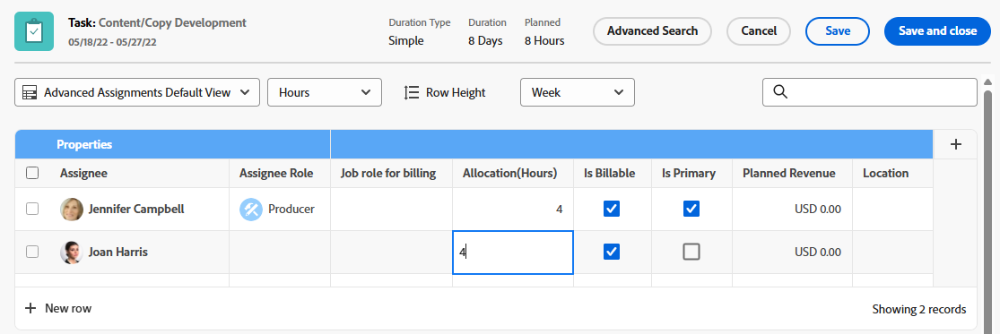

# Gestire le ore di allocazione di utenti e ruoli sulle attività

<!--Audited: 10/2025-->

<!--remove new/old experience references when they remove the New/ Old experience toggle from the Edit Tasks box-->

<!--

 

The highlighted information on this page refers to functionality not yet generally available. It is available only in the Preview environment for all customers. The same features will also be available in the Production environment for all customers starting with  a week from the Preview release.      

For more information, see [Interface modernization](/help/quicksilver/product-announcements/product-releases/interface-modernization/interface-modernization.md).  

-->

Le ore di allocazione rappresentano la quantità totale di tempo per cui una risorsa assegnata deve lavorare su un&#39;attività. Le ore rappresentano il tempo allocato da un utente a un determinato giorno o giorno feriale, settimana o mese per l&#39;intera durata dell&#39;attività.

È possibile modificare le ore di allocazione quando si effettuano assegnazioni avanzate per un&#39;attività.

>[!NOTE]
>
>Quando si assegnano gli utenti al lavoro, la loro disponibilità in base alle loro pianificazioni influisce sulle date pianificate e previste delle attività e dei problemi. Per informazioni sulle pianificazioni, vedere [Creare una pianificazione](../../../administration-and-setup/set-up-workfront/configure-timesheets-schedules/create-schedules.md).

## Requisiti di accesso

+++ Espandi per visualizzare i requisiti di accesso per la funzionalità descritta in questo articolo.

<table style="table-layout:auto"> 
 <col> 
 <col> 
 <tbody> 
  <tr> 
   <td>Pacchetto Adobe Workfront</td> 
   <td> 
Qualsiasi
 </td> 
  </tr> 
  <tr> 
   <td>Licenza di Adobe Workfront</td> 
   <td> 
Standard

   
Work o successiva

   </td> 
  </tr> 
  <tr> 
   <td>Configurazioni del livello di accesso</td> 
   <td>Modifica l'accesso alle Attività</td> 
  </tr> 
  <tr> 
   <td>Autorizzazioni sugli oggetti</td>
   <td>
Autorizzazioni di contribuzione o di livello superiore per l'attività

   
Modificare le autorizzazioni per aggiornare le ore di allocazione nella casella Modifica attività.
 
   <!--
   Not true anymore:
   
<b>NOTE</b>

   

   You can no longer manage allocation hours in the Edit task box when editing tasks in the new experience.
 
For information, see <a href="/help/quicksilver/manage-work/tasks/manage-tasks/edit-tasks.md">Edit tasks</a>.

   -->
   </td>
  </tr>
 </tbody>
</table>

Per informazioni, consulta [Requisiti di accesso nella documentazione di Workfront](/help/quicksilver/administration-and-setup/add-users/access-levels-and-object-permissions/access-level-requirements-in-documentation.md).

+++

## Considerazioni sulla modifica delle ore di allocazione per un&#39;attività

>[!IMPORTANT]
>
>Dopo aver modificato manualmente le allocazioni per ogni assegnazione sulle attività, le ore pianificate delle attività potrebbero essere aggiornate di conseguenza. Per ulteriori informazioni, consulta la sezione [Aggiornare le ore pianificate per l&#39;attività durante la gestione delle allocazioni utente](../../../manage-work/tasks/task-information/planned-hours.md#update) nell&#39;articolo [Panoramica sulle ore pianificate](../../../manage-work/tasks/task-information/planned-hours.md).

* Il totale delle ore assegnate alle singole risorse assegnate all&#39;attività rappresenta le ore pianificate dell&#39;attività.
* Se a un&#39;attività è assegnato un utente o un ruolo, la quantità di ore assegnate all&#39;utente o al ruolo corrisponde alle ore pianificate dell&#39;attività.
* In caso di assegnazioni multiple, a ciascun utente o mansione viene assegnato un numero uguale di ore per lavorare sull&#39;attività, per impostazione predefinita, se il tipo di durata dell&#39;attività è Semplice. Per ulteriori informazioni, consulta i seguenti articoli:

   * [Panoramica della durata e del tipo di durata dell&#39;attività](../../../manage-work/tasks/taskdurtn/task-duration-and-duration-type.md)
   * [Panoramica sul tipo di durata: semplice](../../../manage-work/tasks/taskdurtn/simple-duration-type.md)

* Quando l&#39;attività ha un tipo di durata semplice, è possibile modificare manualmente la quantità di ore allocate per ogni utente o mansione per indicare che alcuni degli assegnatari dell&#39;attività potrebbero avere più tempo per lavorare su un&#39;attività rispetto ad altri.
* Non è possibile modificare la quantità di ore assegnate ai team assegnati alle attività.
* Non è possibile modificare manualmente l’allocazione di utenti o mansioni per i problemi.
* Puoi anche gestire le allocazioni giornaliere, settimanali o mensili degli utenti alle attività o ai problemi utilizzando il Bilanciatore dei carichi di lavoro. Per ulteriori informazioni, consulta [Gestire le allocazioni utente nel Bilanciatore dei carichi di lavoro](../../../resource-mgmt/workload-balancer/manage-user-allocations-workload-balancer.md).

## Modificare le ore di allocazione utente o ruolo per un&#39;attività

1. Passare a un&#39;attività per la quale si desidera modificare le ore di allocazione.
1. Fai clic sull&#39;area **Assegnazioni** nell&#39;intestazione dell&#39;attività, quindi fai clic su **Avanzate**.
1. Assicurarsi che il **Tipo di durata** dell&#39;attività sia **Semplice**.
1. Modifica il campo **Allocazioni** per ogni assegnatario dell&#39;attività. Si tratta delle allocazioni complessive per ogni assegnazione a questa attività, per l&#39;intera durata dell&#39;attività. Questo potrebbe anche aggiornare le **ore pianificate** complessive dell&#39;attività.

   Potresti visualizzare una di queste schermate a seconda del pacchetto Workfront o del flusso di lavoro della tua organizzazione.

   

   

1. Fai clic su **Salva**.
