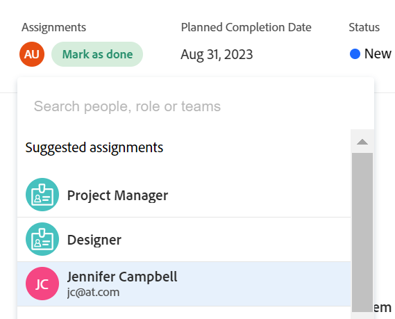

# Panoramica delle assegnazioni intelligenti

Le informazioni evidenziate in questa pagina si riferiscono a funzionalità non ancora generalmente disponibili. È disponibile solo nell’ambiente di anteprima per tutti i clienti.

Per informazioni sulla pianificazione della versione corrente, consulta [Panoramica sulla versione del secondo trimestre 2024](/help/quicksilver/product-announcements/product-releases/24-q2-release-activity/24-q2-release-overview.md).

Quando gestisci le assegnazioni di attività e problemi, puoi utilizzare le assegnazioni intelligenti per identificare la risorsa migliore per completare il lavoro. Le assegnazioni intelligenti sono suggerimenti che Adobe Workfront presenta quando si assegnano elementi di lavoro alle risorse in base a un algoritmo che determina la risorsa più appropriata per il processo. Le assegnazioni intelligenti possono essere utenti, mansioni o team.

>[!NOTE]
>
>Quando si suggeriscono gli utenti, le assegnazioni intelligenti non tengono conto della disponibilità dell’utente. Tuttavia, la loro disponibilità in base alle loro pianificazioni influisce sulle Date pianificate e previste delle attività e dei problemi quando vengono assegnate. Per informazioni sulle pianificazioni, vedere l&#39;articolo [Creare una pianificazione](../../../administration-and-setup/set-up-workfront/configure-timesheets-schedules/create-schedules.md).

Questo articolo contiene informazioni generali sulle assegnazioni avanzate. Per informazioni sull&#39;utilizzo delle assegnazioni avanzate per assegnare attività e problemi agli utenti, vedere [Effettua assegnazioni intelligenti](../../../manage-work/tasks/assign-tasks/make-smart-assignments.md).

## Panoramica delle assegnazioni intelligenti

Quando si lavora con le assegnazioni intelligenti, considera quanto segue:

* L’algoritmo funziona in modo indipendente per le attività e i problemi. Ciò significa che l’elenco degli utenti suggeriti per i problemi potrebbe differire dall’elenco degli utenti suggeriti per un’attività, perché Workfront crea gli elenchi in base ai criteri relativi ai problemi e alle attività separatamente.
* Le assegnazioni intelligenti non consigliano mansioni o team. Si tratta invece di suggerimenti di utenti che si prestano meglio a completare un’attività o un problema.
* Le assegnazioni suggerite sono sempre utenti attivi.
* L’utente elencato per primo deve corrispondere al meglio per l’attività.

## Individuazione suggerimenti assegnazione avanzata

Puoi visualizzare le assegnazioni intelligenti nelle seguenti aree, dove puoi assegnare attività o problemi:

* Un elenco di problemi o un report nella colonna Assegnazioni

  

* Un elenco di attività o un report nella colonna Assegnazioni 

  

* Un&#39;intestazione di attività nel campo Assegnazioni

  

* Intestazione di un problema nel campo Assegnazioni

  

* Pannello Riepilogo attività o problemi nell’area Assegnazioni

  

* Campo Assegnazioni nella casella Nuova attività quando si aggiunge un&#39;attività a un progetto

  

* Il campo Assegnazioni per un elemento elencato nell’area Home quando apri un’attività o un problema

  

* Bilanciatore dei carichi di lavoro nell’area Assegnato a quando si assegna un’attività o un problema

  

## Criteri di assegnazione intelligenti

Le assegnazioni intelligenti funzionano in modo diverso per le attività rispetto ai problemi.

### Criteri di assegnazione intelligenti per le attività

Il calcolo delle assegnazioni intelligenti delle attività funziona in due fasi che utilizzano due algoritmi diversi.

A seconda dell&#39;algoritmo che individua l&#39;assegnazione intelligente, le assegnazioni sono elencate in due sezioni separate nel campo Assegnazioni. Per informazioni, consulta [Effettua assegnazioni intelligenti](/help/quicksilver/manage-work/tasks/assign-tasks/make-smart-assignments.md).

#### Prima fase del calcolo dell&#39;assegnazione intelligente per le attività

Nella prima fase di calcolo delle assegnazioni intelligenti, Workfront calcola un punteggio di somiglianza per ogni assegnazione.

>[!NOTE]
>
>La prima fase del calcolo delle assegnazioni intelligenti non si applica alle seguenti aree di attività:
>
>* Assegnazioni in blocco nel Bilanciatore dei carichi di lavoro.
>* Schede collegate sulle schede.

Il calcolo per il punteggio di somiglianza e l&#39;ordine in cui sono elencate le assegnazioni tiene conto di quanto segue:

* Viene assegnato un punteggio del 100% a un&#39;assegnazione esistente in cui i nomi di attività, progetto e portfolio sono identici all&#39;attività che si sta tentando di assegnare. I nomi di progetto e portfolio dell&#39;attività di un&#39;assegnazione esistente devono inoltre corrispondere al progetto e al portfolio dell&#39;attività che si sta tentando di assegnare.

* Se solo alcune delle informazioni di altre assegnazioni corrispondono alle attività esistenti, il punteggio potrebbe essere inferiore al 100%.

  Ad esempio, se si assegna un&#39;attività denominata &quot;La mia seconda attività&quot; a un progetto denominato &quot;Il mio progetto&quot; in un portfolio denominato &quot;Il mio portfolio&quot; e si dispone di un&#39;attività esistente denominata &quot;La mia attività&quot; in un altro progetto denominato &quot;Il mio progetto&quot; in un portfolio denominato &quot;Il mio portfolio&quot;, l&#39;utente assegnato a &quot;La mia attività&quot; potrebbe ottenere un punteggio del 95% perché il nome dell&#39;attività esistente e l&#39;attività che si sta tentando di assegnare ora sono simili, ma non identici.

  >[!TIP]
  >
  >  Workfront cerca le corrispondenze solo nei campi Nome delle attività, dei progetti e dei portfolio e non in altri campi.

* Un&#39;assegnazione potrebbe ottenere un punteggio più alto quando viene assegnata a molte attività nel sistema che hanno nomi simili. Ad esempio, se un team denominato &quot;Sviluppo&quot; è assegnato al 50% delle attività nel sistema che contengono &quot;AI&quot; nel nome e ora stai assegnando un’altra attività con &quot;AI&quot; nel nome, il punteggio del team &quot;Sviluppo&quot; è più alto. In questo caso, i nomi dei progetti e dei portafogli non sono altrettanto importanti.

* Tenendo conto di questo sistema di punteggio, i primi 7 suggerimenti sono elencati come assegnazioni intelligenti, nell’ordine decrescente dei loro punteggi. Le assegnazioni con punteggi inferiori al 40% non vengono visualizzate.

* Se più assegnazioni hanno punteggi identici, vengono visualizzate in ordine di data in cui sono state eseguite, a partire dalla data più recente.

  Ad esempio, se Rick è stato assegnato a un&#39;attività simile in precedenza e Jennifer è stato assegnato a un&#39;attività simile due giorni fa, Rick viene visualizzato per primo.

* Le assegnazioni identificate in questa fase sono elencate nella **Assegnazioni suggerite** sezione del campo Assegnazioni.

* Se non ci sono corrispondenze che utilizzano questo calcolo, inizia la seconda fase delle assegnazioni intelligenti che viene calcolata utilizzando un algoritmo diverso.

#### Seconda fase del calcolo dell&#39;assegnazione intelligente per le attività

Se il primo passaggio delle assegnazioni intelligenti delle attività non ha trovato corrispondenze, Workfront calcola le assegnazioni intelligenti per le attività nello stesso modo in cui le calcola per i problemi.

Per ulteriori informazioni, consulta la sezione [Criteri di assegnazione intelligenti per attività e problemi](#smart-assignments-criteria-for-tasks-and-issues) in questo articolo.

Le assegnazioni identificate in questa fase sono elencate nella **Altre assegnazioni** sezione del campo Assegnazioni per le attività. <!--update this to "Other assignments"-->

### Criteri di assegnazione intelligenti per attività e problemi

>[!NOTE]
>
>I criteri seguenti si applicano alle attività solo quando nella prima fase del calcolo dell&#39;assegnazione intelligente delle attività non sono state trovate corrispondenze. Per informazioni, consulta la sezione [Prima fase del calcolo dell&#39;assegnazione intelligente per le attività](#first-phase-of-smart-assignment-calculation-for-tasks) in questo articolo. Per impostazione predefinita, i seguenti criteri sono sempre applicabili ai problemi. 

Gli utenti sono consigliati nell’elenco a discesa delle assegnazioni intelligenti in base a una combinazione dei seguenti criteri (elencati in ordine crescente e decrescente):

1. Utenti assegnati ad altri elementi di lavoro negli ultimi 30 giorni dall&#39;utente che ha effettuato l&#39;assegnazione. Vengono visualizzati i primi 50 utenti che soddisfano questo criterio. Viene visualizzato per primo l’utente assegnato più di frequente.

2. Se l’elemento di lavoro è assegnato a un team o a un ruolo, l’elenco degli utenti suggeriti viene filtrato ulteriormente tenendo conto delle assegnazioni esistenti di seguito. In questo caso, nell’elenco dei suggerimenti vengono visualizzati solo i seguenti utenti:

   * Utenti il cui Team predefinito è il team assegnato all&#39;elemento di lavoro.
   * Utenti il cui ruolo principale è il ruolo assegnato all&#39;elemento di lavoro.

>[!TIP]
>
>* Se all’attività o al problema non è assegnato alcun ruolo o team, in Workfront vengono visualizzati tutti gli utenti assegnati per gli ultimi 30 giorni, fino a 50 utenti.
>
>* Se non sono state effettuate assegnazioni negli ultimi 30 giorni, nell&#39;elenco assegnazioni avanzate verranno visualizzati solo gli utenti che appartengono al team assegnato o a cui è stato assegnato il ruolo all&#39;elemento di lavoro.

<!--the commented out piece in the tip above was live before but I am not totally sure that smart assignments look at your team. I think they look JUST at the team/ role assigned to the work item; see this help site request for more info: https://experience.adobe.com/#/@adobeinternalworkfront/so:hub-Hub/workfront/issue/62fd222200037eb87572c5b6ad6bf53e/overview -->
<!--

<h3>Smart assignments criteria for the Production environment</h3>

(NOTE: drafted,this was the case BEFORE we updated the logic in the WB - with the 21.4 release)

Smart assignments display on tasks and issues when the following conditions are met:

<ul>
<li>The task or issue is subordinate to a parent task or issue that has a user, team, or job role currently assigned. </li>
</ul>

Smart assignments display the top twenty recommendations based on a proprietary algorithm that uses your own team information.

Users are recommended in the smart assignments drop-down list based on a combination of the following criteria (listed in order from most important to least important):

<ul>
<li>The user has the team assigned to the task or issue designated as their Home Team</li>
<li>The user is also assigned to the parent task</li>
<li>The user has the same primary job role as is currently assigned to the task or issue</li>
<li>The user has the team assigned to the parent task or issue designated as their Home Team</li>
<li>The user is associated with the same primary job role currently assigned to the parent task</li>
<li>The user is a member of the same team as the user who assigned the task or issue and the team is designated as their Home Team</li>
<li>The user is a member of the same Home Group as the user who is assigning the task or issue</li>
<li>The user has the same primary job role as the user who is assigning the task or issue.</li>
</ul>

-->

<!--

<h2>Make smart assignments</h2>

(NOTE:&nbsp;this was moved to its own article: make-smart-assignments.) 

Smart assignments are available in most locations where you can make assignments in Workfront.

You can use smart assignments on tasks and issues that have previously been assigned to a job role or a team.
 <note type="note">
You must have a Plan or a Work license and have at least Contribute permissions to a task or an issue to be able to make assignments to the task or the issue. You must have the Make Assignments option enabled in your permission level to make assignments.
</note>

To use smart assignments:

<ol>
<li value="1">Navigate to an issue or a task and click one of the following fields to edit them:  
<ul>
<li>
The <strong>Assignments</strong> field in the task or issue header
</li>
<li>The <strong>Assignments</strong> field of a task or issue list using in-line editing in a task or issue list. </li>
<li>The <strong>Assignee</strong> field after you have clicked <strong>Advanced</strong> from a task or an issue. </li>
</ul></li>
<li value="2"> 
Place your cursor in the assignment field, and wait for two seconds, then the <strong>Suggestions</strong> list is displayed.
 
Users displayed in this list are the smart assignment suggestions for the task or the issue. 
 
  
 </li>
<li value="3"> 
Select the user in the recommendations list by clicking their name. 
 
If there are no suggestions, the suggestion list does not open.
 </li>
<li value="4">(Optional) If you do not want to use one of the recommended users from the smart assignments list, start typing the name of the desired user and select the name when it appears in the list.</li>
<li value="5">Click <strong>Enter</strong> to make the assignment. </li>
</ol>

-->
