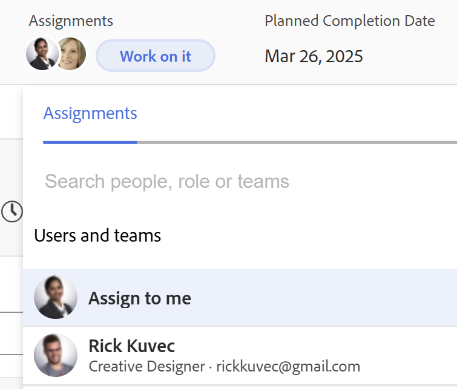
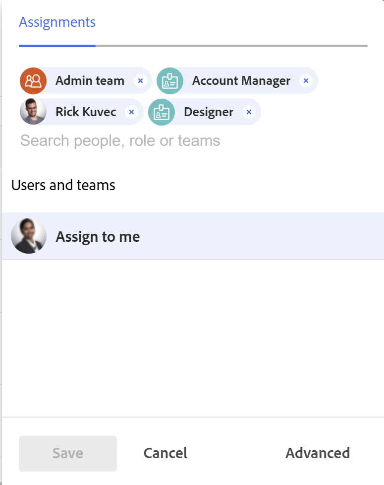

# Panoramica delle assegnazioni intelligenti

Quando si gestiscono le assegnazioni di task e problemi, è possibile utilizzare le assegnazioni intelligenti per identificare l&#39;utente migliore per completare il lavoro. Le assegnazioni avanzate sono suggerimenti presentati da Adobe Workfront quando si assegnano elementi di lavoro alle risorse in base a un algoritmo che determina la risorsa più appropriata per il processo.

>[!NOTE]
>
>Le assegnazioni intelligenti non tengono conto della disponibilità dell&#39;utente. Tuttavia, la loro disponibilità in base alle rispettive pianificazioni influisce sulle date previste e previste delle attività e dei problemi al momento dell’assegnazione. Per informazioni sulle pianificazioni, consulta l’articolo [Creare una pianificazione](../../../administration-and-setup/set-up-workfront/configure-timesheets-schedules/create-schedules.md).

Questo articolo contiene informazioni generali sulle assegnazioni avanzate. Per informazioni sull&#39;utilizzo delle assegnazioni avanzate per assegnare attività e problemi agli utenti, vedere [Esecuzione di assegnazioni avanzate](../../../manage-work/tasks/assign-tasks/make-smart-assignments.md).

## Panoramica delle assegnazioni intelligenti

Quando si lavora con le assegnazioni avanzate, tenere presente quanto segue:

* L’algoritmo funziona in modo indipendente per le attività e i problemi. Ciò significa che l’elenco degli utenti consigliati per i problemi potrebbe differire dall’elenco degli utenti consigliati per un’attività, in quanto Workfront crea gli elenchi in base ai criteri relativi ai problemi e alle attività separatamente.
* Le assegnazioni avanzate non consigliano ruoli di lavoro o team. Sono invece suggerimenti di utenti più adatti a completare un’attività o un problema.
* Le assegnazioni suggerite sono sempre utenti attivi.
* L’utente elencato per primo deve essere la migliore corrispondenza per l’attività.

## Individua suggerimenti per l’assegnazione avanzata

È possibile visualizzare le assegnazioni avanzate nelle aree seguenti in cui è possibile assegnare attività o problemi:

* Un elenco di attività o di problemi o un rapporto

   

* Intestazione di un&#39;attività o di un problema

   

* Pannello Attività o Riepilogo del problema

   

* Campo Assegnazioni per un elemento elencato nell&#39;area Home

   

<!--removed for scheduling deprecation: 

* Resource Scheduling

  

  >[!CAUTION]
  >
  >Resource Scheduling is a deprecated feature. For more information, see [Deprecation of Resource Scheduling tools in Adobe Workfront](../../../resource-mgmt/resource-mgmt-overview/deprecate-resource-scheduling.md).

-->
* Bilanciamento del carico di lavoro

   

## Criteri di assegnazione intelligenti

Le assegnazioni intelligenti visualizzano le prime 50 raccomandazioni in base a un algoritmo proprietario.

Gli utenti sono consigliati nell’elenco a discesa delle assegnazioni avanzate in base a una combinazione dei seguenti criteri (elencati in ordine dal più importante al meno importante):

* Utenti assegnati ad altri elementi di lavoro negli ultimi 30 giorni dall&#39;utente che ha effettuato l&#39;assegnazione. Vengono visualizzati i primi 50 utenti che soddisfano questo criterio. Viene visualizzato per primo l’utente a cui viene assegnato il maggior numero di volte.

   Se l&#39;elemento di lavoro viene assegnato a un team o a un ruolo, l&#39;elenco degli utenti consigliati viene filtrato ulteriormente tenendo conto delle assegnazioni esistenti riportate di seguito. In questo caso, nell’elenco dei suggerimenti vengono visualizzati solo i seguenti utenti:

   * Utenti il cui team principale è il team assegnato all&#39;elemento di lavoro.
   * Utenti il cui ruolo principale è il ruolo assegnato all&#39;elemento di lavoro.

      >[!TIP]
      >
      >* Se <!--you're not part of any team and --> nessun ruolo o team assegnato all&#39;attività o al problema, Workfront visualizza tutti gli utenti assegnati per gli ultimi 30 giorni, fino a 50 utenti.
      >* Se non sono state effettuate assegnazioni negli ultimi 30 giorni, nell&#39;elenco delle assegnazioni avanzate verranno visualizzati solo gli utenti che appartengono al team assegnato o che dispongono del ruolo assegnato all&#39;elemento di lavoro.

<!--the commented out piece in the tip above was live before but I am not totally sure that smart assignments look at your team. I think they look JUST at the team/ role assigned to the work item; see this help site request for more info: https://experience.adobe.com/#/@adobeinternalworkfront/so:hub-Hub/workfront/issue/62fd222200037eb87572c5b6ad6bf53e/overview -->
<!--

<h3>Smart assignments criteria for the Production environment</h3>

(NOTE: drafted,this was the case BEFORE we updated the logic in the WB - with the 21.4 release)

Smart assignments display on tasks and issues when the following conditions are met:

<ul>
<li>The task or issue is subordinate to a parent task or issue that has a user, team, or job role currently assigned. </li>
</ul>

Smart assignments display the top twenty recommendations based on a proprietary algorithm that uses your own team information.

Users are recommended in the smart assignments drop-down list based on a combination of the following criteria (listed in order from most important to least important):

<ul>
<li>The user has the team assigned to the task or issue designated as their Home Team</li>
<li>The user is also assigned to the parent task</li>
<li>The user has the same primary job role as is currently assigned to the task or issue</li>
<li>The user has the team assigned to the parent task or issue designated as their Home Team</li>
<li>The user is associated with the same primary job role currently assigned to the parent task</li>
<li>The user is a member of the same team as the user who assigned the task or issue and the team is designated as their Home Team</li>
<li>The user is a member of the same Home Group as the user who is assigning the task or issue</li>
<li>The user has the same primary job role as the user who is assigning the task or issue.</li>
</ul>

-->

<!--

<h2>Make smart assignments</h2>

(NOTE:&nbsp;this was moved to its own article: make-smart-assignments.) 

Smart assignments are available in most locations where you can make assignments in Workfront.

You can use smart assignments on tasks and issues that have previously been assigned to a job role or a team.
 <note type="note">
You must have a Plan or a Work license and have at least Contribute permissions to a task or an issue to be able to make assignments to the task or the issue. You must have the Make Assignments option enabled in your permission level to make assignments.
</note>

To use smart assignments:

<ol>
<li value="1">Navigate to an issue or a task and click one of the following fields to edit them:  
<ul>
<li>
The <strong>Assignments</strong> field in the task or issue header
</li>
<li>The <strong>Assignments</strong> field of a task or issue list using in-line editing in a task or issue list. </li>
<li>The <strong>Assignee</strong> field after you have clicked <strong>Advanced</strong> from a task or an issue. </li>
</ul></li>
<li value="2"> 
Place your cursor in the assignment field, and wait for two seconds, then the <strong>Suggestions</strong> list is displayed.
 
Users displayed in this list are the smart assignment suggestions for the task or the issue. 
 
  
 </li>
<li value="3"> 
Select the user in the recommendations list by clicking their name. 
 
If there are no suggestions, the suggestion list does not open.
 </li>
<li value="4">(Optional) If you do not want to use one of the recommended users from the smart assignments list, start typing the name of the desired user and select the name when it appears in the list.</li>
<li value="5">Click <strong>Enter</strong> to make the assignment. </li>
</ol>

-->
