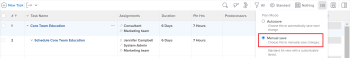

# Creazione di attività in un progetto

È possibile creare attività in un progetto solo dopo la creazione del progetto.

Ad esempio, dopo aver creato un progetto, è possibile aggiungere attività e modificarle per organizzare il piano di progetto. Per ulteriori informazioni sulla creazione di un progetto, consulta [Creare un progetto](../../../manage-work/projects/create-projects/create-project.md).

Per informazioni sulla creazione di attività personali non incluse in un progetto, consulta la sezione &quot;Creare un’attività personale&quot; nell’articolo [Creazione di elementi di lavoro dall&#39;area Home](../../../workfront-basics/using-home/using-the-home-area/create-work-items-in-home.md).

Questo articolo descrive come creare attività da zero. È inoltre possibile creare attività nei seguenti modi:

* Copiando o duplicando le attività esistenti. Per informazioni, consulta [Copia e duplica le attività](../../../manage-work/tasks/manage-tasks/copy-and-duplicate-tasks.md).
* Spostando le attività da un progetto all’altro. Per informazioni, consulta [Sposta attività](../../../manage-work/tasks/manage-tasks/move-tasks.md).

## Requisiti di accesso

<!--drafted for P&P - replace the table:

<table style="table-layout:auto"> 
 <col> 
 <col> 
 <tbody> 
  <tr> 
   <td role="rowheader">Adobe Workfront plan*</td> 
   <td> 
Any
 </td> 
  </tr> 
  <tr> 
   <td role="rowheader"> 
Adobe Workfront license*
 </td> 
   <td>
Current license: Standard
 
   Or
   
Legacy license: Work or higher
 </td> 
  </tr> 
  <tr> 
   <td role="rowheader">Access level configurations*</td> 
   <td> 
Edit access to Tasks and Projects
 
Note: If you still don't have access, ask your Workfront administrator if they set additional restrictions in your access level. For information about access to tasks, see <a href="../../../administration-and-setup/add-users/configure-and-grant-access/grant-access-tasks.md" class="MCXref xref">Grant access to tasks</a>. For information on how a Workfront administrator can change your access level, see <a href="../../../administration-and-setup/add-users/configure-and-grant-access/create-modify-access-levels.md" class="MCXref xref">Create or modify custom access levels</a>. 
 </td> 
  </tr> 
  <tr> 
   <td role="rowheader">Object permissions</td> 
   <td> 
Contribute permissions to the project with ability to Add Tasks or higher
 
When you create a task you automatically receive Manage permissions to the task
 
 For information about task permissions, see <a href="../../../workfront-basics/grant-and-request-access-to-objects/share-a-task.md" class="MCXref xref">Share a task </a>. 
 
For information on requesting additional permissions, see <a href="../../../workfront-basics/grant-and-request-access-to-objects/request-access.md" class="MCXref xref">Request access to objects </a>.
 </td> 
  </tr> 
 </tbody> 
</table>
-->
Per eseguire i passaggi descritti in questo articolo, è necessario disporre dei seguenti diritti di accesso:

<table style="table-layout:auto"> 
 <col> 
 <col> 
 <tbody> 
  <tr> 
   <td role="rowheader">piano Adobe Workfront*</td> 
   <td> 
Qualsiasi
 </td> 
  </tr> 
  <tr> 
   <td role="rowheader"> 
Licenza Adobe Workfront*
 </td> 
   <td> 
Lavoro o superiore
 </td> 
  </tr> 
  <tr> 
   <td role="rowheader">Configurazioni a livello di accesso*</td> 
   <td> 
Modifica l’accesso a Attività e Progetti
 
Nota: Se non disponi ancora dell’accesso, chiedi all’amministratore Workfront se ha impostato ulteriori restrizioni nel livello di accesso. Per informazioni sull'accesso alle attività, consulta <a href="../../../administration-and-setup/add-users/configure-and-grant-access/grant-access-tasks.md" class="MCXref xref">Concedere l’accesso alle attività</a>. Per informazioni su come un amministratore Workfront può modificare il livello di accesso, consulta <a href="../../../administration-and-setup/add-users/configure-and-grant-access/create-modify-access-levels.md" class="MCXref xref">Creare o modificare livelli di accesso personalizzati</a>. 
 </td> 
  </tr> 
  <tr> 
   <td role="rowheader">Autorizzazioni oggetto</td> 
   <td> 
Autorizzazioni di Contribute per il progetto con la possibilità di aggiungere attività o versioni successive
 
Quando crei un'attività, riceverai automaticamente le autorizzazioni di gestione per l'attività
 
 Per informazioni sulle autorizzazioni delle attività, consulta <a href="../../../workfront-basics/grant-and-request-access-to-objects/share-a-task.md" class="MCXref xref">Condividere un’attività </a>. 
 
Per informazioni sulla richiesta di autorizzazioni aggiuntive, consulta <a href="../../../workfront-basics/grant-and-request-access-to-objects/request-access.md" class="MCXref xref">Richiedere l’accesso agli oggetti </a>.
 </td> 
  </tr> 
 </tbody> 
</table>

&#42;Per informazioni sul piano, il tipo di licenza o l&#39;accesso, contattare l&#39;amministratore Workfront.

## Creazione di attività in un progetto

1. Passa al progetto in cui desideri creare un’attività.
1. Fai clic su **Attività** nel pannello a sinistra.
1. (Condizionale) Se stai visualizzando l&#39;elenco delle attività in una visualizzazione agile, fai clic sul pulsante **Vista a elenco** icona  nell&#39;angolo in alto a destra per visualizzare l&#39;elenco delle attività.
1. (Facoltativo) Fai clic sul pulsante **Modalità piano** icona  e seleziona **Salvataggio manuale**, quindi seleziona **Standard** o **Pianificazione temporale**. Questo disattiva il **Salvataggio automatico** che è attivata per impostazione predefinita.

   

   >[!TIP]
   >
   >È possibile annullare le modifiche quando si seleziona Salva manualmente.

1. Crea una nuova attività eseguendo una delle operazioni seguenti:

   * Fai clic su **Nuova attività** nella parte superiore dell’elenco delle attività
   * Fai clic su **Aggiungi altre attività** in fondo all&#39;elenco delle attività

   

1. (Condizionale) Se hai fatto clic su **Nuova attività** effettua le seguenti operazioni:

   1. Specifica uno dei campi nell’elenco limitato di campi all’interno della **Nuova attività** quindi fai clic su **Crea attività** per creare rapidamente un’attività.

      Oppure

      Per aggiornare tutti i campi dell&#39;attività, fare clic su **Altre opzioni** per aprire **Crea attività** scatola.

      

      La **Crea attività** si apre la casella.

      

       

      >[!NOTE]
      >
      >A seconda della configurazione del modello di layout da parte dell’amministratore di Workfront, i campi nella casella Crea attività potrebbero visualizzare campi diversi nell’ambiente in uso. Per informazioni, consulta [Personalizzare la visualizzazione Dettagli utilizzando un modello di layout](../../../administration-and-setup/customize-workfront/use-layout-templates/customize-details-view-layout-template.md).

   1. Specifica le informazioni per le seguenti aree nel pannello a sinistra della casella Crea attività :

      * Nome attività
      * Panoramica
      * Assegnazioni
      * Forms personalizzato
      * Finanz
      * Impostazioni

         Per informazioni sulla definizione di tutti i campi relativi alle attività di un&#39;attività, vedere [Modifica delle attività](../../../manage-work/tasks/manage-tasks/edit-tasks.md).
   1. (Condizionale e facoltativo) Se desideri che l’attività sia ricorrente, aggiorna la sezione **Frequenza ricorrenza** campo . Per ulteriori informazioni sulla creazione di attività ricorrenti, consulta [Creare attività ricorrenti](../../../manage-work/tasks/create-tasks/create-recurring-tasks.md).
   1. (Facoltativo) Fai clic su **Documenti** nel pannello a sinistra per allegare un documento alla nuova attività, quindi fare clic su **Aggiungere o collegare file** per aggiungere un documento all&#39;attività dal computer, da un altro servizio o per collegare documenti e cartelle dal computer o da un altro servizio.

1. (Condizionale) Se hai fatto clic su **Aggiungi altre attività** nel passaggio 5, iniziare a inserire le informazioni sull&#39;attività utilizzando la modifica in linea, quindi premere Invio.

   <!--
   
(NOTE: ensure this stays accurate)

   -->

   È consigliabile utilizzare questa opzione, in particolare quando si aggiungono più attività all’elenco.

   

1. (Condizionale) Effettuare una delle seguenti operazioni:

   * Se hai fatto clic su **Nuova attività** nel passaggio 5, fai clic su **Crea attività** per salvare le modifiche e aggiungere la nuova attività al progetto.

      <!--   
     
(NOTE: is this step still right?)
   
     -->

   * Se hai fatto clic su **Aggiungi altre attività** al punto 5, procedi come segue:

      <!--   
     
(NOTE: is this step still right?) 
   
     -->

      1. Fai clic in un punto qualsiasi del browser per inviare le modifiche, oppure premi Invio.
      1. (Facoltativo) Nell’elenco delle attività, seleziona l’attività appena creata, quindi fai clic su **Rientro**.

         In questo modo la nuova attività diventa un&#39;attività secondaria o secondaria dell&#39;attività precedente.

         Per ulteriori informazioni sulle attività figlio, consulta [Panoramica delle attività](../../../manage-work/tasks/task-information/tasks-overview.md).

      1. (Condizionale) Se hai disabilitato il **Salvataggio automatico** opzione dopo aver premuto **Aggiungi altre attività**, puoi effettuare le seguenti operazioni:

         * Fai clic su **Annulla** in qualsiasi momento per invertire l&#39;ultima modifica, oppure **Annulla** per annullare tutte le modifiche apportate all&#39;elenco delle attività.
         * Se hai fatto clic su **Annulla**, fai clic su **Ripeti** per riapplicare l&#39;ultima modifica annullata.
         * Fai clic su **Salva** per salvare le modifiche nell&#39;elenco delle attività.
