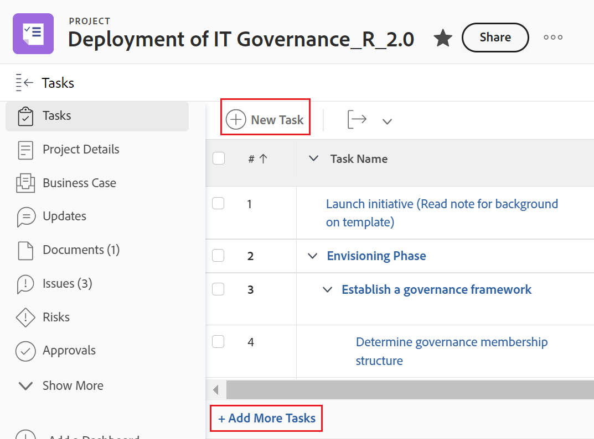

# Creare attività in un progetto

<!-- Audited: 10/2024 -->

Puoi creare le attività in Adobe Workfront nei seguenti modi:

* Crea un&#39;attività in un progetto da zero, dopo la creazione del progetto.

  Dopo aver creato un progetto, è possibile aggiungere attività e modificarle per organizzare il piano del progetto. Per ulteriori informazioni sulla creazione di un progetto, vedere [Creare un progetto](../../../manage-work/projects/create-projects/create-project.md).

* Crea le attività aggiungendo un modello a un progetto.

  Per informazioni, vedere [Allegare un modello a un progetto](/help/quicksilver/manage-work/projects/create-and-manage-templates/attach-template-to-project.md).

* Creare attività personali e spostarle in un progetto.

  È possibile creare attività personali eseguendo una delle operazioni seguenti:

   * Creare una richiesta di lavoro ad hoc e inviarla a un utente
   * Creare un&#39;attività nell&#39;area Home

  Per informazioni sulla creazione di attività personali non incluse in un progetto, vedere [Creare attività personali](/help/quicksilver/workfront-basics/updating-work-items-and-viewing-updates/create-personal-tasks.md).

  È possibile spostare le attività personali in un progetto che diventano attività di lavoro.

Questo articolo descrive come creare attività da zero e come spostare attività personali in un progetto.

È inoltre possibile creare le attività nei modi seguenti:

* Copiando o duplicando le attività esistenti. Per informazioni, vedere [Copiare e duplicare le attività](../../../manage-work/tasks/manage-tasks/copy-and-duplicate-tasks.md).
* Spostando le attività da un progetto all&#39;altro. Per informazioni, vedere [Sposta attività](../../../manage-work/tasks/manage-tasks/move-tasks.md).

## Requisiti di accesso

+++ Espandi per visualizzare i requisiti di accesso per la funzionalità in questo articolo.

<table style="table-layout:auto"> 
 <col> 
 <col> 
 <tbody> 
  <tr> 
   <td role="rowheader">piano Adobe Workfront</td> 
   <td> 
Qualsiasi
 </td> 
  </tr> 
  <tr> 
   <td role="rowheader"> 
Licenza Adobe Workfront
 </td> 
   <td>
Corrente: Lavoro o versione successiva
 
   Oppure
   
Nuovo: Standard
 </td> 
  </tr> 
  <tr> 
   <td role="rowheader">Configurazioni del livello di accesso*</td> 
   <td> 
Modifica accesso ad attività e progetti
</td> 
  </tr> 
  <tr> 
   <td role="rowheader">Autorizzazioni oggetto</td> 
   <td> 
Autorizzazioni di Contribute per il progetto con la possibilità di aggiungere attività o versione successiva
 
Quando crei un’attività, ricevi automaticamente le autorizzazioni di gestione per l’attività
 
 Per informazioni sulle autorizzazioni per l'attività, vedere <a href="../../../workfront-basics/grant-and-request-access-to-objects/share-a-task.md" class="MCXref xref">Condividere un'attività </a>. 
 
Per informazioni sulla richiesta di autorizzazioni aggiuntive, vedere <a href="../../../workfront-basics/grant-and-request-access-to-objects/request-access.md" class="MCXref xref">Richiedere l'accesso agli oggetti </a>.
 </td> 
  </tr> 
 </tbody> 
</table>

Per ulteriori dettagli sulle informazioni contenute in questa tabella, vedere [Requisiti di accesso nella documentazione di Workfront](/help/quicksilver/administration-and-setup/add-users/access-levels-and-object-permissions/access-level-requirements-in-documentation.md).

+++

## Creare attività in un progetto

1. Vai al progetto in cui desideri creare un’attività.
1. Fai clic su **Attività** nel pannello a sinistra.
1. (Condizionale) Se l&#39;elenco delle attività è attualmente visualizzato in una visualizzazione agile, fare clic sull&#39;icona **Visualizzazione elenco**  nell&#39;angolo superiore destro per visualizzare l&#39;elenco delle attività.
1. (Facoltativo) Fai clic sull&#39;icona  della **Modalità pianificazione** e seleziona **Salvataggio manuale**, quindi seleziona **Standard** o **Pianificazione sequenza temporale**. In questo modo viene disabilitata l&#39;opzione **Salvataggio automatico** abilitata per impostazione predefinita.

   

   >[!TIP]
   >
   >È possibile annullare le modifiche quando si seleziona Salvataggio manuale.

1. Creare una nuova attività eseguendo una delle operazioni seguenti:

   * Fai clic su **Nuova attività** nella parte superiore dell&#39;elenco delle attività.
   * Fai clic su **Aggiungi altre attività** nella parte inferiore dell&#39;elenco delle attività.

   

1. (Condizionale) Se hai fatto clic su **Nuova attività**, effettua le seguenti operazioni:

   1. Specifica uno dei campi nell&#39;elenco limitato di campi all&#39;interno della casella **Nuova attività**, quindi fai clic su **Crea attività** per creare rapidamente un&#39;attività.

      Oppure

      Per aggiornare tutti i campi dell&#39;attività, fare clic su **Altre opzioni** per aprire la casella **Crea attività**.

      

      Viene visualizzata la casella **Crea attività**.

      

       

      >[!NOTE]
      >
      >A seconda della modalità di configurazione del modello di layout impostata dall&#39;amministratore di Workfront, è possibile che nei campi della casella Crea attività vengano visualizzati campi diversi dell&#39;ambiente. Per informazioni, vedere [Personalizzare la visualizzazione Dettagli utilizzando un modello di layout](../../../administration-and-setup/customize-workfront/use-layout-templates/customize-details-view-layout-template.md).

   1. Specificare le informazioni per le seguenti aree nel pannello sinistro della casella Crea attività:

      * Nome attività
      * Panoramica
      * Assegnazioni
      * Moduli personalizzati
      * Finanz
      * Impostazioni

        Per informazioni sulla definizione di tutti i campi relativi all&#39;attività in un&#39;attività, vedere [Modifica attività](../../../manage-work/tasks/manage-tasks/edit-tasks.md).

   1. (Condizionale e facoltativo) Se desideri che l&#39;attività sia ricorrente, aggiorna il campo **Frequenza ricorrenza**. Per ulteriori informazioni sulla creazione di attività ricorrenti, vedere [Creare attività ricorrenti](../../../manage-work/tasks/create-tasks/create-recurring-tasks.md).
   1. (Facoltativo) Fai clic su **Documenti** nel pannello a sinistra per allegare un documento alla nuova attività, quindi fai clic su **Aggiungi o collega file** per aggiungere un documento all&#39;attività dal tuo computer, da un altro servizio o per collegare documenti e cartelle dal tuo computer o da un altro servizio.

1. (Condizionale) Se al passaggio 5 hai fatto clic su **Aggiungi altre attività**, inizia a immettere le informazioni sull&#39;attività utilizzando la modifica in linea, quindi premi Invio.

   <!--
   
(NOTE: ensure this stays accurate)

   -->

   È consigliabile utilizzare questa opzione soprattutto quando si aggiungono più attività all’elenco.

   

1. (Condizionale) Effettua una delle seguenti operazioni:

   * Se al passaggio 5 hai fatto clic su **Nuova attività**, fai clic su **Crea attività** per salvare le modifiche e aggiungere la nuova attività al progetto.

     <!--   
     
(NOTE: is this step still right?)
   
     -->

   * Se hai fatto clic su **Aggiungi altre attività** nel passaggio 5, effettua le seguenti operazioni:

     <!--   
     
(NOTE: is this step still right?) 
   
     -->

      1. Fai clic in un punto qualsiasi del browser per inviare le modifiche, oppure premi Invio.
      1. (Facoltativo) Nell&#39;elenco delle attività, seleziona la nuova attività creata, quindi fai clic su **Rientro**.

         In questo modo la nuova attività diventa un&#39;attività secondaria o secondaria dell&#39;attività precedente.

         Per ulteriori informazioni sulle attività figlio, vedere [Creare sottoattività](/help/quicksilver/manage-work/tasks/create-tasks/create-subtasks.md).

      1. (Condizionale) Se hai disabilitato l&#39;opzione **Salvataggio automatico** dopo aver premuto **Aggiungi altre attività**, puoi effettuare le seguenti operazioni:

         * Fai clic su **Annulla** in qualsiasi momento per annullare l&#39;ultima modifica oppure su **Annulla** per annullare tutte le modifiche apportate all&#39;elenco attività.
         * Se in precedenza hai fatto clic su **Annulla**, fai clic su **Ripristina** per applicare nuovamente l&#39;ultima modifica annullata.
         * Fai clic su **Salva** per salvare le modifiche apportate all&#39;elenco delle attività.

## Creare attività spostando un’attività personale in un progetto

1. (Condizionale) Accertati che tu o altri utenti abbiate creato attività personali.

   Per informazioni, vedere [Creare attività personali](/help/quicksilver/workfront-basics/updating-work-items-and-viewing-updates/create-personal-tasks.md).
1. Creare un filtro attività personale e applicarlo a un report o a un elenco attività.

   Per informazioni, vedere [Filtro: attività personali](/help/quicksilver/reports-and-dashboards/reports/custom-view-filter-grouping-samples/filter-personal-tasks.md).

   
1. Fare clic sul nome di un&#39;attività nel report attività personale per aprirla.

   Workfront salva le attività personali in un progetto personale non elencato che viene sempre denominato in base a questo modello: &quot;&lt; Nome completo dell’utente > Attività di. Ad esempio, un progetto personale potrebbe essere denominato &quot;Attività di Rick&quot;.

1. Dalla pagina dell&#39;attività, fai clic sul **menu Altro** , quindi su **Sposta**. Per ulteriori informazioni sullo spostamento delle attività, vedere [Sposta attività](/help/quicksilver/manage-work/tasks/manage-tasks/move-tasks.md).

   Dopo aver completato lo spostamento, l&#39;attività viene visualizzata nel progetto selezionato. La sequenza temporale del progetto potrebbe essere influenzata dalla sequenza temporale della nuova attività.
