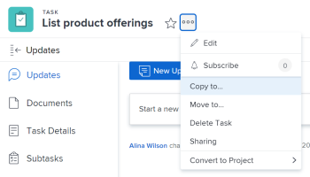

# Copia e duplica le attività

È possibile copiare un&#39;attività da un progetto a un altro oppure duplicarla all&#39;interno dello stesso progetto.

È possibile copiare o duplicare una o più attività o attività principali alla volta.

## Requisiti di accesso

Per eseguire i passaggi descritti in questo articolo, è necessario disporre dei seguenti diritti di accesso:

<table style="table-layout:auto"> 
 <col> 
 <col> 
 <tbody> 
  <tr> 
   <td role="rowheader">piano Adobe Workfront*</td> 
   <td> 
Qualsiasi
 </td> 
  </tr> 
  <tr> 
   <td role="rowheader">Licenza Adobe Workfront*</td> 
   <td> 
Lavoro o superiore 
 </td> 
  </tr> 
  <tr> 
   <td role="rowheader">Configurazioni a livello di accesso*</td> 
   <td> 
Modifica l’accesso a Attività e Progetti
 
Nota: Se non disponi ancora dell’accesso, chiedi all’amministratore Workfront se ha impostato ulteriori restrizioni nel livello di accesso. Per informazioni su come un amministratore Workfront può modificare il livello di accesso, consulta <a href="../../../administration-and-setup/add-users/configure-and-grant-access/create-modify-access-levels.md" class="MCXref xref">Creare o modificare livelli di accesso personalizzati</a>.
 </td> 
  </tr> 
  <tr> 
   <td role="rowheader">Autorizzazioni oggetto</td> 
   <td> 
Gestione delle autorizzazioni per un’attività 
 
Contribuire o autorizzazioni superiori al progetto
 
Per informazioni sulla richiesta di accesso aggiuntivo, vedi <a href="../../../workfront-basics/grant-and-request-access-to-objects/request-access.md" class="MCXref xref">Richiedere l’accesso agli oggetti </a>.
 </td> 
  </tr> 
 </tbody> 
</table>

&#42;Per informazioni sul piano, il tipo di licenza o l&#39;accesso, contattare l&#39;amministratore Workfront.

## Considerazioni sulla copia delle attività

Quando copi un&#39;attività, tieni presente quanto segue:

* I problemi non vengono copiati con l&#39;attività.
* Le attività cardine vengono trasferite all&#39;attività copiata e rimosse dall&#39;attività originale.

Puoi copiare un’attività nelle seguenti aree dell’applicazione Web Adobe Workfront:

* A livello di task, dal **Icona Altro**  a destra del nome dell&#39;attività.

   Per informazioni, consulta la sezione [Copiare un&#39;attività a livello di attività](#copy-a-task-at-the-task-level) in questo articolo.

* In un elenco di attività, eseguire una delle operazioni seguenti:

   * Fare clic con il pulsante destro del mouse sul nome di un&#39;attività.
   * Seleziona l’attività (o le attività) ed espandi la **Altro** icona  nella parte superiore dell’elenco delle attività.
   * Seleziona un’attività ed espandi la **Altro** icona  accanto al nome dell’attività.

      Questa opzione non è disponibile quando si selezionano più attività.
   Per informazioni, consulta la sezione [Copiare le attività in un elenco](#copy-tasks-in-a-list) in questo articolo.

## Copiare le attività in un elenco {#copy-tasks-in-a-list}

1. Passa al progetto contenente l&#39;attività o le attività da copiare.

   Oppure

   Passare a un rapporto delle attività.

1. Fai clic su **Attività** nel pannello a sinistra.
1. Fai clic sul pulsante **Menu della modalità Piano**  , quindi **Salvataggio automatico**.

   >[!IMPORTANT]
   >
   >È possibile copiare le attività in un elenco solo quando si salvano automaticamente le modifiche. Per informazioni sul salvataggio delle opzioni durante la modifica delle attività, consulta [Modificare le attività in un elenco](../../../manage-work/tasks/manage-tasks/edit-tasks-in-a-list.md).

1. Selezionare l&#39;attività o le attività da copiare ed effettuare una delle seguenti operazioni:

   * Fai clic sul pulsante **Menu Altro** in alto nell’elenco delle attività, quindi fai clic su **Copia in**.
   * Fai clic con il pulsante destro del mouse sulle attività selezionate, quindi fai clic su **Copia in**.
   * Quando selezioni un’attività, fai clic sul pulsante **Altro** menu  accanto al nome dell’attività nell’elenco, quindi fai clic su **Copia in**.
   

1. Continua a copiare l’attività, come descritto nella sezione . [Copiare un&#39;attività a livello di attività](#copy-a-task-at-the-task-level) a partire dal passaggio 4.

   <!--
   <MadCap:conditionalText data-mc-conditions="QuicksilverOrClassic.Draft mode">
   (NOTE: is this still accurate?!)
   </MadCap:conditionalText>
   -->

## Copiare un&#39;attività a livello di attività {#copy-a-task-at-the-task-level}

Oltre a copiare le attività in un elenco di attività, è anche possibile copiare un&#39;attività dopo averla aperta. 

1. Trovare un&#39;attività nel sistema Workfront ricercandola.
1. Fare clic sul nome dell&#39;attività per aprirla. 
1. Fai clic sul pulsante **Altro** menu a discesa  accanto al nome dell’attività, quindi fai clic su **Copia** **a**.

   

   Viene visualizzata la casella Copia attività.

1. (Facoltativo) Aggiorna **Nome attività**.

   >[!TIP]
   >
   >Questo campo è oscurato e non modificabile quando si seleziona per copiare più attività in un elenco. Passa il puntatore del mouse sul campo Nome attività per visualizzare un elenco di tutte le attività selezionate.
   >
   >

1. Digita il nome della **Progetto di destinazione** dove si desidera copiare l&#39;attività nel **Seleziona progetto di destinazione** campo . 

   >[!TIP]
   >
   >* Il nome del progetto distingue tra maiuscole e minuscole.
   >* Puoi anche iniziare a digitare il numero di riferimento o l’ID del progetto. Questo potrebbe essere utile per distinguere tra progetti con nomi identici.
   >* Nell’elenco vengono visualizzati solo 100 progetti.

   Per impostazione predefinita viene visualizzato il nome del progetto corrente. Se si desidera copiare l&#39;attività all&#39;interno dello stesso progetto, lasciare invariato questo campo.

1. (Condizionale) Fai clic su **richiesta di accesso** per richiedere l’accesso al progetto, se non disponi dell’accesso al progetto selezionato.
1. (Condizionale) Continua a copiare l’attività nel progetto di destinazione selezionato senza richiedere l’accesso se hai accesso per aggiungere attività a una delle attività del progetto di destinazione.

   

   >[!TIP]
   >
   >Messaggi simili vengono visualizzati se il progetto selezionato è in attesa di approvazione, completato o disattivato, quando l’amministratore di Workfront impedisce l’aggiunta di attività a tali progetti. Per ulteriori informazioni, consulta [Configurare le preferenze del progetto a livello di sistema](../../../administration-and-setup/set-up-workfront/configure-system-defaults/set-project-preferences.md).

1. Fai clic su **Opzioni** nel pannello a sinistra, deseleziona gli attributi dell’attività che non desideri copiare con l’attività. Tutte le opzioni sono selezionate per impostazione predefinita.

   >[!TIP]
   Selezione e deselezione **Seleziona tutto** deseleziona tutte le opzioni.

   Deselezionare le opzioni seguenti per non trasferirle all&#39;attività copiata. La tabella seguente descrive cosa accade quando le opzioni sono deselezionate:

   <table style="table-layout:auto"> 
    <col> 
    <col> 
    <tbody> 
     <tr> 
      <td role="rowheader">Vincolo Data</td> 
      <td> 
Il vincolo dell'attività viene impostato su Il più presto possibile o Il più tardi possibile in base all'impostazione Modalità pianificazione progetto.
 
 Se selezionata, il vincolo corrente dell'attività viene trasferito all'attività copiata. 
 
Nota: Quando si sposta o si copia un'attività con vincoli specifici per la data in un altro progetto e le date dei vincoli dell'attività sono al di fuori delle date del nuovo progetto, il Vincolo attività diventa Il più presto possibile o Il più tardi possibile oppure le date di Inizio pianificato o Completamento pianificato dei progetti vengono modificate. Alcuni esempi di vincoli specifici per la data sono Deve iniziare il, Deve finire il, Deve iniziare non prima di, Inizia non più tardi di, ecc. Per informazioni sui vincoli delle attività e sulle possibili ripercussioni sui vincoli delle attività o sulle date del progetto, consulta <a href="../../../manage-work/tasks/task-constraints/task-constraint-overview.md" class="MCXref xref">Panoramica sul vincolo di attività</a> e cercare un vincolo specifico.
 </td> 
     </tr> 
     <tr> 
      <td role="rowheader">Assegnazioni</td> 
      <td> 
Tutte le assegnazioni vengono rimosse dall'attività. 
 </td> 
     </tr> 
     <tr> 
      <td role="rowheader">Processo di approvazione</td> 
      <td>Tutti i processi di approvazione vengono rimossi dall'attività.</td> 
     </tr> 
     <tr> 
      <td role="rowheader">Avanzamento</td> 
      <td>Lo stato dell'attività è Nuovo. In caso contrario, l'attività copiata mantiene lo stato dell'attività esistente.</td> 
     </tr> 
     <tr> 
      <td role="rowheader">Informazione Finanziaria</td> 
      <td>Le informazioni finanziarie dell'attività vengono rimosse.</td> 
     </tr> 
     <tr> 
      <td role="rowheader">Tutti i predecessori</td> 
      <td> 
Ciò significa che le dipendenze non verranno riportate alle attività copiate. 
 
Quando è selezionata questa opzione, i predecessori all'interno del gruppo di attività copiate vengono mantenuti, gli altri vengono eliminati.
 </td> 
     </tr> 
     <tr> 
      <td role="rowheader">Documenti</td> 
      <td> 
I documenti allegati all'attività non vengono trasferiti all'attività copiata. Ciò include versioni, bozze e documenti collegati.
 
Non sono incluse le approvazioni dei documenti. Le approvazioni dei documenti non possono mai essere copiate quando un'attività viene copiata.
 </td> 
     </tr> 
     <tr> 
      <td role="rowheader">Notifiche promemoria</td> 
      <td>I promemoria attività non vengono trasferiti all'attività copiata. </td> 
     </tr> 
     <tr> 
      <td role="rowheader">Spese</td> 
      <td>Le spese registrate nell'attività non vengono trasferite all'attività copiata. </td> 
     </tr> 
     <tr> 
      <td role="rowheader">Autorizzazioni</td> 
      <td>Workfront rimuove i nomi di tutte le entità visualizzate nell'elenco Condivisione dell'attività. </td> 
     </tr> 
     <tr> 
      <td role="rowheader">Dati personalizzati</td> 
      <td> 
I valori dei campi personalizzati vengono cancellati e i moduli personalizzati vengono trasferiti all’attività copiata. 
 
Quando è selezionata questa opzione, sia i moduli che i valori dei campi personalizzati vengono trasferiti all’attività copiata. 
 </td> 
     </tr> 
    </tbody> 
   </table>

1.  (Facoltativo) Fai clic su **Seleziona padre** nel pannello a sinistra, seleziona l’attività nel progetto di destinazione che desideri diventare l’elemento padre dell’attività copiata.

   >[!TIP]
   Quando si sceglie di copiare più attività in un elenco, tutte le attività selezionate diventano le attività secondarie dell&#39;elemento padre selezionato.

   Selezionare un padre eseguendo una delle operazioni seguenti:

   * Nell’elenco Attività, selezionare uno degli elementi principali del piano di progetto.
   * Fai clic sull’icona di ricerca  e cercare un&#39;attività principale per nome.
   L’attività deve essere visualizzata nell’elenco.

   

1. Selezionare il pulsante di scelta per il padre dopo averlo trovato. 

   Se non si seleziona un&#39;attività padre, le attività vengono copiate come attività principali anziché come sottoattività e verranno posizionate alla fine dell&#39;elenco delle attività nel progetto di destinazione. 

1. Fai clic su **Copia attività**

   Oppure

   Fai clic su **Copia delle attività** quando si selezionano più attività in un elenco.
Le attività copiate ora si trovano nel progetto specificato e sono sottoattività all&#39;attività principale selezionata o le ultime attività del progetto.

## Duplicare le attività

È possibile duplicare rapidamente un&#39;attività in un elenco di attività, se è necessario eseguire un&#39;operazione identica sullo stesso progetto.

* [Considerazioni sulla duplicazione delle attività](#considerations-for-duplicating-tasks)
* [Duplicare le attività](#duplicate-tasks)

### Considerazioni sulla duplicazione delle attività {#considerations-for-duplicating-tasks}

* È possibile duplicare un&#39;attività in un elenco di attività solo quando l&#39;elenco è ordinato per numero di attività.

* La nuova attività avrà lo stesso nome dell&#39;attività originale.
* Non è possibile selezionare le informazioni duplicate per la nuova attività. Per impostazione predefinita, quasi tutte le informazioni dell&#39;attività originale verranno trasferite all&#39;attività duplicata, inclusa la relazione padre.
* Gli elementi seguenti non vengono trasferiti alla nuova attività:

   * Ore registrate
   * Note
   * Problemi
   * Solo i predecessori che fanno parte dello stesso gruppo di attività copiate vengono copiati con le attività successive.

      **Esempio:** Ad esempio, se si copia contemporaneamente l&#39;attività 2 e il relativo predecessore, l&#39;attività 1, si dispone di una copia dell&#39;attività 2 e di una copia dell&#39;attività 1. La copia del task 1 sarà il predecessore della copia del task 2. Ma se si copia solo il Task 2 senza copiarne il predecessore, la sua copia non avrà predecessore.

* Quando si duplica un&#39;attività padre, vengono duplicate anche tutte le attività figlio, anche quando le attività figlio non sono selezionate.
* È possibile duplicare più attività contemporaneamente.

   Tuttavia, non è possibile duplicare più attività che non sono sequenziali contemporaneamente.

* Le attività cardine vengono spostate nella nuova attività e rimosse dall&#39;attività originale.

### Duplicare le attività

1. Passa al progetto contenente l&#39;attività o le attività da duplicare.
1. Fai clic su **Attività** nel pannello a sinistra.
1. Esegui una delle operazioni seguenti:

   * (Condizionale) Fai clic sul pulsante **Menu della modalità Piano**  > **Salvataggio automatico**, seleziona le attività da duplicare, quindi fai clic sul pulsante **Menu Altro**  > **Duplica**.

      

   * (Condizionale) Fai clic sul pulsante **Menu della modalità Piano**  > **Salvataggio manuale** > **Standard** o **Pianificazione temporale**, quindi procedi come segue:

      1. Selezionare l&#39;attività o le attività da duplicare e fare clic su **Duplica**.
      1. (Facoltativo) Fai clic su **Annulla** per annullare le modifiche e non duplicare le attività.
      1. (Facoltativo e condizionale) Fai clic su **Ripeti** se in precedenza hai fatto clic su **Annulla**, per mantenere le modifiche e duplicare le attività.

      1. Fai clic su **Salva** per salvare le modifiche.
   1. Modificare le attività in un elenco
